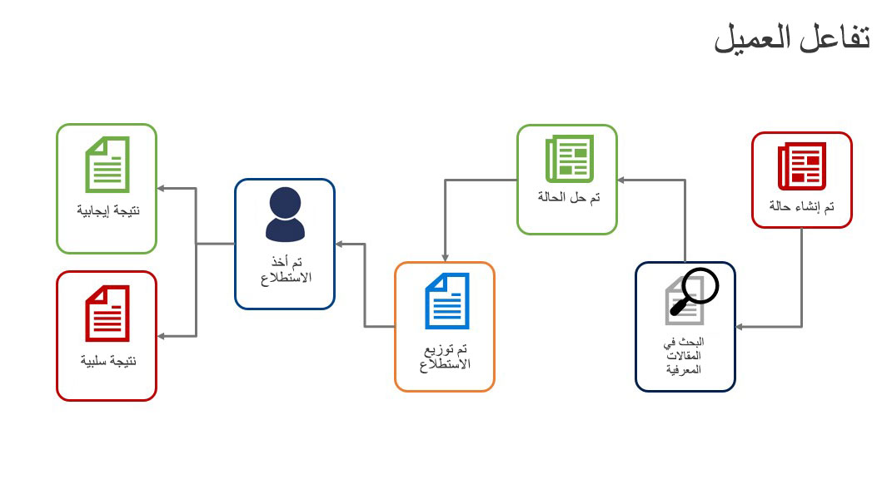
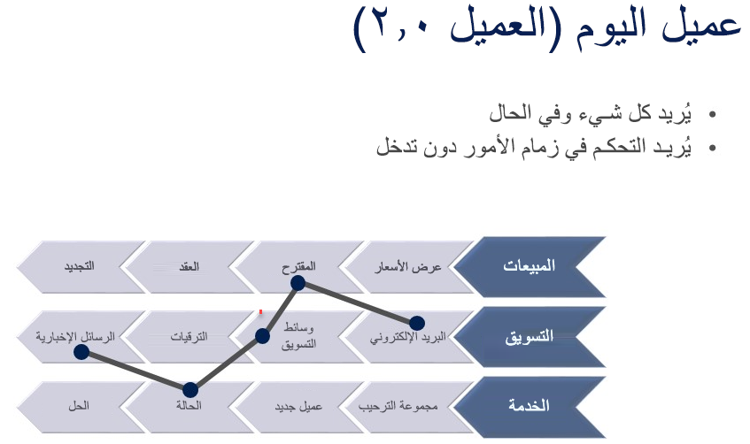

تشكل Customer Service أحد الجوانب الرئيسية في أي استراتيجية لإدارة علاقات العملاء. تحتوي Customer Service في Microsoft Dynamics 365 على العديد من الميزات التي يمكن للمؤسسات استخدامها لإدارة الخدمات التي تقدمها للعملاء.

## نظرة عامة على مشهد خدمة العملاء

لمساعدتك على فهم سياق خدمة العملاء بشكل أفضل، دعنا نراجع بعض سيناريوهات العملاء الواقعية.

**معالجة وحل مشكلات العملاء أو المنتجات**:‏ Paul Cannon هو عميل لشركة Contoso ‏Bicycles. اكتشف مؤخراً أن التعليق في دراجته الجبلية من Contoso معيب ولا يعمل بشكل صحيح. يتصل Paul بشركة Contoso ‏Bicycles لمناقشة المشكلة والحصول على المساعدة بشأن دراجته. تم تسجيل المشكلة في قائمة انتظار طلبات دعم الدراجات الجبلية. 

يتلقى Rob، متخصص دعم الدراجات الجبلية لدى شركة Contoso ‏Bicycles، المشكلة من خلال Customer Service. بعد ذلك، يعمل مع Paul لجدولة نشاط الخدمة لإصلاح أو استبدال التعليق المعيب.

**تلقي أسئلة العملاء والإجابة عنها**:‏ Jim Glynn هو أحد عملاء Fabrikam Furniture. حصل مؤخراً على طاولة اشتراها عبر موقع Fabrikam الإلكتروني. يحاول Jim تجميع الطاولة، لكنه غير متأكد من قيامه بذلك بشكل صحيح. يتصل بشركة Fabrikam Furniture لطرح الأسئلة والحصول على المساعدة بشأن طاولته. 

يتلقى Sidney، أخصائي دعم العملاء في شركة Fabrikam Furniture، يتلقى أسئلة Jim. يستخدم قاعدة المعارف في Customer Service للعثور على مستند الأسئلة المتداولة (FAQ) للجدول. بعد ذلك، يستخدم هذا المستند للمساعدة في الإجابة عن أسئلة Jim.

**جمع ملاحظات العملاء وتطبيقها**:‏ Maria هي مديرة المنتجات للطاولات والكراسي في شركة Fabrikam Furniture. إنها تريد جمع ملاحظات حول عملية التجميع في المنزل عندما يتصل العملاء بشركة Fabrikam. إنها تستخدم وظيفة إدارة الحالة في Customer Service لالتقاط هذه الملاحظات. يمكنها أيضاً تحليل الطاولات والكراسي التي تسبب معظم المشكلات أثناء التجميع في المنزل وتلك التي يسهل تجميعها. بالإضافة إلى ذلك، تستطيع Maria تحديد التعليمات الخاصة بالتجميع في المنزل للطاولات والكراسي التي يجب منحها الأولوية للتحرير والمراجعة.

## فهم عميل اليوم
أصبح العملاء اليوم أكثر درايةً من أي وقت مضى. اعتاد العملاء على الحصول على ما يريدون، عندما يريدون، بالطريقة التي يريدونها. 
 
فكر في العملية المعتادة لشراء تلفاز:

1. قبل أن تنتقل إلى المتجر لشراء الصنف، ربما تقوم ببعض البحث على الإنترنت.
1. يمكنك تحديد العديد من أجهزة التلفاز ومقارنة الخيارات والميزات المختلفة.
1. من المحتمل أن تتحقق من تقييمات العملاء وتحدد التلفاز الذي تعتقد أنه الأفضل قبل أن تطأ قدمك متجراً.
1. بعد أن تكون في المتجر، قد تتعامل مع مندوب مبيعات، ولكن لديك بالفعل فكرة جيدة عما تبحث عنه.

يمكن تطبيق نفس العملية عبر تجارب مختلفة. يريد العملاء أن يتحكموا في التجربة، ويفضلون تدخلاً ضئيلاً أو معدوماً أثناء عملهم خلال العملية. يجب أن يتمتع العملاء بالمرونة لدفع تجربة المشاركة قُدماً ولكن لا يزال بإمكانهم التعامل مع المندوبين المباشرين. ولكن أي مشاركة من هذا القبيل يجب أن تكون وفقاً *لشروطهم*.

## الاتجاهات المؤثرة في خدمة العملاء
توجد العديد من الاتجاهات التي تؤثر حالياً في كيفية عمل خدمة العملاء. كمؤسسة خدمية، من المهم أن تفهم ماهية هذه الاتجاهات وكيف يمكنك الاستفادة منها لتحسين تجربة العميل ودفعها قُدماً. فيما يلي بعض الاتجاهات التي تؤثر في الخدمة اليوم:

- **الأجهزة المحمولة**: مع وجود العديد من الأجهزة المحمولة المتاحة اليوم، لم يعد الأشخاص يتفاعلون مع خدمة العملاء فقط من خلال مكالمة هاتفية أو بريد إلكتروني. يريدون أن يكونوا قادرين على الوصول إلى معلومات المدخل على أجهزتهم المحمولة أو التفاعل مع مندوب من خلال محادثة يبدؤونها على أجهزتهم. 
- **وسائل التواصل الاجتماعي**: لا يشعر الأشخاص بالخجل عادةً عندما يتعلق الأمر بالتعبير عن أفكارهم وآرائهم على وسائل التواصل الاجتماعي. يجب أن تكون قادراً على الاستفادة من هذا النظام الأساسي لضمان معالجة مشكلات العملاء أو شكاواهم بنفس الطريقة التي يتم التعامل بها إذا تفاعل العميل مباشرةً مع الدعم.
- **الخدمة الذاتية**: يمكن أن تعني الخدمة الذاتية أشياء مختلفة:

    - يمكن أن يكون الأمر بسيطاً مثل توفير قاعدة معرفية يمكن للعملاء استخدامها للعثور على إجابات لأسئلة إجرائية بسيطة. 
    - يمكن أن يتضمن السماح للعملاء بإدارة حساباتهم.
    - في بعض الأحيان، يمكن أن يتضمن منح العملاء طريقة للتفاعل مع العملاء الآخرين الموجودين في الموقف نفسه.

- **إنترنت الأشياء**: مع وجود المزيد والمزيد من الأجهزة المتصلة بالإنترنت والاتصال ذهاباً وإياباً، من المهم الاستفادة من التكنولوجيا المستخدمة على هذه الأجهزة لإجراء مكالمات الخدمة. فيما يلي بعض الطرق التي يمكن من خلالها القيام بذلك:

    - اكتشاف الخارج عن المألوف
    - الصيانة التنبؤية
    - استخدام البيانات التي تم جمعها للمساعدة في دفع عروض الخدمة قُدماً في المستقبل

- **مشاركة العملاء**: المشاركة هي أكثر من مجرد التواصل للحصول على آراء العملاء. يمكن أن تشمل معرفة التفاصيل التالية:

    - متى يكون الوقت المناسب للمشاركة؟
    - ما القنوات التي يجب استخدامها؟
    - ما المعلومات التي يجب عليك جمعها؟
