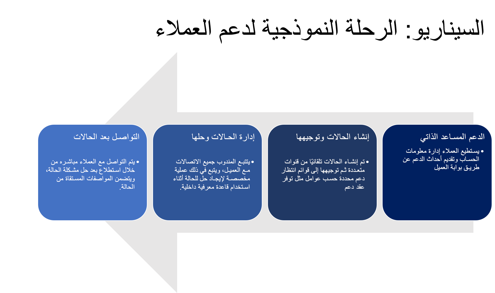
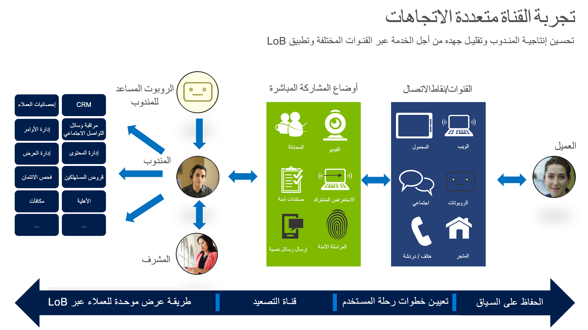

قد تغيرت الخدمة بشكل كبير على مدى السنوات الخمس إلى العشر الماضية. في الماضي، كان العميل يتصل ويوضع في الانتظار حتى يلتقط شخص ما الهاتف للمساعدة. واليوم، يبدو مشهد الدعم مختلفاً جداً.

> [!VIDEO https://www.microsoft.com/videoplayer/embed/RE2rlss]

 يمكن للعميل اليوم بدء رحلة دعم من نقاط انطلاق متعددة. العملاء لديهم تفضيلات قناة مختلفة ويتوقعون تجربة سهلة عبر جميع القنوات.

مع ظهور قدرات الخدمة الذاتية، يمكن للعملاء الآن البدء في تثقيف أنفسهم باستخدام أي من هذه الموارد:

- مداخل مع روبوت تفاعلي
- إمكانية المحادثة المباشرة
- أكشاك تفاعلية
- تطبيق محمول تم نشره بواسطة مؤسسة العميل
- مشاركة الشاشات عن بُعد بين مندوب خدمة والعميل
- أي عدد من الشبكات الاجتماعية، بما في ذلك Facebook وTwitter

كما تظهر هذه القائمة، لا يمكننا أبداً أن نكون متأكدين من المكان الذي يأتي منه العميل. لذلك، يجب أن نكون مستعدين، مع كل القنوات ووسائل الإعلام الممكنة مفتوحة والاستماع.

## منظور العملاء وتوقعاتهم
لا يكفي فقط أن يكون لديك مجموعة من القنوات المختلفة. يجب أن تكون مؤسسة الخدمة الخاصة بك متكاملة، بحيث:

- جميع قنوات الدعم لديها نفس المعلومات. أنت لا تريد أن تختلف النصيحة التي تقدمها السير الخاصة بك عن النصيحة التي سيقدمها ممثل العميل.
- قنوات الدعم الخاصة بك متصلة بسلاسة. تريد أن تكون المعلومات قادرة على المرور بسهولة من قناة إلى أخرى.

التعقيد لا يتوقف عند هذا الحد. بشكل عام، يجب على شركة الخدمات الحديثة النظر في ما يلي:

- **وسائل التواصل الاجتماعي**: العملاء نشطون للغاية على وسائل التواصل الاجتماعي. إنهم لا يتركون تعليقات حول الأشياء التي يحبونها. سوف يعلقون أيضاً - بصوت عالٍ - على ما لا يحبونه. والأكثر من ذلك، يستمع العديد من أصدقائهم – العملاء المحتملين – إلى هذه التعليقات ويشكلون آرائهم الخاصة في شركتك.
- **حجم الشركة**: غالباً ما ترغب الشركات في استهداف عملاء الشركات الصغيرة من خلال نفس المجموعة من القنوات.
- **دعم العملاء المتعاقدين وغير المتعاقدين**: يحصل الجميع على الدعم، وليس فقط أولئك الذين لديهم اتفاقيات مستوى الخدمة (SLAs). مرة أخرى، أنت لا تعرف من أين يأتي العملاء الجدد.
- **أوقات الاستجابة السريعة**: يتوقع العملاء أوقات استجابة سريعة. إذا لم تتمكن من تقديم رد في الوقت المناسب، فسيذهبون إلى مكان آخر - ربما حتى إلى منافسيك، الذين قد يكون لديهم قناة دعم أفضل.
- **الدعم في الموقع**: في بعض الأحيان، لا يمكن مساعدة العملاء عبر الإنترنت. في هذه الحالة، غالباً ما يتوقعون من شركة الخدمات زيارتهم في مكان عملهم أو في الميدان لحل مشكلة. 

## رحلة العملاء النموذجية

سيتبع العميل النموذجي مساراً محدداً للحصول على حل لمشكلة ما:

1. **المساعدة الذاتية**: عندما يحتاج الأشخاص إلى المساعدة، فإن أول شيء يفعلونه هو الذهاب إلى الإنترنت ومعرفة ما إذا كان بإمكانهم إصلاح المشكلة بأنفسهم. سيزورون بعض المنتديات ومجموعات الأخبار، ويسألون بعض الأسئلة، على أمل الحلول السريعة. قد يزورون موقع الشركة على الويب ويقومون ببعض الأبحاث أثناء البحث في الوثائق.
1. **إنشاء الحالة الأولية وتوجيهها**: سيتم إنشاء الحالات من قنوات متعددة. ويمكن بعد ذلك توجيهها إلى قوائم انتظار محددة، استناداً إلى عوامل مثل ما إذا كان هناك عقد، أو ما إذا كان العميل عميلا مفضلاً، أو ما إذا كان الفني المؤهل للتعامل مع المشكلة متاحاً في قائمة انتظار محددة.
1. **إدارة الحالات وحلها**: يقوم مندوب الخدمة الآن بتتبع جميع الاتصالات مع العميل واتباع عملية مخصصة لحل الحالات أثناء استخدام قاعدة معرفية داخلية. عند هذه النقطة، يمكن أن يكون اتصال العملاء من خلال البريد الإلكتروني أو الرسائل النصية أو مكالمة هاتفية. عادةً ما يتم تعقب الحالات لإنشاء سجل تاريخي لما حدث مع العميل. كما سيتم إنشاء قاعدة المعارف، بحيث يمكن لممثلي الخدمات الآخرين الاستفادة من المعرفة من الحالات السابقة.
1. **أنشطة ما بعد الحالة**: تولي مؤسسات خدمة العملاء المزيد والمزيد من الاهتمام لما تقوم به *بعد* حل الحالة. وينظر إلى هذه الأنشطة اللاحقة للحالات الآن على أنها حاسمة. ترغب الشركات الآن في الحصول على تعليقات من العملاء حول جودة التفاعل، كوسيلة للحفاظ على القنوات مفتوحة وتشجيع العميل على البقاء مع الشركة. للحصول على مزيد من الرؤى من الحالة وزيادة بناء قاعدة معارفهم، قد ترسل الشركات للعملاء مسحاً مع تفاصيل الحالة.

في العالم الحديث، هذه هي الطريقة التي يتفاعل بها العملاء مع مؤسسة دعم داخل الشركات.