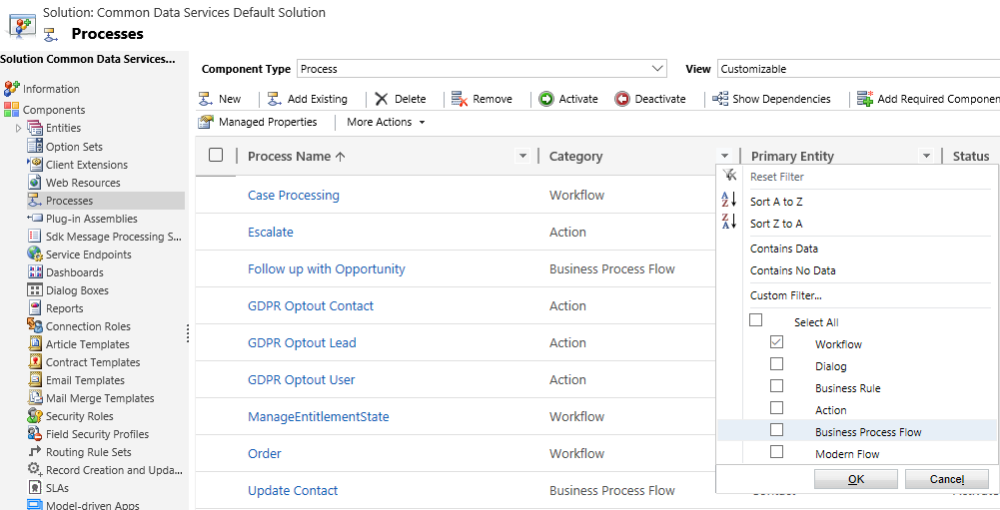
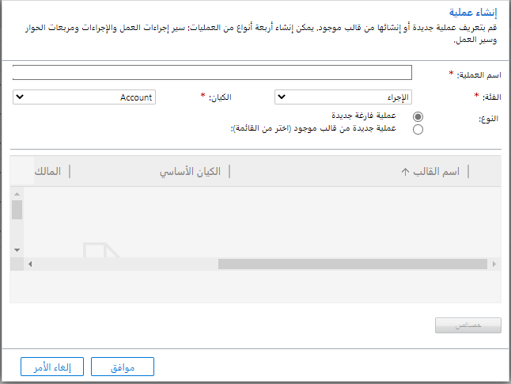
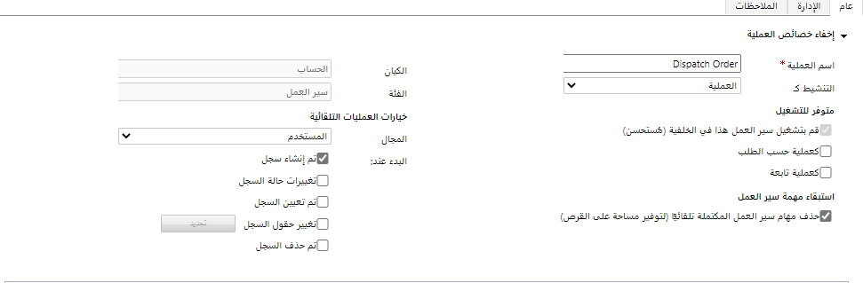

تنفذ مهام سير العمل عمليات الأعمال تلقائياً. يستخدم الأشخاص عادةً عمليات سير العمل لبدء التنفيذ التلقائي الذي لا يتطلب أي تفاعل من المستخدم. 

عند تكوين مهام سير العمل، لديك أربعة مجالات رئيسية يجب وضعها في الاعتبار:

- متى تبدأها؟

- هل يجب تشغيلها كسير عمل في الوقت الحقيقي أو سير عمل في الخلفية؟

- ما الإجراءات التي يجب عليهم القيام بها؟

- تحت أي ظروف يجب تنفيذ الإجراءات؟

بناءً على متطلبات العمل، يمكنك تكوين سير عمل للبدء:

- تلقائياً رداً على أحداث مثل الإنشاء أو التحديث أو الحذف أو التغيير في حالة السجل أو التغيير في ملكية السجل (التعيين).

- يدوياً من قِبل مستخدم. 

- كسير عمل فرعي يبدأ من خلال عملية سير عمل أخرى.

لإنشاء سير عمل جديد أو تعديله، افتح الحل المختار غير المُدار وحدد **العمليات.** يمكنك عرض مهام سير العمل الموجودة في الحل عن طريق التصفية على العمليات التي تحتوي على الفئة **سير العمل.** إذا لم يكن سير العمل الحالي موجوداً في الحل، فقد تحتاج إلى إضافته باستخدام الأمر "إضافة موجود".

عند إنشاء سير عمل باستخدام **أمر جديد**، يتطلب مربع الحوار **إنشاء عملية** منك تعيين الخصائص التالية التي تحتوي عليها جميع العمليات:

|**الخاصية**   |**الوصف**|
| - |
| **الاسم**| لا يلزم أن يكون اسم عملية سير العمل فريداً، ولكن قد ترغب في استخدام اصطلاح تسمية للتمييز بوضوح بين عملياتك. قد ترغب في تطبيق البادئات القياسية على اسم سير العمل. قد تصف البادئة وظيفة سير العمل أو القسم داخل الشركة. سيساعدك هذا في تجميع العناصر المتشابهة في قائمة مهام سير العمل. |
| **فئة**| حدد سير العمل لإنشاء عملية سير العمل. لا يمكنك تغيير الفئة بمجرد إنشاء العملية. |
| **الكيان**| ترتبط كل عملية سير عمل بكيان واحد. بغض النظر عن الطريقة المستخدمة لبدء سير العمل، سيكون لكل مثيل قيد التشغيل لعملية سير العمل سجل هدف واحد للكيان المرتبط بالعملية. لا يمكنك تغيير الكيان بعد إنشاء عملية سير العمل. |
| **تشغيل سير العمل هذا في الخلفية (مستحسن)**| يظهر هذا الخيار عندما تحدد سير العمل كفئة. يحدد هذا الإعداد ما إذا كان سير العمل هو سير عمل في الوقت الحقيقي أم في الخلفية. يتم تشغيل مهام سير العمل في الوقت الحقيقي على الفور (بشكل متزامن) ويتم تشغيل مهام سير العمل في الخلفية بشكل غير متزامن. تعتمد خيارات التكوين المتاحة على اختيارك لهذا الإعداد. تسمح مهام سير العمل في الخلفية بشروط الانتظار غير المتوفرة لمهام سير العمل في الوقت الحقيقي. طالما أنك لا تستخدم شروط الانتظار هذه، يمكنك في وقت لاحق تحويل مهام سير العمل في الخلفية إلى مهام سير عمل في الوقت الحقيقي ومهام سير عمل في الوقت الحقيقي إلى مهام سير عمل في الخلفية. |
| **النوع**| حدد ما إذا كنت تريد إنشاء سير عمل جديد من البداية أو اختيار البدء من قالب موجود. عندما تختار عملية جديدة من قالب موجود (حدد من القائمة)، يمكنك الاختيار من عمليات سير العمل المتوفرة التي تم حفظها مسبقاً كقالب عملية للكيان المحدد. |

بعد إنشاء سير العمل أو إذا قمت بتحرير واحد موجود، سيكون لديك الخصائص الإضافية التالية مجمعة في عدد من الأقسام. تتغير الخصائص المتاحة بناءً على ما إذا كان سير العمل في الخلفية أم في الوقت الحقيقي.

|**الخاصية**   |**الوصف**|
| - |
| **اسم العملية**| يمكن تغيير اسم العملية عند إلغاء تنشيط العملية. بينما لا تتأثر المراجع إلى مهام سير العمل من مهام سير العمل الأخرى، غالباً ما تحتوي المشروعات أثناء عمليات التنفيذ على تعليمات برمجية للمطورين قد تشير إلى عملية بالاسم. قد تتطلب إعادة تسمية العملية قيد الاستخدام تنسيقاً إضافياً عبر المشروع للتعامل مع هذه المراجع. |
| **التنشيط كـ**| يمكنك اختيار نموذج العملية لإنشاء نقطة بداية متقدمة لعمليات سير العمل الأخرى. إذا اخترت هذا الخيار، فلن يتم تطبيقه بعد تنشيط سير العمل ولكنه سيكون متاحاً للتحديد في مربع الحوار "إنشاء عملية" بدلاً من ذلك. تكون قوالب العمليات ملائمة عندما يكون لديك عدد من عمليات سير العمل المتشابهة وتريد تعريفها دون تكرار نفس المنطق، أو عندما تريد تزويد المستخدمين بنقطة بداية للمهام الأكثر شيوعاً التي يرغبون في تشغيلها تلقائياً لأنفسهم. |

**نصيحة:** عند تحرير سير عمل، استخدم **إخفاء خصائص العملية** بمجرد الانتهاء من هذه العناصر. ستمنحك مساحة عمل أكبر لإنشاء ما تبقى من تعريف سير العمل. 

### متوفر للتشغيل

يحتوي هذا القسم على خيارات تصف كيفية توفر سير العمل ليتم تشغيله. 

|**الخاصية**   |**الوصف**|
| - |
| **تشغيل سير العمل هذا في الخلفية (مستحسن)**| تعكس خانة الاختيار هذه الخيار الذي حددته عند إنشاء سير العمل. تم تعطيل هذا الخيار، ولكن يمكنك تغييره من قائمة الإجراءات باختيار التحويل إلى سير عمل في الوقت الحقيقي أو التحويل إلى سير عمل في الخلفية. |
| **كعملية حسب الطلب**| حدد هذا الخيار إذا كنت تريد السماح للمستخدمين بتشغيل سير العمل هذا من أمر تشغيل سير العمل. |
| **كعملية تابعة**| حدد هذا الخيار إذا كنت تريد السماح لسير العمل بأن يكون متاحاً ليبدأ من سير عمل آخر. |

### استبقاء مهمة سير العمل

بالنسبة لمهام سير العمل في الخلفية، يحتوي هذا القسم على خيار لحذف معلومات حول تشغيل سير العمل بعد اكتمال تنفيذ سير العمل. 

بالنسبة لسير العمل في الوقت الحقيقي، لا يتم الاحتفاظ بالسجلات افتراضياً، ولكن هذا القسم يحتوي على خيار للاحتفاظ بسجلات المهام التي واجهت أخطاء.

### خيارات للعمليات التلقائية

تعتمد الخيارات المتاحة في هذا القسم على ما إذا كانت العملية في الخلفية أم في الوقت الحقيقي. 

### النطاق

إذا كان النطاق عبارة عن مؤسسة، فيمكن تطبيق منطق سير العمل على أي سجل في المؤسسة. خلاف ذلك، يمكن تطبيق سير العمل فقط على مجموعة فرعية من السجلات التي تقع ضمن النطاق. 

قيمة النطاق الافتراضية هي المستخدم. بالنسبة إلى مهام سير العمل التي تم نشرها مع الحلول التي تنوي العمل بها على جميع السجلات التي تم تعديلها، قد ترغب في أن يتم تكوين النطاق للمؤسسة وأن يكون لمستخدم الاتصال حق الوصول للقراءة على مستوى المؤسسة للعمل بشكل صحيح. تأكد من التحقق من أن قيمة النطاق مناسبة قبل تنشيط سير العمل.

تتم مناقشة نطاق سير العمل بالتفصيل في الدرس التالي. 

### البدء عند

استخدم الخيارات الموجودة في هذا القسم لتحديد متى يجب أن يبدأ سير العمل تلقائياً. 

يمكنك تكوين سير عمل في الوقت الحقيقي ليتم تشغيله قبل أو بعد أحداث معينة. تتم مناقشة تكوين سير العمل في الوقت الحقيقي بالتفصيل في الدرس التالي.

تعمل مهام سير العمل في الخلفية دائماً بعد إجراء التشغيل وقد لا يتم تشغيلها على الفور. يعمل هذا الأسلوب بشكل أفضل مع المعالجة غير الحساسة للوقت، على سبيل المثال، إرسال بريد إلكتروني استجابة لحدث معين. 

اعلم أن بعض الأحداث والإجراءات اللاحقة قد تتسبب في استدعاء سير العمل لنفسه. على سبيل المثال، سيؤدي تشغيل سير العمل في حدث تغييرات حالة السجل ثم تغيير حالة السجل كجزء من سير العمل إلى استدعاء سير العمل لنفسه والذي قد يكون مقصوداً أو غير مقصود. 

عند تحديد حدث تغيير حقول السجل، استخدم زر التحديد لتحديد الحقول المحددة التي ستطلق سير العمل. يوصى بشدة بهذه الخطوة لتقليل التشغيل غير الضروري وتقليل احتمالية حدوث الحلقة اللانهائية عندما يقوم سير العمل بتحديث السجل. |

### تنشيط سير عمل

لا يمكن تحرير مهام سير العمل إلا أثناء إلغاء تنشيطها. قبل أن يمكن استخدام سير العمل يدوياً أو تطبيقه بسبب الأحداث، يجب تنشيطه. قبل أن يتم تنشيط سير العمل، يجب أن يحتوي على خطوة واحدة على الأقل.

### الملكية

لا يمكن تنشيط سير العمل أو إلغاء تنشيطه إلا بواسطة مالك سير العمل أو بواسطة شخص لديه امتياز التصرف نيابة عن مستخدم آخر مثل مسؤول النظام. يمكنك إعادة تعيين سير عمل تملكه عن طريق تغيير المالك. هذا الحقل موجود في علامة التبويب **الإدارة**. 

لاحظ أن ملكية سير العمل تحدد النطاق. قد يتغير تغيير مالك سير العمل مع أي نطاق باستثناء المؤسسة عند بدء سير العمل. 

### الملاحظات

تطوير سير العمل عبارة عن عملية تعاونية. استخدم علامة التبويب **ملاحظات** لتتبع أي تغييرات تم تطبيقها على سير العمل عند تطوير مهام سير عمل جديدة وتعديلها.
