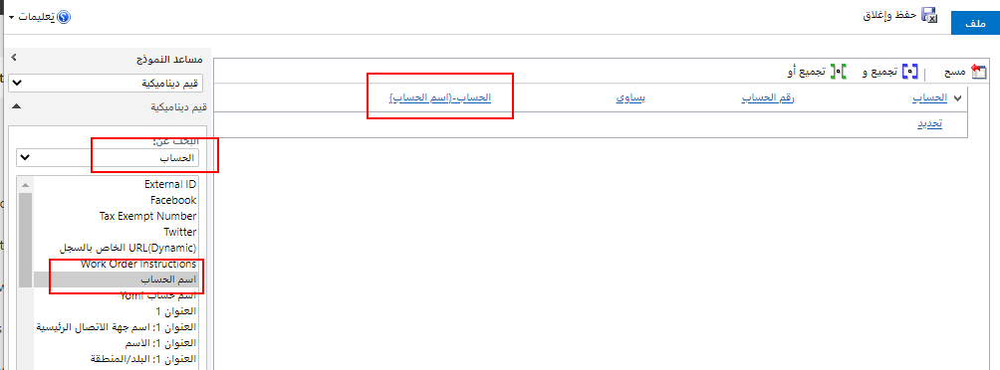

عندما تنشئ سير عمل، فإن ما يلي عبارة عن الإجراءات المتاحة لديك لإضافتها كخطوات في العملية. 

### الإجراءات الشرطية

تتحكم هذه الإجراءات في تدفق سير العمل وتسمح لك بإنشاء فروع من الإجراءات التي معالجتها عند الوفاء بالشروط فقط. 

| **الإجراء**| **الوصف** |
| - |
| راجع الشرط| عبارة منطقية "إذا-[شرطك]، إذن". يمكنك التحقق من القيم الحالية للسجل الذي يعمل عليه سير العمل، أو أي من السجلات المرتبطة بهذا السجل في علاقة N:1، أو أي سجلات تم إنشاؤها بواسطة الخطوات السابقة. بناءً على هذه القيم، يمكنك تحديد خطوات إضافية عندما يكون الشرط صحيحاً. |
| تفرع شرطي| عبارة منطقية "آخر-إذا-إذن"، يستخدم المحرر النص "خلاف ذلك، إذا [حالتك] ثم:" حدد شرط فحص قمت بتعريفه مسبقاً ويمكنك إضافة تفرع شرطي لتحديد خطوات إضافية عند الفحص إرجاع الشرط زائف. |
| الإجراء الافتراضي| عبارة "آخر" المنطقية. يستخدم المحرر النص "خلاف ذلك:" حدد شرط تحقق، أو تفرعاً شرطياً، أو شرط انتظار، أو تفرع انتظار موازٍ قمت بتعريفه مسبقاً ويمكنك استخدام إجراء افتراضي لتحديد الخطوات لجميع الحالات التي لا تتطابق مع المعايير المحددة في عناصر الشرط أو التفرع. |
| شرط الانتظار| تمكين سير عمل الخلفية من إيقاف نفسه مؤقتاً حتى يتم استيفاء المعايير المحددة بواسطة الشرط. يبدأ سير العمل تلقائياً مرة أخرى عند استيفاء المعايير الموجودة في حالة الانتظار. لا يمكن لمهام سير العمل في الوقت الحقيقي استخدام شروط الانتظار. |
| تفرع انتظار موازي| تحديد شرط انتظار بديل لسير عمل في الخلفية بمجموعة مقابلة من الخطوات الإضافية التي يتم تنفيذها فقط عند استيفاء المعيار الأولي. يمكنك استخدام تفرعات الانتظار الموازية لإنشاء حدود زمنية في منطق سير العمل الخاص بك. إنها تساعد في منع سير العمل من الانتظار إلى أجل غير مسمى حتى يتم استيفاء المعايير المحددة في حالة الانتظار. |

لبناء المعايير، سوف تستخدم محرر معايير متقدم يشبه البحث والذي سيسمح ببناء الشروط التي تتضمن مجموعات "و" و"أو". من الممكن مقارنة هذه الحقول بالقيم الثابتة أو قيم البيانات الديناميكية. يمكنك تقييم الحقول مقابل قيم البيانات الديناميكية التي تم تكوينها باستخدام "مساعد النموذج" على اليمين. يتيح لك هذا تحديد الكيان والحقل للمقارنة بهما. في المثال التالي نقارن بالحساب الرئيسي -> حقل رقم الحساب باستخدام علاقة N:1 الموجودة.

في عبارة "إذا-[الشرط الخاص بك] إذن"، يمكنك استخدام العوامل التالية: 

- يساوي **،** 
- لا يساوي **،** 
- يحتوي على بيانات **،** 
- لا يحتوي على بيانات **،** 
- ضمن وليس ضمن **.** 

> [!NOTE] 
> العاملان ضمن وليس ضمن هما عاملان هرميان. يمكن استخدامها فقط في الكيانات التي لها علاقة هرمية محددة. إذا كنت تحاول استخدام هذه العوامل في الكيانات التي ليس لها علاقة هرمية محددة، فستظهر لك رسالة الخطأ: "أنت تستخدم عاملاً هرمياً في كيان ليس له علاقة هرمية محددة. إما أن تجعل الكيان هرمياً (عن طريق وضع علامة على علاقة كهرمية) أو استخدام عامل مختلف." لمزيد من المعلومات حول العلاقات الهرمية، راجع [الاستعلام عن وتصور البيانات الهرمية](https://docs.microsoft.com/dynamics365/customer-engagement/customize/query-visualize-hierarchical-data). 

### إجراءات التعديلات

| **الإجراء**| **الوصف** |
| - |
| إنشاء سجل| إنشاء سجل جديد لكيان ما وتعيين القيم التي تختارها للسمات. |
| تحديث السجل| يمكنك تحديث السجل الذي يعمل عليه سير العمل، أو أي من السجلات المرتبطة بهذا السجل في علاقة N:1، أو أي سجلات تم إنشاؤها بواسطة الخطوات السابقة. |
| تعيين سجل| يمكنك تعيين السجل الذي يعمل عليه سير العمل، أو أي من السجلات المرتبطة بهذا السجل في علاقة N:1، أو أي سجلات تم إنشاؤها بواسطة الخطوات السابقة. |
| تغيير الحالة| قم بتغيير حالة السجل الذي تعمل عليه العملية، أو أي من السجلات المرتبطة بهذا السجل في علاقة N:1، أو أي سجلات تم إنشاؤها بواسطة الخطوات السابقة. |

### تعيين قيم السجلات

عند إنشاء سجل أو تحديثه، يمكنك تعيين قيم للسجل إما بقيم ثابتة أو قيم ديناميكية يتم تعيينها بواسطة استخدام مساعد النموذج. عند تحديث السجلات، من الأفضل تعيين القيم على القيم التي تحاول تغييرها فقط لتجنب التشغيل غير الضروري لتنفيذ تلقائي آخر. 

عندما تحدد تعيين الخصائص، يفتح مربع حوار يعرض لك النموذج الافتراضي للكيان. قد لا يحتوي هذا النموذج على جميع الحقول الخاصة بالكيان. في الجزء السفلي من مربع الحوار يمكنك رؤية قائمة الحقول الإضافية غير الموجودة في النموذج. 

على الجانب الأيمن من مربع الحوار، يمنحك "مساعد النموذج" القدرة على تعيين القيم الديناميكية أو إلحاقها من سياق السجل الحالي. يتضمن هذا القيم من السجلات ذات الصلة التي يمكن الوصول إليها من علاقات N:1 (متعدد إلى واحد) للكيان. 

تعتمد الخيارات المتاحة في "مساعد النموذج" على الحقل الذي حددته في النموذج. عند تعيين قيمة ديناميكية، فسيظهر لك عنصر نائب أصفر يُعرف باسم "حقل" يوضح مكان تضمين البيانات الديناميكية. إذا كنت ترغب في إزالة القيمة، فما عليك سوى تحديد الحقل وحذفه. بالنسبة إلى حقول النص، يمكنك استخدام مجموعة من البيانات الثابتة والديناميكية. 

باستخدام القيم الديناميكية، لا تعرف على وجه اليقين أن الحقل أو الكيان المرتبط به القيمة التي تريد تعيينها. يمكنك بالفعل تعيين عدد من الحقول لمحاولة تعيين القيمة وفرزها بالترتيب من خلال استخدام الأسهم الخضراء. إذا كان الحقل الأول لا يحتوي على بيانات، فستتم تجربة الحقل الثاني وهكذا. إذا لم يكن أي حقل من الحقول يحتوي على بيانات، فيمكنك تحديد قيمة افتراضية لاستخدامها. 
 
### الإجراءات الأخرى

توفر الإجراءات التالية القدرة على التحكم في تنفيذ سير العمل الحالي وكذلك بدء مهام سير العمل الفرعية. باستخدام تنفيذ الإجراء والخطوات المخصصة، يمكنك الوصول إلى منطق مخصص قابل لإعادة الاستخدام.

| **الإجراء**| **الوصف** |
| - |
| إرسال البريد الإلكتروني| إرسال رسالة بريد إلكتروني. يمكنك اختيار إنشاء رسالة بريد إلكتروني جديدة أو استخدام قالب بريد إلكتروني تم تكوينه لكيان السجل الذي يعمل عليه سير العمل أو أي كيانات لها علاقة N:1 بالكيان، أو الكيان لأي سجلات تم إنشاؤها بواسطة خطوات سابقة. |
| بدء سير عمل تابع| بدء عملية سير العمل التي تم تكوينها كسير عمل تابع. |
| إيقاف سير العمل| إيقاف سير العمل الحالي. يمكنك تعيين حالة إما ناجح أو ملغى وتحديد رسالة الحالة. عندما يتم تكوين مهام سير العمل في الوقت الحقيقي لحدث ما، فإن إيقاف سير عمل بحالة "ملغى" سيمنع اكتمال إجراء الحدث. |
| تنفيذ الإجراء| السماح لك باستدعاء الإجراءات المخصصة التي تم إنشاؤها في البيئة أو تثبيتها عبر الحلول. تأتي العديد من التطبيقات مع العديد من الإجراءات لأداء منطق مخصص. عند تنفيذ الإجراءات، يمكنك تمرير المعلمات للتأثير على معالجة الإجراءات، ويمكن للإجراء إرجاع النتائج التي يمكنك استخدامها في خطوات سير العمل اللاحقة. |
| الخطوة المخصصة| يستطيع المطورون إنشاء خطوات سير عمل مخصصة تحدد الإجراءات. لا توجد خطوات مخصصة متاحة بشكل افتراضي. عندما يتم تثبيتها في بيئة فإنها تظهر في قائمة الإجراءات. يمكن تجميعها في مجموعات منطقية على النحو المحدد من قِبل المطور. |
