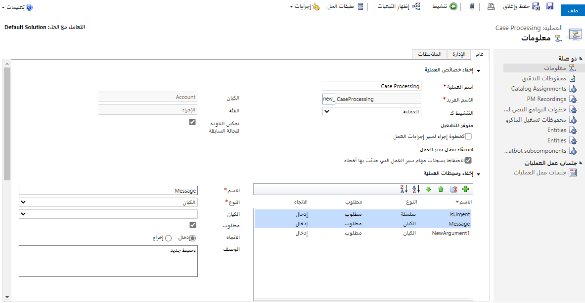
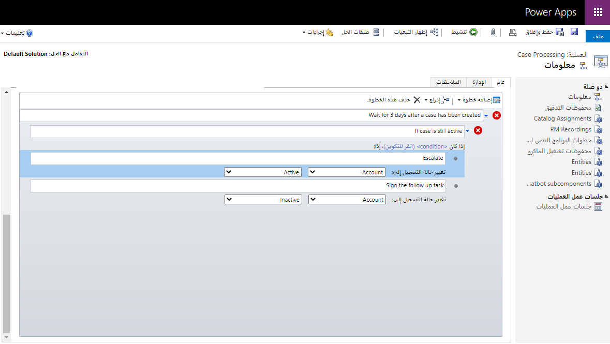
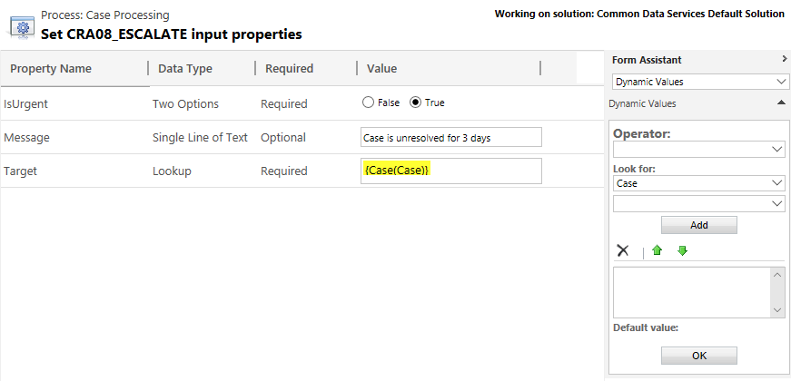

الإجراءات المخصصة هي نوع من العمليات يشبه إلى حد بعيد مهام سير العمل في الوقت الحقيقي. لديهم الخصائص المماثلة التي تم إنشاؤها وتحريرها في محرر سير العمل واستخدام نفس الكتل الإنشائية: المراحل، والشروط، والإجراءات. 

بخلاف عمليات سير العمل، لا تحتاج إلى تعيين الخيارات التالية:

- **البدء عند**: تبدأ الإجراءات عند استدعائها من خلال عملية أخرى عبر تنفيذ إجراء أو عندما يستدعي رمز المطور الرسالة التي تم إنشاؤها من أجلهم.

- **النطاق**: تعمل الإجراءات دائماً في سياق المستخدم المتصل.

- **تشغيل في الخلفية**: الإجراءات هي دائماً مهام سير العمل في الوقت الحقيقي.

تحتوي الإجراءات أيضاً على شيء لا تمتلكه عمليات سير العمل - وسيطات الإدخال والإخراج.

استخدم الإجراءات لإنشاء عملية جديدة غير متوفرة في Microsoft Dataverse أو تطبيقات Dynamics 365 Customer Engagement لدمج عدة عمليات متباينة في عملية واحدة. على سبيل المثال، في حالة مركز اتصال الدعم، يمكنك دمج عمليات الإنشاء والتعيين وSetState في عملية "تصعيد" واحدة جديدة.

### لماذا استخدام الإجراءات

عند إنشاء إجراء مخصص، فإنك تقوم بتوسيع وظائف Microsoft Power Platform عن طريق إنشاء رسالة مخصصة. من خلال الجمع بين العديد من الخطوات والمنطق، تفتح الإجراءات مجموعة من الاحتمالات لتكوين منطق الأعمال الذي يمكن الوصول إليه كرسالة واحدة جديدة في Dataverse.

الإجراءات مثل أنشطة سير العمل المخصصة بمعنى أنها تتضمن الوظائف. أنشطة سير العمل المخصصة عبارة عن كتل من الوظائف تم إنشاؤها وصيانتها من قِبل المطورين لاستخدامها من قِبل غير المطورين كجزء من مهام سير العمل. الإجراءات عبارة عن كتل من الوظائف التي عادةً ما يتم تنفيذها وصيانتها بواسطة غير المطورين بشكل إعلاني مثل استخدام خطوات سير العمل القياسية. لا يزال بإمكان الإجراءات المخصصة الأكثر تعقيداً تطبيق المنطق بواسطة المطورين.

على عكس مهام سير العمل، لا يمكن بدء الإجراءات بواسطة حدث، بل يجب استدعاؤها. يمكنك استدعاء الإجراءات بشكل إعلاني من تدفقات العمل باستخدام خطوة **تنفيذ الإجراء** أو تدفقات إجراءات العمل باستخدام **خطوة العمل.** يستطيع المطورون استخدام رسالة الإجراء مثل أي من الرسائل الأخرى التي يوفرها النظام الأساسي. 

### متى ينبغي استخدام الإجراءات

توفر الإجراءات القدرة على تحديد رسالة واحدة تطابق عملية تحتاج إلى تنفيذها لعملك. هذه الرسائل الجديدة مدفوعة بعملية أو سلوك بدلاً من ما يمكن عمله مع كيان. يمكن أن تتوافق هذه الرسائل مع أفعال مثل تصعيد أو تحويل أو جدولة أو توجيه أو موافقة - أياً كان ما تحتاج إليه. تساعد إضافة هذه الأفعال في توفير مفردات أكثر ثراءً لك لتعريف عمليات عملك بطلاقة. يمكنك تطبيق هذه المفردات الأكثر ثراءً من العملاء أو عمليات الدمج بدلاً من الاضطرار إلى كتابة الإجراء داخل العملاء. يجعل هذا أيضاً الأمر أسهل لأنه يمكنك إدارة وتسجيل نجاح أو فشل الإجراء بأكمله كوحدة واحدة.

### إنشاء إجراء

قم بإنشاء إجراء كما تفعل مع أي عملية أخرى: افتح حلاً غير مُدار يكون الإجراء جزءاً منه، واستخدم الأمر **جديد > عملية**، وحدد فئة **الإجراء**. باستخدام عمليات الإجراء، يمكنك تحديد كيان لتوفير سياق لسير العمل تماماً مثل أنواع العمليات الأخرى، ولكن لديك أيضاً خيار اختيار "بلا" (عمومي). استخدم هذا إذا كان الإجراء لا يتطلب سياق كيان معين. 

عند قيامك بتسمية الإجراء، من المهم اختيار اسم عملية مناسب. عندما يتم حفظ إجراء ما، بناءً على هذا الاسم، يتم إنشاء اسم رسالة فريد بما في ذلك بادئة التخصيص. هذا هو اسم الرسالة التي سيستخدمها المطور في التعليمات البرمجية الخاصة به. لا تغير هذا الاسم الفريد إذا تم تنشيط العملية وكان الرمز في مكانه ويتوقع استدعاء الإجراء باستخدام هذا الاسم.

توجد بعض الخصائص الفريدة الخاصة بالإجراءات:

**تمكين التراجع.** بشكل عام، فإن العمليات التي تدعم الحركات سوف "تعيد" (أو تتراجع) عن العملية بأكملها إذا فشل أي جزء منها. هناك بعض الاستثناءات من ذلك، ومع الإجراءات لديك خيار إلغاء الاشتراك في ذلك. يجب عليك استشارة المطور الذي سيستخدم هذه الرسالة لتحديد ما إذا كان يجب أن يكون في حركة أو لا. يمكنك تمكين التراجع إذا تم تشغيل إجراء بواسطة رمز مطور باستخدام رسالة Dataverse، فلن يتم تطبيق الخيار إذا تم استدعاء إجراء مخصص مباشرةً من داخل سير العمل. 

**تحديد وسيطات العملية.** في هذه المنطقة، ستحدد أي بيانات يتوقع الإجراء أن يبدأ والبيانات التي سيتم تمريرها من الإجراء عند الانتهاء. 

بعد تحديد خصائص الإجراء، أضف المراحل والشروط والإجراءات كما تفعل عند تحرير سير عمل في الوقت الحقيقي. بالإضافة إلى الخطوات التي يمكن استخدامها لسير العمل في الوقت الفعلي، تحتوي الإجراءات أيضاً على خطوة **تعيين القيمة**. في الإجراءات، يمكن استخدام هذه لتعيين وسيطات الإخراج فقط.

### استخدام الإجراءات

يمكنك تنفيذ إجراء من مهام سير العمل، كخطوة إجراء سير إجراءات العمل، أو إجراءات عملية أخرى. تتوفر الإجراءات المخصصة المنشطة للعمليات عن طريق تحديد عنصر تنفيذ الإجراء في القائمة المنسدلة إضافة خطوة من نموذج عملية طلب الويب. 

بعد إضافة الخطوة إلى عمليتك، يمكنك تحديد الإجراء المخصص الجديد (أو أي إجراء) من قائمة الإجراءات الموفرة في الخطوة. حدد تعيين الخصائص في الخطوة لتحديد أي معلمات إدخال يتطلبها الإجراء المخصص الخاص بك.

> [!NOTE] 
> بعض أنواع المعلمات، على سبيل المثال قائمة الانتقاء أو الكيان أو مجموعة الكيانات، غير مدعومة لاستخدام الإجراء في مهام سير العمل. إذا كان الإجراء المخصص يحتوي على أي نوع من هذه الأنواع، فلن يتم إدراج الإجراء المخصص في قائمة الإجراءات.
