استخدم مهام سير العمل الفوري عندما تتطلب إحدى العمليات التجارية من شخص ما رؤية نتائج العملية على الفور أو إذا كنت تريد القدرة على إلغاء عملية ما. على سبيل المثال، قد ترغب في تعيين قيم افتراضية معينة لسجل ما في المرة الأولى التي يتم فيها حفظه، أو قد ترغب في التأكد من عدم حذف بعض السجلات.

> [!NOTE] 
> عندما يكون المستخدم نشطاً في سجل به سير عمل الفوري قيد التشغيل، يتم منع المستخدم من المتابعة حتى ينتهي سير العمل. إذا كان سير العمل يعمل كما هو متوقع وبكفاءة، فلا ينبغي أن يكون هذا مشكلة للمستخدمين.

يمكنك تكوين سير عمل في الوقت الحقيقي ليتم تشغيله قبل أو بعد أحداث معينة. هذه قدرة قوية لأن سير العمل، إذا تم تكوينه للتشغيل قبل الحدث، يمكنه إيقاف الإجراء قبل حدوثه.

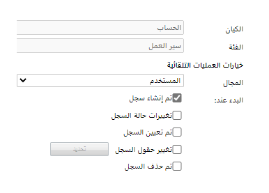

يكون الخيار"بعد" متاحاً فقط عند إنشاء السجل، وذلك ببساطة لأن السجل لم يكن موجوداً مسبقاً.

يكون الخيار "قبل" متاحاً فقط عند حذف السجل، لأن سجل الحدث لم يعد له وجود.

بالنسبة لجميع الأحداث الأخرى، حدد "قبل" المعالجة أو "بعد" حسب الاقتضاء. عندما تحدد "قبل" هذا يعني أنك تريد تطبيق المنطق في سير العمل قبل حدوث تغيير البيانات. يوفر لك هذا القدرة على التحقق من القيم قبل تحديث قيم الحقل وقبل تطبيق المنطق الآخر ومنع تنفيذ المزيد من المنطق.

عندما تقوم بتطبيق إجراء "إيقاف سير العمل" في سير عمل فوري، يكون لديك الخيار لتحديد شرط حالة أن يكون ناجحاً أو ملغى. عندما تقوم بتعيين الحالة على "ملغى"، فإنك تمنع العملية. سيتم عرض رسالة خطأ تحتوي على النص من رسالة حالة إجراء الإيقاف للمستخدم بالعنوان خطأ في إجراءات العمل.

في المثال التالي، نوقف حذف الطلبات ما لم يتم تعيين حالتها على "ملغاة". إذا حاول المستخدم حذف طلب لم يتم إلغاؤه، فسيتلقى رسالة "يمكن حذف الطلبات الملغاة فقط". سيحدث هذا بغض النظر عن أدوار الأمان والامتيازات التي يمتلكها المستخدم. 

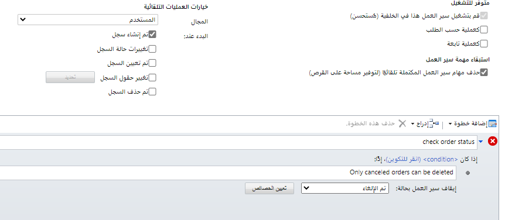

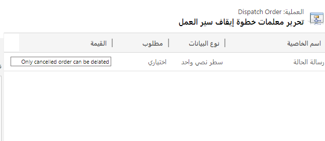

### <a name="scope"></a>النطاق

النطاق هو أحد الخيارات الرئيسية المتاحة لسير العمل. يضيف التحديد الدقيق للنطاق المرونة إلى كيفية ووقت تشغيل مهام سير العمل.

بالنسبة للكيانات المملوكة للمؤسسة، يكون الخيار الوحيد هو المؤسسة. بالنسبة للكيانات المملوكة للمستخدم، فإن الخيارات هي المؤسسة، أو الأصل: وحدات العمل التابعة، أو وحدة الأعمال، أو المستخدم. 

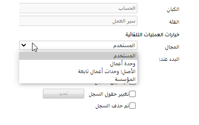

إذا كان النطاق هو مؤسسة، فيمكن تشغيل منطق سير العمل بواسطة أي سجل في المؤسسة. وبخلاف ذلك، لا يمكن تشغيل سير العمل إلا من خلال مجموعة فرعية من السجلات التي تقع ضمن النطاق. يتم تحديد هذه المجموعة الفرعية من السجلات بواسطة مالك سير العمل. عند تحرير خصائص سير العمل، تتوفر معلومات المالك في علامة التبويب الإدارة. 

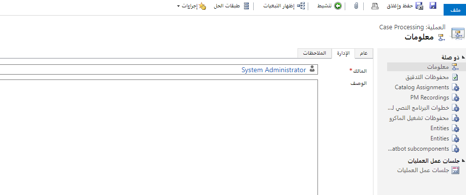  
‎

| **النطاق**| **الوصف** |  
| - |  
| **المستخدم**| سيتم تشغيل سير العمل فقط للسجلات التي يمتلكها مالك سير العمل. لا تؤثر مشاركة السجل وملكية سجلات الفريق على النطاق، أي لن يتم تشغيل سير العمل للسجلات المملوكة من قبل فرق المالك التي يعد المستخدم عضواً فيها. |  
| **وحدة الأعمال**| سيتم تشغيل سير العمل فقط للسجلات المملوكة من قبل المستخدمين أو فرق المالكين داخل نفس وحدة الأعمال التي يمتلكها مالك سير العمل. |  
| **الأصل: وحدات الأعمال الفرعية:**| سيتم تشغيل سير العمل فقط للسجلات المملوكة من قبل المستخدمين أو فرق المالكين داخل نفس وحدة العمل مثل مالك سير العمل أو في أي من وحدات الأعمال التابعة لوحدة أعمال المستخدم. |  

يضيف التحديد الدقيق للنطاق المرونة في كيفية ووقت تشغيل مهام سير العمل.

- عند منح الامتيازات الكافية، يمكن للمستخدمين أتمتة تفاعلاتهم مع التطبيق من خلال إنشاء مهام سير العمل وتحديد نطاق المستخدم لسير العمل

- يمكن أن تستهدف مهام سير العمل مجموعة من المستخدمين تنطبق عليهم الوظيفة. على سبيل المثال، قد ترغب في تطبيق عملية تصعيد حالة الطوارئ فقط إذا كان مالك الحالة ضمن وحدة أعمال الاستجابة للطوارئ

قيمة النطاق الافتراضية هي المستخدم. بالنسبة إلى مهام سير العمل التي تم نشرها مع الحلول التي تنوي العمل بها على جميع السجلات التي تم تعديلها، قد ترغب في أن يكون للنطاق الذي تم تكوينه للمؤسسة ومستخدم الاتصال حق الوصول للقراءة على مستوى المؤسسة للعمل بشكل صحيح. تأكد من التحقق من أن قيمة النطاق مناسبة قبل تنشيط سير العمل.

## <a name="security-context"></a>سياق الأمان 

### <a name="background-workflows"></a>سير العمل في الخلفية

عندما يبدأ سير العمل في الخلفية استناداً إلى حدث ما، يعمل سير العمل في سياق الشخص الذي يمتلكه، وعادة ما يكون الشخص الذي أنشأ سير العمل أو استورد الحل الذي يحتوي على سير العمل.

عندما يتم تكوين سير عمل في الخلفية كعملية عند الطلب ويبدأها مستخدم باستخدام الأمر "تشغيل سير العمل"، يتم تنفيذ أي إجراء يتم تنفيذه بواسطة سير العمل في سياق هذا المستخدم. تقتصر الإجراءات التي يمكن لسير العمل تنفيذها على تلك التي يمكن للمستخدم تنفيذها استناداً إلى الامتيازات ومستويات الوصول المحددة بواسطة دور (أدوار) الأمان المعينة لحساب المستخدم الخاص به. 

### <a name="real-time-workflows"></a>سير العمل الفوري

بالنسبة إلى مهام سير العمل الفوري، لديك الخيار "تنفيذ باسم" ويمكنك اختيار ما إذا كان سير العمل يجب أن يطبق سياق الأمان لمالك سير العمل أو المستخدم الذي أجرى تغييرات على السجل. 

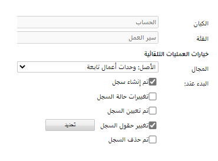

إذا كان سير العمل الخاص بك يتضمن إجراءات، والتي لن يتمكن جميع المستخدمين من تنفيذها استناداً إلى قيود الأمان، يمكنك اختيار تشغيل سير العمل كمالك لسير العمل. 

### <a name="templates"></a>القوالب

تسمح لك قوالب سير العمل بإنشاء سير عمل بسرعة من خلال البدء من حالة سابقة الإنشاء. يتم إنشاء القوالب عن طريق إنشاء سير عمل عادي وتغيير قالب التنشيط اعتباراً من العملية إلى نموذج العملية. يمكن أن تكون قوالب العمليات مفيدة في السيناريوهات التالية:

- تريد السماح للمستخدمين بإنشاء مهام سير العمل الخاصة بهم مع منحهم نقطة بداية، على سبيل المثال متابعة الحساب. في هذا السيناريو، يمكن للمستخدم أن ينشئ من العملية تغييراً لأشياء قليلة فقط مثل عدد الأيام. ثم حفظ وتنشيط سير العمل على أنه خاص بهم.  

- يمكن لموردي البرامج المستقلين (ISVs) أيضاً إرسال الحلول الخاصة بهم باستخدام قالب عملية يسمح لعملائهم بتنفيذ مهام سير العمل بسرعة من نقطة البداية التي قدموها.

توضح الصورة التالية كيفية تغيير حالة التنشيط لسير العمل من عملية إلى عملية قالب. 

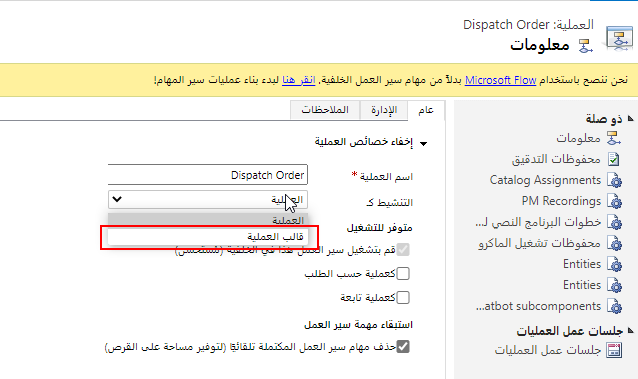

بعد إنشاء الخطوات في سير العمل، يجب عليك حفظها وتنشيطها حتى تكون متاحة لإعادة الاستخدام.

ثم عندما ينتقل المستخدم لإنشاء سير عمل جديد ويختار الفئة والكيان المناسبين، سيظهر في قائمة القوالب المتاحة. باختيار عملية جديدة من قالب، سير العمل الذي يقومون بإنشائه سيتم تعبئته مسبقاً بخطوات سير العمل من القالب. سيحتاج المستخدم فقط إلى إجراء أي تغييرات مطلوبة، وحفظه باسم جديد وتنشيطه ليكون جاهزاً للتشغيل.

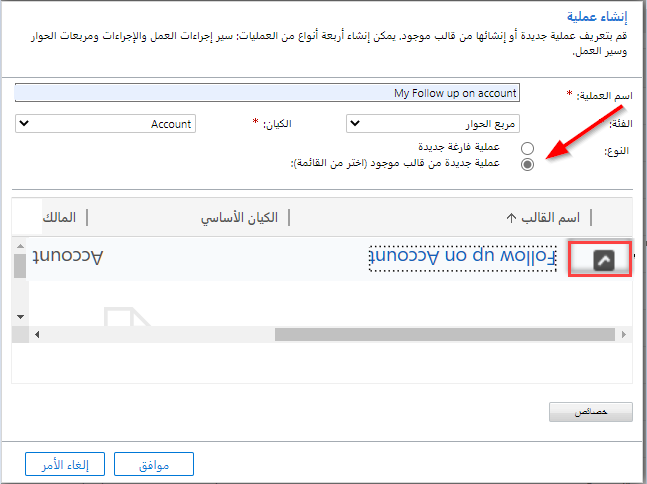

### <a name="runtime-management"></a>إدارة وقت التشغيل
> [!VIDEO https://www.microsoft.com/videoplayer/embed/RWrFjs]

### <a name="common-patterns-and-techniques"></a>الأنماط والتقنيات الشائعة
تحتوي مهام سير العمل على العديد من الأنماط والتقنيات الشائعة التي يمكن أن تكون مفيدة في إنشاء تطبيقات فعالة وتجنب الأخطاء الشائعة.

## <a name="waiting"></a>الانتظار

يمكن أن تكون شروط انتظار سير العمل مفيدة لإيقاف العملية مؤقتاً حتى يتم استيفاء شروط بيانات معينة. على سبيل المثال، قد ترغب في الانتظار حتى تتغير حالة الاستحقاق إلى منتهي الصلاحية قبل متابعة التجديد. أو قمت بتعيين مهمة لمستخدم وتريد الانتظار حتى تكتمل المهمة. من الممكن دمج شروط انتظار متعددة باستخدام عوامل التشغيل AND وOR، ويمكن أن تتضمن الشروط حقولاً من العمل الهدف بالإضافة إلى الكيانات ذات الصلة.

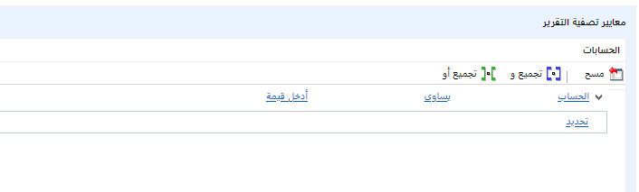

على الرغم من الاسم، فإن الانتظار ليس الطريقة الأكثر فاعلية للتعامل مع الأحداث المتعلقة بالوقت. بدلاً من ذلك، استخدم خاصية **المهلة** الخاصة بالعملية لتحديد الشروط المطلقة أو النسبية.

يمكنك إيقاف سير العمل مؤقتاً لمدة محددة، على سبيل المثال يوم واحد.

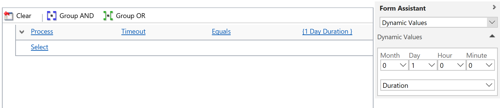

أو يمكنك الانتظار حتى يتم استيفاء شرط نسبي معين، على سبيل المثال، الانتظار لمدة 30 يوماً قبل تاريخ انتهاء الاستحقاق قبل إرسال تذكير بالبريد الإلكتروني إلى العميل.

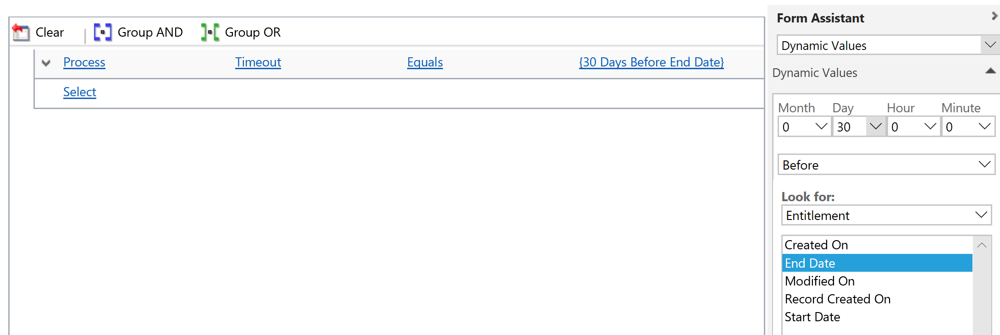

تجنب الاستخدام المفرط لظروف الانتظار بسبب العوامل التالية:

- الآثار المترتبة على الأداء: كل مثيل سير عمل انتظار يحمل عبء الأداء. كلما زاد انتظار مثيلات سير العمل لديك، سيتم استهلاك المزيد من موارد الخادم. 

- إذا قمت بتغيير المنطق في سير العمل الخاص بك وأعدت النشر (مثل تحديث نص البريد الإلكتروني المرسل إلى العميل الخاص بك)، فإنه لا يغير مثيلات سير العمل المنتظرة. على سبيل المثال، إذا قمت بتغيير تكرار البريد الإلكتروني للتجديد إلى 15 يوماً بدلاً من 30 يوماً، فلن يتم تحديث أي مثيلات سير عمل تنتظر حالياً.

لا يمكن استخدام شروط الانتظار والمهلة في مهام سير العمل الفوري.

Power Automate قدمت طرقاً أكثر فاعلية لتنفيذ بعض الأنماط. على سبيل المثال، إذا كان لديك عدد كبير من مهام سير العمل في انتظار أحداث غير متكررة مثل التجديد السنوي، ففكر بدلاً من ذلك في جعل سير العمل يعمل وفقاً لجدول زمني، على سبيل المثال مرة واحدة في الأسبوع، ومعالجة جميع السجلات المُستحقة للتجديد في غضون ذلك الأسبوع، يمكن أن تكون أكثر فعالية.

### <a name="parallel-wait"></a>الانتظار المتوازي

عندما تنتظر العملية حدوث شيء ما، احذر من السيناريوهات التي لن يتم فيها تلبية الشرط أبداً. على سبيل المثال، إذا انتظر سير العمل حتى تكتمل مهمة ما ولكن تم إلغاءها بدلاً من ذلك، فلن يصل سير العمل مطلقاً إلى الخطوات التالية وسوف ينتظر إلى أجل غير مسمى.

يسمح الانتظار المتوازي بالانتظار في ظروف متعددة في نفس الوقت. يستخدم الانتظار الموازي الأكثر شيوعاً مزيجاً من انتظار البيانات وشروط انتهاء المهلة. على سبيل المثال، انتظر حتى تكتمل المهمة وإرسال بريد إلكتروني إلى مدير المستخدم في غضون ثلاثة أيام، مهما حدث قبل ذلك.

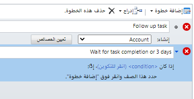

### <a name="stopping"></a>الإيقاف

عندما يلزم إيقاف سير العمل، يقدم مُحرر سير العمل خيارين لخطوة إيقاف سير العمل: **تم بنجاح** و **تم إلغاؤه**. يتمثل الاختلاف الرئيسي في أن الحالة **تم إلغاؤه** تُعتبر خطأ، مما يترتب عليه الآثار التالية:

1. يتم الاحتفاظ بسجلات السجل (إذا تم تعيين العلامة للاحتفاظ بسجلات مهام سير العمل التي فشلت).

2. بالنسبة إلى مهام سير العمل في الفورية، تتراجع المعاملة التي يعد سير العمل جزءاً منها وتفشل العملية بأكملها.

يُعد إلغاء سير العمل بمثابة إنهاء غير طبيعي ويجب استخدامه فقط عند حدوث شيء غير متوقع، ويجب إلغاء العملية بأكملها (لعمليات سير العمل الفورية) وهناك ما يبرر إجراء مزيد من التحقيق.

تحتوي خطوة إيقاف سير العمل على خاصية واحدة تسمى **رسالة الحالة** والتي يمكن استخدامها لنشر رسالة الخطأ الصحيحة للمستخدم. إذا كان سير العمل الفوري جزءاً من معاملة بدأها مستخدم، على سبيل المثال عند إنشاء سجل، وتم تعيين خاصية **رسالة الحالة**، سيرى المستخدم هذه الرسالة. يمكن إنشاء الرسالة ديناميكياً باستخدام قيم السجلات الحالية. 

### <a name="urls"></a>URLs

يتضمن كل سجل في سير العمل حقلاً خاصاً يُسمى عنوان URL للسجل (ديناميكي) سيتم ملؤه في وقت التشغيل برابط فريد للسجل الهدف. يمكن استخدام هذه الخاصية في أي مكان في سير العمل حيث يتم استخدام حقول السجل. إنه مفيد بشكل خاص عند إنشاء محتوى بريد إلكتروني (أو أي نشاط آخر).

بدلاً من عرض عنوان URL الكامل كجزء من البريد الإلكتروني بتنسيق HTML، يسمح لك سير العمل بإدراج ارتباط تشعبي في السياق باستخدام أمر إدراج ارتباط تشعبي خاص في محرر البريد الإلكتروني لسير العمل.

تم تنسيق الارتباط التشعبي باستخدام البنية التالية:

```html
<hyperlink><name>Open the Record</name><value>{Case-{Record URL(Dynamic)}}</value></hyperlink>
```

في وقت التشغيل سيتم تحويل هذا التعريف إلى علامة HTML &lt;a&gt;. لا يسمح إنشاء عنوان URL للسجل بفتح سجل في واجهة موحدة، ولا في سياق التطبيق الصحيح. إذا كنت تريد دعم التطبيقات أو التنقل في الواجهة الموحدة، ففكر في إنشاء عناوين URL باستخدام تعبيرات سير العمل بدلاً من ذلك.

### <a name="child-workflows"></a>سير العمل الفرعي

تُعد القدرة على إعلان واستدعاء سير العمل التابع مفيدة في العديد من السيناريوهات.

### <a name="ordering"></a>الترتيب

في بعض الأحيان يكون من المرغوب فيه تنفيذ مهام سير العمل المتعددة بترتيب معين. إذا قمت بتعريف مهام سير العمل هذه كعمليات فرعية، فسيكون من الممكن إنشاء سير عمل أصلي يتحكم في سير العمل يمكنه استدعاء مهام سير العمل التابع بترتيب معين.

> [!NOTE] 
> بالنسبة إلى مهام سير العمل في الخلفية، لا يوجد ضمان لتنفيذ مهام سير العمل التابعة بنفس الترتيب الذي تم استدعاؤها.

### <a name="elevating-permissions"></a>رفع الأذونات

غالباً ما يتم تشغيل سير العمل في سياق المستخدم الذي قام بتشغيل سير العمل. في بعض الأحيان، ومع ذلك، فإن الامتيازات المرتفعة مطلوبة. على سبيل المثال، قد تحتاج إلى تحديث حقل محمي بأمان على مستوى الحقل مع الحفاظ على سياق بقية العمليات التي يتم إجراؤها. يمكن تنفيذ العملية المرتفعة كسير عمل تابع مُنفصل تم تكوينه للتشغيل في سياق المالك.

### <a name="changes-to-workflow-definitions"></a>تغييرات على تعريفات سير العمل

سير العمل الجاري دائماً يخزن التعريفات مؤقتاً ولا يتأثر بأي تغييرات تعريف مستقبلية. هذا السلوك حسب التصميم، ومع ذلك، فمن المستحسن في بعض الأحيان أن يكون لديك بعض الخطوات لاستخدام أحدث التعريفات، على سبيل المثال محتوى بريد إلكتروني ثابت. يتيح عزل هذه الخطوات في سير عمل تابع منفصل للمستخدمين بشكل فعال تعديل خصائص سير عمل قيد التشغيل.

على سبيل المثال، ينتظر سير العمل حتى 30 يوماً قبل انتهاء صلاحية الاتفاقية، ثم يرسل بريداً إلكترونياً للتذكير. يمكن أن يكون سير العمل هذا في مرحلة الانتظار لفترة طويلة، على سبيل المثال منذ آخر تجديد قبل عامين. مرة أخرى، بالنسبة للسيناريوهات ذات فترات الانتظار الطويلة، ضع في اعتبارك أن Power Automate تعمل على أساس مجدول.

### <a name="routing"></a>التوجيه

إذا كان لديك نمط انتظار شائع، على سبيل المثال انتظار رسالة بريد إلكتروني، ولديك العديد من العمليات المميزة لمعالجة البريد الإلكتروني المستلم اعتماداً على بعض المعايير، فقد يكون نمط جهاز التوجيه مفيداً. قم بتقييم بيانات البريد الإلكتروني في سير عمل مركزي واحد ثم أرسل العمل المطلوب إنجازه إلى مهام سير العمل التابعة، كما هو مطلوب.

### <a name="workflows-and-other-automations"></a>سير العمل والأتمتة الأخرى

عند إنشاء الأتمتة بما في ذلك سير العمل، يجب أن تأخذ في الاعتبار الأتمتة الأخرى (قواعد العمل، Power Automate، منطق المطور) الموجودة بالفعل أو التي سيتم بناؤها. ينفذ كل نوع من الأتمتة التي توفرها platform Power بعض أشكال الحماية أو الميزات التي تحاول تقليل قدرة التشغيل الآلي على التأثير على الآخر. يتحمل فريق المشروع المسؤولية النهائية عن ضمان توافق الأتمتة التي يبنونها.

### <a name="workflows-and-other-processes"></a>سير العمل والعمليات الأخرى

ضمن سير العمل، قد يؤدي تنفيذ نفس العملية التي تم تكوينها كمشغل سير عمل إلى حدوث حلقة لا نهائية. على سبيل المثال، قد يؤدي تحديث سجل الحساب الهدف في سير العمل الذي يتم تشغيله بواسطة حدث تحديث الحساب إلى تشغيل سير العمل نفسه والتسبب في الحلقة. لمنع هذه الحلقات، سينهي النظام أي مهام سير عمل تتكرر أكثر من 15 مرة في غضون ساعة.

التبعيات الدائرية غالباً ما تكون غير مباشرة. يمكن أن تؤدي عمليات تلقائية أخرى مثل المكونات الإضافية وقواعد العمل والتدفقات إلى تشغيل أحداث تتسبب في تنفيذ مهام سير العمل. من ناحية أخرى، يمكن أن تؤدي مهام سير العمل إلى أحداث تؤدي إلى تشغيل عمليات أتمتة أخرى بما في ذلك مهام سير العمل نفسها. بدون مراعاة والتنسيق في مشروعك، يمكن أن يؤدي هذا التشغيل ذهاباً وإياباً إلى حالات توقف (مما قد يؤدي إلى انتهاء المهلة / فشل إجراءات المستخدم) وضعف الأداء.

هناك طريقة جيدة لتجنب التشغيل غير الضروري والحلقات وهي التأكد من ضبط عوامل تصفية السمات بشكل صحيح على مهام سير العمل والمكونات الإضافية وPower Automate عند تكوين مشغلات التحديث. 

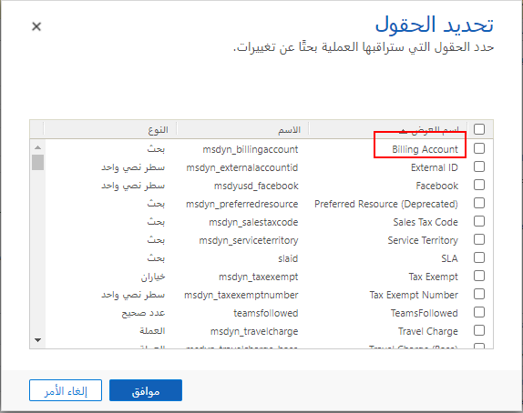

هناك أسلوب آخر يتسبب في الإفراط في تشغيل مهام سير العمل والعمليات الأخرى وهو تحديث العديد من الحقول. من المهم أن تتذكر أن أي تحديث سيؤدي إلى إطلاق مشغل تغيير الحقل حتى إذا لم تتغير القيمة ولكن تم تحديدها في طلب التحديث. تأكد دائماً من أنك في أي تحديث تحدد فقط الحقول التي تحتوي على قيم متغيرة فعلية.

### <a name="impact-of-multiple-workflows-or-plugins"></a>تأثير عمليات سير العمل المتعددة أو المكونات الإضافية

عندما يكون لديك العديد من مهام سير العمل و/ أو المكونات الإضافية الفورية التي يتم تشغيلها لنفس حدث التشغيل، يجب أن تنجح جميعها، أو تفشل جميعها، وسيتم التراجع عن التغييرات. إذا كنت تقوم ببناء سير عمل في الفوري واستخدمت خيار إيقاف سير العمل الذي يوفر خطأ تذكر أن هذا يمكن أن ينهي كل العمل الجاري ويوقف طلب الإنشاء أو التحديث من الاكتمال. ضع في اعتبارك دائماً ما إذا كان إنشاء مهمة لشخص ما لمتابعة الحل هو خيار أفضل من مجرد إنهاء العمل.

تعمل مهام سير العمل في الخلفية بشكل مستقل عن مهام سير العمل والمكونات الإضافية الأخرى. أمر التنفيذ ووقت الانتهاء غير مضمونين وسيحدثان في معظم الحالات بعد أن يتلقى المستخدم بالفعل الاستجابة لطلب الإنشاء أو التحديث.  

يمكن أن يؤدي تشغيل أكثر من سير عمل واحد يقوم بتحديث نفس الكيان إلى حدوث مشكلات في تأمين الموارد. من الممارسات الجيدة لتجنب عمليات التأمين المحتملة تحديد عدد مهام سير العمل التي تقوم بتحديث نفس الكيان.

من خلال التنسيق مع مهندس الحلول الخاص بمشروعك، يمكنك التأكد من أن أتمتة سير العمل التي يتم بناؤها ستكون متوافقة مع الأتمتة الأخرى ولا تسبب توقفاً أو مشكلات في الأداء. 
