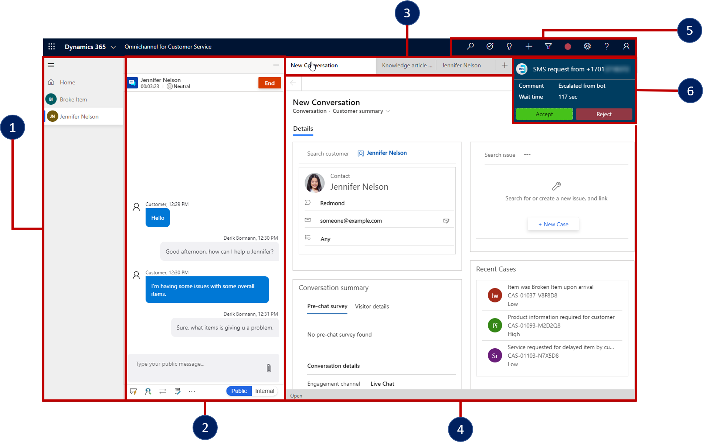

في عالم اليوم من العملاء الممكنين، تدرك المؤسسات التي تركز على الخدمات الحاجة إلى تعديل استراتيجية الدعم الخاصة بها لتزويد العملاء بأفضل خيارات الدعم التي تستند إلى احتياجاتهم. يرغب العملاء في التفاعل مع مؤسسات الخدمة وفقاً لشروطهم. انهم يريدون أن يكونوا قادرين على الاتصال متى وكيف يشعرون بالراحة أكثر. يريد العملاء أيضاً معرفة أنه عند الاتصال، سيحصل المندوبون على المعلومات المطلوبة لحل مشكلتهم.

إحدى الطرق التي يمكن للمؤسسات من خلالها مساعدة عملائها هي تقديم مجموعة متنوعة من قنوات الدعم مثل الدعم عبر الهاتف والبريد الإلكتروني والمحادثة الحية والمندوبين الافتراضيين ووسائل التواصل الاجتماعي والمنتديات وقواعد المعرفة بالخدمة الذاتية وما إلى ذلك. يشار إلى هذا النوع من الدعم عادةً باسم الدعم متعدد القنوات. في حين أن تزويد العملاء بخيارات دعم متعددة غالباً ما يسهل عليهم بدء طلبات الدعم، فإنه يقدم تحديات جديدة لمؤسسة الدعم. يتمثل أحد التحديات الرئيسية للمؤسسات في تزويد العملاء بتجربة سلسة ومرضية بشكل متساوٍ عبر أي قناة يستخدمونها لجذب الدعم.

سواء كانت المؤسسة تساعد العميل من خلال المحادثة الحية أو المندوبين الافتراضيين (الروبوتات) أو الدعم عبر الهاتف، فمن الأهمية بمكان أن تتوفر نفس المعلومات المتوفرة من خلال قناة واحدة من خلال القنوات الأخرى. يجب أن يكون المندوب الذي يعمل مع العميل من خلال المحادثة قادراً على استخدام نفس مستودعات المعرفة التي يعمل بها المندوب الذي يتفاعل عبر الهاتف. في الوقت نفسه، حيث يتم نقل العملاء عبر قنوات أو أقسام مختلفة، يجب أن يعرف المندوبون سياق ما حدث لتلك النقطة. يضمن هذا الأسلوب عدم اضطرار العميل إلى إعادة شرح أو تكرار أي خطوات حل تم تجربتها مسبقاً.

لهذا السبب، تسعى المؤسسات جاهدة لتوفير تجربة قناة متعددة الاتجاهات لعملائها تضمن نفس التجربة، بغض النظر عن كيفية وصول العميل.

تشمل العديد من الطرق التي يمكن أن يفيد بها حل القناة متعددة الاتجاهات المؤسسات:

-   **تقليل جهد العميل** - من خلال تقديم قنوات دعم متعددة والحفاظ على السياق عبر كل قناة، يمكن للمؤسسات مساعدة العملاء في بذل جهد أقل في حل مشكلاتهم. توفر هذه الطريقة وقت المؤسسة، كما توفر على العميل وقت وساعات العمل، مما يساعده على المساهمة في نجاحه.

-   **علاقة أفضل مع العملاء** - من خلال الحصول على رؤية أعمق لتاريخ العميل، بغض النظر عن قناة الدعم المستخدمة، يكون لدى المندوبين فهم أفضل لمن هو العميل والتحديات التي يواجهونها والمكان الذي يريدون الذهاب إليه. يمكن أن يساعد هذا النهج العملاء على الشعور بالتقدير وفهم احتياجاتهم؛ ومن ثمَّ مساعدتهم على تمكينهم من دعم أنفسهم بشكل أفضل في المستقبل.

-   **زيادة ولاء العملاء** - نظراً لأن العملاء يعرفون أنه يتم تقديرهم وفهمهم، فسيصبحون بطبيعة الحال أكثر ولاءً لمؤسستك. نتيجة لذلك، يمكن لمؤسستك أن تقدم للعملاء فرصاً مستهدفة وذات صلة بالبيع الإضافي أو البيع المتلازم بناءً على احتياجاتهم.

باستخدام القناة متعددة الاتجاهات لـ Customer Service في Dynamics 365، يمكن للمؤسسات تقديم دعم القناة متعددة الاتجاهات لعملائها. يوسع الحل من قوة Dynamics 365 Customer Service. يوفر تطبيقاً حديثاً وقابلاً للتخصيص وعالي الإنتاجية يسمح للمندوبين بالتفاعل مع العملاء عبر قنوات مختلفة.

توفر القناة متعددة الاتجاهات لـ Customer Service للمندوبين الميزات التالية:

1. **إدارة جلسات العمل** - تتيح لوحة جلسة العمل للمندوبين العمل مع جلسات عملاء متعددة في آن واحد. يمكن للمندوبين التبديل بين جلسات العمل دون فقدان سياق المحادثة أو أي تفاصيل عميل.

1. **تفاعل العملاء** - تسمح لوحة المحادثة للمندوبين بالتفاعل مباشرةً مع العملاء من لوحة الاتصالات.
    يمكن للمندوبين استخدام قاعدة المعارف والتعاون مع الزملاء والمزيد.

1. **التطبيقات المتعددة** - يتيح شريط علامة تبويب **التطبيقات** للمندوبين الوصول إلى التطبيقات الداعمة ذات الصلة في سياق جلسة العمل. تظل هذه التطبيقات مفتوحة إذا انتقل المندوب إلى جلسة عمل أخرى.

1. **ملخص العميل** - توفر لوحة الواجهة الموحدة عرضاً سياقياً واحداً للعميل بناءً على المحادثة الحالية.
    يمكن للمندوبين الوصول إلى تفاصيل العميل ومعلومات الحالة ذات الصلة، ويمكنهم عرض الأنشطة من السجلات ذات الصلة من شاشة واحدة.

1. **الوصول السريع إلى أدوات Dynamics 365 المألوفة** - باستخدام وظائف Dynamics 365 الحالية، يمكن للمندوبين الوصول إلى البحث عن السجلات وإنشاء سجل سريع ومعلومات حضور المندوب.

1. **الإخطار في الوقت الحقيقي** - يتلقى المندوبون رسائل إخطار في الوقت الفعلي بالاتصالات الواردة من العملاء.
