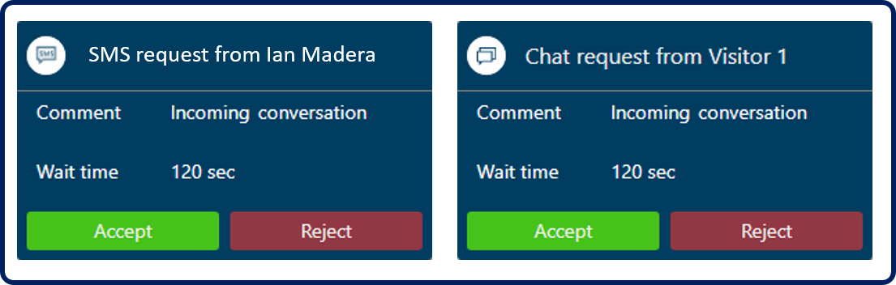

## <a name="accessing-the-omnichannel-for-customer-service-app"></a>جارٍ تقييم تطبيق القناة متعددة الاتجاهات لـ Customer Service

يمكن للمندوبين الوصول إلى تطبيق القناة متعددة الاتجاهات لـ Customer Service من خلال الوصول إلى شاشة التطبيقات في بيئتهم. سيبدو العنوان مشابهاً لهذا المثال: ```
https://mytrainingenviornment.crm.dynamics.com/apps```.

بعد المصادقة بنجاح على التطبيق، سيتم إحضار المستخدمين إلى صفحة التطبيق الخاصة بهم. حدد **القناة متعددة الاتجاهات لـ Customer Service** لتشغيل التطبيق.


## <a name="working-with-the-omnichannel-for-customer-service-user-interface"></a>العمل مع واجهة مستخدم القناة متعددة الاتجاهات لـ Customer Service

في كل مرة يقوم فيها المندوبون بتسجيل الدخول إلى القناة متعددة الاتجاهات لـ Customer Service، يتم نقلهم إلى جلسة العمل الرئيسية الخاصة بهم. جلسة العمل الرئيسية مفتوحة دائماً ولا يمكن إغلاقها في أي وقت. تشبه جلسة العمل الرئيسية تقريباً المعسكر الأساسي للمندوب. في أي وقت، يمكن للمندوبين العودة إلى جلسة العمل الرئيسية والعمل على العناصر التي قد لا تكون مرتبطة بالعميل أو المحادثة التي تحدث.

بشكل افتراضي، سيتم فتح جلسة العمل الرئيسية لوحة معلومات مندوب القناة متعددة الاتجاهات على علامة التبويب **التطبيقات**. والغرض من لوحة المعلومات هذه هو تزويد المندوبين بمعلومات حول عناصر العمل المتوفرة لهم. 

> [!NOTE]
> عنصر العمل هو طريقة أخرى للإشارة إلى محادثة. قد تكون المحادثة محادثة مباشرة مع عميل أو محادثة رسائل قصيرة أو شيء مشابه.


تحتوي لوحة المعلومات على تدفقات بيانات متعددة. دفق البيانات هو طريقة لتقديم المعلومات في Dynamics 365، حيث يتم تضمين البيانات في الدفق في طريقة العرض عن طريق بيانات الخلفية. ميزة واحدة لتدفقات البيانات هي أنه يمكنك تشغيل إجراءات سجل مختلفة مباشرة من الدفق.

تحتوي لوحة معلومات مندوب القناة متعددة الاتجاهات على التدفقات التالية:

-   **عناصر العمل الخاصة بي** - عرض قائمة بالمحادثات التي يعمل عليها المندوب بنشاط. يتم تزويد المندوبين بإجراء مفتوح، والذي يسمح لهم بفتح عنصر العمل لمواصلة العمل عليه.

-   **عناصر العمل المفتوحة** - يعرض قائمة المحادثات المفتوحة حالياً والمتاحة من قوائم الانتظار التي يكون المندوب عضواً فيها. قد يتم تعيين مندوب كعضو في قوائم انتظار متعددة في التطبيق استناداً إلى دورها أو مهاراتها أو عوامل أخرى. يتم تزويد المندوبين بإجراء اختيار لمساعدتهم على تحديد العناصر من قائمة الانتظار. عندما يختار مندوب عنصراً، يتم نقله إلى تدفق **عناصر العمل الخاص بي** للمندوب.

-   **عناصر العمل المغلقة** - تعرض قائمة بالمحادثات التي أغلقها المندوب خلال ال 24 ساعة الماضية. يتيح هذا الدفق للمندوبين إمكانية إعادة فتح العنصر إذا كان لديهم مهام إضافية لإكمالها.


## <a name="working-with-agent-presence"></a>العمل مع حضور المندوب

كلما تم تسجيل دخول المندوبين إلى التطبيق، سيكون لديهم مؤشر وجود يقوم بتوصيل حالتهم الحالية. حضور المندوب جزء مهم من حل القناة متعددة الاتجاهات لأنه يتم استخدام حضور المندوب الحالي لتحديد ما إذا كان يمكن توجيه عنصر عمل إليها. على سبيل المثال، قد يكون نهج مؤسستك هو أنه إذا تم عرض حضور المندوب على أنه **متاح**، يمكن إرسال عناصر العمل إليها؛ ومع ذلك، إذا تم تعيين حضوره إلى **عدم الإزعاج**، فلا ينبغي إرسال أي شيء إلى المندوب. يمكن للمؤسسات تكوين حالات الحضور التي يمكنك توجيه أنواع مختلفة من الاتصالات إليها أو لا يمكنك توجيهها إليها. يمكن للمندوبين عرض حضورهم من جزء التطبيقات. يتم تمثيل رمز التواجد بدائرة ذات رموز لونية. سيكون لكل حضور لون مطابق مقترن به.


### <a name="manually-updating-presence"></a>تحديث الحضور يدوياً

إذا لزم الأمر، يمكن للمندوبين تغيير حالة حضورهم يدوياً استناداً إلى ما يقومون به. يمكن للمندوبين تبديل حالتهم يدوياً إلى إحدى حالات الحضور القياسية الخمسة المتوفرة. على سبيل المثال، إذا تم سحب مندوب إلى مكالمة هامة لا يمكنه المغادرة، فقد يقوم المندوب بتعيين حالته إلى عدم الإزعاج. بعد أن يكمل المندوب المكالمة، يمكنهم تغيير حالتهم مرة أخرى إلى متاح.

### <a name="automatically-updating-presence"></a>تحديث الحضور تلقائياً

عند تعيين عناصر العمل إلى مندوبين، يتم تعيين حالة حضورهم تلقائياً. تختلف الحالة المعينة باختلاف العوامل.

أحد العوامل هو مقدار القدرة المتاحة التي يمتلكها المندوب في ذلك الوقت. تحدد القدرة الإنتاجية الحد الأقصى لعدد الوحدات التي يستطيع المندوب التعامل معها في وقت واحد. يتم تقليل القدرة الإنتاجية المتوفرة للمندوب حيث يتم تعيين عناصر العمل إليها ثم زيادتها مع حل عناصر العمل.

### <a name="key-points-on-capacity"></a>النقاط الأساسية حول القدرة الإنتاجية

النقاط الأساسية حول قدرة المندوب الإنتاجية هي:

-   يتم تعيين قدرة إنتاجية لكل مندوب تبلغ 100 افتراضياً.

-   كل قناة اتصال لديها القدرة الإنتاجية المعينة لها. يمثل هذا مقدار القدرة الإنتاجية التي يتم استهلاكها عند تعيين عنصر عمل مندوب من تلك القناة.

على سبيل المثال، مندوب يدعى بيرت، لديه قدرة 100 ولا يعمل حاليا على أي شيء. لدى منظمة بيرت قناة محادثة تم تكوينها لتكون سعتها 20، مما يعني أنه عندما يتم تعيين المندوبين إلى عنصر عمل من تلك القناة، سيتم تقليل سعتهم بمقدار 20. عندما يتم تعيين بيرت إلى عنصر عمل من قناة المحادثة، تنخفض قدرته إلى 80. عندما يحل بيرت المحادثة، سيتم إضافة الوحدات العشرين مرة أخرى إلى قدرته، وبالتالي زيادة القدرة مرة أخرى إلى 100.

يعتمد إعداد حالة وجود المندوب على مقدار القدرة الإنتاجية المستخدمة بعد تعيين عنصر له.

-   عند استخدام قدرة المندوب، يتم تعيين التواجد إلى عدم الإزعاج.

-   عند استخدام قدرة المندوب جزئياً، يتم تعيين الحضور إلى "مشغول".

-   عندما لا يتم استخدام قدرة المندوب، يتم تعيين الحضور إلى متاح.


## <a name="working-with-notifications"></a>العمل مع الإخطارات

كما يتم توزيع عناصر العمل على المندوبين، إحدى الطرق بالنسبة لهم لمعرفة أنه يتم تعيين عنصر من خلال الإخطارات. يتم عرض مربعات الحوار تنبيه إخطار عند تعيين مندوبين إلى محادثة أو طلب محادثة رسائل قصيرة من عميل. سوف يقدم الإخطار تفاصيل حول العميل الذي سيتفاعلون معه.



بعد قبول مندوب الإخطار، ستقوم القناة متعددة الاتجاهات لـ Customer Service بتحميل جلسة عمل جديدة في التطبيق.


