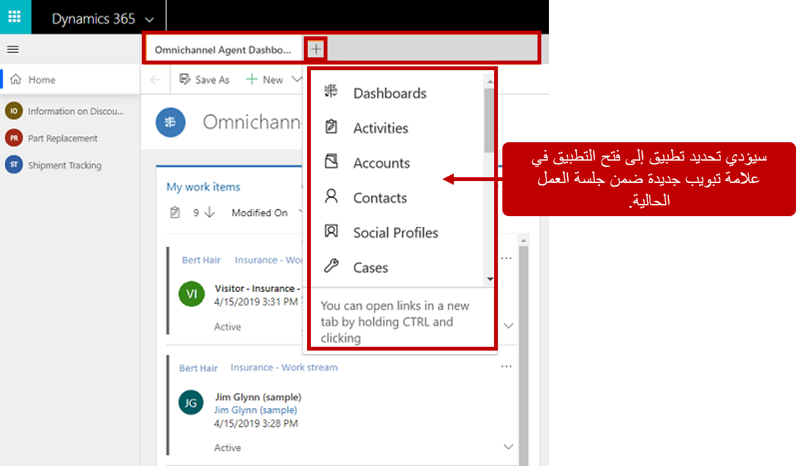

## جلسات عمل القناة متعددة الاتجاهات

العمل مع جلسات عمل متعددة هي واحدة من السمات الرئيسية لحل القناة متعددة الاتجاهات لـ Customer Service. تحتفظ الجلسات بالبيانات والتطبيقات ذات الصلة معاً في منطقة واحدة. عندما يتنقل المندوبون بين الجلسات، لا داعي للقلق بشأن ضياع التغييرات غير المحفوظة؛ ستظل جميع المعلومات في الجلسة عند عودتهم إليها.

على سبيل المثال، بينما يتعامل المندوب مع عميل من قناة SMS، قرر إدخال ملاحظة تتعلق بجهة الاتصال. بينما يضيف المندوب الملاحظة مباشرة إلى علامة التبويب **المحادثة** في تلك الجلسة، يتلقى إخطاراً حول محادثة واردة أخرى.

عندما يقبل المندوب الطلب، يتم إنشاء جلسة عمل جديدة. يمكن للمندوب الوصول إلى نفس الميزات والأدوات كما في الجلسة الأخرى، ولكن ستكون جميع العناصر في سياق المحادثة الجديدة. يمكن للمندوب بعد ذلك التبديل بسهولة بين الجلستين، إذا لزم الأمر. ستظل جميع المعلومات الملتقطة في الجلسة الأولى، حتى لو لم يتم حفظ السجل في البداية أثناء عمل المندوب عليه.

### التعامل مع جلسات العمل

تعرض لوحة جلسة العمل جميع جلسات العمل التي يعمل عليها مندوب حالياً. بشكل افتراضي، ستكون اللوحة في وضع موسع، ولكن يمكن للمندوبين التبديل بين الوضع الموسع أو المطوي. يوفر هذا الخيار مرونة للمندوبين لاستخدام أكبر قدر ممكن من الشاشة كما يريدون أثناء العمل مع العملاء لحل مشكلاتهم. سيتم تغيير قائمة جلسات العمل في لوحة جلسة العمل حيث يعمل المندوبون مع العملاء. جلسة العمل الوحيدة التي لن تتغير هي جلسة العمل الرئيسية، والتي ستكون دائماً راسية ولا يمكن إغلاقها من قِبل المندوبين.

### عناوين الجلسة والرموز

تحتوي كل جلسة عمل مدرجة في لوحة جلسة العمل على عنوان ورمز. تختلف معلومات عنوان الجلسة بناء على ما إذا كان المستخدم مستخدماً مصادقاً أو مستخدماً مجهولاً. جلسات العمل المقترنة مع المستخدمين المصادقين يكون اسم جلسة العمل التي تم ملؤها من معلومات سجل Dynamics 365. بشكل افتراضي، تعرض جلسة العمل اسم العميل أو الحساب أو عنوان الحالة. تعرض الجلسات من المحادثات غير المصادق عليها إما الزائر أو الحادث (اعتماداً على العنصر) مع رقم. على سبيل المثال، قد تعرض جلسة عمل لزائر عام الزائر 1 أو الزائر 2.

تعرض رموز جلسة العمل الحرفين الأولين من عنوان الجلسة. بالنسبة للجلسات التي لها كلمات متعددة، يتم استخدام الحرف الأول من الكلمتين الأوليين. على سبيل المثال، ستظهر جلسة عمل تتعلق بجهة اتصال تسمى John Doe **JD** في رمز جلسة العمل. ستظهر جلسة عمل للزائر 2 **V2** كرمز جلسة العمل.

### بدء جلسات العمل

يمكن للمندوبين بدء جلسات العمل بطريقتين: يدوياً أو تلقائياً، استناداً إلى إخطار وارد.

### بدء جلسة عمل يدوياً

تحدث العديد من وحدات السيناريو حيث قد يحتاج المندوبون إلى بدء جلسة عمل يدوياً. على سبيل المثال، بعد إكمال محادثة سابقة، يلاحظ المندوب عدة حالات يمكن أن يعمل عليها. في هذه الحالة، يمكن للمندوب إنشاء جلسة عمل حالة جديدة تتعلق بالحالة التي يريدون العمل عليها. في سيناريو آخر، قد يحتاج المندوب إلى فتح جلسة عمل تتعلق بجهة اتصال يعمل معها. لدعم هذه السيناريوهات، يمكن للمندوبين بدء ما يشار إليه يدوياً بجلسات الاتصال أو جلسات العمل الخاصة بالحالات. ترتبط جلسات العمل هذه بسجل جهة اتصال أو حالة في التطبيق. 

يمكن للمندوبين استخدام مفاتيح اختصار التطبيق لإنجاز هذه المهمة. أثناء الضغط على مفتاح **Shift** ، يمكن للمندوب تحديد عنصر العمل الذي يريد فتح حالة أو جلسة اتصال له. يمكن أيضاً تنفيذ هذه المهمة عن طريق تحديد خيار  **فتح**  من لوحة معلومات مندوب القناة متعددة الاتجاهات لبدء جلسة عمل حالة أو جهة اتصال.

في بعض الحالات، قد لا يتم تعيين المحادثات تلقائياً إلى المندوبين. قد يحدث هذا الموقف عندما تدعم المؤسسات كلاًّ من طلبات الدعم المصادق عليها وغير المصادق عليها. قد يتم توجيه الطلبات المصادق عليها تلقائياً إلى المندوبين لأنهم على الأرجح عملاء حاليون وتريد المؤسسة التأكد من خدمة هؤلاء العملاء على الفور. بالإضافة إلى ذلك، يجب العمل على المحادثات غير المصادق عليها في وقت واحد، ولكن قد ترسل المؤسسة هذه العناصر إلى قائمة انتظار حيث يمكن للمندوبين اختيار العمل عليها عندما يكون لديهم وقت. 

يمكن للمندوبين بدء جلسات SMS أو المحادثة يدوياً من لوحة معلومات مندوب القناة متعددة الاتجاهات.

### بدء جلسة عمل تلقائياً باستخدام الإخطار الوارد

عند تلقي طلب محادثة واردة، يمكن للمندوب اختيار قبولها أو رفضها من مربع حوار الطلب. إذا تم قبول طلب المحادثة، سيتم بدء جلسة عمل، ويتم تحميل صفحة ملخص العميل في منطقة تطبيق الواجهة الموحدة.

### الجلسات الختامية

يمكن للمندوبين إغلاق جلسات العمل يدوياً عن طريق تحديد الزر  **X**  الموجود بجوار عنوان جلسة العمل. لا يتم عرض الزر في البداية، ولكنه يصبح متوفراً إذا قام المندوب بتمرير المؤشر فوق جلسة العمل. عندما يغلق المندوب جلسة عمل، سيتم تقديم مربع حوار تأكيد، يطلب منه تأكيد رغبته في الإغلاق. قبل إغلاق جلسة عمل، يجب على المندوب تنفيذ أي مهام ضرورية لإنهاء العمل على العنصر.

### تطبيقات القناة متعددة الاتجاهات

عادةً، سيحتاج مندوب إلى معلومات في تطبيقات أخرى لتسليم الحل المناسب لمشكلة العميل. قد تكون هذه المعلومات بسيطة مثل الحاجة إلى عرض البيانات المخزنة في حساب العميل أو سجل جهة الاتصال. قد يتطلب أيضاً أن يكون لدى المندوب حق الوصول إلى البيانات المخزنة في تطبيق خط عمل مختلف.

يتيح جزء التطبيقات للمندوبين تشغيل التطبيقات المدرجة من أي جلسة عمل. سيتم عرض التطبيقات المفتوحة كعلامات تبويب منفصلة داخل نافذة جلسة العمل تلك. إذا لم يعد التطبيق مطلوباً لجلسة العمل هذه، يمكن إغلاقه. ستبقى جميع علامات تبويب التطبيق الأخرى مفتوحة.
عند إغلاق جلسة العمل، سيتم إغلاق جميع علامات التبويب التطبيق أيضاً. لضمان عدم إغلاق الجلسات عن غير قصد، تحتوي كل جلسة عميل على تطبيق واحد غير قابل للإغلاق، والذي يشار إليه بعلامة تبويب الارتساء.

بشكل افتراضي، تتضمن التطبيقات المتوفرة لوحات معلومات وكيانات Dynamics 365. يمكن توسيعه ليشمل تطبيقات خط أعمال إضافية لجهات خارجية. يمكن للمندوبين فتح التطبيقات إما عن طريق تحديدها من قائمة التطبيقات في قائمة **التطبيقات** أو ن طريق الضغط على **Ctrl**. وأثناء تحديد رابط لفتح علامة تبويب التطبيق الجديدة. سيفتح كلا الخيارين العنصر في الجلسة النشطة الحالية.

