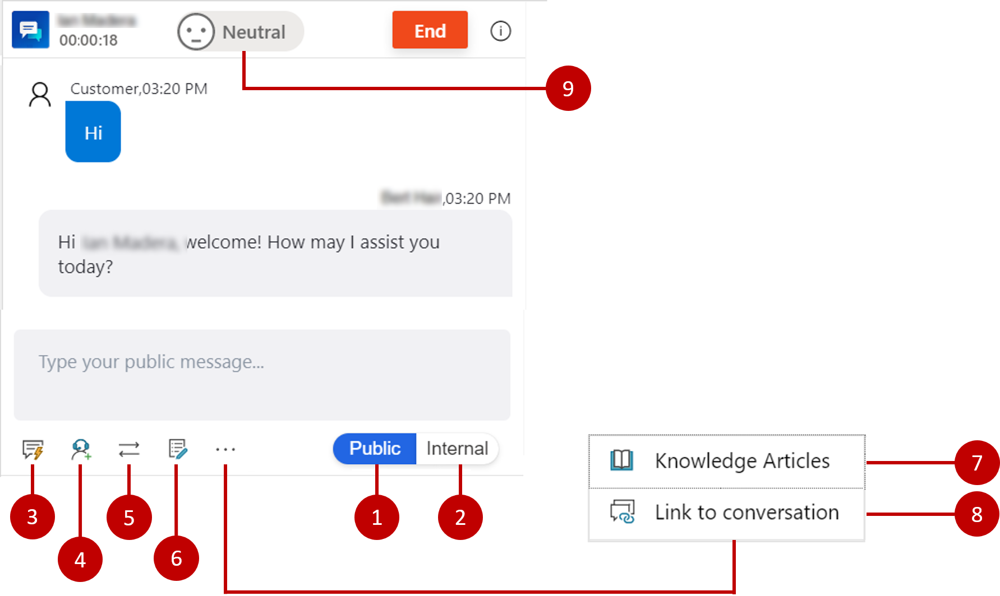
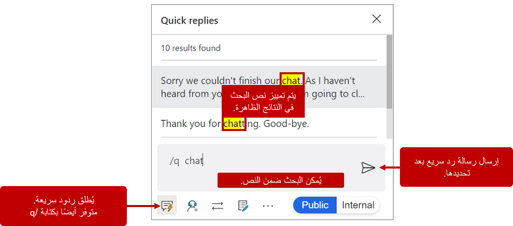
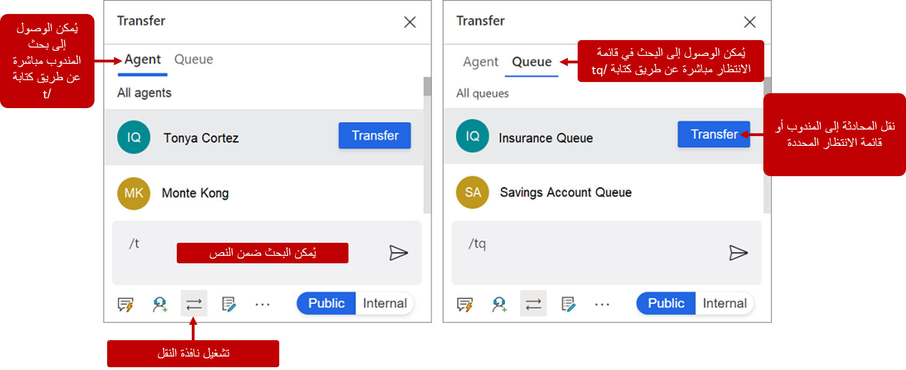
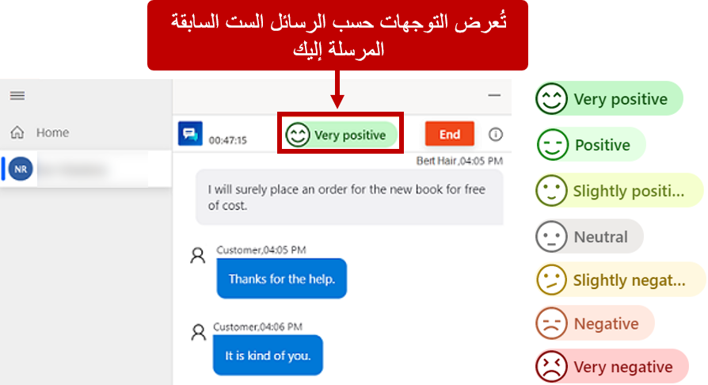

أثناء الجلسة، يتفاعل المندوبون مع العملاء من خلال لوحة المحادثة. افتراضياً، تكون اللوحة مخفية عندما يكون المندوب في التطبيق ولا تكون مرئية إلا عندما ينخرط المندوب في محادثة مع أحد العملاء. على سبيل المثال، عندما تسجّل جينيفر الدخول إلى التطبيق، سترى فقط الجلسة الرئيسية في لوحة الجلسة؛ لا يتم عرض لوحة المحادثة على الإطلاق. عندما تقبل جينيفر طلب محادثة وارد، تظهر اللوحة كجزء من الجلسة الجديدة التي تم فتحها.

يمكن للمندوبين تنفيذ المهام التالية من لوحة المحادثة:

- **عام** - يمكن للمندوبين التعامل مع كل من المندوبين الداخليين أو المشرفين والعميل النهائي.

- **داخلي** - يرسل الرسائل فقط إلى مستخدمي Dynamics 365، مثل المندوبين أو المشرفين الآخرين.

- **الردود السريعة** - رسائل مُصممة خصيصاً لتسريع التواصل مع العملاء.

- **استشارة** - يمكن للمندوبين العثور على مندوبين أو مشرفين آخرين والتعامل معهم.

- **التحويل** - يسمح للمندوبين بنقل محادثة إلى مندوب أو مشرف آخر.

- **ملاحظات** - يوفر عنصر تحكم يمكن للمندوبين استخدامه لتدوين ملاحظات خاصة بالمحادثة.

- **مقالات معرفية** - يمكن للمندوبين البحث عن المقالات المعرفية ومشاركتها مع العملاء.

- **ارتباط بالمحادثة** - إقران المقالة المعرفية بالمحادثة بسرعة.

- **مشاعر العميل** - يعرض مستويات رضا العملاء الفوري.

يمكن للمندوبين الوصول إلى جميع المهام المدرجة باستخدام الماوس أثناء وجودهم في لوحة المحادثة؛ ومع ذلك، يجد العديد منهم أنه من الأسرع استخدام لوحة المفاتيح لتسريع تفاعل العملاء. يمكن أيضاً بدء العديد من الميزات المتوفرة من لوحة الاتصال، مثل مشاهدة الردود السريعة، والاستشارة، والتحويل، وعناصر التحكم في الملاحظات، باستخدام اختصارات لوحة المفاتيح. 

للحصول على تفاصيل اختصارات لوحة المفاتيح المتاحة، راجع [تحسين إنتاجية المندوب باستخدام أوامر لوحة المفاتيح](/dynamics365/omnichannel/agent/agent-oc/oc-conversation-control#enhance-agent-productivity-using-keyboard-commands).

## العمل مع المشاركين الداخليين والخارجيين

عند بدء محادثة، فإنها تكون تلقائياً في الوضع العام.
عندما تكون المحادثة في الوضع العام، يمكن إضافة مشاركين آخرين مثل المندوبين الداخليين و / أو المشرفين إليها. ستنتقل أي رسائل يتم إرسالها أثناء المحادثة في الوضع العام إلى جميع المشاركين المضافين. من حين لآخر، قد يرغب المندوب في إرسال رسالة إلى المشاركين الداخليين فقط. يمكنهم إكمال هذه المهمة عن طريق تحديد الخيار **داخلي** .
في هذه الحالة، سيظل المندوب يستخدم نفس نافذة المحادثة، لكن المشاركين الداخليين فقط هم من سيرون الرسائل. عند إعادة المحادثة إلى الوضع العام، سيرى كل من المشاركين الداخليين والخارجيين الرسائل.

يمكن للمندوبين أيضاً استخدام أوامر لوحة المفاتيح لإرسال رسائل داخلية وعامة:

-   **/i** - التبديل إلى "داخلي"

-   **/p** - التبديل إلى "العام"

## إرسال رسائل نموذجية 

نظراً لأن المندوبين يتواصلون مع العديد من العملاء ومن خلال قنوات متعددة في وقت واحد، فقد يكون من الصعب على المندوبين تتبع محادثاتهم. غالباً ما يكون من الأسهل تزويد المندوبين ببعض قوالب الاتصالات المحددة مسبقاً والتي يمكنهم الوصول إليها بسرعة من لوحة الاتصال. في القناة متعددة الاتجاهات لـ Customer Service، يمكن إكمال هذه المهمة من خلال **الردود السريعة**.

يمكن إرسال الردود السريعة إلى كل من المشاركين الخارجيين والداخليين.
يمكن للمؤسسات إنشاء ردود سريعة بناءً على احتياجات مندوبيها. بالنسبة إلى المندوبين الذين يفضلون الاختصارات، يمكن أيضاً فتحهم عن طريق إدخال  **/q**، والتي ستعرض قائمة منبثقة **الردود السريعة** . من القائمة المنبثقة، يمكن للمندوبين الاستمرار في كتابة الكلمات الرئيسية التي يبحثون عنها. عند العثور على التطابقات المحتملة، سيتم عرض النتائج في القائمة. يمكن للمندوبين استخدام مفاتيح الأسهم على لوحة المفاتيح للتنقل بين جميع الردود التي تم إرجاعها.

## التعاون مع مندوبين ومشرفين آخرين 

أثناء العمل مع أحد العملاء، قد يحتاج المندوب إلى مساعدة أو إرشادات إضافية. قد يكون التوجيه المطلوب بسيطاً مثل الوصول إلى شخص آخر والعثور على الإجابة، أو قد يكون سيناريو ليس فيه المندوب هو أفضل شخص لحل المشكلة.

عندما يحتاج المندوب إلى التحدث مع عضو آخر في الفريق، يمكنه استخدام الزر **استشارة** لدعوة مندوبين أو مشرفين آخرين. يمكن أيضاً الوصول إلى خيار **استشارة** عن طريق كتابة **/c**. باستخدام هذا الخيار، يمكن للمندوب البحث عن الشخص الذي يريده، وسيتم عرض النتائج في اللوحة. على الرغم من عدم وجود حد لعدد المندوبين الاستشاريين الذين يمكن دعوتهم إلى محادثة، فإننا نوصي بشدة أن تقتصر الدعوة على خمسة.

إذا كان شخص ما مؤهلاً أكثر للعمل على عنصر ما، فيمكن نقل المحادثة إلى مندوب آخر أو صف انتظار. يمكن أيضاً إجراء التحويل عن طريق إدخال **/t** (نقل إلى مندوب) أو (نقل إلى صف الانتظار). **/tq**. عند نقل عنصر إلى شخص آخر، يمكن للمندوبين النقل فقط إلى المندوبين الموجودين في نفس تدفق العمل وصف الانتظار. على سبيل المثال، إذا كان المندوب يعمل في محادثة جاءت من صف انتظار الفوترة، فلا يمكن نقلها إلى مندوب من صف انتظار الخدمة. لا يمكن نقل المحادثة إلا إلى المندوبين الموجودين في قائمة انتظار إعداد الفواتير. إذا كان الطلب المنقول يأتي من صف انتظار آخر، فستقوم قواعد التحويل بتعيين المحادثة إلى المندوب المناسب في صف الانتظار.

## العمل مع المقالات المعرفية

يجب أن يكون المندوبون قادرين على تحديد موقع المعلومات التي يحتاجون إليها بسرعة لحل مشكلات العملاء، بما في ذلك الوصول السريع إلى نفس المحتوى المعرفي المستخدم لحل الحالات. من لوحة المحادثة، يمكن للمندوبين البحث عن المقالات المعرفية ذات الصلة أثناء عملهم في جلسة. يمكن للمندوبين أيضاً بدء تشغيل قاعدة المعرفة عن طريق إدخال **/kb**، والتي ستعرض المقالات المعرفية في علامة تبويب تطبيق جديدة في الجلسة. عندما يعثر المندوب على مقالة تحل المشكلة، يمكنه مشاركتها مع العميل من لوحة المحادثة عن طريق تحديد الزر **إرسال الرابط**.

## مراقبة رضا العملاء الفوري

لسوء الحظ، لن يكون كل عميل سعيداً أثناء حديثه معك. قد يبدأ بعض العملاء محادثاتهم غير سعداء، بينما قد يصبح الآخرون غير سعداء مع استمرار المحادثة. عوامل متعددة تؤثر على رضا العميل عن المكالمة مثل المدة التي يستغرقها المندوب للرد أو تقديم معلومات غير صحيحة أو حتى كيفية كتابة المندوب للرسائل. في كثير من الأحيان، سيبدأ رضا العميل في التغير بشكل طفيف فقط. ومع ذلك، إذا لم يتم التعرف على معنويات العملاء والتعامل معها، فيمكن أن تتصاعد بسرعة.

لمساعدة المندوبين في فهم أفضل لمشاعر العميل، يتم عرض المشاعر اللحظية أعلى لوحة المحادثة.
عندما يفتح المندوب محادثة لأول مرة، ستكون أيقونة المشاعر محايدة. في السيناريوهات التي تم فيها تصعيد المحادثة من روبوت، يعتمد المشاعر على الرسائل السابقة التي تم تبادلها بين العميل والروبوت. سيتغير المشاعر عندما يتفاعل المندوب مع العميل وينظر في أحدث ست رسائل تم إرسالها. يساعد عرض المشاعر على ضمان أن يكون المندوب على دراية بالتغيير قبل أن يصبح مشكلة محتملة، من خلال النظر في أحدث الاتصالات.

