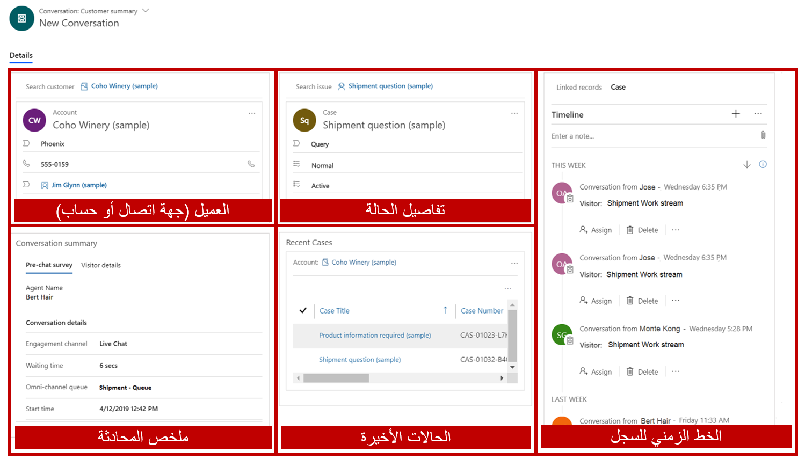
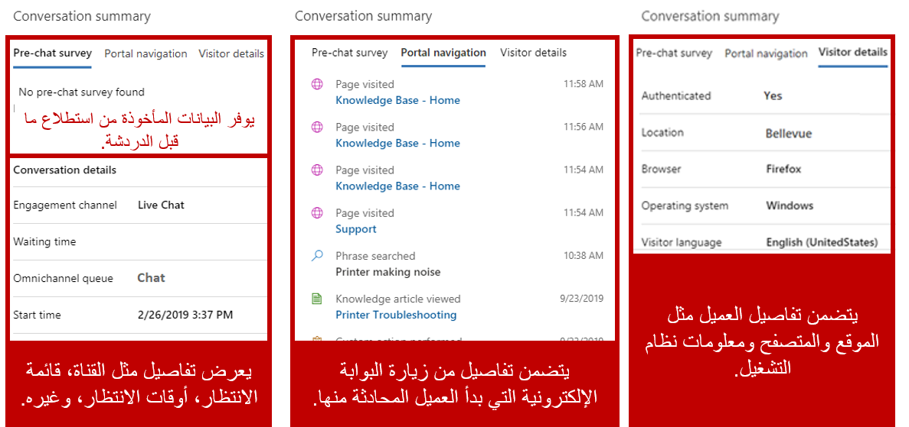
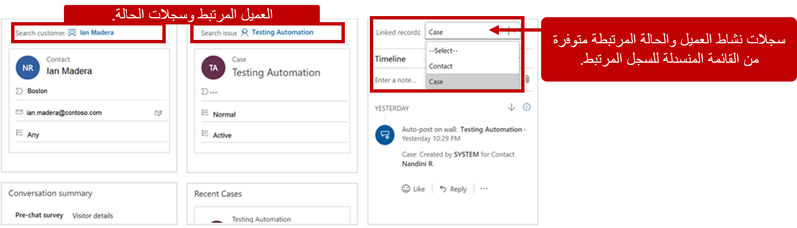

واحدة من أكثر الشكاوى شيوعاً لدى العملاء حول الدعم هي تكرار نفس المعلومات عدة مرات أثناء العملية. بشكل عام، عندما يتم تحويل العملاء أثناء مكالمة، يتعين عليهم تكرار اسمهم أو ملخص المشكلات أو البيانات الأخرى ذات الصلة إلى المندوب التالي. يمكن أن يصبح هذا التكرار أكثر صعوبة للعملاء عندما يتواصلون مع المشكلة من قناة أخرى.

عندما يعمل المندوبون مع أحد العملاء، يجب أن يكون لديهم حق الوصول إلى معلومات العميل الأساسية و  
التفاصيل المتعلقة بالمنتج / الخدمة، بالإضافة إلى معلومات حول المشكلة الحالية وسجل الحالة والحالات ذات الصلة والموقع وما إلى ذلك. إذا كان من السهل على المندوب الوصول إلى هذه المعلومات، فيمكن أن تقلل بشكل كبير من مقدار الوقت الذي يقضيه العميل في الانتظار ويمكنه تقريباً إزالة أي حاجة للعميل لتكرار المعلومات أثناء انتقال مشكلته عبر القنوات. نتيجة لذلك، يمكن أن يصبح المندوبون أكثر إنتاجية بسبب تقليل أوقات التعامل. يزداد رضا العملاء أيضاً نتيجة للقرارات الأسرع.

## العمل مع سجل ملخص العميل

عندما يقبل مندوب طلب محادثة وارد ويتم تحميل جلسة، ستنتقل الجلسة افتراضياً إلى صفحة **ملخص العميل**.

توفر طريقة عرض ملخص العميل الأقسام التالية:

-   **العميل** - يوفر تفاصيل حول العميل الذي يتم التعامل معه. يمكن للعميل أن يكون حساباً أو جهة اتصال. بالنسبة للمحادثات التي لا يكون فيها العميل معروفاً في البداية، يمكن ربط المحادثة بسجل عميل مباشرةً من قسم العميل.

-   **ملخص المحادثة** - يعرض سلسلة من علامات التبويب التي توفر تفاصيل إضافية ذات صلة بالمحادثة.

-   **الحالة** - توفر القدرة على ربط المحادثة بحالة جديدة أو موجودة في التطبيق.

-   **الحالات الأخيرة** - يُزود المندوبين ببيانات تاريخية مرتبطة بأحدث الحالات المرتبطة بالعميل للمساعدة في تسهيل الوصول إلى هذه السجلات.

-   **المخطط الزمني** - يوفر وصولاً مباشراً إلى المخطط الزمني للنشاط للحالة المرتبطة و / أو سجل العميل للمساعدة في تسهيل مراجعة الأنشطة السابقة.

## ملخص المحادثة

يعرض قسم **ملخص المحادثة** علامات تبويب متعددة تزود المندوبين بالتفاصيل لمساعدتهم على فهم المعلومات المتعلقة بالمحادثة مع العميل بشكل أفضل. قد تختلف المعلومات المتاحة واكتمال البيانات المقدمة اعتماداً على الميزات التي تم تمكينها على مستوى المؤسسة.

سيعرض سجل المحادثة علامات التبويب التالية:

-   **استطلاع ما قبل المحادثة** - يظهر عندما يكون استطلاع ما قبل المحادثة متاحاً على القناة التي كان العميل يتعامل معها. سيُظهر الإجابات التي تم توفيرها على الأسئلة.

-   **التنقل في البوابة** - يعرض معلومات حول ما فعله العميل في المدخل قبل بدء المحادثة. يتم تصنيف العناصر إلى الأنواع التالية:

    -   صفحة تمت زيارتها - أي صفحة (صفحات) مدخل تمت زيارتها بطابع زمني

    -   تم البحث عن عبارة - أي كلمات أساسية أو عبارات تم البحث عنها

    -   تم عرض مقالة معرفية - مقالة معرفية تم عرضها

    > [!IMPORTANT]
    > اعتباراً من نشر هذه الدورة التدريبية، كانت وظائف البوابة قيد المعاينة.

-   **تفاصيل الزائر** - توفر معلومات مثل ما إذا كان العميل قد تمت مصادقته، ومعلومات المتصفح، ونظام التشغيل، والموقع، وما إلى ذلك.

-   **تفاصيل إضافية** - يوفر أي متغيرات سياق إضافية تم تكوينها للقناة.

    سيظهر هذا القسم فقط إذا تم توفير متغيرات سياق إضافية.

أسفل علامات التبويب هذه، سيرى المندوبون قسم **تفاصيل المحادثة**، والذي يعرض المعلومات ذات الصلة بالتفاعل الحالي، مثل:

-   **قناة المشاركة** - القناة التي شارك فيها العميل.

-   **وقت الانتظار** - طول المدة التي انتظرها العميل منذ آخر تفاعل.

-   **المهارات** - المهارات المرتبطة بهذا الصنف. (يُستخدم للتوجيه المستند إلى المهارات، وهو قيد المعاينة حالياً.)

-   **صف الانتظار** - قائمة الانتظار التي جاء منها الصنف.

-   **وقت البدء** - وقت بدء المحادثة.

## التعامل مع الحالات

بالإضافة إلى توفر معلومات العميل ذات الصلة، هناك ميزة رئيسية أخرى لشاشة **ملخص العميل** وهي القدرة على الوصول إلى معلومات الحالة المتعلقة بالمحادثة. عندما تفتح شاشة **ملخص العميل** لأول مرة، فلن يتم إقرانها بحالة معينة. السبب هو أنه، في كثير من الأحيان، يفتح العملاء محادثات للتفاعل مع مشكلة أو صنف سابق. إذا كان العميل يتواصل بشأن مشكلة سابقة، فيمكن للمندوبين استخدام نموذج الحالة للبحث عن حالة موجودة في القناة متعددة الاتجاهات لـ Customer Service ثم ربط الحالة بالمحادثة الحالية.

إذا كانت المحادثة متعلقة بحادث جديد، يمكن للمندوبين استخدام الزر **+ إضافة حالة** لإضافة حالة جديدة، والتي يمكن ربطها بعد ذلك بالمحادثة.

## العمل مع الجدول الزمني

غالباً ما تساعد القدرة على الوصول إلى الأنشطة التي قد تكون مفيدة للمحادثة المندوبين على اكتساب فهم أفضل لما تم القيام به مع العميل في الماضي عبر أنواع السجلات المختلفة.
في سجل ملخص العميل، يعرض الجدول الزمني الأنشطة المتعلقة بالحالة والعميل في شكل مخطط زمني. يمكن للمندوبين إنشاء ملاحظات سريعة بناءً على المناقشة مع العميل. يوفر عنصر التحكم في المخطط الزمني القدرة على تبديل الأنشطة التي يتم عرضها على المخطط الزمني بناءً على الحالة أو جهة الاتصال أو سجل الحساب المرتبط بالمحادثة. على سبيل المثال، إذا كانت المحادثة التي تعمل عليها مرتبطة بكل من جهة الاتصال والحالة، فإن القائمة المنسدلة للحقل **السجلات المرتبطة** توفر القدرة على التبديل بين كليهما جهة الاتصال والحالة، على التوالي.

