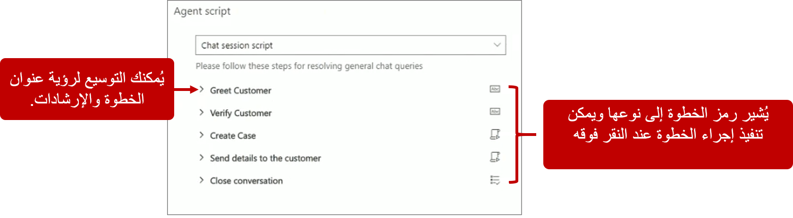
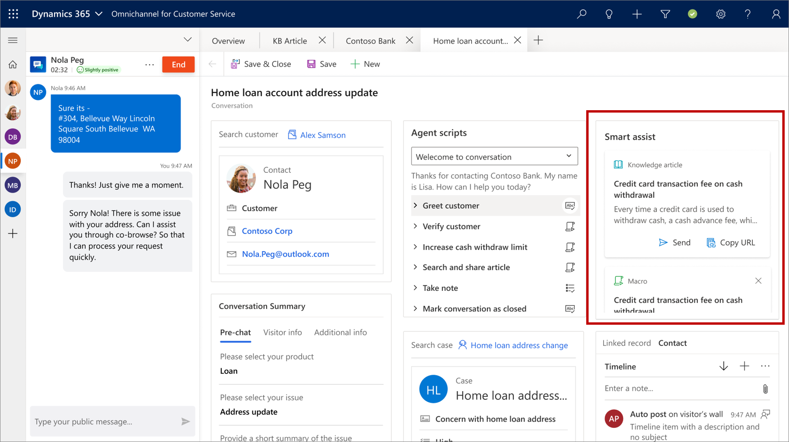

## البرامج النصية للمندوب

عندما يتعامل المناديب مع العملاء،قد يكون من المفيد تزويدهم بالإرشادات للتأكد من أنهم يستخدمون أفضل عملية لحل مشكلات العملاء. قد يستفيد المناديب من الإرشادات لأسباب عديدة مثل عدم الإلمام بالإجراءات المتعلقة بمنتجات معينة، أو قد يكونوا مجرد موظفين جدد لا يفهمون تمامًا العملية التي يجب اتباعها.

باستخدام القناة متعددة الاتجاهات لـ Customer Service، يمكن للمؤسسات تزويد المناديب بإرشادات حول ما يجب القيام به عند تعيين محادثة لهم. يساعد هذا النهج في ضمان دقة وكفاءة المناديب العاملين لديك مع مساعدتهم على تحسين قدراتهم للتعامل مع العملاء.

> [!IMPORTANT] 
> يجب على أي مندوب أو مشرف يستخدم البرامج النصية للمندوب تعيين دور أمان مستخدم الأدوات الإنتاجية المعينة له.

تتكون البرامج النصية للمندوب من سلسلة من الخطوات. يتم تحديد كل خطوة باستخدام رمز قابل للتنفيذ يساعد على بدء هذه الخطوة. عندما يقوم المندوب بتوسيع خطوة، يتم تزويده بوصف قصير يحدد ما تقوم به الخطوة ويوفر رمزًا يتم استخدامه لتنفيذ إجراءات الخطوة. عندما يبدأ المناديب باتخاذ الخطوات، يتعقب البرنامج النصي حالة تنفيذ الخطوة ثم يلاحظها. تتم الإشارة إلى الخطوات التي يتم تنفيذها بنجاح باستخدام رمز علامة اختيار خضراء. تتم الإشارة إلى الخطوات التي تحتوي على أخطاء باستخدام أيقونة التقاطع الحمراء. يمكن تنفيذ الخطوات مجدداً حسب الحاجة. سواءً ظهرت علامة الاختيار الخضراء أو أيقونة التقاطع الحمراء، فهذا يعتمد على آخر مرة تم فيها تنفيذ الخطوة.

الأنواع الثلاثة للخطوات المتوفرة داخل برنامج المندوب النصي هي:

-   **إرشادات نصية** - توفير إرشادات حول الإجراءات التي يجب تنفيذها. على سبيل المثال، قد توجه إحدى التعليمات النصية المندوب حول كيفية الترجيب العميل.

    بعد أن يقوم المندوب بتنفيذ الخطوة استنادًا إلى التعليمات، يمكنه ملاحظة اكتمالها.

-   **الماكرو** - تعليمات تُعلم النظام بكيفية إكمال مهمة. على سبيل المثال، قد يتم تكوين الماكرو لإنشاء سجل حالة.

    في البرنامج النصي، سيحصل الماكرو على أيقونة تشغيل بجانبه. عندما يحدد مندوب أيقونة "تشغيل"، سيقوم النظام بتنفيذ الماكرو.

-   **البرنامج النصي للمندوب** - يمكنك تحميل برنامج نصي آخر للمندوب من البرنامج النصي الحالي للمندوب. سوف يحل البرنامج النصي الذي تم تحميله حديثًا محل البرنامج النصي الحالي في قائمة **برنامج المندوب النصي**.

**العمل باستخدام البرامج النصية**

بعد أن يقبل مندوب إخطار محادثة واردة، مثل المحادثة، بالإضافة إلى بدء جلسة عمل جديدة، سيتم عرض برنامج المندوب النصي. عندما يقوم مسؤول بتكوين التطبيق، يمكنهم تحديد مكان عرض البرنامج النصي للمندوب في التطبيق. على سبيل المثال، إذا قام مسؤول بالتكوين في الصفحة **ملخص العميل**، يمكنك الاطلاع على البرنامج النصي للمندوب في صفحة **ملخص العميل**.

تعرض الصورة التالية برنامج نصي لجلسة عمل المحادثة يحتوي على خمس خطوات. وينتهي الأمر بالمندوب الذي يتم نقله إلى برنامج نصي جديد للإغلاق.

يُوضح الجدول التالي كل الخطوات بمزيد من التفصيل.

| الخطوة              | العنوان                                                                                                         | التعليمات                                                               | الأيقونة                                                                                                                | الإجراء                                                                                                                                                                 |
|-------------------|---------------------------------------------------------------------------------------------------------------|---------------------------------------------------------------------------|---------------------------------------------------------------------------------------------------------------------|------------------------------------------------------------------------------------------------------------------------------------------------------------------------|
| التعليمات النصية  | الترحيب بالعميل                                                                                                | يمكنك الترحيب بالعميل باستخدام رسالة ترحيب من مستودع الرد السريع | وضع علامة "تمّ"                                                                                                        | بعد أن يقوم المندوب بالترحيب بالعميل، يجب عليهم تحديد الأيقونة لوضع علامة على الخطوة باعتبارها تمت.                                                                        |
| التعليمات النصية  | تحقق من أن العميل يستخدم أيًا مما يلي: العميل كيني سميث، تاريخ الميلاد، معرف البريد الإلكتروني، الرمز البريدي، الهاتف المحمول | وضع علامة "تمّ"                                                              | بعد أن يتحقق المندوب من البيانات المناسبة، يجب عليه تحديد الأيقونة لوضع علامة على الخطوة على أنها تمت.            |                                                                                                                                                                        |
| الماكرو             | إنشاء حالة                                                                                                   | تنشئ المشغلات نموذج الحالة باستخدام سياق العميل                           | تشغيل‬                                                                                                                 | عند تحديد أيقونة التشغيل الماكرو، يفتح النظام نموذج حالة في لوحة علامة التبويب "تطبيق" الجديدة.                                                                       |
| تفاصيل إرسال الماكرو | يفتح البريد الإلكتروني لإرسال التفاصيل إلى العميل                                                                   | تشغيل‬                                                                       | عند تحديد أيقونة التشغيل الماكرو، يفتح النظام مسودة بريد إلكتروني بحيث يمكنك إرسال بريد إلكتروني إلى العميل المرتبط. |                                                                                                                                                                        |
| البرنامج النصي للمندوب      | إنهاء المحادثة                                                                                            | اتبع الخطوات التالية لإنهاء محادثة                                | العرض                                                                                                                | عند تحديد أيقونة طريقة العرض، يقوم النظام بتحميل برنامج نصي آخر للمندوب من البرنامج النصي الحالي للمندوب. في هذا النموذج، البرنامج النصي الآخر للمندوب يمثل البرنامج النصي إنهاء المحادثة. |

**العمل مع المساعدة الذكية**

تتمثل المساعدة الذكية في المساعد الذكي الذي يوفر توصيات في الوقت الحقيقي للمناديب لمساعدتهم على اتخاذ الإجراءات اللازمة أثناء التفاعل مع العملاء. ويعرض التقرير توصيات ذات صلة مثل المقالات المعرفية والحالات المماثلة وأفضل الخطوات التالية. يقوم روبوت المساعدة الذكية بتفسير المحادثة في لوحة الاتصالات ويقدم توصيات في الوقت الحقيقي.

تظهر التوصيات في واجهة المستخدم كبطاقات. تظهر أحدث بطاقة (توصية) في الجزء العلوي من عنصر التحكم. إذا شعرت أن التوصية لا تتوافق مع سياق المحادثة، يمكنك اختيار رفض البطاقة.

لاستخدام عنصر تحكم المساعدة الذكية، يجب تكوينه بواسطة مسؤول النظام. أثناء عملية التكوين، يمكن للمسؤول تحديد نماذج الكيان التي سيظهر عنصر التحكم فيها.
