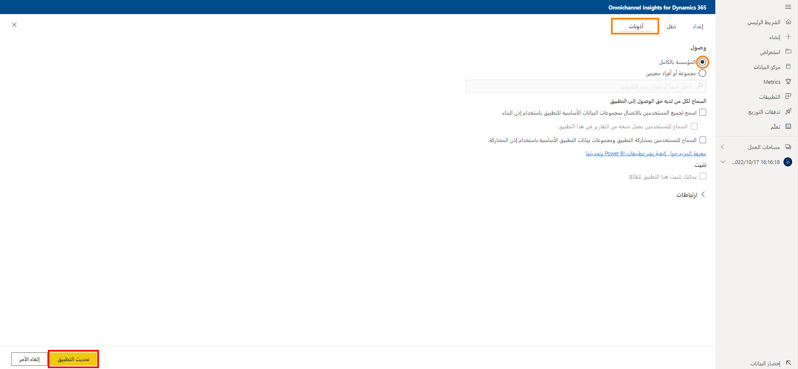

من الضروري أن يكون لدى مديري خدمة العملاء والمشرفين المقاييس التشغيلية اللازمة تحت تصرفهم لضمان قيام المندوبين بتزويد العملاء بدعم الجودة. من خلال تزويد المشرفين بالبيانات الصحيحة، يمكنهم تحديد الاتجاهات في هذه المقاييس على مدار فترات زمنية لفهم كيفية أداء المندوبين وصفوف الانتظار بشكل أفضل. واستناداً إلى هذه المعلومات، يمكنهم اتخاذ الإجراءات التصحيحية وتوفير إرشادات مناسبة للمندوبين وتحسين تجربة دعم العملاء.

تتضمن القناة المتعددة الاتجاهات لـ Customer Service في Dynamics 365 لوحة معلومات رؤى القناة متعددة الاتجاهات‬ التي توفر مؤشرات الأداء الأساسية (KPIs) والاتجاهات التي يمكن للمشرفين الاستفادة منها لفهم الحالة العامة لتجربة الدعم بشكل أفضل في لمح البصر.

تنقسم لوحة المعلومات العامة إلى قسمين:

- **لوحة معلومات رؤى القناة متعددة الاتجاهات:** توفر تفاصيل مهمة لمؤشرات الأداء الأساسية مثل متوسط ​​وقت الانتظار ومعدلات التخلي ومتوسط ​​وقت المعالجة ومعدل النقل ومتوسط ​​نبض توجه العملاء والمزيد.

- **لوحة معلومات تحليل توجه القناة متعددة الاتجاهات:** توفر نظرة عامة على مؤشرات الأداء الأساسية الهامة والاتجاهات المهمة المتعلقة بتحليل توجه المحادثة المقدمة.

الرسم التوضيحي التالي هو مثال على لوحة معلومات رؤى القناة متعددة الاتجاهات لـ Dynamics 365.

> [!div class="mx-imgBorder"]
> 

يمكنك معرفة المزيد حول مؤشرات الأداء الأساسية والرسوم المرئية المختلفة المتوفرة على لوحة معلومات رؤى القناة متعددة الاتجاهات هنا: [لوحة معلومات رؤى القناة متعددة الاتجاهات](/dynamics365/customer-service/omnichannel-insights-dashboard/?azure-portal=true).

## رؤى القناة متعددة الاتجاهات لـ Dynamics 365

تتيح تقارير رؤى القناة متعددة الاتجاهات للمسؤولين والمشرفين معرفة كيفية أداء الدعم العام عبر القنوات. تساعد الرسوم المرئية الغنية مع القدرة على التصفية عبر القنوات وصفوف الانتظار والمندوبين والنطاقات الزمنية على فهم الأداء بشكل أفضل واستكشاف المشكلات وإصلاحها.

تتكون بنية التقارير من الأقسام التالية:

- **المحادثات والقنوات:** توفر رؤية المحفوظات في عمليات الدعم العام عبر المحادثات والقنوات المتنوعة.

- **صف الانتظار والمندوبين:** توفر رؤية المحفوظات حول كيفية تنفيذ قوائم الانتظار والمندوبين عبر قنوات مختلفة حتى يتمكن المشرفون من اتخاذ الخطوات المناسبة لتحسين تجربة الدعم الخاصة بالعميل.

- **رؤى الروبوت:** توفر رؤية المحفوظات حول كيفية أداء الروبوتات للمساعدة في حل مشكلات دعم العملاء.

### المحادثات والقنوات

يوفر تقرير المحادثات والقنوات مؤشرات أداء أساسية هامة للمحادثات والقنوات. بالنسبة للمحادثات، يمكن تطبيق مؤشرات الأداء الأساسية هذه على السيناريوهات التي تقوم الروبوتات فيها بالتصعيد إلى المندوبين أو المندوبين الذين يتعاملون مباشرة مع مكالمات العملاء. بالنسبة لقنوات الدعم مثل الدردشة أو الرسائل القصيرة أو الرسائل الصوتية، تعد مؤشرات الأداء الأساسية قابلة للتطبيق من قبل كل قناة. يساعد هذا المشرفين على فهم كيفية أداء كل قناة دعم بسهولة واتخاذ الإجراءات المناسبة لتحسين تجربة الدعم العام للعملاء.

بعض مؤشرات الأداء الأساسية المتاحة هي:

- **المحادثات الواردة:** عدد المحادثات التي بدأها العملاء ويمكن تقديمها إلى المندوبين.

- **المحادثات المُشاركة:** عرض المحادثات التي شارك فيها المندوب. يمكن أن يبدأ الاتصال بين العميل والمندوب في هذه المرحلة.

- **معدل التخلي** النسبة المئوية للمحادثات التي لا يشارك فيها المندوبون.

- **معدل النقل** النسبة المئوية للمحادثات التي تم نقلها إلى مندوب آخر أو قائمة انتظار.

- **وقت معالجة المحادثة:** الوقت النشط لجلسة العمل التراكمية الخاص بالمحادثة.

- **متوسط وقت المحادثة:** متوسط الوقت من بداية المحادثة إلى نهايتها.

- **متوسط وقت جهد العميل:** متوسط الوقت من بدء المحادثة إلى وقت بدء إتمام المحادثة.

- **وقت انتظار العميل:** متوسط الوقت الذي انتظره العملاء قبل الاتصال بالمندوبين.

- **متوسط ​​نبض توجه العملاء (CSP):** توجه العميل المتوقع في إطار زمني معين لقائمة انتظار محددة أو مندوب معين، مما يشير إلى درجة التوجه الإيجابية التي عبر عنها العملاء في نهاية تفاعلاتهم.

  > [!div class="mx-imgBorder"]
  > 

يمكنك العثور على قائمة كاملة بجميع مؤشرات الأداء الأساسية، بالإضافة إلى تصنيف تفصيلي لكل واحد مضمن في تقرير المحادثات والقنوات هنا: [المحادثات والقنوات](/dynamics365/customer-service/omnichannel-insights-dashboard/?azure-portal=true)

### قائمة الانتظار والمندوبون

تحتوي أقسام صف الانتظار والمندوبين على مؤشرات أداء أساسية تساعد في تفصيل معلومات المحادثة حسب قوائم الانتظار والمندوبين. على سبيل المثال، يمكنك الاستفادة من هذه المعلومات لتحديد المندوبين الأكثر كفاءة. يتم حساب المقاييس في هذا القسم بناءً على دقة جلسة العمل. يتم تعريف كل جهة اتصال خاصة بالعميل على أنها محادثة. يتم تعريف كل محادثة على أنها جلسة عمل. من الممكن أن يتم التعامل مع محادثة من خلال مندوب واحد أو أكثر.

تتضمن بعض مؤشرات الأداء الأساسية الهامة الواردة في هذا القسم ما يلي:

- **جلسات عمل استشارية:** عدد جلسات العمل المقبولة من قبل مستخدم في الوضع = استشارة.

- **إجمالي وقت الاستشارة:** الوقت المستغرق في الاستشارة من وقت انضمام المندوب إلى وقت مغادرته للمشارك في جلسة العمل.

- **متوسط وقت الاستشارة:** إجمالي وقت الاستشارة مقسوماً على إجمالي جلسات الاستشارة.

- **جلسات العمل المشغولة:** عدد جلسات العمل المقدمة إلى المندوب والتي قبلها المندوب.

- **معدل رفض جلسة العمل:** عدد جلسات العمل المقدمة إلى المندوب ولا يقبلها المندوب.

- **معدل النقل:** عدد جلسات العمل التي تم نقلها بواسطة مندوب.

- **جلسات عمل استشارية:** عدد جلسات العمل التي شارك فيها المندوب في وضع الاستشارة.

- **جلسات المراقبة:** عدد جلسات العمل التي شارك فيها المندوب في وضع المراقبة.

- **متوسط وقت الاستشارة:** متوسط الوقت الذي قضاه العميل في جلسة العمل في الوضع الاستشاري.

- **الوقت النشط لجلسة العمل:** الوقت الذي يقضيه المندوب بشكل نشط في جلسة العمل.

  > [!div class="mx-imgBorder"]
  > 

يمكنك العثور على قائمة كاملة بجميع مؤشرات الأداء الأساسية، بالإضافة إلى تصنيف تفصيلي لكل واحد مضمن في قسم صف الانتظار والمندوب هنا: [صفوف الانتظار والمندوبون](/dynamics365/customer-service/omnichannel-insights-dashboard/?azure-portal=true)

### رؤى الروبوت

تستفيد المزيد والمزيد من مؤسسات الدعم من الروبوتات للمساعدة في تحسين تجربة دعم عملائها. ويمكن أن تساعدهم على تقليل أوقات انتظار العميل ومن ثم تخفيف أعباء عمل المندوب وأكثر من ذلك. يتيح لك قسم رؤى الروبوت معرفة أداء الروبوتات للمساعدة في حل مشكلات دعم العملاء. تتضمن مؤشرات الأداء الأساسية المتاحة للروبوتات ما يلي:

- **محادثات الروبوت:** عدد المحادثات التي بدأها العميل وتم التعامل معها من خلال الروبوت.

- **معدل دقة الروبوت:** النسبة المئوية للمحادثات التي تم إغلاقها من خلال التفاعل مع الروبوت من بين كافة المحادثات التي تم التعامل معها من خلال الروبوت.

- **وقت دقة الروبوت (دقائق):** طول الوقت، محسوباً بالدقائق، الذي تفاعل فيه العميل مع الروبوت قبل إغلاق المحادثة.

- **معدل تصعيد الروبوت:** النسبة المئوية للمحادثات التي تم تصعيدها من خلال الروبوت إلى مندوب بشري.

- **وقت تصعيد الروبوت (دقائق):** طول الوقت، محسوباً بالدقائق، الذي تفاعل فيه العميل مع الروبوت قبل تصعيد المحادثة إلى مندوب بشري.

  > [!div class="mx-imgBorder"]
  > 

يمكنك العثور على قائمة كاملة بجميع مؤشرات الأداء الأساسية، بالإضافة إلى تصنيف تفصيلي لكل واحد مضمن في قسم رؤى الروبوت هنا: [رؤى الروبوت](/dynamics365/customer-service/omnichannel-insights-dashboard/?azure-portal=true)

## لوحة معلومات تحليل توجهات القناة متعددة الاتجاهات

يشير التوجه إلى الإيجابية أو السلبية التي يعبر عنها الأفراد. يتيح تحليل التوجه طريقة فعالة لتقييم اللغة المكتوبة أو المنطوقة لتحديد ما إذا كان التعبير ملائماً أو غير ملائم أو محايداً، وكذلك إلى أي درجة. عندما يتم تسجيل توجهات العملاء، يتم وضعها في مناطق التوجهات. تتوفر ثلاث مناطق يمكن إجراء المحادثات فيها:

- **التوجه الإيجابي:** يعبر عنه العميل بكتابة رسائل تشير إلى أنه سعيد ومسرور أو يشعر بشعور إيجابي بسبب تفاعل الدعم. يجب أن تكون هناك كلمات إيجابية لنقل الشعور الإيجابي إلى ما هو أبعد من مجرد المجاملات البسيطة أو التصرفات المهذبة. على سبيل المثال، العميل الذي يقول "شكراً لك"، هو مجرد أسلوب مهذب. ولا يشير ذلك إلى أنه سعيد أو مسرور. ومع ذلك، إذا قال شيئاً مثل "لا أستطيع أن أشكرك بما فيه الكفاية" أو "شكراً جزيلاً لك"، فإنه الآن يشير إلى شعور إيجابي.

- **التوجه السلبي:** يعبر عنه العميل عندما يشعر بخيبة أمل من تفاعل الدعم. يمكن أن تكون هذه حالات يشير فيها العميل إلى الإحباط أو التعاسة عند وصف مشكلة بسبب تأثيرها عليه بالسلب في الوقت الحالي. 
  لكي يتم تسجيل شيء ما بتوجه سلبي، يجب أن تنقل الكلمات بوضوح استياء المستخدم أو خيبة أمله أو إحباطه.

- **التوجه المحايد:** يتم تقديمه عندما يكون توجه العميل لا إيجابياً ولا سلبياً. لا يتم تسجيل بيان مشكلة العميل على أنه توجه سلبي. يجب أن يتم تسجيله على أنه محايد ما لم يحتوي على كلمات تدل على التوجه. ويصح هذا بغض النظر عن مدى خطورة مشكلة المستخدم. ويتم تسجيل الرسائل التي تحتوي على مجاملات غير محددة أو تصرفات مهذبة على أنها محايدة وليست إيجابية.

هناك العديد من مؤشرات الأداء الأساسية لتحليل التوجهات المعروضة في التقرير.

- **متوسط نبض التوجه:** توجه العميل المتوقع في إطار زمني معين لقائمة انتظار محددة أو مندوب معين يشير إلى درجة التوجه الإيجابي التي عبر عنها العملاء في نهاية تفاعلاتهم. بالنسبة للقناة وقائمة الانتظار، فإنه يوفر التوجه العام الخاص بالمحادثة للعميل. بالنسبة للمندوب، فإنه يوفر توجه العميل الخاص بجلسات العمل التي يتعامل معها المندوب في المحادثة.

- **% توجه إيجابي:** عدد محادثات منطقة التوجهات الإيجابية مقسوماً على إجمالي جلسات العمل.

- **% توجه محايد:** عدد محادثات منطقة التوجهات المحايدة مقسوماً على إجمالي جلسات العمل.

- **% توجه سلبي:** عدد محادثات منطقة التوجهات السلبية مقسوماً على إجمالي جلسات العمل.

> [!div class="mx-imgBorder"]
> 

## تكوين لوحات معلومات رؤى القناة متعددة الاتجاهات

مديرو أو مشرفو خدمة العملاء مسؤولون عن إدارة المندوبين الذين يعملون على حل استفسارات العملاء كل يوم من خلال قنوات الخدمة المتعددة. إنهم بحاجة إلى معرفة المقاييس التشغيلية الرئيسية للتأكد من أن مندوبيهم يقدمون دعماً عالي الجودة. تتكون رؤى القناة متعددة الاتجاهات من القنوات ولوحات معلومات تحليل التوجهات التي يمكن أن تساعد في ذلك.

وبصفتك مسؤولاً، يجب عليك تنزيل تطبيق رؤى القناة متعددة الاتجاهات لـ Dynamics 365 وتكوينه لعرض القنوات ولوحات معلومات تحليل التوجهات في تطبيق القناة متعددة الاتجاهات لـ Customer Service. لتكوين رؤى القناة متعددة الاتجاهات، اتبع الخطوات التالية:

[الخطوة 1: مراجعة المتطلبات الأساسية](/dynamics365/customer-service/configure-historical-sentiment-dashboard-supervisor/?azure-portal=true#step-1-review-prerequisites)

[الخطوة 2: تثبيت تطبيق رؤى القناة متعددة الاتجاهات لـ Dynamics 365](/dynamics365/customer-service/configure-historical-sentiment-dashboard-supervisor/?azure-portal=true#step-2a-install-omnichannel-insights-for-dynamics-365-app)

[الخطوة 3: الاتصال بتطبيق رؤى القناة متعددة الاتجاهات لـ Dynamics 365](/dynamics365/customer-service/configure-historical-sentiment-dashboard-supervisor/?azure-portal=true#step-3-connect-to-omnichannel-insights-for-dynamics-365-app)

[الخطوة 4: تكوين معدل تكرار التحديث في مجموعة بيانات Power BI](/dynamics365/customer-service/configure-historical-sentiment-dashboard-supervisor/?azure-portal=true#step-4-configure-refresh-frequency-on-power-bi-dataset)

[الخطوة 5: نشر التطبيق داخل مؤسستك](/dynamics365/customer-service/configure-historical-sentiment-dashboard-supervisor/?azure-portal=true#step-5-publish-application-within-your-organization)

[الخطوة 6: إضافة لوحات معلومات Power BI إلى القناة متعددة الاتجاهات لـ Customer Service](/dynamics365/customer-service/configure-historical-sentiment-dashboard-supervisor/?azure-portal=true#step-6-add-power-bi-dashboards-to-omnichannel-for-customer-service)

قبل أن تتمكن من تكوين لوحات المعلومات، ستحتاج إلى الحصول على امتيازات إدارية لكل من Dynamics 365 Customer Service وPower BI. بالإضافة إلى ذلك، ستحتاج إلى ترخيص Power BI Pro للقيام بما يلي:

- الحصول على رؤى القناة متعددة الاتجاهات من متجر التطبيقات وتثبيتها في مؤسستك.

- للمستخدمين لاستخدام تطبيق القالب أو لمشاركته مع مستخدمي Power BI Pro الآخرين.

ستحتاج أيضاً إلى تخصيص مساحة عمل تطبيق القالب إلى سعة متميزة حتى يتمكن كل مستخدم مجاني في المؤسسة من استهلاك التقرير. لمزيد من المعلومات، راجع [طرق للتعاون والمشاركة في Power BI](/power-bi/collaborate-share/service-how-to-collaborate-distribute-dashboards-reports/?azure-portal=true).

الشيء الأخير الذي ستحتاج إلى القيام به قبل البدء هو التأكد من أنك قمت بتمكين تضمين تقارير Power BI في Dynamics 365 Customer Service. يمكنك القيام بذلك في مركز مسؤولي [Power Platform](https://admin.powerplatform.microsoft.com/home/?azure-portal=true).

بمجرد الدخول إلى مركز مسؤولي Power Platform، حدد البيئة التي ستقوم بتضمين تقارير Power BI فيها، واختر **الإعدادات**. بمجرد الدخول إلى **الإعدادات**، قم بتوسيع **المنتج** واختر **الميزات**. ضمن عنوان **المحتوى المضمن**، قم بتعيين **تضمين رسوم مرئية Power BI** على **تشغيل**.

> [!div class="mx-imgBorder"]
> 

### تثبيت تطبيق رؤى القناة متعددة الاتجاهات لـ Dynamics 365

تطبيق رؤى القناة متعددة الاتجاهات لـ Dynamics 365 هو تطبيق الوظيفة الإضافية لـ Power BI الذي سيسمح لك بالاتصال بمثيل Dynamics 365 Customer Service الخاص بك. يمكن لمسؤولي Power BI تثبيت تطبيق رؤى القناة متعددة الاتجاهات لـ Dynamics 365 من صفحة تطبيق [رؤى القناة متعددة الاتجاهات لـ Dynamics 365](https://aka.ms/d365-oc-insights/?azure-portal=true).

> [!div class="mx-imgBorder"]
> 

### الاتصال بتطبيق رؤى القناة متعددة الاتجاهات لـ Dynamics 365

بعد تثبيت التطبيق، تكون جاهزاً للاتصال ببيانات Dynamics 365 الخاصة بك. على صفحة تكوين تطبيق **رؤى القناة متعددة الاتجاهات لـ Dynamics 365**، حدد **اتصال**.

> [!div class="mx-imgBorder"]
> 

أثناء التنقل في التكوين، ستحتاج إلى تقديم المعلومات التالية:

- **عنوان URL لموجز CRM OData الخاص بمؤسستك:** يمكنك العثور على عنوان URL بالانتقال إلى مثيل Dynamic 365 Customer Service، والانتقال إلى **الإعدادات** > **التخصيص**، ثم تحديد **موارد المطورين**. 
  سيكون موجوداً ضمن Web API المثيل.

- **حد عدد صفوف الانتظار:** يحدد عدد صفوف الانتظار التي تريد سحبها في الاستعلام. القيمة الافتراضية هي 500,000. زيادة العدد قد تؤثر في الأداء.

- **الشهور المراد الاستعلام عنها:** تحديد عدد الشهور التي ترغب في تضمينها في الاستعلام.

> [!div class="mx-imgBorder"]
> 

ستحتاج إلى المصادقة على مثيل Dynamics 365 الخاص بك للحصول على الوصول إلى البيانات التي سيتم عرضها في التقرير. سترغب في اختيار ما يلي:

- **طريقة المصادقة** = **OAuth2**

- **مستوى الخصوصية** = **مؤسسي**

> [!div class="mx-imgBorder"]
> 

بمجرد المصادقة وتسجيل الدخول بنجاح، يتم تحديث التقرير الحالي بالبيانات من مؤسستك.

### تكوين معدل تكرار التحديث على مجموعة بيانات Power BI

بعد توصيل تطبيق رؤى القناة متعددة الاتجاهات لـ Dynamics 365 بمؤسسة Dynamics 365، تحتاج إلى تكوين معدل تكرار التحديث على مجموعة بيانات Power BI بحيث يتم تحديث التقارير ولوحات المعلومات بشكل صحيح. في **مساحة عمل تطبيق رؤى القناة متعددة الاتجاهات**، حدد علامة تبويب **مجموعات البيانات** وحدد **الإعدادات**. قم بتعيين **التحديث المجدول** على **تشغيل**. يوصى بشده بتعيين معدل تكرار التحديث على **يومي**.

> [!div class="mx-imgBorder"]
> 

### نشر التطبيق داخل مؤسستك

للتأكد من أن المشرفين والأفراد الآخرين الذين سيستفيدون من التقارير يمكنهم الوصول إليها، يجب عليك مشاركة التطبيق الذي تم تكوينه مع مؤسستك بأكملها حتى يتمكن المشرفون من عرض لوحات معلومات **رؤى القناة متعددة الاتجاهات** والتقارير مع حسابات **Power BI Pro**.

في مساحة عمل التطبيق، حدد **تحديث التطبيق** لفتح معالج تحديث التطبيق. انتقل إلى علامة التبويب **الوصول**، وحدد **المؤسسة بأكملها.**

> [!div class="mx-imgBorder"]
> 

### إضافة لوحات معلومات Power BI إلى القناة متعددة الاتجاهات لـ Customer Service

بمجرد إنشاء لوحات المعلومات ومشاركتها مع المؤسسة، سيتمكن المشرفون من الوصول إليها في Dynamics 365. سيحتاج كل مشرف إلى تكوين بيئة Power Platform لدمج لوحات معلومات رؤى القناة متعددة الاتجاهات ولوحات معلومات تحليل توجه القناة متعددة الاتجاهات. في منطقة لوحات المعلومات، حدد **جديد** ثم اختر **لوحة معلومات Power BI**. في شاشة إضافة لوحة معلومات Power BI، قم بالتكوين كما يلي:

- قم بتعيين حقل **مساحة العمل** على **رؤى القناة متعددة الاتجاهات لـ Dynamics 365**.

- قم بتعيين حقل **لوحة المعلومات** على **رؤى القناة متعددة الاتجاهات لـ Dynamics 365**.

> [!div class="mx-imgBorder"]
> 

لإضافة لوحة معلومات **رؤى القناة متعددة الاتجاهات - تحليل التوجه**، حدد **جديد** ولوحة معلومات **Power BI** مرة أخرى. قم بالتكوين على النحو التالي:

- قم بتعيين حقل **مساحة العمل** على **رؤى القناة متعددة الاتجاهات لـ Dynamics 365**.

- قم بتعيين حقل **لوحة المعلومات** على **تحليل توجه القناة متعددة الاتجاهات لـ Dynamics 365**.

> [!div class="mx-imgBorder"]
> 

## تخصيص رؤى القناة متعددة الاتجاهات

يتم إنشاء تطبيق قالب رؤى القناة متعددة الاتجاهات مع مجموعة من الكيانات والحقول المفيدة لمعظم سيناريوهات إعداد التقارير. غالباً ما يتم توسيع تطبيقات Dynamics 365 باستخدام حقول مخصصة. لا تظهر هذه الحقول المخصصة تلقائياً في نموذج Power BI. استناداً إلى احتياجاتك التنظيمية، يمكنك تحرير التقرير المضمن في تطبيق القالب وتوسيعه لتضمين الحقول المخصصة في نموذج Power BI.

لمزيد من المعلومات، راجع [تخصيص رؤى القناة متعددة الاتجاهات](/dynamics365/customer-service/configure-historical-sentiment-dashboard-supervisor?azure-portal=true#customize-omnichannel-insights).
