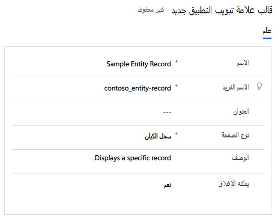
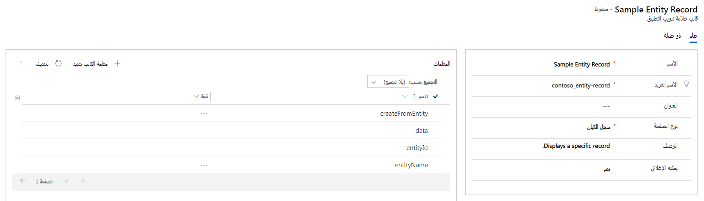

من المهم أن يتمكن المندوبين من الوصول إلى المعلومات ذات الصلة والسياقية المناسبة حسب الحاجة أثناء العمل مع العميل. على سبيل المثال، أثناء النظر في سجل حساب العميل، إذا حدد المندوب رابط جهة الاتصال الأساسية، فيجب فتح سجل جهة الاتصال في علامة تبويب منفصلة في الجلسة. يجب أن يظل سجل الحساب قابلاً للوصول عن طريق التبديل إلى علامة التبويب حسب الحاجة. عندما تعمل مع التطبيقات المستندة إلى الجلسة مثل Customer Service workspace والقناة متعددة الاتجاهات لـ Customer Service، فإنك تشير إلى علامات التبويب التي تفتح داخل جلسة لعرض معلومات مختلفة كعلامات تبويب تطبيق.

تتيح لك قوالب علامة تبويب التطبيق في خدمة العملاء تحديد نوع التطبيقات التي تريد فتحها عند بدء جلسة عمل. باستخدام قوالب علامة تبويب التطبيق، يمكنك تحديد التطبيقات المتاحة للجلسة، ثم ربط التطبيقات بجلسة. على سبيل المثال، يمكنك إنشاء نوع تطبيق **ملخص العميل** وربطه بجلسة عمل المحادثة والرسائل القصيرة (SMS). الآن، عندما يقبل المندوب الإعلام من قنوات المحادثة أو قنوات الرسائل القصيرة (SMS)، تبدأ جلسة عمل وتبدأ صفحة **ملخص العميل** في التحميل. يمكنك أيضاً إنشاء قالب علامة تبويب تطبيق لتحميل موقع ويب تابع لجهة خارجية ذات صلة في جلسة للتأكد من أن المندوب يمكنه الوصول إلى الموقع حسب الحاجة دون الحاجة إلى فتح جلسة متصفح أخرى.

تتوفر قوالب تطبيقات جاهزة للاستخدام بشكل افتراضي بناءً على تطبيقات خدمة العملاء التي قمت بنشرها.

- ملخص العميل

- سجل الكيانات

- البحث عن المعرفة

- لوحة معلومات محادثات القناة متعددة الاتجاهات

- Power BI

- البحث

توفر القوالب المذكورة أعلاه نقطة بدء رائعة. ومع ذلك، لا يمكنك تخصيص قوالب علامة تبويب التطبيق هذه. إذا كنت بحاجة إلى خيارات مختلفة، يمكنك إنشاء القوالب المخصصة الخاصة بك.

يمكنك الوصول إلى قوالب علامة تبويب التطبيق في تطبيق مركز مسؤولي Customer Service. ضمن **تجربة المندوب**، حدد **مساحات العمل** واختر **إدارة** بجوار قوالب **علامة تبويب التطبيق**. تم إنشاء قوالب جديدة عن طريق تحديد الزر **جديد** على شريط الأوامر.

عند إنشاء قالب تطبيق مبدئياً، ستحتاج إلى تحديد ما يلي:

- **الاسم:** يحدد اسم الجلسة.

- **الاسم الفريد:** معرّف فريد بتنسيق `<prefix>_<name>`. مطلوب ما يلي للاسم الفريد:

  - يمكن أن تكون البادئة فقط أبجدية رقمية ويجب أن يتراوح طولها بين 3 إلى 8 أحرف.

  - يجب أن توجد شرطة سفلية بين البادئة والاسم. 
    مثال: `Contoso_application_tab`

- **العنوان**: يحدد عنوان جلسة العمل الذي يتم عرضه على المندوبين في واجهة المستخدم (UI) في وقت التشغيل. 
  مثال: البحث عن المقالات المعرفية

- **نوع الصفحة:** يحدد نوع التطبيق الذي سيتم تحميله.

- **الوصف:** يُستخدم لتقديم وصف للمرجع الخاص بك.

- **يمكن الإغلاق:** يحدد ما إذا كان يمكن إغلاق علامة التبويب بواسطة عميل.

> [!div class="mx-imgBorder"]
> 

### نوع التطبيقات

هناك ثمانية أنواع من التطبيقات المتاحة للاختيار من بينها. أنواع التطبيقات المتاحة هي كما يلي:

- **قائمة الكيانات:** تعرض طريقة عرض تحدد كيفية عرض قائمة سجلات لجدول معين في تطبيق القناة متعددة الاتجاهات، مثل عرض قائمة بالحالات المفتوحة.

- **سجل الكيانات:** تعرض سجل منفرد لجدول، مثل سجل حالة للعميل الذي تعمل معه.

- **مورد الويب:** يعرض موارد الويب التي تمثل الملفات المستخدمة لتوسيع تطبيق الويب. يمكن أن تكون هذه عناصر مثل الصور أو ملفات html أو JavaScript.

- **عنصر التحكم:** هذا مخصص للاستخدام الداخلي فقط.

- **لوحة المعلومات:** تعرض لوحة معلومات.

- **بحث:** يعرض نتائج البحث بناءً على النص الذي تم تمريره إلى عنصر تحكم البحث.

- **‏‫موقع ويب جهة خارجية:‬** يعرض مواقع ويب الطرف الأول والطرف الثالث كتطبيق.

بعد حفظ قالب علامة تبويب التطبيق لأول مرة، ستظهر شبكة فرعية **المعلمات** تتضمن معلمات محددة مسبقاً. تضمن هذه المعلمات القابلة للتكوين أنه عند فتح علامة التبويب، سيتم تحميلها بالمعلومات الصحيحة.

> [!div class="mx-imgBorder"]
> 

تستند المعلمات المعروضة في الشبكة الفرعية إلى نوع الصفحة الذي تم تحديده للقالب. لنفترض أنك حددت نوع صفحة لسجل الكيانات لأن علامة التبويب يجب أن تقوم بتحميل سجلات الحساب. لضمان حدوث ذلك بشكل صحيح، نحتاج إلى معرفة التفاصيل مثل الجدول الذي تأتي منه البيانات، والنموذج الذي يجب استخدامه، وبيانات السجل التي يجب تعبئتها في علامة تبويب التطبيق.

لضمان تحميل المعلومات الصحيحة، يشتمل نوع تطبيق سجل الكيانات على المعلمات التالية:

| **معلمة**| **قيمة المثال**| **الوصف‏‎** |
| - | - | - |
| **createFromEntity**| الحساب| يعيّن سجلاً يوفر قيماً افتراضية بناءً على قيم السمات المعينة. يحتوي كائن البحث على خصائص السلسلة التالية: نوع الكيان والمعرف والاسم (اختياري).  النوع = كائن JSON |
| **البيانات**| {"firstname":"Rigsby", "lastname":"cho", "jobtitle":"Sales Manager"}| يحدد سمات وقيم سجل الكيانات الجديد.  النوع = كائن JSON |
| **entityId**| d72e3735-5dca-e911-a826-000d3a1f0599| معرف GUID لسجل الكيانات.   النوع = سلسلة |
| **entityName**| الحساب| الاسم المنطقي للكيان. النوع = سلسلة |
| **formId**| 8448B78F-8F42-454E-8E2A-F8196B0419AF| معرف GUID لمثيل النموذج.   النوع = سلسلة |
| **processId**| | معرف GUID لعملية الأعمال.   النوع = سلسلة |
| **العلاقة**| | كائن العلاقة من السجل. النوع = كائن JSON |
| **selectStageId**| | معرف GUID للمرحلة المحددة في مثيل عملية الأعمال.   النوع = سلسلة |

يمكنك العثور على قائمة كاملة بجميع المعلمات المختلفة المتاحة حسب نوع التطبيق في [إدارة قوالب علامات تبويب التطبيقات](/dynamics365/app-profile-manager/application-tab-templates/?azure-portal=true).

بمجرد تحديد قوالب التطبيق الخاصة بك، ستحتاج إلى ربطها بقوالب الجلسة حتى تكون متاحة عندما يحتاجها المستخدمون.
