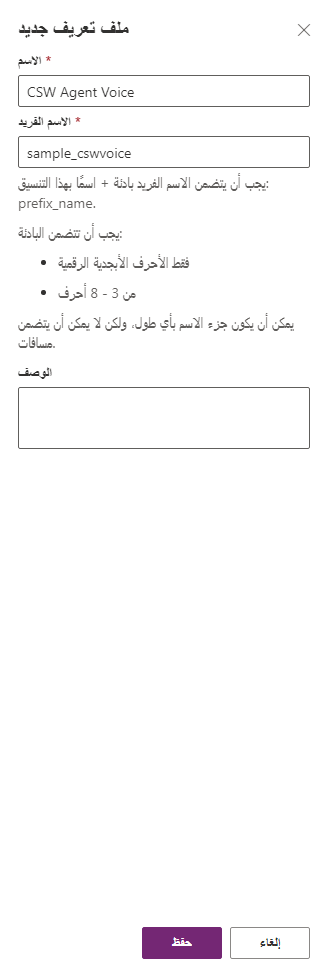
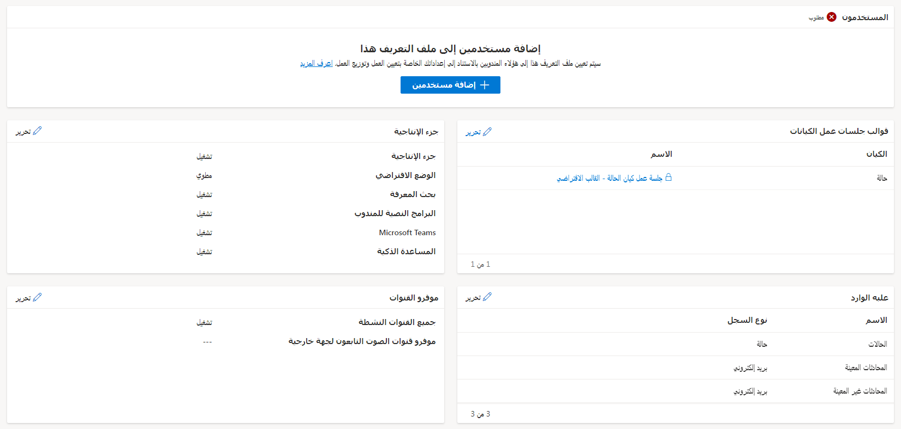
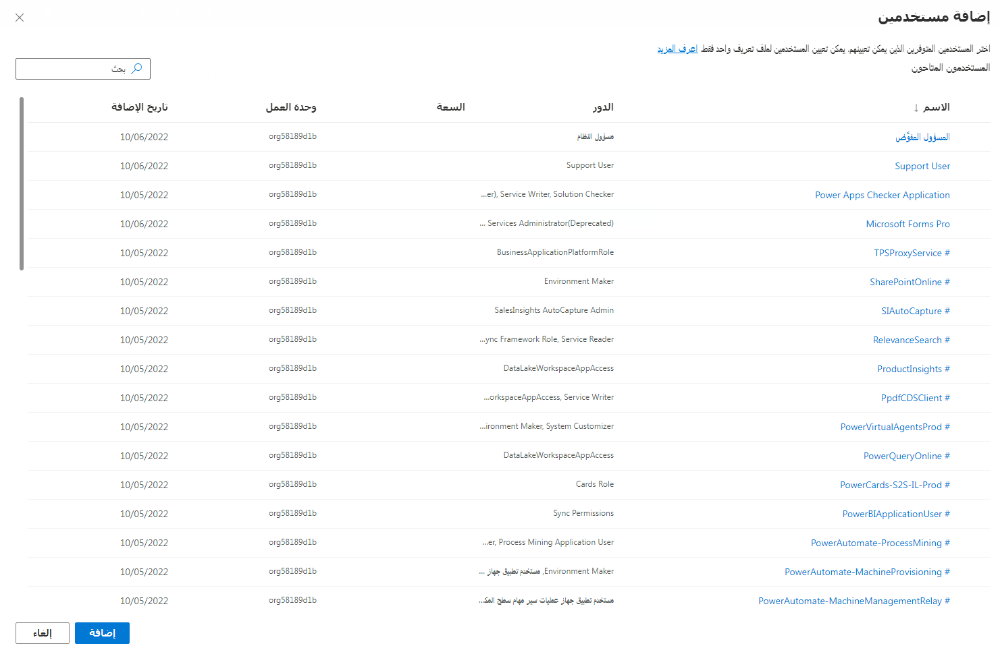

عندما تبدأ المؤسسة عملية تنفيذ إمكانيات جلسات العمل المتعددة المتوفرة في Dynamics 365 Customer Service، عليك التفكير بالشكل الذي تتخذه جلسة عمل بالنسبة إلى المندوب. يتعين عليك أن تأخذ في الاعتبار أشياء مثل، الإمكانيات التي يجب أن تكون متوفرة للمندوب، والبيانات التي يجب أن تكون متوفرة للفني عدما تفتح جلسة العمل. على سبيل المثال، عند فتح جلسة دردشة جديدة، بالإضافة إلى شاشة معلومات العميل الرئيسية، هل يجب أن يفتح سجل حساب العميل أيضاً في علامة تبويب جديدة؟ هل يجب أن تتوفر لدى مستخدمين معينين برامج نصية مختلفة للمندوب؟ تمثل هذه الأسئلة مجموعة فرعية صغيرة من الأشياء التي تريد أخذها في الاعتبار عندما تبدأ عملية تنفيذ تجربة متعددة جلسات العمل.

يوجد لدى المسؤولين أدوات متعددة متوفرة يمكنهم استخدامها للتحكم في كيفية تخصيص تجربة المستخدم للمندوبين أثناء عملهم مع العملاء. يمكنهم التحكم في كل شيء من الوظيفة المتاحة لأي فئة من المستخدمين إلى الشكل الذي تبدو عليه تجربة المستخدم. يتم ذلك في **مركز مسؤولي Customer Service**. ضمن مجموعة **تجارب المندوبين**، سترى **مساحات العمل**. من المجموعة **تجربة المندوب**. تتضمن مساحات العمل خيارات متعددة تساعد في تخصيص التجربة متعددة جلسات العمل للمندوبين.

تتضمن هذه الخيارات:

- **ملفات تعريف تجربة المندوب‬:** يسمح لك هذا الخيار بإنشاء تجارب تطبيقات مستهدفة للمندوبين والمشرفين بحيث لا تحتاج إلى إنشاء تطبيقات مخصصة وصيانتها.

- **‏‫قوالب جلسات العمل:** مجموعة من السمات ومعلومات علامة تبويب التطبيق التي يمكنها التحكم في العناصر المقدمة للمندوبين وكيفية تقديمها.

- **قوالب علامة التبويب التطبيق:** يسمح لك هذا الخيار بتحديد نوع التطبيقات التي يمكن فتحها عندما يبدأ المندوبون جلسة عمل في تطبيق Customer Service workspace أو القناة متعددة الاتجاهات لـ Customer Service.

- **قوالب الإعلامات‬:** يسمح لك هذا الخيار بتحديد المعلومات التي تُعرض للمندوبين والمشرفين للمحادثات الواردة أو عمليات التصعيد أو النقل أو الاستشارات.

## ملفات تعريف تجربة المندوب

بعد وصول العملاء إلى Dynamics 365 Customer Service، تقوم **ملفات تعريف تجربة المندوب‬** بالتحكم في الميزات المتاحة لهم، وكيفية تقديم البيانات، والقنوات المتاحة لهم، والعناصر الأخرى التي تؤثر على تجربتهم الإجمالية. يمكن تعريف ملفات تعريف مختلفة لتجربة المندوب بالاستناد إلى الاحتياجات المختلفة للمندوبين لديك. على سبيل المثال، قد يكون لديك بعض المندوبين ممن يستندون إلى هذا الدور ولا يحتاجون إلى برامج نصية للمندوب أو إلى أنواع معينه من القنوات. بمجرد إنشاء ملف تعريف تجربة المندوب، يمكنك تحديد العناصر التي ترغب في جعلها متاحة للمندوبين المعينين لملف التعريف هذا.

بإمكان المسؤولين إدارة ملفات تعريف تجربة المندوب كما يلي:

1.  إنشاء مستخدمين وتعيينهم إلى بيئة Microsoft Dynamics 365 Customer Service.

1.  التأكد من أن المستخدمين لديهم أدوار الأمان الضرورية، مثل ممثل خدمة العملاء أو مندوب القناة متعددة الاتجاهات.

1.  إنشاء دورات عمل، مثل تدفقات العمل وقوائم الانتظار وجلسات العمل وأدوات الإنتاجية.

1.  إنشاء ملفات تعريف تجربة المندوب.

1.  ‏‏تعيين ملفات تعريف تجربة المندوب إلى المستخدمين.

عندما يتم نشر Dynamics 365 Customer Service واستناداً إلى ما إذا كنت قد قمت بتكوين القناة متعددة الاتجاهات لـ Customer Service، سيتم إنشاء ملفات تعريف متعددة بشكل افتراضي. يمكن إضافة المستخدمين إلى ملفات التعريف هذه حسب الحاجة لتوفير الوصول إلى التطبيقات والميزات بسرعة. ملفات التعريف الموجودة بشكل افتراضي هي:

- **Customer Service workspace + القنوات + علبة الوارد + ملف التعريف الافتراضي:** ملف تعريف Customer Service workspace الذي يتضمن الوصول إلى القنوات وعلبة الوارد وميزات ملف التعريف الافتراضي.

- **Customer Service workspace + القنوات + ملف التعريف الافتراضي:** ملف تعريف Customer Service workspace الذي يتضمن الوصول إلى القنوات وميزات ملف التعريف الافتراضي.

- **Customer Service workspace + علبة الوارد + ملف التعريف الافتراضي:** ملف تعريف Customer Service workspace الذي يتضمن الوصول إلى علبة الوارد وميزات ملف التعريف الافتراضي.

- **Customer Service workspace + ملف التعريف الافتراضي:** ملف تعريف Customer Service workspace الذي يتضمن الوصول إلى القنوات وعلبة الوارد وميزات ملف التعريف الافتراضي.

- **القناة متعددة الاتجاهات لـ Customer Service - ملف التعريف الافتراضي:** ملف تعريف القناة متعددة الاتجاهات لـ Customer Service.

## إنشاء ملفات تعريف تجربة المندوب

بينما يمكن إضافة المستخدمين إلى أي من ملفات تعريف تجربة المندوب المذكورة أعلاه، لا يمكن حذف الوظائف الموجودة في ملفات التعريف نفسها أو تعديلها. على سبيل المثال، لا يمكنك تعطيل جزء الإنتاجية إذا أردت ذلك. للحصول على تحكم كامل في ملف تعريف تجربة المندوب، ستحتاج إلى إنشاء ملف تعريف جديد.

عندما إنشاء ملف تعريف جديد لتجربة المندوب، ستحتاج إلى توفير التفاصيل التالية:

- **الاسم:** يحدد اسم ملف التعريف الذي سيتم عرضه في ملف تعريف التطبيق.

- **الاسم الفريد:** يحدد معرفاً فريداً سيتم استخدامه لملف تعريف التطبيق. عند إنشاء الاسم الفريد لملف التعريف، ستحتاج إلى التأكد مما يلي:

  - تتكون البادئة من أحرف أبجدية وأرقام بطول يتراوح من 3 إلى 8 أحرف.

  - تضمين تسطير سفلي بين البادئة والاسم. على سبيل المثال، sample_cswvoice.

- **الوصف:** وصف لملف التعريف.

  > [!div class="mx-imgBorder"]
  > 

بعد إنشاء ملف تعريف، يمكنك فتحه وإدخال أي تغييرات عليه، إذا لزم الأمر. في ملف التعريف، يمكنك تحديد ما يلي:

- **المستخدمون:** تحديد المندوبين الذين يقترن بهم ملف التعريف.

- **قالب جلسة عمل الكيان:** تحديد جلسات عمل الكيانات‬ التي تريد ربطها بملف التعريف هذا لكل كيان سيتم عرضه في واجهة المستخدم (UI). يمكنك تحديد قالب موجود أو إنشاء قالب جلسة عمل كيان جديد.

- **جزء الإنتاجية:** تحديد خيارات أداة الإنتاجية التي يجب إتاحتها في جزء الإنتاجية. تتوفر الخيارات التالية لأداة الإنتاجية:

  - **جزء الإنتاجية** تحديد ما إذا كنت تريد استخدام جزء الإنتاجية مع ملف التعريف هذا.

  - **الوضع الافتراضي:** يحدد ما إذا كنت تريد توسيع جزء الإنتاجية أو طيه بشكل افتراضي.

  - **المساعدة الذكية:** تحديد ما إذا كنت تريد عرض وظائف المساعدة الذكية في جزء الإنتاجية. ستكون هناك حاجة إلى المزيد من عمليات التكوين.

  - **البرامج النصية للمندوب:** تحديد ما إذا كنت تريد عرض البرامج النصية للمندوب في جزء الإنتاجية.

  - **Microsoft Teams:** تحديد إذا كنت تريد أن تكون قادراً على استخدام تكامل Microsoft Teams مع ملف التعريف هذا. يجب أن يتم أيضاً تكوين تكامل Microsoft Teams في البيئة.

  - **بحث المعرفة:** تحدد رغبتك في أن تكون قادراً على استخدام عنصر تحكم Knowledge Search من ضمن جزء الإنتاجية.

- **علبة الوارد:** يسمح هذا الخيار للمندوبين بعرض جميع عناصر عملهم على شاشة واحدة ويساعدهم في تحديد أولويات المهام والعمل بكفاءة على مهام متعددة. 
  على سبيل المثال، يمكنك تعيين علبة الوارد لعرض أي محادثات معينة أو تضمين أي بريد إلكتروني تم تعيينه للمستخدم.

- **موفرو القنوات** يسمح لك هذا الخيار بتحديد القنوات المختلفة التي ستكون متاحة وتحديد موفري قنوات صوت تابعين لجهة خارجية. في جزء "موفرو القنوات‬"، يمكنك القيام بما يلي:

  - تشغيل مفتاح تبديل "جميع القنوات النشطة‬"

  - تحديد موفر قناة أو إنشاء موفري قنوات في القسم "موفرو قنوات الصوت التابعون لجهة خارجية".

  > [!div class="mx-imgBorder"]
  > 

يمكنك معرفة المزيد حول الأذونات المحددة المرتبطة بدور ما عن طريق الوصول إلى [الأدوار والأذونات المقترنة بإدارة ملف تعريف التطبيق](/dynamics365/app-profile-manager/security-roles/?azure-portal=true).

### ‏‏تعيين ملفات التعريف إلى المستخدمين

بعد تحديد العناصر التي تريد تضمينها في ملف التعريف، ستحتاج إلى تعيين ملف التعريف إلى أي من المستخدمين الذين ينبغي تطبيقه عليهم. يُعد هذا الأمر مهماً لأنه إذا لم يتم تعيين مستخدم إلى ملف تعريف، فسيستخدم بشكل تلقائي ملف التعريف الافتراضي للتطبيق الذي يستخدمه.

يمكنك تعيين مستخدمين إلى ملف تعريف عن طريق تحديد **إضافة مستخدمين** على شاشة ملف التعريف. سيؤدي ذلك إلى فتح الشاشة "إضافة مستخدمين". على الشاشة، يمكنك إضافة مستخدمين موجودين إلى ملف التعريف عن طريق تحديد الزر **إضافة**.

> [!div class="mx-imgBorder"]
> 

سيتم عرض أي مستخدمين تم تحديدهم لملف التعريف أسفل المستخدمين. بعد أن تنتهي من تعيين جميع المستخدمين الضروريين، يمكنك إغلاق علامة تبويب مستخدمي ملف التعريف للعودة إلى صفحة ملف تعريف التطبيق. يمكن لمستخدم فردي أن ينتمي إلى ملف تعريف واحد فقط في كل مرة. إذا أردت تعيين مستخدم إلى ملف تعريف مختلف، فستحتاج أولاً إلى إزالة المستخدم من ملف تعريفه الحالي، ثم إضافته إلى ملف التعريف الجديد.

الآن بعد أن فهمنا كيفية إنشاء ملفات تعريف تجربة المندوب، دعنا نفحص كيفية تكوين بعض العناصر الأخرى بمزيد من التفاصيل.
