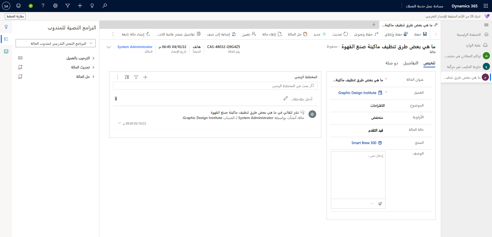
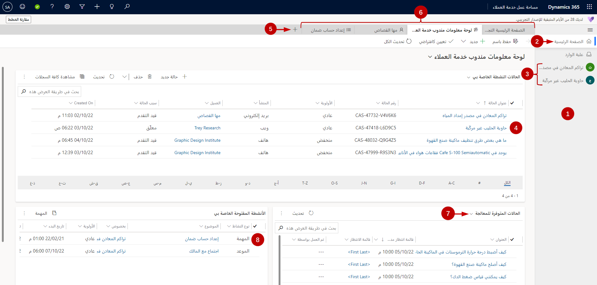
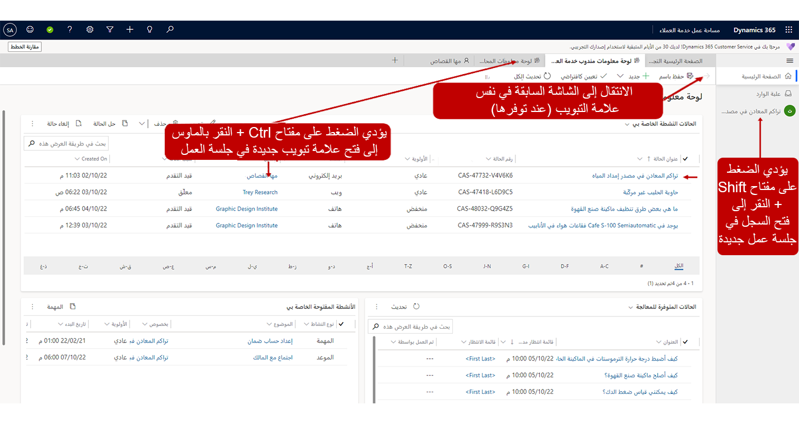

في كثير من المؤسسات، يحتاج المندوبون إلى العمل مع عدة عملاء في الوقت نفسه. بإمكان هذا الجانب أن يكون صعباً، لأن المندوبين لا يحتاجون فقط إلى التفاصيل الضرورية حول الفرد الذي يعملون معه في تلك اللحظة. فهم يريدون أيضاً أن يكونوا قادرين على الانتقال إلى عميل آخر، إذا لزم الأمر، من دون فقدان التفاصيل حول العميل الحالي.

يوفر Dynamics 365 Customer Service للمؤسسات خيارين لتوفير إمكانيات دعم جلسات العمل المتعددة لدعم المندوبين:

-   **القناة متعددة الاتجاهات لـ Customer Service:** يسمح هذا الخيار للمندوبين بالتواصل مع العملاء في جلسات عمل متعددة في وقت واحد عبر قنوات مثل الدردشة المباشرة والصوت والرسائل النصية القصيرة (SMS).

-   **Customer Service workspace:** يسمح هذا الخيار للمندوبين بالعمل على جلسات عمل متعددة في وقت واحد في مساحة عمل واحدة.

عندما تقوم المؤسسة بإعداد القناة متعددة الاتجاهات لـ Customer Service، يمكن إتاحة إمكانيات القناة المتوفرة في القناة متعددة الاتجاهات لـ Customer Service في تطبيق Customer Service workspace. يعني هذا الأمر أن المؤسسة التي تحتاج إلى إمكانيات جلسات عمل متعددة والقدرة على الدعم عبر قنوات متعددة يمكنها استخدام Customer Service workspace وواجهة المندوب الأساسية.

كما ورد سابقاً، تساعد واجهة مستخدم Customer Service workspace في Dynamics 365 على ضمان تزويد المندوبين بكل ما يحتاجون إليه لدعم الكثير من العملاء بسهولة في وقت واحد من خلال إمكانيات جلسات العمل المتعددة المتوفرة.

> [!div class="mx-imgBorder"]
> 

أثناء جلسة العمل، بإمكان المندوبين فتح علامات تبويب متعددة لبيانات ذات صلة مثل المقالات المعرفية وتفاصيل الحساب والمزيد. تتيح لك التنبيهات معرفة ما إذا كان هناك نشاط في جلسة عمل أخرى، بحيث لا يفوتك أي اتصال. أثناء التبديل من جلسة عمل إلى أخرى، ستبقى جميع علامات التبويب في تلك الجلسة مفتوحة بحيث تبقى موجودة عند التبديل مرة أخرى. بعد إغلاق جلسة العمل، سيتم أيضاً إغلاق جميع علامات التبويب في جلسة العمل تلك.

دعنا نلقي نظرة سريعة على العناصر المتوفرة في Customer Service workspace.

> [!div class="mx-imgBorder"]
> 

يستعرض الجدول التالي بعض العناصر الأساسية التي ستراها أثناء العمل مع تطبيق Customer Service workspace.

| **التسمية**| **الوصف‏‎** |
| - | - |
| **1**| يسرد جزء جلسة العمل جميع جلسات العمل التي تعمل عليها بنشاط. حدد علامات التبويب للتنقل بين جلسات العمل. |
| **2**| تعيدك جلسة العمل الرئيسية إلى طريقة عرض لوحة معلومات مندوب خدمة العملاء. |
| **3**| لكل جلسة عمل علامة تبويب في لوحة جلسة العمل. حدد علامة تبويب للانتقال إلى جلسة العمل التي تريد العمل فيها. |
| **4**| حدد حالة لفتح جلسة عمل جديدة. يؤدي تنفيذ نقرة واحدة على حالة إلى استبدال طريقة العرض بنموذج الحالة. حدد سهم الرجوع‬ الموجود في الزاوية العلوية اليمنى من النموذج للعودة إلى طريقة العرض السابقة. |
| **5**| حدد أيقونة علامة الجمع + لتوسيع القائمة لعرض قائمة بالنماذج وطرق العرض والأنشطة. حدد الخيار الذي تريد فتحه في علامة تبويب جديدة. |
| **6**| حدد علامات التبويب للانتقال إلى الأنشطة والحالات والنماذج وطرق العرض المفتوحة. |
| **7**| حدد محدد القائمة المنسدلة لتصفية الحالات في قوائم الانتظار التي يمكنك اختيار العمل عليها. |
| **8**| حدد Shift + النقر بالماوس لفتح جلسة عمل جديدة لنشاط ما. يؤدي تنفيذ نقرة واحدة إلى استبدال طريقة العرض بنموذج الحالة. حدد سهم الرجوع‬ الموجود في الزاوية العلوية اليمنى من النموذج للعودة إلى طريقة العرض السابقة. |

## التنقل وعرض السجلات

بإمكان جلسة العمل أن تحتوي على علامات تبويب متعددة ذات صلة، وهذا يضمن أنه أثناء عمل المندوب، ستظل علامات التبويب الأخرى التي تحتوي على البيانات ذات الصلة مفتوحة بينما تكون جلسة العمل مفتوحة، ويمكن للمندوب التبديل بينها حسب الحاجة. تؤثر طريقة تفاعلك مع المعلومات على كيفية عرضها في التطبيق. على سبيل المثال، إذا كنت تعمل في جلسة العمل الرئيسية، وقمت بتحديد حالة من قائمة الحالات النشطة، فسيفتح سجل الحالة في علامة التبويب الحالية وسيحل مكان محتويات علامة تبويب لوحة معلومات مندوب خدمة العملاء. ولن تفتح مساحة العمل السجل في علامة تبويب جديدة أو جلسة عمل جديدة، الأمر الذي يتطلب مجموعة مختلفة من لوحة المفاتيح/الماوس عند التحديد.

مجموعات الماوس/لوحة المفاتيح المتوفرة هي:

-   **تحديد سجل:** استبدال محتويات علامة التبويب الحالية بالنموذج الخاص بالعنصر الذي حددته.

-   **الضغط مع الاستمرار على مفتاح Shift أثناء تحديد أحد السجلات:** فتح العنصر المحدد في جلسة العمل الجديدة التي سيتم عرضها في لوحة جلسة العمل على يمين التطبيق.

-   **الضغط مع الاستمرار على مفتاح Ctrl أثناء تحديد أحد السجلات:** فتح العنصر المحدد في علامة تبويب جديدة داخل جلسة العمل الحالية.

تحديد سهم الرجوع‬ الموجود في الزاوية العلوية اليمنى من النموذج للعودة إلى طريقة العرض السابقة.

> [!div class="mx-imgBorder"]
> 

> [!NOTE]
> يمكن للمؤسسات تكوين الإعدادات التي تسمح بخيارات تنقل أبسط لا تتطلب من المندوبين استخدام تحديدات لوحة المفاتيح.

## العمل مع علامات تبويب التطبيق

في كثير من الأحيان، أثناء العمل في جلسة عمل، قد تحتاج إلى الوصول إلى معلومات أخرى. كما هو الحال عند فتح السجلات في علامات تبويب جديدة في التطبيق، يمكنك فتح علامات تبويب تطبيق أخرى لتوفير وظائف الدعم. على سبيل المثال، أثناء العمل في إحدى الحالات، قد ترغب في البحث في قاعدة المعارف وتحديد ما إذا كانت المقالات المعرفية الحالية متاحة للمساعدة في حل المشكلة.

عندما تقوم بتحديد رمز علامة زائد (**+**) في جلسة العمل، سيتم عرض عنصر معرف مسبقاً يمكنك الانتقال إليه. عند تحديد صنف من القائمة، يتم فتح الصنف في علامة تبويب جديدة في جلسة العمل الحالية.

بشكل افتراضي، الأصناف المتوفرة هي:

- **لوحات المعلومات** - لفتح لوحة معلومات مندوب خدمة العملاء.

- **الحالات** - لفتح طريقة العرض **‏‫الحالات النشطة الخاصة بي‬**.

- **‏‫قوائم الانتظار‬** - لفتح طريقة العرض **قوائم الانتظار**.

- **الأنشطة** - لفتح طريقة العرض **‏‫الأنشطة المفتوحة الخاصة بي‬**.

- **جهات الاتصال** - لفتح طريقة العرض **جهات الاتصال النشطة**.

- **الحسابات** - لفتح طريقة عرض **الحسابات النشطة**.

- **المقالات المعرفية** - لفتح طريقة عرض **‏‫المقالات النشطة الخاصة بي‬**.

الآن بعد أن تعرفت على Customer Service workspace، دعنا نستعرض كيفية تنفيذ تجارب جلسات العمل المتعددة للمندوبين.
