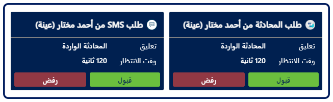
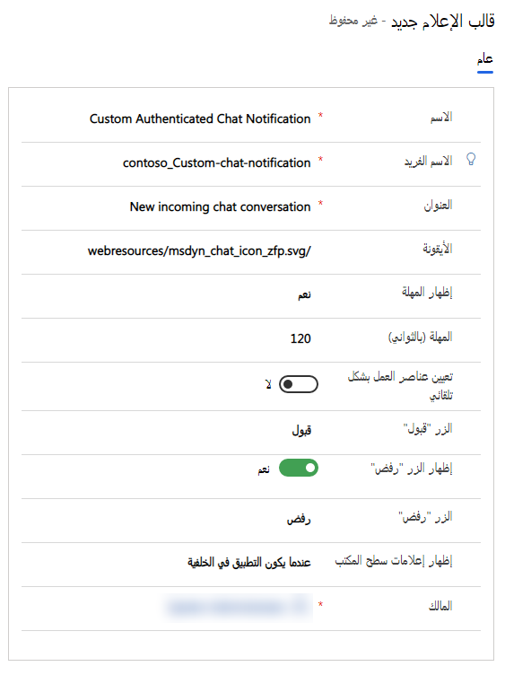
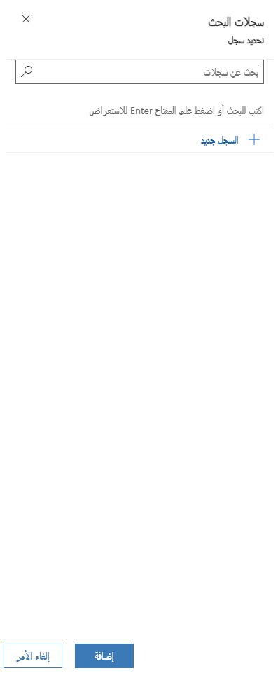
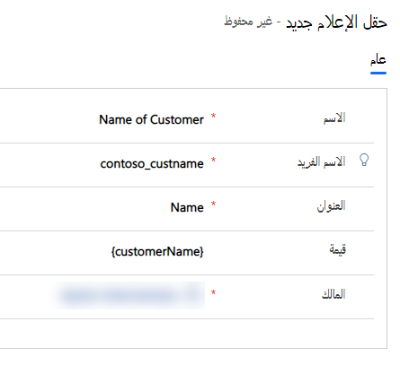
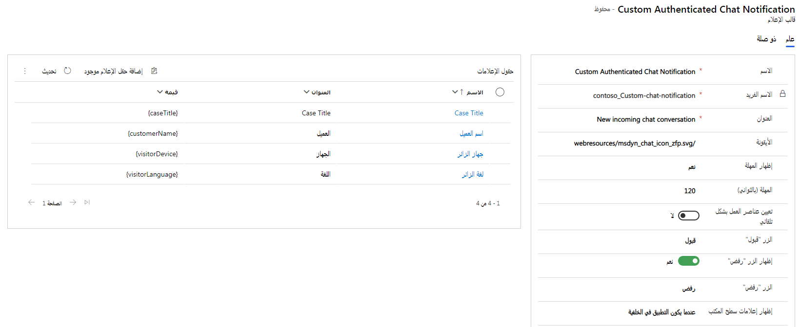

بينما يحاول العملاء التفاعل مع مؤسستك عبر قنوات دردشة مختلفة، يتم إنشاء طلبات المحادثة وتوجيهها إلى المندوبين المتاحين. بمجرد أن يُحدد النظام أحد المندوبين، يرسل إخطاراً إليه. الإخطار هو تنبيه مرئي يظهر في كل مرة تتلقى فيها دردشة أو طلب محادثة عبر الرسائل القصيرة من أحد العملاء. يتضمن الإخطار تفاصيل حول العميل الذي ستتفاعل معه. ستبدأ جلسة عند قبول الطلب، ويمكنك عرض المعلومات السياقية للعميل والحالة في صفحة ملخص العميل.

بعض السيناريوهات التي قد تتلقى فيها إخطارات:

-   الدردشة الواردة أو الرسائل القصيرة أو محادثة القناة الاجتماعية.

-   المحادثات التي يتم تحويلها إليك من مندوب آخر.

-   يتم تصعيد المحادثة إليك من مندوب آخر أو روبوت.

تُظهر الصورة أدناه أمثلة على إخطارين مختلفين من قنوات مختلفة.

> [!div class="mx-imgBorder"]
> 

الصورة الأولى هي إخطار وارد من عميل حالي محدد من قناة LINE الاجتماعية. الإخطار الثاني وارد من مستخدم غير معرّف عبر قناة دردشة. لدى كل مؤسسة متطلبات عمل متنوعة وتريد من الإخطارات أن تعرض المعلومات ذات الصلة للمندوبين.

كما هو الحال مع قوالب علامة التبويب الخاصة بالجلسة والتطبيق، يمكنك استخدام قوالب الإخطارات الجاهزة أو إنشاء نموذج خاص بك. قالب الإخطار عبارة عن مجموعة من المعلومات المتعلقة بالإخطار والقابلة لإعادة الاستخدام، ويتم استخدامه لتكوين المعلومات التي يجب عرضها للمندوبين والمشرفين فيما يتعلق بمحادثة واردة أو تصعيد أو تحويل أو استشارة.

## قوالب الإخطار الجاهزة

عندما تستخدم مؤسستك القناة متعددة الاتجاهات لـ Customer Service لتقديم الدعم عبر قنوات متعددة، سيتم تزويدك بالعديد من قوالب الإخطارات الجاهزة التي يمكنك استخدامها في بيئتك. وبناءً على ما إذا كان العميل قد تمت مصادقته أم لا، تتوفر قوالب مختلفة مصدّق عليها وغير مصدّق عليها. على سبيل المثال، إذا سجل أحد العملاء الدخول إلى بوابة الدعم الخاصة بشركتك ثم بدأ محادثة دردشة، فسيتم تمرير معلوماته وستتضمن رسالة الإخطار تفاصيل العميل. إذا لم يتم تسجيل دخولهم إلى البوابة الإلكترونية، فلن يتم تضمين معلومات العميل في الرسالة.

تكون القوالب الجاهزة كما يلي:

| **القناة/الكيان**| **استشارة**| **مصدّق**| **غير مصدّق**| **التحويل** |
| - | -| - | - | - |
| **دردشة**| دردشة - استشارة - افتراضي| دردشة - وارد مصدّق عليه - افتراضي| دردشة - وارد غير مصدّق عليه - افتراضي| دردشة - تحويل - افتراضي |
| **رسائل مخصصة**| رسائل مخصصة - استشارة - افتراضي| رسائل مخصصة - وارد مصدّق عليه - افتراضي| رسائل مخصصة - وارد غير مصدّق عليه - افتراضي| رسائل مخصصة - تحويل - افتراضي |
| **Facebook**| Facebook - استشارة - الافتراضي| Facebook - وارد مصدّق عليه - افتراضي| Facebook - وارد غير مصدّق عليه - افتراضي| Facebook - تحويل - افتراضي |
| **LINE**| LINE - استشارة - افتراضي| LINE - وارد مصدّق عليه - افتراضي| LINE - وارد غير مصدّق عليه - افتراضي| LINE - تحويل - افتراضي |
| **SMS**| رسالة نصية قصيرة - استشارة - افتراضي| رسالة نصية قصيرة - وارد مصدّق عليه - افتراضي| رسالة نصية قصيرة - وارد غير مصدّق عليه - افتراضي| رسالة نصية قصيرة - تحويل - افتراضي |
| **Microsoft Teams**| Teams - استشارة - افتراضي| Teams - وارد مصدّق عليه - افتراضي| Teams - وارد غير مصدّق عليه - افتراضي| Teams - تحويل - افتراضي |
| **Twitter**| Twitter - استشارة - افتراضي| Twitter - وارد مصدّق عليه - افتراضي| Twitter - وارد غير مصدّق عليه - افتراضي| Twitter - تحويل - افتراضي |
| **WeChat**| WeChat - استشارة - افتراضي| WeChat - وارد مصدّق عليه - افتراضي| WeChat - وارد غير مصدّق عليه - افتراضي| WeChat - تحويل - افتراضي |

لا يمكنك تخصيص قوالب الإخطارات الجاهزة. إذا كنت بحاجة إلى رسائل إخطار مخصصة، فأنت بحاجة إلى إنشاء قوالبك المخصصة.

## إنشاء قالب إخطار

يمكن إنشاء قوالب إخطارات جديدة في تطبيق **مركز مسؤول خدمة العملاء**. ضمن **تجربة المندوب**، اختر **مساحات العمل** وحدد **إدارة** بجوار **قوالب الإخطار**. يمكن إنشاء قوالب جديدة عن طريق تحديد الزر **قالب إخطار جديد** على شريط الأوامر.

يتضمن قالب الإخطار العناصر التالية:

-   **الاسم:** يحدد اسم الإخطار.

-   **الاسم الفريد:** معرّف فريد بتنسيق `<prefix>_<name>`.

-   **العنوان**: يحدد عنوان الإخطار الذي يتم عرضه على المندوبين في واجهة المستخدم (UI) في وقت التشغيل. 
    مثال: محادثة دردشة واردة جديدة

-   **الرمز:** يحدد المسار إلى مورد الويب الذي سيتم استخدامه لرمز الإخطار. 
    مثال: `/webresources/msdyn_chat_icon_zfp.svg`

-   **إظهار المهلة:** يحدد ما إذا كان يجب عرض مؤقت العد التنازلي للمستخدم الذي يحدد وقت انتهاء صلاحية الإخطار.

-   **المهلة (بالثواني):** تحدد مدة عداد المهلة.

-   **التعيين التلقائي لعناصر العمل:** يحدد ما إذا كان يجب تعيين العناصر تلقائياً للفنيين.

-   **زر القبول:** يحدد النص الذي سيتم عرضه على زر النص.

-   **زر الرفض:** يحدد ما إذا كان يجب عرض زر الرفض للمندوبين. إذا تم التعيين على نعم، يمكنك تعديل النص المعروض.

-   **إظهار إخطارات سطح المكتب:** يحدد ما إذا كنت تريد عرض الإخطارات للمندوبين عندما يكون تطبيق القناة متعددة الاتجاهات لـ Customer Service خارج نطاق التركيز.

> [!div class="mx-imgBorder"]
> 

### حقول الإخطار

بعد حفظ قالب الإخطار مبدئياً، سيظهر قسم **حقول الإخطار** على الصفحة.

يُستخدم حقل الإخطار لعرض المعلومات السياقية في الإخطار. على سبيل المثال، إذا كنت تريد أن يعرض الإخطار اسم العميل الذي يطلب الدردشة، يمكنك إنشاء حقل إخطار يحدد البيانات المراد تعبئتها. يمكنك تحديد حقول الإخطار التي تريد استخدامها لهذا القالب عن طريق تحديد الزر **إضافة إخطار موجود**. سيؤدي هذا إلى فتح نافذة بحث حيث يمكنك إضافة حقول إخطار موجودة أو حقل جديد إذا لزم الأمر.

> [!div class="mx-imgBorder"]
> 

عند تحديد حقل إخطار، ستحتاج إلى تحديد ما يلي:

-   **الاسم** يحدد اسم حقل الإخطار.

-   **الاسم الفريد:** معرّف فريد بتنسيق `<prefix>_<name>`.

-   **العنوان:** يحدد عنوان حقل الإخطار.

-   **القيمة:** تحدد القيمة التي سيتم تقديمها إلى المندوب في وقت التشغيل. مثال.{customerName}

    > [!div class="mx-imgBorder"]
    > 

في المثال أعلاه، ترى أنه يتم استخدام {customerName} في حقل القيمة. يشار إلى هذا باسم حقل احتياطي البريد الإلكتروني. حقل احتياطي البريد الإلكتروني عبارة عن معلمة استبدال يتم ملؤها في وقت التشغيل بناءً على متغيرات السياق. في هذه الحالة، سيتم استبدال {customerName} باسم العميل الذي بدأ محادثة الدردشة، مثل Kenny Smith.

يوفر الجدول أدناه قائمة بحقل احتياطي البريد الإلكتروني المتوفر.

| **حقل احتياطي البريد الإلكتروني**| **الوصف‏‎** |
| - | - |
| **{customerName}**| اسم العميل الذي بدأ المحادثة. |
| **{caseId}**| المعرّف الفريد العالمي لمشكلة ما. يتم عرض معرف المشكلة فقط إذا كانت المشكلة مرتبطة بالمحادثة. |
| **{caseTitle}**| عنوان المشكلة. يتم عرض عنوان المشكلة فقط إذا كانت المشكلة مرتبطة بالمحادثة. |
| **{queueId}**| معرف GUID للصف. |
| **{visitorLanguage}**| اللغة التي يبدأ بها العميل المحادثة. |
| **{visitorDevice}**| جهاز العميل الذي بدأ المحادثة. |
| **{entityRoutingLogicalName}**| اسم الكيان إذا كان الإشعار لسجلات كيان. |
| **{entityRoutingRecordId}**| معرف GUID لسجل الكيان إذا كان الإخطار لسجلات الكيان. لمعرفة المزيد، راجع توجيه سجلات الكيانات. |
| **{customerEntityName}**| اسم الكيان (جهة الاتصال أو كيان الحساب) إذا تمت مصادقة العميل. |
| **{customerRecordId}**| معرف GUID للكيان (جهة اتصال أو كيان الحساب) إذا تمت مصادقة العميل. |
| **{&lt;اسم سؤال استطلاع ما قبل المحادثة&gt;}**| يمكن استخدام جميع أسئلة استطلاع ما قبل المحادثة التي تم تكوينها لدفق العمل باعتبارها حقل احتياطي البريد الإلكتروني. التنسيق هو نفسه السؤال. |

بمجرد إضافة جميع حقول الإخطار التي تريد تضمينها في القالب، سيتم ملؤها عند تقديم الإخطار في حالة وجود بيانات لهذه القيم.

> [!div class="mx-imgBorder"]
> 

الآن وقد أكملنا تحديد القوالب التي تريد استخدامها، فإن الخطوة الأخيرة هي التأكد من استخدامها بشكل مناسب عن طريق تعيينها إلى عمليات دفق العمل المناسبة.
