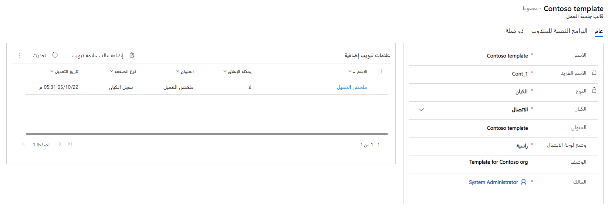
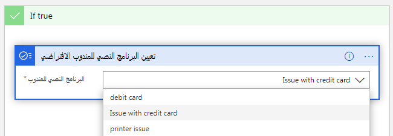

نظراً لأن المندوبين يعملون مع العملاء عبر قنوات مختلفة أو في سيناريوهات مختلفة، يمكن أن تختلف المعلومات التي يحتاجونها تحت تصرفهم، وكيف ينبغي تقديمها. يتم التحكم في كيفية تقديم هذه العناصر إلى المندوبين من خلال جلسات العمل. عندما يقبل مندوب طلب محادثة وارد من أحد العملاء، تبدأ جلسة العمل. خلال الجلسة، يتم استخدام مجالات وتطبيقات مختلفة لتقديم البيانات إلى المندوبين. بشكل افتراضي، يفتح النظام تطبيق **ملخص العميل** كلوحة علامات تبويب تطبيق. وهذا يوفر للمندوبين تفاصيل مهمة، مثل تفاصيل العميل وتفاصيل المحادثة والوصول إلى المعلومات الأخرى ذات الصلة. حسب الحاجة، يمكن فتح المزيد من علامات تبويب التطبيقات داخل جلسة العمل لتوفير مزيد من التفاصيل حول المعلومات ذات الصلة. على سبيل المثال، سيؤدي تحديد الحالة المقترنة بالمحادثة إلى فتح تفاصيل الحالة في علامة تبويب تطبيق أخرى. حيث يمكن للمندوبين التبديل بسهولة بين علامات التبويب داخل جلسة العمل حسب الحاجة.

تتضمن كل جلسة عمل **علامة تبويب الارتساء**. وتُعد علامة التبويب المرساة هي علامة التبويب التي سيتم فتحها عند بدء جلسة عمل جديدة. وهي بمثابة علامة التبويب الرئيسية لجلسة العمل. على سبيل المثال، في القناة متعددة الاتجاهات لـ Customer Service، **علامة تبويب الارتساء** هي تطبيق ملخص العميل. لا يمكن إغلاق **علامة تبويب الارتساء**. سيظل متوفراً اثناء فتح جلسة العمل.

لضمان حصول المندوبين على ما يحتاجون إليه، يمكنك تحديد قوالب جلسات مختلفة يمكن إضافتها إلى ملفات تعريف التطبيق. قالب الجلسة هو مزيج من السمات ومعلومات علامة تبويب التطبيق التي يمكن إعادة استخدامها حسب الحاجة.

تعرف على كيفية استخدام قوالب جلسات العمل لتحديد العناصر الأساسية في تجربة جلسة العمل.

-   **علامات تبويب الارتساء** - تحدد التطبيق المراد فتحه كعلامة التبويب الرئيسية لجلسة العمل هذه.

-   **علامات تبويب التطبيقات الإضافية** - تحدد علامات تبويب أخرى لفتحها عند بدء الجلسة.

-   **لوحة الاتصال** - تحديد الوضع الافتراضي للوحة الاتصال عند بدء الجلسة.

تتوفر قوالب الجلسة الجاهزة بشكل افتراضي. بناءً على تطبيقات Customer Service التي قمت بنشرها، سيكون لديك قوالب مختلفة متاحة.

القوالب الجاهزة هي:

| **القناة متعددة الاتجاهات لـ Customer Service**| **Customer Service Workspace** |
| - | - |
| جلسة عمل كيان الحالة - القالب الافتراضي| جلسة عمل كيان الحالة - القالب الافتراضي |
| جلسة عمل دردشة – افتراضي|  |
| جلسة عمل مراسلة مخصصة – افتراضي|  |
| جلسة عمل سجلات الكيان – افتراضي|  |
| 
القنوات الاجتماعية:<ul><li>جلسة عمل Facebook – افتراضي</li><li>جلسة عمل LINE – افتراضي</li><li>جلسة عمل SMS – افتراضي</li><li>جلسة عمل Teams – افتراضي</li><li>جلسة عمل Twitter – افتراضي</li><li>جلسة عمل WeChat – افتراضي</li><li>جلسة عمل WhatsApp - افتراضي</li></ul>
|  |

توفر القوالب المذكورة أعلاه نقطة بدء رائعة. ومع ذلك، لا يمكنك تخصيص قوالب الجلسة هذه. إذا كنت بحاجة إلى خيارات مختلفة، يمكنك إنشاء القوالب المخصصة الخاصة بك.

## إنشاء قالب جلسة عمل

يتم إنشاء قوالب جلسات العمل من الصفحة أداره ملف تعريف التطبيق. يمكنك إنشاء قوالب جلسات العمل استناداً إلى التطبيق الذي سيتم تطبيقه عليه. على سبيل المثال، إذا أردت إنشاء قالب جلسة عمل لينطبق على ملفات تعريف Customer Service workspace، فستحتاج إلى إنشاء قالب جلسة عمل لتطبيق Customer Service workspace. في تطبيق **مركز مسؤولي Customer Service‬‏‫**، ضمن **تجربة المندوب**، حدد **مساحات العمل** وحدد **إدارة** بجوار **قوالب جلسة العمل.** وسينقلك هذا إلى شاشة **قوالب جلسات العمل النشطة**. تم إنشاء قوالب جديدة عن طريق تحديد الزر **جديد** على شريط الأوامر.

>[!IMPORTANT]
> بغض النظر عن التطبيق الذي تحدده، سيتم نقلك إلى نفس الشاشة حيث سيتم عرض جميع قوالب جلسات العمل. يتم فتح صفحة الواجهة الموحدة على علامة تبويب جديدة.

عند تحديد قالب جلسة عمل، ستحتاج إلى تحديد المعلمات التالية.

| **الاسم**| **وصف القيمة**| **مثال** |
| - | - | - |
| **الاسم**| تحديد اسم جلسة العمل.| جلسة عمل الدردشة |
| **الاسم الفريد**| 
معرف فريد بتنسيق `<prefix>_<name>`. **مهم**   مطلوب ما يلي للاسم الفريد: <ul><li>يمكن أن تكون البادئة فقط أبجدية رقمية ويجب أن يتراوح طولها بين 3 إلى 8 أحرف.</li><li>يجب أن توجد شرطة سفلية بين البادئة والاسم.</li></ul>
| msdyn_chat_custom |
| **النوع**| 
تحديد نوع قالب جلسة العمل. يتوفر الخياران التاليان. <ul><li>**الكيان:** تحديد أن العنصر يستند إلى جدول Dataverse. عند تحديد الكيان، سيتم عرض حقل الكيان، حيث يمكنك تحديد الجدول الذي سيتم ربطه به.</li><li>**عام:** استخدم هذا الخيار عندما يتم تخصيص النموذج لأي قناة، مثل الدردشة أو الرسائل النصية.</li></ul>
| الكيان |
| **‏‫العنوان**| تحديد عنوان الجلسة التي يتم عرضها للمندوبين في واجهة المستخدم (UI) في وقت التشغيل.| {customerName} |
| **وضع لوحة الاتصال**| 
تحديد الوضع الافتراضي للوحة عند بدء جلسة عمل. يمكنك تحديد أحد الخيارات التالية: **تم الإرساء**: ستكون اللوحة في الوضع الموسع.<ul><li>**مصغرة**: ستكون اللوحة موجودة في الوضع المصغر.</li><li>**إخفاء**: سيتم إخفاء اللوحة.</li></ul>
| تم الإرساء |
| **الوصف‏‎**| يتم استخدامه لتقديم وصفاً للرجوع إليه.| يتم استخدام قالب جلسة العمل لطلب محادثة من قناة الدردشة. |
| **علامة تبويب الارتساء**| تحديد التطبيق الذي سيتم فتحه افتراضياً عند بدء جلسة العمل ولا يمكن إغلاقه.| ملخص العميل |

> [!IMPORTANT]
> يتم عرض خيار علامة تبويب الارتساء فقط عند تعيين النوع إلى عام.

> [!div class="mx-imgBorder"]
> 

كما ذكرنا سابقاً، تتمثل إحدى مزايا قوالب جلسة العمل في أنه يمكنك تحديد علامات التبويب الأخرى التي يجب فتحها عند بدء تشغيل جلسة العمل. وتضمن هذه الميزة أن المندوب يمكنه تحديد العناصر التي يحتاجون إليها بسهولة دون الحاجة إلى البحث المفرط. فبمجرد أن تقوم بحفظ سجل قالب جلسة العمل، سيتم عرض الشبكة الفرعية **علامات التبويب الإضافية**. وهذا هو المكان الذي يمكنك من خلاله تحديد علامات تبويب التطبيق الأخرى التي سيتم فتحها عند بدء تشغيل إحدى جلسات العمل.

إن علامة تبويب **البرامج النصية للمندوبين** هي المكان الذي يمكنك فيه تحديد البرامج النصية للمندوب التي يجب أن تكون متاحة للمندوبين أثناء عملهم في جلسة العمل. تتضمن علامة تبويب البرامج النصية للمندوبين أيضاً خيار تبديل لتعيين البرنامج النصي الافتراضي لنوع جلسة عمل معين. إذا قمت بتعيين حقل **تمكين إنشاء التعبير** إلى **نعم**، يمكنك استخدام منشئ التعبير لتحديد برنامج المندوب النصي الذي سيتم تحميله استناداً إلى نوع جلسة العمل التي يتم بدؤها. على سبيل المثال، بالنسبة لأنواع جلسات الكيانات مثل الحالة، قد ترغب في تحميل برنامج نصي للمندوب يتضمن المعلومات المتعلقة بالحالة. ولأن أنواع جلسات العمل العامة ستتضمن لوحة المحادثة، فقد ترغب في تحميل برنامج نصي يتضمن بيانات المحادثة وخطوات إنشاء السجلات ذات الصلة.

> [!div class="mx-imgBorder"]
> 

يمكنك معرفه المزيد عن تعريف البرنامج النصي للمندوب الافتراضي في [‬‏‫إرشاد المندوبين باستخدام البرامج النصية](/dynamics365/app-profile-manager/agent-scripts/?azure-portal=true).

الآن بعد أن تم تكوين قالب جلسة العمل الخاص بك، يجب أن يكون مقترناً بمسار عمل لضمان تحميله عند الحاجة.
