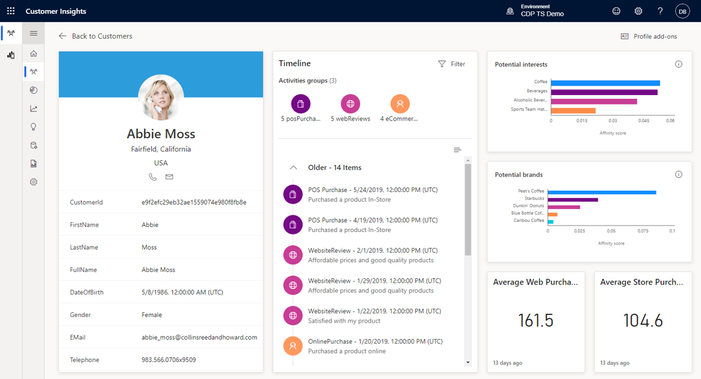

أحد أكبر التحديات التي تواجهها المؤسسات اليوم هو أنه قد يكون من الصعب فهم عملائك وما المهم بالنسبة لهم. يمكن أن تكون بيانات العميل مبعثرة عبر مستودعات بيانات متعددة. فمثلاً، قد يعمل نظام الحركات الذي يستخدمه موقع ويب التجزئة الخاص بمؤسستك بشكل مستقل عن نظام نقاط البيع المستخدم في متاجر البيع بالتجزئة الخاصة بك. بالإضافة إلى ذلك، قد تستخدم مراكز الدعم والاتصال في مؤسستك تطبيقًا منفصلاً مصممًا لسيناريوهات مركز الاتصال. كيف يمكنك الحصول على صورة واضحة عن هوية هذا العميل، في ظل انتشار بيانات العملاء عبر أنظمة مختلفة؟

رؤى الجمهور، وهي جزء من Dynamics 365 Customer Insights يساعد مؤسستك على فتح الرؤى لبناء فهم أعمق لعملائك. تقوم "رؤى الجمهور" باستيعاب البيانات من جميع مصادر البيانات المختلفة وتوحدها في ملف تعريف عميل واحد. ومن ضمن ملف تعريف العميل، يمكنك تعقب البيانات عبر مختلف المجموعات السكانية وتحديد الاتجاهات بالاستناد إلى البيانات التي تريد تعقبها.

> [!div class="mx-imgBorder"]
> ملف تعريف عملاء 

يبدأ الحصول على عرض شامل لعملائك من خلال استيعاب البيانات المحددة التي تحتاج إلى العمل معها عبر جميع مستودعات البيانات المختلفة في مؤسساتك.

قد تشمل هذه المصادر:

-  بيانات الحركات مثل أنظمة نقاط البيع

-  بيانات المراقبة مثل تطبيق اختبار المنتج

-  المصادر السلوكية مثل تطبيقات Customer Service وSales وغير ذلك

-  أي مصدر بيانات حيث يتم تخزين البيانات المتعلقة بالعميل

## الاستخراج والتحويل والتحميل (ETL)

قبل أن تتمكن التطبيقات التي تعمل مع البيانات من مصادر مختلفة، مثل "رؤى الجمهور" من استخدامها. يجب جمع البيانات وصقلها إلى شيء يمكن أن يستهلكه التطبيق. لا غنى عن هذه العملية لضمان استخدام البيانات بشكل مناسب. يشار إلى هذه العملية باسم ETL، والتي تعني "الاستخراج" و"التحويل" و"التحميل".

هناك ثلاث خطوات تشكل عملية ETL وتمكّن البيانات من التكامل من المصدر إلى الوجهة، كما هو الواضح من الاسم.

-   **استخراج البيانات:** يستخرج البيانات الأولية من مصدر بيانات مثل الأنظمة القديمة والبيئات السحابية وتطبيقات CRM / ERP ومستودعات البيانات وغيرها.

-   **تحويل البيانات:** يحسّن جودة البيانات وإمكانية الوصول إليها من خلال عمليات مثل تنقية البيانات والتوحيد القياسي والفرز وغير ذلك.

-   **تحميل البيانات:** يقوم بتحميل البيانات في موقعها الجديد.

قد يتم إجراء ETL كجزء من عملية الاستيعاب، أو قبل استيعاب البيانات وفقًا لطريقة استيعاب البيانات التي ستستخدمها. سنطلع على متى يجب إجراء ETL، أثناء قيامنا بفحص طرق الاستيعاب المختلفة المتاحة.

## إدخال البيانات

يتم تخزين البيانات التي يتم إدخالها إلى رؤى الجمهور في مجموعة بيانات. مجموعة البيانات هي في الأساس جدول يحتوي على البيانات التي تريد استخدامها. قد تكون بيانات ملف التعريف الواردة من تطبيق CRM، أو مشتريات قادمة من نظام PoS. يتم تخزين مجموعات البيانات في مصادر البيانات، وهي وحدات تنظيمية تساعد في تنظيم مجموعات البيانات وتسهل تجميعها / العثور عليها. مثلاً، يمكنك تحديد مصدر بيانات يسمى "التجارة الإلكترونية" لجلب البيانات من تطبيق التجارة الإلكترونية. ربما يحتوي تطبيق التجارة الإلكترونية على كلٍّ من ملف تعريف العميل وبيانات شراء العميل. توجد مجموعة بيانات لكلٍّ منها في مصدر البيانات.

ستكون بحاجة لتحديد طريقة الإدخال التي يجب استخدامها، بناءً على حجم البيانات التي تريد إدخالها ومكانها.

توفر "رؤى الجمهور" ثلاثة خيارات يمكنك الاختيار من بينها:

-   **استيراد البيانات** - يُستخدم عندما تريد الاتصال ببيانات مثل Microsoft Dataverse وAzure Blobs ومصادر OData وغيرها للمزيد من المعلومات. راجع [موصلات Power Query](/dynamics365/customer-insights/audience-insights/connect-power-query/?azure-portal=true).

-   **الاتصال بمجلد Common Data Model** - تستخدم عندما تريد الاتصال بحساب Azure Data Lake Storage‏ Gen 2. لمزيد من المعلومات، راجع [مجلد البيانات العامة.](/dynamics365/customer-insights/audience-insights/connect-common-data-model/?azure-portal=true).

-   **اتصل بـ Dataverse** - يُستخدم عندما تريد الاتصال بمجموعات البيانات في مستودع بيانات Dataverse. لمزيد من المعلومات، راجع [Dataverse](/dynamics365/customer-insights/audience-insights/connect-common-data-service-lake/?azure-portal=true).

من خلال الوحدات المتبقية، سندرس كل خيار من هذه الخيارات بمزيد من التفصيل.
