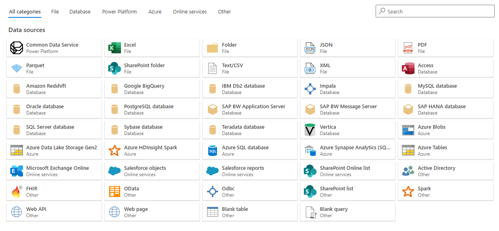
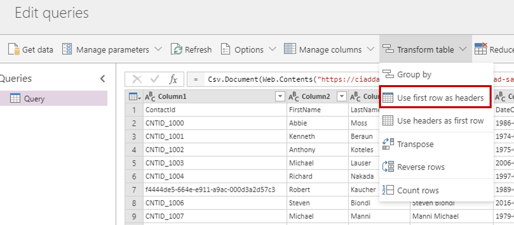
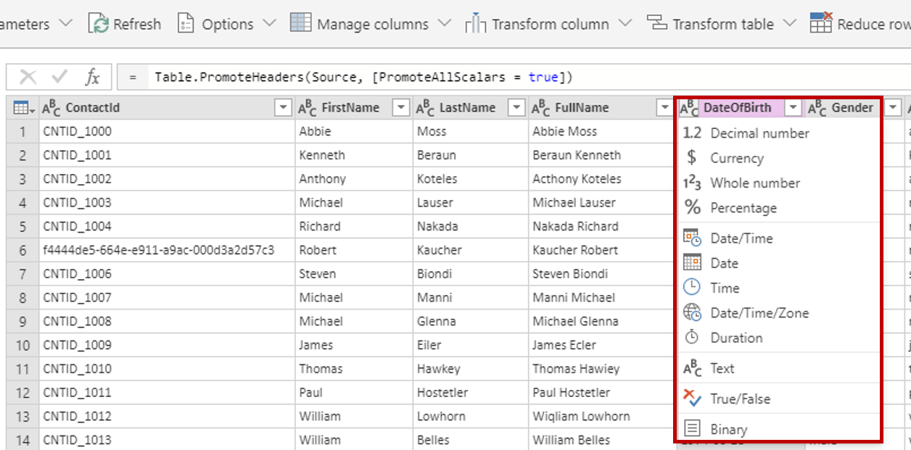
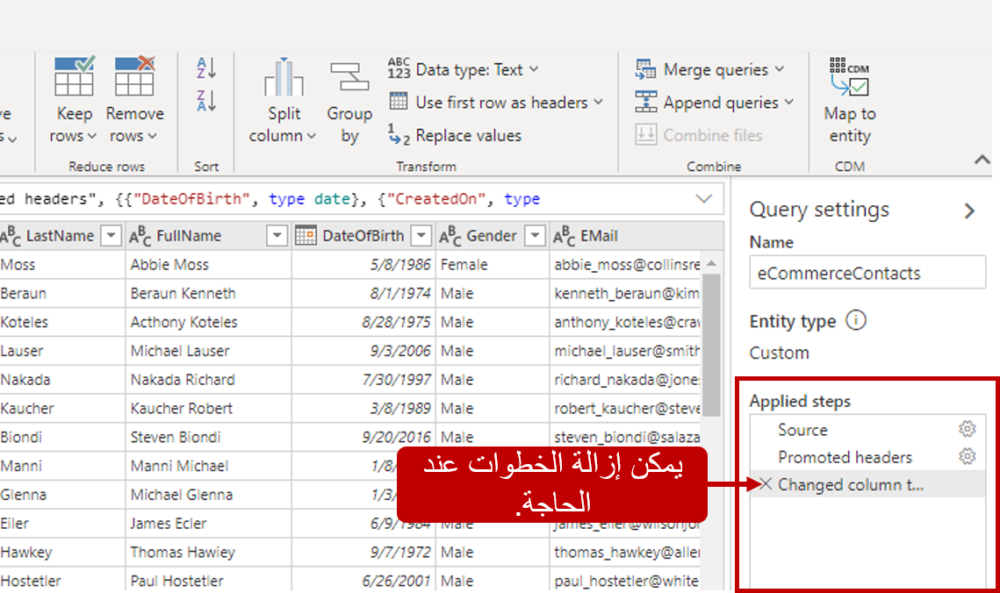

قبل أن تبدأ عملية [استيعاب البيانات في Customer Insights](/dynamics365/customer-insights/audience-insights/data-sources/?azure-portal=true)، عليك تحديد أفضل طريقة لاستخدامها في جمع البيانات. سيختلف هذا اعتمادًا على عوامل مثل حجم البيانات التي يتم استيعابها ومقدار تحويل البيانات المطلوب. في السيناريوهات التي تتطلب قدراً كبيراً من تحويل البيانات أو عندما تريد الاتصال بمصادر غير Common Data Model أو Dataverse، فغالبًا ما يكون استيراد البيانات الخيار الأفضل.

يوفر خيار الاستيراد أكبر قدر من المرونة حيث يستخدم Power Query. يمثل Power Query تقنية من Microsoft لاتصال البيانات وإعداد البيانات يتم استخدامها للوصول إلى البيانات وإعادة تشكيلها من مئات مصادر البيانات. للحصول على المزيد من المعلومات حول استخدام Power Query: [ما هو Power Query؟](/power-query/power-query-what-is-power-query/?azure-portal=true) إنه يتضمن حوالي 40 موصلاً مختلفاً للاتصال بمصادر بيانات مثل Excel وOracle وOData وAzure والمزيد.

> [!div class="mx-imgBorder"]
> 

تجدر الإشارة إلى أنه يتم نسخ البيانات إلى مستودع بياناتك في Customer Insights عند [استيعاب البيانات باستخدام خيار الاستيراد](/dynamics365/customer-insights/audience-insights/connect-power-query/?azure-portal=true). وبحسب حجم البيانات، قد يتطلب ذلك مساحة تخزين إضافية لدعمها. ستحتاج إلى التأكد من إمكانية الوصول إلى البيانات التي تريد استيرادها لأن الموصلات المختلفة قد تتطلب تكويناً ومصادقة مختلفين. على الرغم من أن Customer Insights يستخدم Power Query، فإن جميع الموصلات التي يدعمها Power Query لا تسمح لك بإحضار البيانات إلى Customer Insights. يجب أن تكون على دراية بمختلف الخيارات المتاحة بالاستناد إلى الموصل الذي تحدده. تتوفر قائمة كاملة تتضمن [موصلات وإمكانات Power Query](/power-query/connectors/?azure-portal=true).

## تحويل البيانات

تتمثل إحدى المزايا الرئيسية لاستيراد البيانات باستخدام Power Query في القدرة على تنفيذ عملية تحويل البيانات. يتم استخدام تحويل البيانات لتغيير البيانات إلى الشكل المناسب بحيث يمكن استخدامها في اختبار أو طريقة إحصائية. من وجهة نظر Customer Insights، تحتاج البيانات عادةً إلى تحويلها لضمان إمكانية استخدامها بشكل مناسب من خلال ميزات التطبيق مثل الأنشطة والمقاييس. فمثلاً ، تعتمد الأنشطة بشكل كبير على التواريخ، وبالتالي فإذا كنت تنوي استخدام بيانات للأنشطة، فستحتاج إلى التأكد أن مجموعة البيانات تحتوي على حقل بيانات واحد على الأقل. ستكون بحاجة إلى حقل رقمي للحقول التي يمكن استخدامها في العمليات الحسابية أو كمقاييس مثل حساب التكلفة الإجمالية لشيء ما.

أثناء عملية الاستيراد، يمكنك تعديل إعدادات التكوين مثل المحدد المستخدَم (بناءً على مصدر البيانات المحدد). تسمح لك منطقة المعاينة بتعديل بعض هذه الإعدادات قبل أن تبدأ عملية التحويل. رغم أن كل موقف سيكون فريدًا، إلا أن هناك بعض خطوات التحويل القياسية التي يجب عليك مراعاتها.

ننصح بشدة بهذه التحويلات:

-   **استخدام الرؤوس كصف أول** - إذا كنت تستوعب البيانات من ملف CSV، فيمكنك استخدام الصف الأول من ملف CSV كمعلومات للرأس. حدد جدول التحويل، وسترى خيار التبديل بين استخدام الصف الأول كرؤوس أو استخدامه كبيانات.

-   **تعيين بياناتك إلى تنسيق بيانات قياسي** - يسمح لك Customer Insights بتعيين بياناتك إلى Common Data Model. Common Data Model (CDM)‎ عبارة عن مجموعة قياسية وقابلة للتوسيع من المخططات (الكيانات والسمات والعلاقات) التي تمثل مفاهيم وأنشطة الأعمال مع دلالات محددة جيدًا، لتسهيل إمكانية التشغيل البيني للبيانات. تتضمن أمثلة الكيانات: "الحساب" و"جهة الاتصال" و"العميل المحتمل" و"الفرصة" و"المنتج" وغير ذلك. للقيام بذلك، انتقل إلى التعيين إلى المعيار، ثم قم بتعيين الحقول من بيانات المصدر إلى حقول Common Data Model.

-   **تعديل أنواع بيانات الحقل** - سيكون لكل حقل به مجموعة بيانات نوع بيانات مرتبط به.

> [!div class="mx-imgBorder"]
> 

## المزيد من أنواع البيانات

كما ذكرنا سابقاً، يؤثر نوع البيانات المرتبط بالحقل بشكل مباشر على كيفية استخدام العنصر وتعقبه في Customer Insights. قد يؤدي الفشل في تحديد أنواع البيانات بشكل صحيح إلى عدم قدرتك على إنشاء أنشطة أو مقاييس. بناءً على المكان الذي تتواجد فيه في العملية، فقد يؤدي ذلك إلى العديد من عمليات التكوين، في حين أنه من الممكن تعديل هذه المعلومات لاحقًا. من المهم أن تقضي بعض الوقت للتأكد أن كل عنصر لديه نوع البيانات المناسب المقترن به.

> [!div class="mx-imgBorder"]
> 

تأمل المثال التالي. يمثل الجدول مثالاً لجدول الحركات الذي يحتوي على بيانات، والتي تمثل عمليات الشراء التي تم إجراؤها على موقع ويب الشركة. يحتوي على معرّف العميل الذي أجرى عملية الشراء وتاريخ الشراء والسعر الإجمالي للشراء.

|     معرّف العميل    |     تاريخ الشراء    |     السعر الإجمالي    |
|----------------------|------------------------|----------------------|
|     1005             |     11/1/2019          |     259.95           |
|     1006             |     11/5/2019          |     350.00           |
|     1007             |     11/10/2019         |     425.99           |

للتأكد أنه يمكننا استخدام البيانات من هذا الجدول بشكل مناسب، نحتاج إلى التأكد من قدرتنا على تعيين نوع البيانات الصحيح للحقول المناسبة.

في المثال أعلاه، قد نقوم بتعيين أنواع البيانات للحقول على النحو المذكور أدناه:

-   **معرّف العميل** - نظرًا لأن هذه قيمة نصية، يمكننا تركها كحقل نصي.

-   **تاريخ الشراء** - من المحتمل أن يتم استخدام هذا لتمثيل النوافذ الزمنية، لذا نرغب في تعيين هذا الحقل على نوع من أنواع البيانات ذات الصلة بالتاريخ.

    -   **التاريخ** - يخزن فقط التاريخ الذي تمت فيه الحركة.

    -   **التاريخ / الوقت** - يخزن تاريخ الشراء ووقته.

    -   **التاريخ / الوقت / المنطقة** - يخزّن التاريخ والوقت وتفاصيل المنطقة الزمنية.

        في مثالنا، يمكن ضبطه على التاريخ لأننا نحتاج فقط إلى تخزينه كتاريخ وليس هناك ضرورة لبيانات متعلقة بالوقت.

-   **السعر الإجمالي** - من المحتمل أن يتم تعيين هذا كعُملة لتمثيل مبلغ بالدولار.

تأكد من مراجعة كل حقل، خاصةً إذا كنت متصلاً بمصدر بيانات يستند إلى نص لضمان تعيين كل شيء بصورة مناسبة.

كما هو الحال مع أي شيء، من الممكن ارتكاب أخطاء أثناء عملية تحويل البيانات مثل تحديد نوع البيانات الخطأ. أثناء إجراء تغييرات على مجموعة بيانات، يتم تعقب هذه التغييرات في قسم "الخطوات المطبقة" ضمن قسم إعدادات الاستعلام على الجانب الأيمن من شاشة استعلامات التحرير. يمكن استخدام الخطوات المطبقة لتحرير أية خطوات تم تنفيذها أو إزالتها بحسب الحاجة.

> [!div class="mx-imgBorder"]
> 

تحتوي إعدادات "الاستعلام" أيضًا على حقل اسم يمكنك استخدامه لتسمية الاستعلام الذي تعمل معه. بمجرد الانتهاء من تغييرات الاستعلام، يمكنك تحديد التالي لحفظ تغييرات مجموعة بياناتك.

> [!VIDEO https://www.microsoft.com/videoplayer/embed/RWFVs7]

لمزيد من المعلومات حول الاستيراد باستخدام Power Query، راجع [الاستيراد باستخدام Power Query](/dynamics365/customer-insights/audience-insights/connect-power-query/?azure-portal=true).
