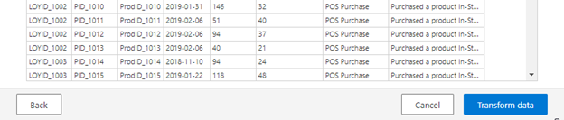
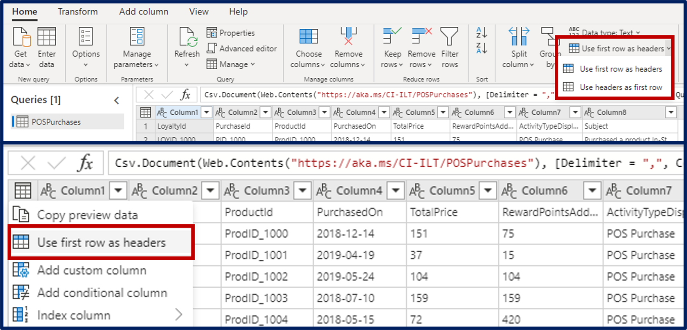
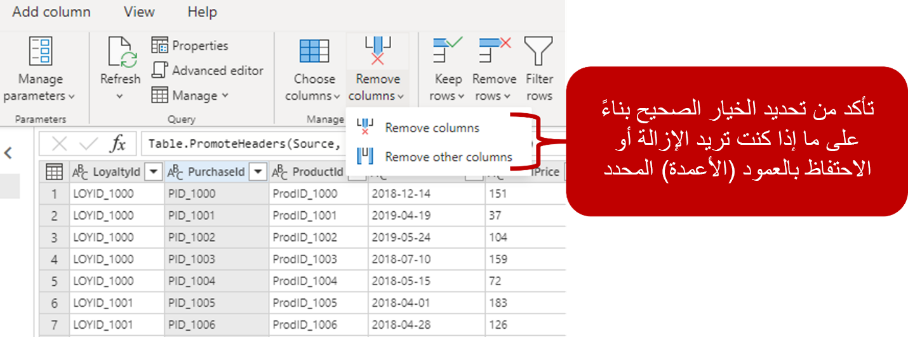
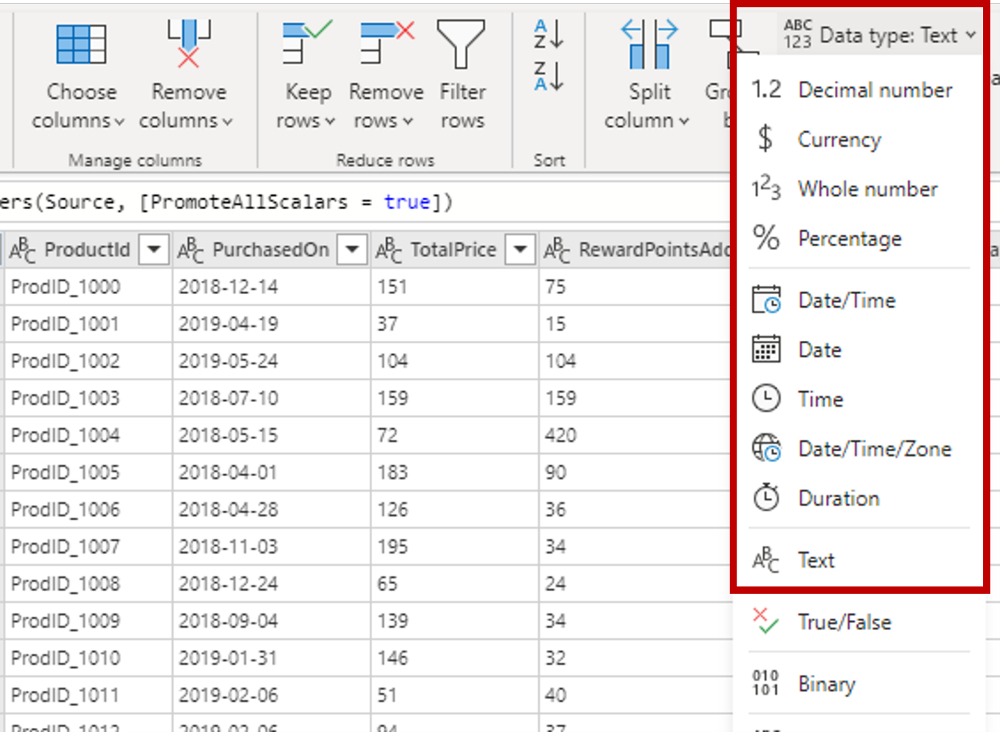
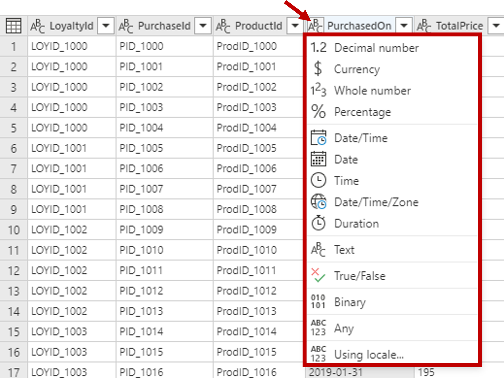
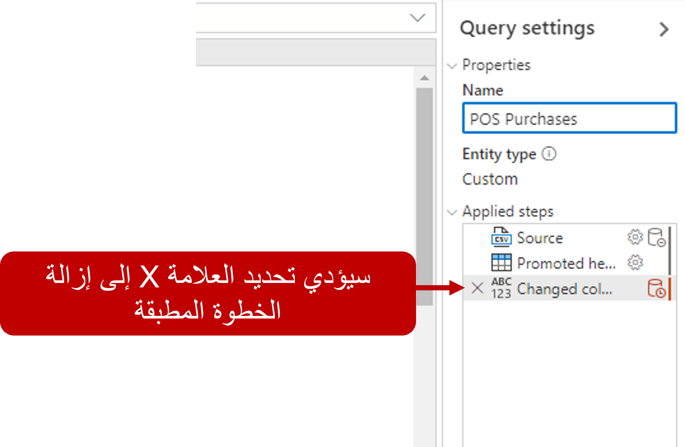
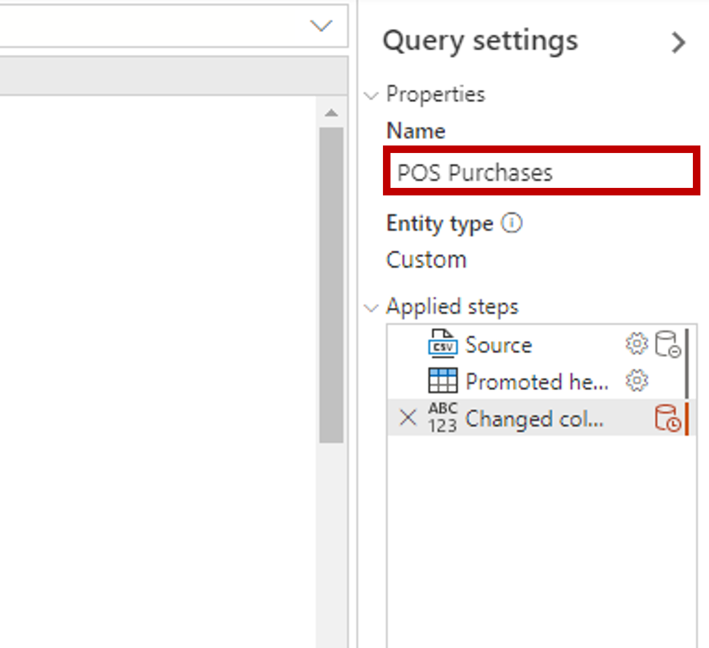

عند استخدام Power Query لاستيعاب البيانات في Customer Insights، يمكنك استخدام قدرات تحويل البيانات المتاحة لتشكيل بياناتك حسب الحاجة للحصول على أفضل تجربة في التطبيق. بعد تحديد موصل Power Query، قم بتعريف مصدر البيانات المراد استخدامه وتوصيله، ويمكنك البدء في تشكيل البيانات الخاصة بك. حدد خيار تحويل البيانات في أسفل الشاشة لفتح مصمم Power Query.

> [!div class="mx-imgBorder"]
> 

> [!IMPORTANT]
> يحتوي شريط Power Query Editor على العديد من الأزرار التي يمكنك استخدامها لتحديد البيانات الخاصة بك وعرضها وتشكيلها. لمعرفة المزيد حول الميزات والوظائف المتوفرة، راجع [شريط الاستعلام](/power-query/power-query-quickstart-using-power-bi?azure-portal=true#the-query-ribbon).

## تحديد رؤوس الأعمدة وأسماؤها

الخطوة الأولى في تشكيل بياناتك الأولية هي تحديد رؤوس الأعمدة والأسماء داخل البيانات، ثم تقييم مكان وجودها للتأكد من وجودها في المكان الصحيح. عند إحضار البيانات، يفترض محرر Power Query أن جميع البيانات تنتمي إلى صفوف الجدول. ومع ذلك، قد يحتوي مصدر البيانات على صف أول يحتوي على أسماء الأعمدة. لتصحيح عدم الدقة، يجب ترقية صف الجدول الأول إلى رؤوس الأعمدة.

يمكنك ترقية الرؤوس بطريقتين:

-   حدد خيار استخدام الصف الأول كرؤوس في علامة التبويب الصفحة الرئيسية.

-   حدد زر القائمة المنسدلة بجانب Column1، ثم حدد استخدام الصف الأول كرؤوس. 

> [!div class="mx-imgBorder"]
> 

## إعادة تسمية الأعمدة

عندما تأتي بياناتك، قد تجد أن عموداً واحداً أو أكثر له اسم غير صحيح، أو يحتوي على خطأ إملائي أو أنه ليس مألوفاً بالنسبة للمستخدمين. في تلك الحالات، يمكنك إعادة تسمية الأعمدة حسب الحاجة.  

يمكن إعادة تسمية الأعمدة بطريقتين:

-   انقر بزر الماوس الأيمن فوق رأس العمود وحدد إعادة تسمية.

-   انقر نقراً مزدوجاً فوق رأس العمود واكتب الاسم الصحيح فوق الاسم. 

## قم بإزالة الأعمدة 

تتمثل إحدى الخطوات الأساسية في عملية تشكيل البيانات في إزالة الأعمدة غير الضرورية. من الأفضل إزالة الأعمدة في مرحلة مبكرة من العملية وليس لاحقاً، وخاصةً عندما تقوم بإنشاء علاقات بين الجداول الخاصة بك.  

يمكنك إزالة الأعمدة بطريقتين:

-   حدد الأعمدة التي ترغب في إزالتها.

    -   ضمن علامة التبويب الصفحة الرئيسية، حدد إزالة أعمدة. 

-   حدد الأعمدة التي ترغب في الاحتفاظ بها.

    -   ضمن علامة التبويب الصفحة الرئيسية، حدد إزالة أعمدة ثم اختر إزالة الأعمدة الأخرى.

> [!div class="mx-imgBorder"]
> 

## تغيير نوع بيانات العمود

يمكن أن تؤثر أنواع البيانات التي تم تخزينها في الأعمدة على جوانب مختلفة لما يمكنك فعله بالبيانات في Customer Insights. على سبيل المثال، إذا كنت تقوم بإنشاء مقطع ستقوم بتحديد العملاء الموجودين ضمن نطاق عمر معين، فمن المهم تنسيق عمود تاريخ الميلاد إلى تاريخ. وإذا لم يكن كذلك، فلن يتمكن النظام من استخدام تعبيرات البيانات للتحقق من عمر العميل. وهذا مهم أيضاً عندما تخطط لإجراء العمليات الحسابية، مثل تحديد المبلغ الذي قد ينفقه شخص ما.

وليس من غير المألوف أن تحتوي البيانات الموجودة في البداية على نوع بيانات خاطئ مقترن بها. على سبيل المثال، عند الاتصال بملف CSV/Text، فمن المحتمل أن يتم تعيين نوع بيانات نصية لجميع الأعمدة التي تم تحميلها. في حالة عدم التأكد من أن كل عمود يحتوي على نوع البيانات الصحيح، فقد نواجه مشكلات في المستقبل. يمكن تعديل أنواع البيانات بطريقتين.

الطريقة الأولى هي تحديد العمود الذي توجد به المشكلة المقترنة به. على شريط الصفحة الرئيسية، حدد القائمة المنسدلة نوع البيانات في علامة التبويب التحويل ثم حدد نوع البيانات الصحيح من القائمة.

> [!div class="mx-imgBorder"]
> 

والطريقة الثانية لتعديل أنواع البيانات هي تحديد رمز نوع البيانات بجوار عنوان العمود، ثم تحديد نوع البيانات الصحيح من القائمة.

> [!div class="mx-imgBorder"]
> 

تتمثل إحدى مزايا Power Query في تخزين أي تغييرات تقوم بإجرائها على البيانات على أنها الخطوات التي يتم تطبيقها. في كل مرة تتصل فيها بالاستعلام، يتم تطبيق التغييرات التي أجريتها أثناء التحويل. ويضمن ذلك ان الاستعلام الخاص بك هو نفسه في كل مرة. ويتم حفظ أي تغييرات أخرى تقوم بإجرائها على الأصناف، مثل أنواع بيانات الأعمدة كخطوة تتم برمجتها. إذا وجدت أنك بحاجة إلى إزالة خطوة تم تطبيقها، يمكنك تحديد خيار الحذف بجوار الخطوة في مربع الخطوات المطبقة.

> [!div class="mx-imgBorder"]
> 

## إعادة تسمية الاستعلام

في البداية عند إنشاء الاستعلام الخاص بك، سيكون له اسم عام. من الأفضل تغيير أسماء الاستعلام غير الشائعة أو غير المفيدة إلى أسماء أكثر وضوحاً، أو تكون مألوفة بالنسبة للمستخدم.  على سبيل المثال، إذا كنت تقوم باستيراد مشتريات من نظام نقطة البيع، فقد ترغب في تسمية الاستعلام بشيء مثل مشتريات نقطة البيع.

> [!div class="mx-imgBorder"]
> 

بمجرد أن يتم تشكيل البيانات التي تريدها، يمكنك تحديد زر التالي لحفظ الاستعلام وبدء عملية الاستيعاب.
