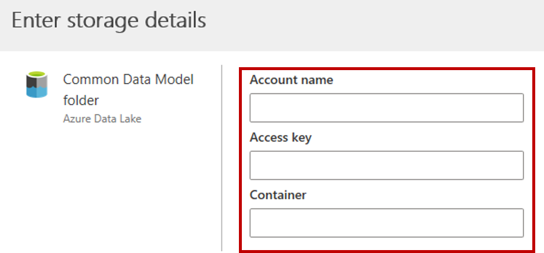
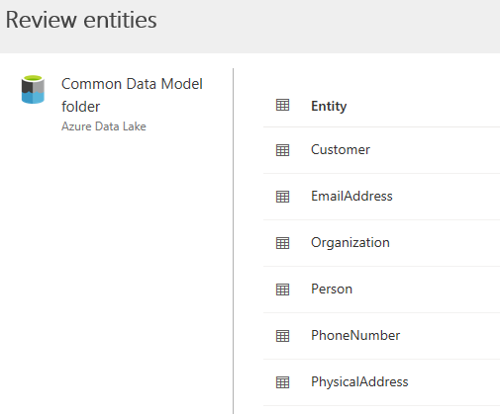
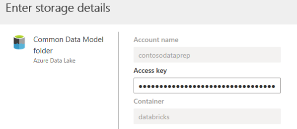

كما رأينا في الوحدة السابقة، فان استخدام Power Query لاستيراد البيانات هو سيناريو مثالي عندما يكون لديك بيانات قد تحتاج إلى ETL (استخراج، تحويل، تحميل) قبل أن يصبح استخدامها ممكناً. علاوةً على ذلك، يُعد الاستيراد باستخدام Power Query خياراً مفيداً عند التعامل مع أقل من 5 ملايين من السجلات وثمة حاجة إلى إجراء عملية تحويل معقدة للبيانات. هناك خيار آخر لاستيعاب البيانات وهو الاتصال بـ Common Data Model. وعلى عكس الاستيراد باستخدام Power Query، يمكن استخدام نماذج Common Data Model لدعم أحجام البيانات الصغيرة والكبيرة معاً ويتم استخدامها في سيناريوهات لا تحتاج إلى ETL (استخراج، تحويل، تحميل). 

> [!NOTE]
> إذا كانت عمليات ETL (استخراج، تحويل، تحميل) مطلوبة لمصادر Common Data Model، فيجب التعامل معها خارج Customer Insights وتنفيذها قبل استيعاب البيانات. يمكن تنفيذها عبر تطبيقات مثل Azure Data Factory/Databricks/HDInsight. 

## أمور يجب مراعاتها قبل تقرير استخدام Common Data Model

بخلاف استيراد البيانات، لا يؤدي الاتصال بمجلد Common Data Model إلى نسخ البيانات إلى Customer Insights. بالإضافة إلى ذلك، يدعم استيعاب بيانات Common Data Model حسابات تخزين Azure Data Lake Gen2 بشكل حصري. لا يمكنك استخدام حسابات تخزين Azure Data Lake Gen1 لاستيعاب البيانات. يجب أن تتبع البيانات الموجودة في Azure Data Lake معيار CDM. لم تكن التنسيقات الأخرى مدعومة عندما تم نشر هذه الوحدة (نوفمبر 2020).

> [!IMPORTANT]
> يجب أن يكون Azure Data Lake الذي ستتصل به وستستوعب البيانات منه موجوداً في منطقة Azure نفسها حيث بيئة Dynamics 365 Customer Insights. يمكنك الاتصال بمجلد Common Data Model من Azure Data Lake في منطقة Azure مختلفة. ويمكنك العثور على منطقة Azure لبيئة Customer Insights عن طريق الوصول إلى "حول" من "إعدادات النظام".

## الاتصال بمجلد Common Data Model

يبدأ إجراء استيعاب البيانات من Common Data Model تماماً كأي إجراء آخر لاستيعاب البيانات. للاتصال بـ Common Data Model، ستحتاج إلى توفير ما يلي:

-   **اسم الحساب**

-   **مفتاح الوصول**

-   **الحاوية** 

> [!div class="mx-imgBorder"]
> 

ستحتاج إلى تحديد model.json الذي تريد استيراد البيانات منه. ستتمكن فقط من تحديد ملفات model.json من مجلد Common Data Model. ولن يظهر في القائمة أي ملف model.json مقترن بمصدر بيانات آخر في المثيل. بعد تحديده، سيتم تزويدك بقائمة الكيانات المتاحة في ملف model.json. ويمكنك تحديد الكيانات التي تريد استيعابها من مصدر البيانات.

> [!div class="mx-imgBorder"]
> 

> [!NOTE]
> بإمكان ملف model.json أن يقترن بمصدر بيانات واحد فقط في المثيل نفسه. ومع ذلك، يمكن استخدام ملف model.json نفسه لمصادر البيانات في مثيلات متعددة.

## تحرير مصدر بيانات مجلد نموذج بيانات عامة

من الممكن إجراء تغييرات على مجلد Common Data Model. ويمكنك تحديث مفتاح الوصول لحساب التخزين الذي يحتوي على مجلد Common Data Model، وتغيير ملف model.json. إذا أردت الاتصال بحاوية مختلفة في حساب التخزين نفسه أو تغيير اسم الحساب، فيمكنك [إنشاء اتصال مصدر بيانات جديد](/dynamics365/customer-insights/audience-insights/connect-common-data-model.md?azure-portal=true#connect-to-a-common-data-model-folder).

> [!div class="mx-imgBorder"]
> 

لمزيد من الإرشادات التفصيلية حول العمل مع Common Data Model، راجع [Common Data Model](/dynamics365/customer-insights/audience-insights/connect-common-data-model/?azure-portal=true).

