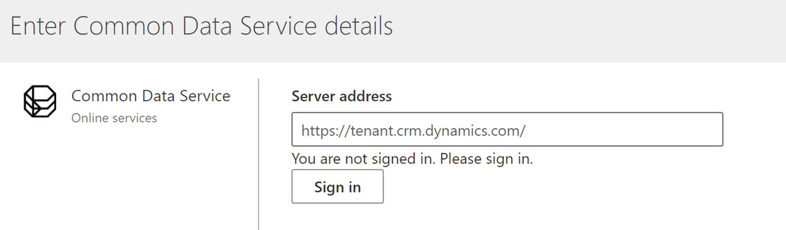
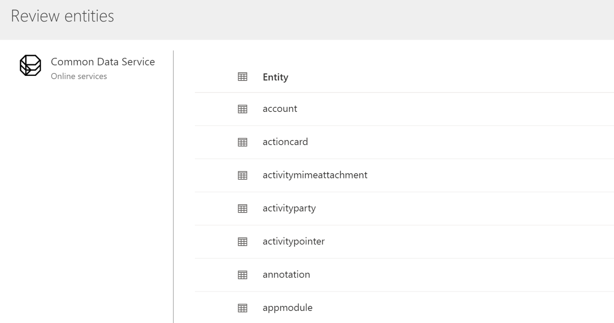

من المحتمل أن يكون لدى العملاء الذين يستخدمون تطبيقات Dynamics 365 مثل Dynamics 365 Sales أو Customer Service أو Marketing ملف تعريف عميل أو بيانات متعلقة بالنشاط موجودة في مثيل Microsoft Dataverse الخاص بهم يريدون استيعابها في رؤى الجمهور. فمثلاً، قد يكون لديك معلومات عن الفرصة أو الحالة التي ترغب في استيعابها باعتبارها أنشطة عميل يمكن عرضها على شاشة ملف تعريف العميل. قد يكون لديك أيضًا بعض المعلومات الإضافية حول كيان الاتصال الذي يجب تضمينه كجزء من ملف التعريف الشخصي الموحد. بغض النظر عن البيانات اللازمة، يسهّل رؤى الجمهور على المسؤولين في مؤسسة Dataverse الاتصال بسرعة بكياناتهم التحليلية في مستودع Dataverse المُدار.

مثلما ناقشنا في وحدة "نموذج البيانات العامة"، فإن استخدام Dataverse كمصدر بيانات مدعوم لكل من حجمي البيانات الصغيرة والكبيرة. يجب معالجة "الاستخراج" و"التحويل" و"التحميل" (ETL) خارج رؤى الجمهور باستخدام أدوات مثل Azure Data Factory أو Databricks. 

## أشياء يجب مراعاتها قبل اتخاذ قرار باستخدام Dataverse

مثل الاتصال بمجلد Common Data Model، [لا يؤدي الاتصال بـ Dataverse](/dynamics365/customer-insights/audience-insights/connect-common-data-service-lake/?azure-portal=true) إلى نسخ البيانات إلى Customer Insights. عند الاتصال، ستحتاج إلى توفير **عنوان الخادم** لمؤسسة Dataverse. اعتمادًا على منطقتك الجغرافية، يمكن أن يختلف العنوان. فمثلاً، للاتصال بمثيل Dataverse في الولايات المتحدة، قد يكون عنوان URL لخادمك مشابهًا لما يلي: 'https://instancename.crm.dynamics.com'. ستحتاج إلى الاتصال بمثيل Dataverse بحساب له امتيازات إدارية.

> [!div class="mx-imgBorder"]
> 

بمجرد المصادقة على مصدر البيانات، يمكنك تحديد الكيانات التي تريد استيعابها من القائمة المتاحة. من المحتمل أن يكون هذا بسبب استخدامها بواسطة تطبيقات Dynamics 365 الأخرى مثل Dynamics 365 Sales Insights، إذا لاحظت أن بعض الكيانات محددة بالفعل. لا يُسمح لك بتعديل التحديد. ستكون الكيانات متاحة بمجرد إنشاء مصدر البيانات.

> [!div class="mx-imgBorder"]
> 

بعد حفظ مصدر البيانات، سيبدأ في مزامنة الكيانات المحددة مع مستودع Dataverse المُدارة. يمكن لمصدر بيانات واحد فقط للمثيل استخدام نفس المستودع المُدار من Dataverse في نفس الوقت.

لمزيد من المعلومات، راجع [Dataverse](/dynamics365/customer-insights/audience-insights/connect-common-data-service-lake/?azure-portal=true).

