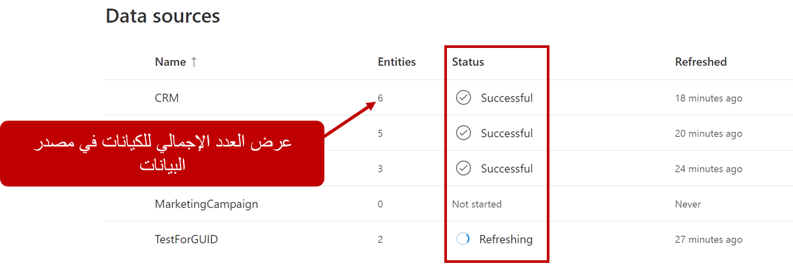
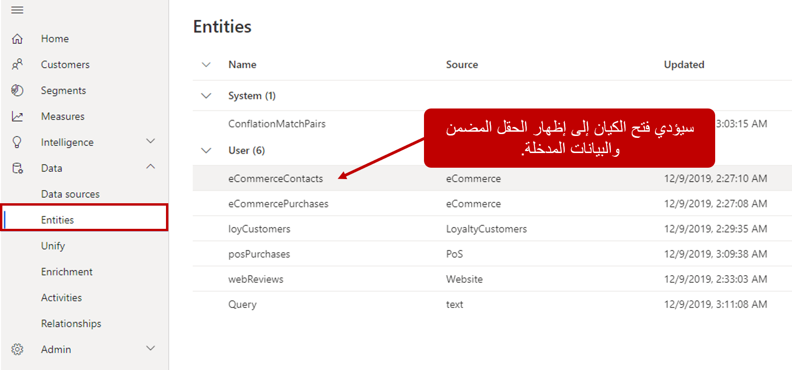

سيبدأ مصدر البيانات في استيعاب البيانات، بمجرد تحديد مجموعات البيانات الخاصة بك وحفظها لأول مرة. سيتم تحديث أي مجموعة بيانات في مصدر البيانات، أثناء عملية التحديث. يمكن رؤية حالة تحديث مصادر البيانات من صفحة **مصادر البيانات**. من **مصادر البيانات**، سترى اسم كل مصدر بيانات تم إدخاله، وعدد الكيانات (مجموعات البيانات) التي يحتويها، وآخر مرة تم فيها تحديث البيانات لمصدر البيانات هذا وحالة مصدر البيانات.

> [!div class="mx-imgBorder"]
> 

هناك [حالات متعددة](/dynamics365/customer-insights/audience-insights/data-sources.md?azure-portal=true#review-ingested-data) يمكن عرضها لمصدر بيانات:

-   **ناجح:** تم استيعاب مصدر التاريخ بنجاح. سيتم ذكر الوقت في العمود المحدّث.

-   **لم يتم البدء:** لم يتم إدخال أي بيانات لمصدر البيانات حتى الآن أو أنه لا يزال في وضع المسودة.

-   **جارٍ التحديث:** جارٍ استيعاب البيانات. يمكنك إلغاء هذه العملية بتحديد إيقاف التحديث في عمود "الإجراءات". سيؤدي إيقاف تحديث مصدر البيانات إلى إعادته إلى آخر حالة تحديث له.

-   **فشل:** حدثت أخطاء في عرض البيانات.

-   **تم الإلغاء:** تم إلغاء عملية تحديث البيانات.

يمكن تحديث مصدر البيانات يدويًا عن طريق تحديد مصدر البيانات وتحديد أيقونة التحديث. إذا كنت تريد إجراء تغييرات على مصادر البيانات، فحدد اسم مصدر البيانات وحدد رمز التحرير (القلم الرصاص) لإجراء تغييرات على مصدر البيانات. ستختلف الشاشة التي ستنتقل إليها، اعتماداً على نوع مصدر البيانات الذي تعمل معه. سيتم نقلك مرة أخرى إلى محرر Power Query، لإجراء أي تغييرات ضرورية، إذا قمت باستيراد البيانات باستخدام Power Query. إذا كنت قد استفدت من Common Data Model أو Microsoft Dataverse، فسيتم نقلك إلى شاشة الاتصال، حيث يمكنك متابعة الخطوات السابقة وتعديلها على النحو المطلوب. لحذف مصدر بيانات، حدد مصدر البيانات وحدد "حذف".

> [!NOTE]
> لا يمكنك حذف مصدر البيانات إذا تم استخدامه في ملف تعريف العميل الموحد، في الأنشطة، والمقاييس، وغير ذلك. ستحتاج إلى إزالة المرجع إليه من هذه الأصناف قبل إزالته من النظام.

## مراجعة البيانات التي تم إدخالها

في المرة الأولى التي تقوم فيها بإدخال البيانات من مصدر بيانات، من المحتمل أن يستغرق تحميل البيانات بعض الوقت. بعد إدخال البيانات بنجاح، يمكن [مراجعتها من صفحة "الكيانات"](/dynamics365/customer-insights/audience-insights/entities/?azure-portal=true). يمكنك الوصول إلى صفحة الكيان من قسم الكيانات وتحديد العنصر الذي تريد عرضه. سيعرض الكيان كلاً من البيانات التي تم إدخالها من الكيان والحقول التي تم تضمينها في الكيان.

> [!div class="mx-imgBorder"]
> 

> [!VIDEO https://www.microsoft.com/videoplayer/embed/RWFVs8]

لمزيد من المعلومات، راجع [كيانات Customer Insights](/dynamics365/customer-insights/audience-insights/entities/?azure-portal=true).

الآن وبعد أن نجحت في إدخال البيانات في Customer Insights، لنقم بفحص بعض الخيارات المختلفة للحفاظ على البيانات الحالية.

