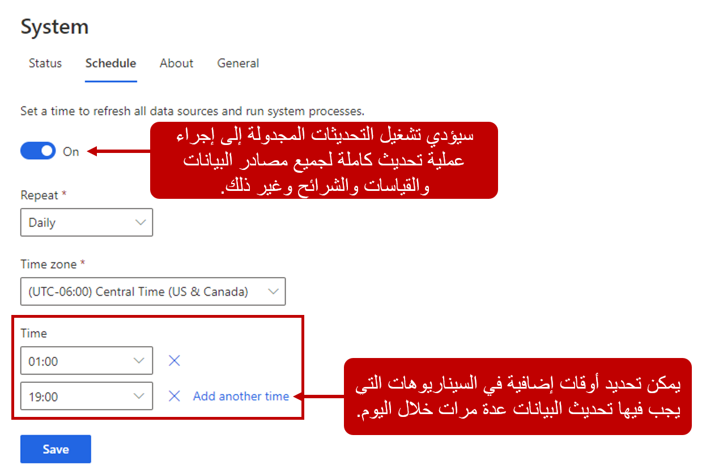
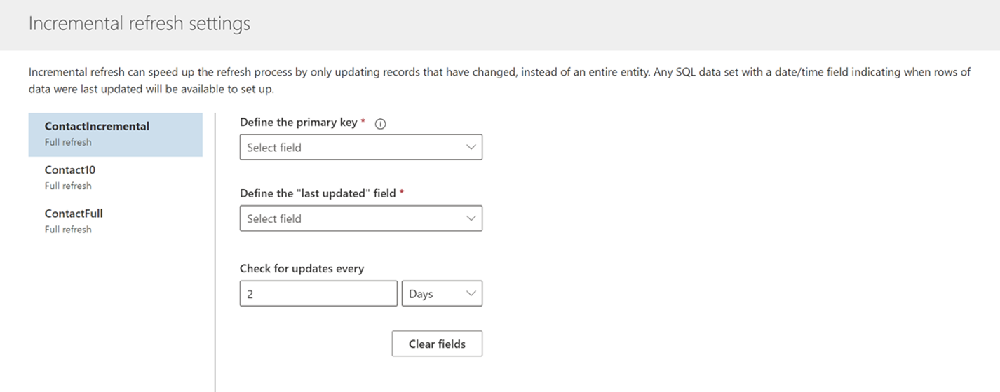

كما ذكرنا في الوحدة السابقة، سواء كنت تستورد البيانات باستخدام Power Query أو تستوعب البيانات من Common Data Model أو Microsoft Dataverse، لا يتم تحديث مصادر البيانات بشكل تلقائي. إذا أردت أن تتأكد من توفر البيانات الجديدة من مصادر بياناتك في "رؤى الجمهور"، فستحتاج إلى تحديثها يدوياً. بعد تحديث بياناتك، ستظهر المعلومات الجديدة في الكيانات. بعد إكمال عملية توحيد البيانات، تقوم عملية التحديث أيضاً بتحديث أي شرائح وقياسات وأنشطة وإثراء وبحث وإعداد بيانات ورؤى تم تكوينها في التطبيق.

لا يُعد تحديث البيانات يدوياً سيناريو مثالياً لمعظم المؤسسات. لكي تكون "رؤى الجمهور" فعالة قدر الإمكان لمؤسستك، يجب أن تكون البيانات في حالة محدّثة قدر الإمكان. بإمكان ذلك أن يساعد على ضمان حصول المؤسسة على أوضح صورة ممكنة لعملائها. وللمساعدة في ذلك، توفر "رؤى الجمهور" خيارات متعددة لتحديث مصادر البيانات.

تتضمن هذه الخيارات:

-   **عمليات تحديث البيانات المجدولة** - تحديث جميع مصادر البيانات وفق جدول محدد بشكل مسبق.

-   **تحديث تزايدي** - تحديث مجموعات فرعية أصغر من البيانات لمصدر بيانات بالاستناد إلى إعدادات التحديث التزايدي المكوّن.

-   **استيعاب البيانات في وقت قريب من الوقت الحقيقي** - يسمح باستيعاب معلومات ملف التعريف والنشاط في وقت قريب من الوقت الحقيقي.

## تحديث مجدول

إن أسهل طريقة لتحديث البيانات بشكل تلقائي هي إعداد عمليات تحديث مجدولة. يتم تكوين عمليات التحديث المجدولة عن طريق تحديد **النظام** أسفل عنوان الإدارة في شريط التنقل في التطبيق. يمكنك تعديل الجدول من علامة تبويب **الجدول**. وستؤثر عمليات التحديث المجدولة، عند تمكينها، على جميع مصادر البيانات. فهي لن تقوم بتحديث البيانات فحسب، بل ستقوم أيضاً بتحديث جميع العناصر التي تم تكوينها، مثل الشرائح والقياسات والأنشطة والإثراء والبحث وإعداد البيانات والرؤى.

ستحتاج إلى توفير الخيارات التالية:

-   **مدى التكرار** - تحديد مدى تكرار تحديث البيانات. يمكن تحديث البيانات يومياً أو أسبوعياً. يؤدي تحديد "أسبوعياً" إلى السماح لك بتحديد أيام معينة يجب أن يتم تشغيل الجدول فيها.

-   **المنطقة الزمنية** - تحديد المنطقة الزمنية التي يتم تشغيل المهمة فيها.

-   **الوقت** - تحديد الوقت الذي تريد فيه حدوث عملية التحديث. إذا أردت تريد حدوث عمليات التحديث مرات متعددة في اليوم، فيمكنك إضافة أوقات إضافية.

> [!div class="mx-imgBorder"]
> 

> [!IMPORTANT]
> تقوم عمليات التحديث المجدولة بتنفيذ عملية تحديث كاملة للبيانات على "جميع" مصادر البيانات التي تم تكوينها. لا يمكن تكوين جداول مختلفة لمصادر بيانات مختلفة. تتضمن عمليات التحديث المجدولة عادةً عدداً كبيراً من السجلات وعدة عمليات معقدة.

عند تشغيل عمليات تحديث مجدولة، يحدث ما يلي:

1.  تُسحب البيانات من مصدر البيانات.

1.  يتم توحيد البيانات.

1.  يتم إثراء البيانات بواسطة معلومات إضافية.

بإمكان عمليات التشغيل المجدولة أن تتراوح من دقائق إلى ساعات، وهذا يتوقف على عوامل مثل عدد مصادر البيانات وحجم البيانات.

## تحديث تزايدي

لا تتوفر عمليات التحديث التزايدية لجميع أساليب الاستيعاب. في الوقت الحالي، وحدها مصادر البيانات المستوردة باستخدام Power Query تدعم الاستيعاب التزايدي. تم التخطيط لدعم الاستيعاب التزايدي للاتصالات بـ Common Data Model. لا تدعم جميع مصادر البيانات التي تم استيرادها من خلال Power Query التحديث التزايدي. ستحتاج إلى التحقق من انه مسموح به لمصدر البيانات الذي تستخدمه. عندما تحدد مصدر بيانات يسمح بالتحديث التزايدي مثل قاعدة بيانات Azure SQL، سيتم تزويدك بإعدادات التحديث التزايدي كي تقوم بتكوينه بعد تحويل بياناتك. ستتمكن من تعديل إعدادات التحديث لجميع الكيانات التي تم تحديدها عندما أنشأت مصدر البيانات.

توفر بيانات التحديث التزايدي الميزات التالية:

-   **عمليات تحديث أسرع** - يتم تحديث البيانات التي تغيّرت فقط.

-   **موثوقية متزايدة** - بسبب الحجم الصغير لعمليات التحديث، من غير الضروري أن تتم صيانة الاتصالات بأنظمة المصدر المتنقلة لفترة طويلة، مما يقلل من خطر حدوث مشاكل في الاتصال.

-   **استهلاك مخفض للموارد** - يؤدي تحديث مجموعة فرعية فقط من بياناتك الإجمالية إلى استخدام موارد الحوسبة بطريقة أكثر فعالية وتقليل الأثر البيئي.

على سبيل المثال، قد تحتوي مجموعة بيانات قديمة مخزنة في قاعدة بيانات Azure SQL على آلاف أو حتى ملايين السجلات التي تمتد عبر سنوات متعددة. من خلال عمليات التحديث التزايدية، يمكنك اختيار تحديث فقط السجلات التي تم إنشاؤها أو تعديلها في الأيام الخمسة الأخيرة.

بالنسبة لكل كيان، ستحتاج إلى توفير التفاصيل التالية:

-   **المفتاح الأساسي** - حدد مفتاحاً أساسياً للكيان أو الجدول.

-   **حقل آخر تحديث** - يحدد السمة التي تشير إلى الوقت الذي تم فيه التحديث الأخير للسجلات. يتم استخدامه لتعريف السجلات التي تقع ضمن الإطار الزمني للتحديث التزايدي.

-   **التحقق من وجود تحديثات كل** - تحديد فترة الإطار الزمني للتحديث التزايدي.

> [!div class="mx-imgBorder"]
> 

## استيعاب البيانات في الوقت الحقيقي

تسمح لك وظيفة "رؤى الجمهور" في وقت قريب من الوقت الحقيقي برؤية التفاعلات الأخيرة التي تمت بين العملاء ومنتجاتك أو خدماتك، خلال ثوانٍ. الغرض من التحديثات في الوقت الحقيقي هو مواصلة تحديث معلومات ملف تعريف العميل ومعلومات النشاط في وقت قريب من الوقت الحقيقي بحيث يمكن استخدامها على الفور، حتى تقوم وظيفة تحديث مجدولة بتحديث البيانات من مصدر البيانات.

تحدث العمليات في وقت قريب من الوقت الحقيقي بعد حدوث توحيد البيانات، وهي تطبّق فقط على ملفات تعريف العملاء الموحدة. ولهذا السبب، يمكن تحديث ملفات تعريف العميل الموجودة، ولكن لا يمكن إنشاء ملفات تعريف جديدة. لا يمكن حذف ملفات التعريف الموجودة. وبالتالي، لن تقوم التغييرات في ملفات التعريف في وقت قريب من الوقت الحقيقي بتحديث القياسات أو عضوية الشرائح أو عمليات الإثراء. فور حدوث تحديث الجدول العادي، سيتم تحديث عناصر مثل القياسات والشرائح وعمليات الإثراء كما يحدث ذلك عادةً.

> [!NOTE]
> في الوقت الحالي، لا يمكن تصدير التحديثات في الوقت الحقيقي إلى أنظمه خارجية، مثل Power BI.

يسمح لك استخدام واجهة برمجة التطبيقات (API) في الوقت الحقيقي بنشر نشاط جديد من النظام المصدر (سجل مصدر فردي) إلى ملف تعريف عميل موحد. سيتوفر النشاط الجديد كنشاط موحد في المخطط الزمني لملف تعريف العميل الموحد هذا في غضون ثوانٍ. ويمكنك رؤية المخطط الزمني في طريقة عرض بطاقة العميل أو أي تكامل مخطط زمني آخر قمت بتكوينه. وعلى غرار معلومات ملف تعريف العميل التي يتم تحديثها في الوقت الحقيقي، لن تظهر الأنشطة الجديدة في الشرائح أو القياسات حتى حدوث عملية تحديث للجدول. لا تشكّل الأنشطة المضافة فقط عبر واجهة برمجة التطبيقات (API) في الوقت الحقيقي جزءاً من عمليات التصدير، ولن تظهر في Power BI.

هناك طريقتان للاتصال بواجهة برمجة التطبيقات (API) في الوقت الحقيقي:

-   **بطريقة غير مباشرة** - تستخدم هذه الطريقة Dynamics 365 Customer Insights connector.

-   **بطريقة مباشرة** - بشكل برمجي عبر التعليمات البرمجية.

بصرف النظر عن الأسلوب الذي تحدده، يحتاج الأسلوبان إلى بيئة Dynamics 365 Customer Insights وملفات تعريف عملاء موحدة وأنشطة تم تكوينها وتشغيلها. ويجب أن تتوفر للحساب الذي تم استخدامه لتنفيذ التكوين أذونات المساهم أو المسؤول لمصادقة حسابك.

تم تصميم المعلومات التي تمت مناقشتها في الوحدة لتوفير نقطة بداية في العمل مع الاستيعاب في الوقت الحقيقي. لمزيد من المعلومات المفصلة حول استيعاب البيانات في الوقت الحقيقي، راجع الارتباطات التالية:

-   [تحديث في الوقت الحقيقي لحقول ملفات تعريف العملاء الموحدة](/dynamics365/customer-insights/audience-insights/real-time-data-ingestion/?azure-portal=true#real-time-update-of-the-unified-customer-profile-fields).

-   [إنشاء الأنشطة في الوقت الحقيقي](/dynamics365/customer-insights/audience-insights/real-time-data-ingestion#real-time-creation-of-activities/?azure-portal=true).

-   [استخدام Dynamics 365 Customer Insights Connector](/dynamics365/customer-insights/audience-insights/real-time-data-ingestion#connect-via-the-dynamics-365-customer-insights-connector/?azure-portal=true).

-   [الاتصال مباشرة بواجهة برمجة التطبيقات (API‎) في الوقت الحقيقي](/dynamics365/customer-insights/audience-insights/real-time-data-ingestion?azure-portal=true#connect-directly-to-the-real-time-api).

-   [التعرف على الاستخدام في الوقت الحقيقي مع قياس تتبع الاستخدام](/dynamics365/customer-insights/audience-insights/real-time-data-ingestion#understand-your-real-time-usage-with-telemetry/?azure-portal=true).

