دعنا نلق نظرة على قوة القوالب.

> [!VIDEO https://www.microsoft.com/videoplayer/embed/RWrRME]

## قوالب Word

توفر قوالب Word للمستخدمين وسيلة لإنشاء مستندات موحدة بسهولة حول السجلات الغنية ببيانات Microsoft Dataverse والاستفادة من قوة التنسيق الكاملة لبرنامج Microsoft Word. يمكن إنشاء قوالب تنظيمية للمستخدمين لدعم إنشاء مستند بسيط ويستطيع المستخدمون الذين لديهم أذونات مناسبة إنشاء قوالبهم الخاصة ومشاركة القوالب مع مستخدمين آخرين. السيناريو الشائع هو استخدام قالب مستند للتعامل مع حاجة تقارير خفيفة الوزن.

عندما ترغب في إنشاء قالب أو تحميله أو تنزيله، يمكنك القيام بذلك من منطقة المسؤول. ومع ذلك، يمكن للمستخدمين الذين يتمتعون بامتيازات الأمان إنشاؤها مباشرةً من العرض أو النموذج.

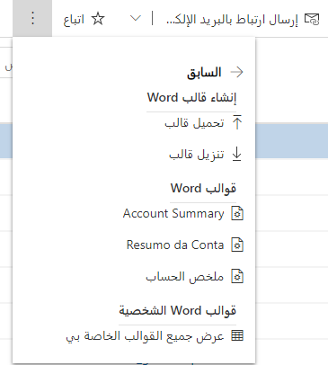

يتم إنشاء قوالب Word كمستند محدد، من قالب للكيان الهدف. القوالب خاصة بالكيان ويمكن أن تتضمن بيانات من الكيانات ذات الصلة. يتم تحديد علاقات الكيانات وإحضارها في وقت إنشاء القالب. قوالب Word عبارة عن مجموعة أدوات فريدة لإعداد التقارير في ذلك واحد إلى العديد (1:N)، من العديد إلى واحد (N:1)، وعلاقات العديد إلى العديد (N:N) يمكن الاستفادة منها، ويتم عرض قوائم السجلات الفرعية بسهولة. 

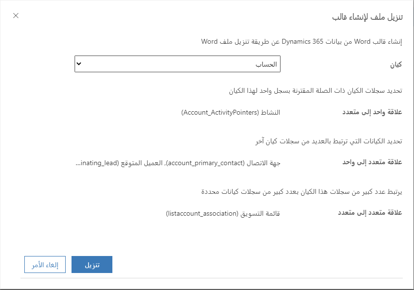

بعد تحديد العلاقات المطلوبة، يتم تنزيل القالب كملف Microsoft Word مع تضمين معلومات الكيان كبيانات xml. 

لإضافة حقول البيانات إلى القالب، ستحتاج إلى تمكين علامة تبويب المطور في Word حتى تتمكن من الوصول إلى جزء بيانات xml. للقيام بذلك، انتقل إلى ملف-> حدد الخيارات وانقر لفتح قائمة الشريط المخصصة.

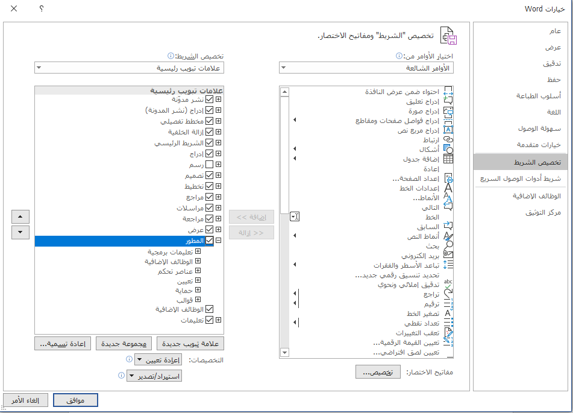

## الأمان

يتم التحكم في أذونات القوالب من خلال دور أمان المستخدم. يمكن منح امتيازات قوالب المستندات التنظيمية كمنظمة أو لا شيء. يمكن منح امتيازات قوالب المستندات الشخصية على مستوى المستخدم أو المؤسسة أو لا شيء. 

بشكل افتراضي، تكون قوالب Word التنظيمية مرئية لجميع أدوار الأمان، ومع ذلك يمكن أن يقتصر الوصول على أدوار أمان محددة. يمكن مشاركة القوالب الشخصية مع مستخدمين محددين أو فرق بواسطة مالك القالب. 

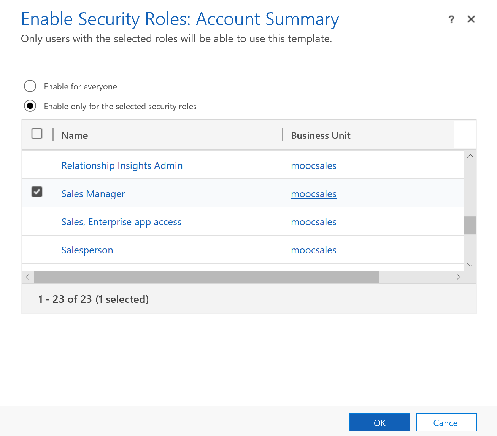

من خلال إنشاء مستند ببيانات من Dataverse، يمكن الآن مشاركة هذه البيانات مع أصحاب المصلحة الخارجيين. عند تصدير البيانات، من المهم أن تتذكر أن البيانات تغادر الآن نموذج الأمان ولم تعد تتحكم في من يرى المستند وبياناته. 

## استخدام قالب

يمكن للمستخدمين استخدام قوالب Word من عدة أماكن مختلفة داخل واجهة المستخدم.

يمكن للمستخدم استخدام قالب أثناء عرض سجل عن طريق تحديد القالب من شريط الأوامر للسجل المفتوح.

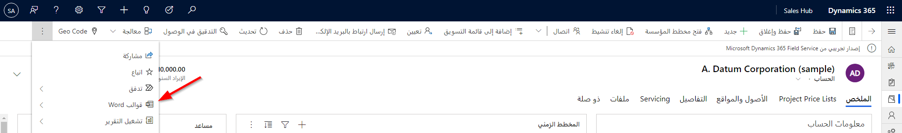

يمكنك استخدام قالب على سجل محدد من طريقة عرض الكيان. لاحظ أنه إذا كنت لا ترى القوالب كخيار من طريقة عرض، فمن المحتمل ألا يكون لديك سجل محدد.

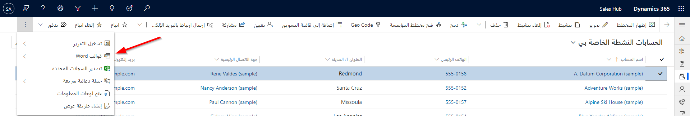

يمكنك أيضاً استخدام قالب Word من سير عمل. في تعريف سير العمل، حدد إجراء التنفيذ. من هناك حدد عنصر SetWordTemplate. نظراً لأن هذا يستخدم إجراءً عمومياً، فستحتاج إلى التعمق في التعريف لتعيين الخصائص. مناقشة مفصلة حول هذا خارج نطاق هذه الدورة التدريبية ولكن يمكن العثور عليها في الدورة التدريبية للتنفيذ التلقائي للنظام الأساسي لـ Power.

## الاعتبارات الإضافية

لأسباب تتعلق بالأداء، تقتصر القوالب على 100 سجل ذي صلة لكل علاقة. على سبيل المثال، سيكون قالب الحساب الذي يسرد جهات الاتصال ذات الصلة محدوداً بـ 100 جهة اتصال، حتى إذا كان هناك المزيد من جهات الاتصال ذات الصلة في النظام. 

إذا كان لديك عمليات تحرير غير مقصودة متكررة أدت إلى تجميد Word أو انخفاض أدائه، فقم بإيقاف تشغيل خيارات التصحيح التلقائي.

قد لا تظهر قوائم السجلات التي تم إنشاؤها من قالب مخصص بنفس الترتيب في مستندات Word بالترتيب في التطبيقات. يتم سرد السجلات بترتيب وقت وتاريخ إنشائها.

يمكن إنشاء قوالب Word في إصدارات 2013 و2016 من Microsoft Word، ويمكن استخدام إصدار 2010 من Word لإنشاء المستندات وليس لإنشاء القوالب. 

قوالب Word ليست على دراية بالحلول ولا يمكن ترحيلها إلى بيئات أخرى. يمكن استخدام القوالب التي تم تنزيلها من مثيل واحد فقط داخل هذا المثال. ترحيل مثيل إلى مثيل لقوالب Word غير مدعوم حالياً.

## قوالب ‏‫Excel‬

تعمل قوالب Excel على تمكين المستخدمين من إنشاء تقارير Excel محدثة دون الحاجة إلى معرفة صيغ Excel أو المخططات أو الجداول المحورية. يتم إنشاء قوالب Excel من طريقة عرض واحدة لبيانات Dataverse. 

يمكن فتح القوالب في Excel online أو تنزيلها ثم فتحها محلياً في Excel. تسمح القوالب للمستخدمين الذين لن يتمكنوا عادةً من إنشاء هذه التقارير باستخدام مستندات Excel المعدة مسبقاً بسهولة مع البيانات الحالية وتمكين مستخدمي Excel من إنشاء تقارير بالبيانات الحالية بدلاً من الاحتفاظ ببياناتهم الخاصة خارج النظام. 

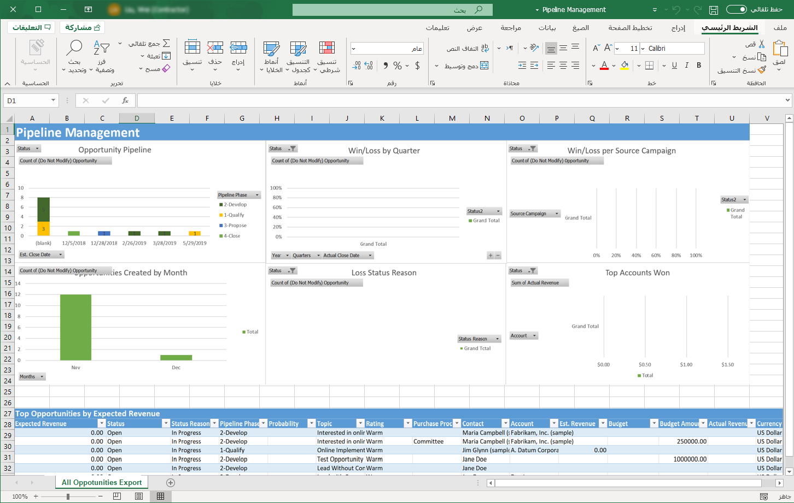

لإنشاء قالب، يجب عليك أولاً تحديد كيان وطريقة عرض. يجب أن تستخدم القوالب التنظيمية طرق عرض النظام ؛ قد تستخدم القوالب الشخصية طرق عرض النظام أو وجهات النظر الشخصية. 

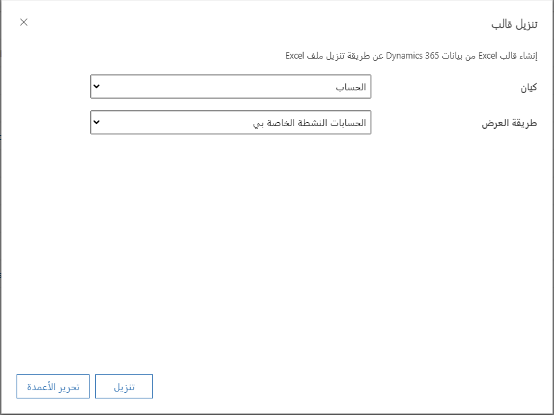

عندما يتم تنزيل النموذج، سيتم تنزيل النتائج الحالية لطريقة العرض المختارة معه. أضف الأعمدة والصيغ حسب الحاجة للتقرير. استخدم الأعمدة والنطاقات المسماة في الصيغ بدلاً من عناوين الأعمدة أو أرقام الخلايا. 

استخدم وظيفة المخطط المحوري في Excel لإضافة مخططات ورسوم بيانية إلى المستند. يجب إضافة جميع المخططات والرسوم البيانية فوق الجدول الحالي حتى لا يتم الكتابة فوق العناصر، حيث يتغير عدد الصفوف في جدول البيانات في المستقبل. 

يتم تحميل القوالب التنظيمية في منطقة الإعدادات ضمن القوالب. يتم تحميل القوالب الشخصية في منطقة الكيان حيث يمكن العثور على العرض ذي الصلة ضمن عقدة قالب Excel في التنقل. 

> [!NOTE] 
> إذا لم يتم تحميل قالب Excel في تطبيقاتك عند استخدام Microsoft Edge كمتصفح، فحدِّث Microsoft Edge وحاول مرة أخرى.

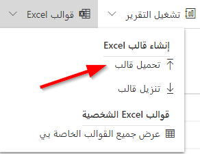

## الأمان
يتم التحكم في أذونات القوالب من خلال دور الأمان. يمكن منح امتيازات قوالب المستندات التنظيمية كمنظمة أو لا شيء. يمكن منح امتيازات قوالب المستندات الشخصية على مستوى المستخدم أو المؤسسة أو لا شيء. 

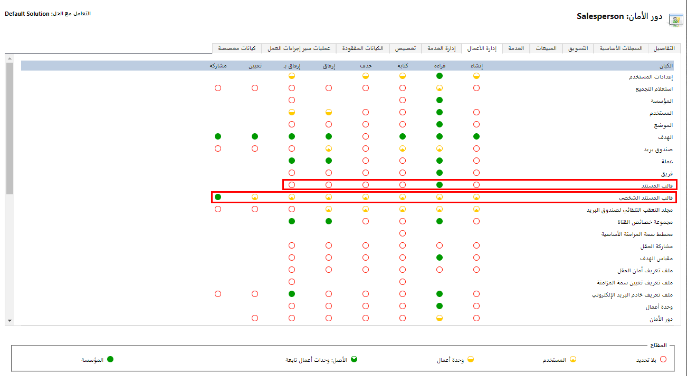

بشكل افتراضي، تكون قوالب Excel التنظيمية مرئية لجميع أدوار الأمان، ولكن يمكن أن يقتصر الوصول على أدوار أمان معينة. يمكن مشاركة القوالب الشخصية مع مستخدمين محددين أو فرق بواسطة مالك القالب. 

عند تصدير البيانات، من المهم أن تتذكر أن البيانات تغادر الآن نموذج الأمان ولم تعد تتحكم في من يرى المستند وبياناته. 

## الاعتبارات 
- قوالب Excel ليست على دراية بالحلول ولا يمكن ترحيلها إلى بيئات أخرى. يمكن استخدام القوالب التي تم تنزيلها من مثيل واحد فقط داخل هذا المثال. ترحيل مثيل إلى مثيل لقوالب Excel غير مدعوم حالياً.

- بخلاف قوالب Word، التي يتم إنشاؤها من سجل معين، يتم إنشاء قوالب Excel فقط من طرق العرض. قد تضطر إلى تذكير المستخدمين بالذهاب إلى طريقة عرض للوصول إلى قوالب Excel من القائمة لأن هذا قد لا يكون بديهياً بالنسبة لهم. 

- بشكل افتراضي، لا يتم تحديث بيانات المخطط المحوري تلقائياً. لتمكين التحديث التلقائي، انقر بزر الماوس الأيمن على المخطط المحوري، وحدد خيارات المخطط المحوري، ثم في علامة تبويب البيانات، حدد خيار تحديث البيانات عند فتح الملف. 

## قوالب البريد الإلكتروني

توفر قوالب البريد الإلكتروني اتصالاً ملائماً ومتسقاً للمستخدمين للتواصل مع العملاء والتوقعات والبائعين والداعمين. يمكن استخدام قوالب البريد الإلكتروني لتوفير نقطة انطلاق لبريد إلكتروني فردي، أو إرسال رسالة سريعة إلى العديد من العملاء عبر حملة سريعة أو إرسال رسائل بريد إلكتروني جماعية مع سير عمل. 

تكون القوالب إما مرتبطة بنوع كيان واحد أو عمومي. تتوفر قوالب البريد الإلكتروني الخاصة بالكيان فقط للحسابات وجهات الاتصال والفرص والعملاء المتوقعين وعروض الأسعار والأوامر والفواتير والحالات والعقود وأنشطة الخدمة ووظائف النظام. إذا كان هناك حاجة إلى قالب بريد إلكتروني لأي كيان آخر، فسيتم استخدام قالب عمومي. تُستخدم القوالب المستندة إلى الكيانات لإرسال بريد إلكتروني إلى سجلات من هذا النوع ولديك حق الوصول إلى حقول هذا الكيان وبعض البيانات ذات الصلة. يمكن استخدام القوالب العمومية لأي كيان يتم فيه تمكين الكيان للبريد الإلكتروني. 

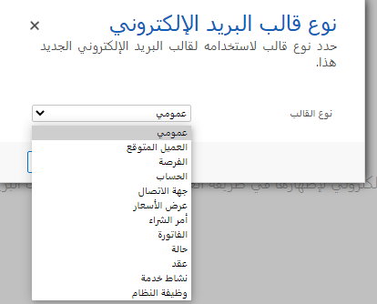

عنوان قالب البريد الإلكتروني ووصفه مرئيان للمستخدمين وليس مستلم البريد الإلكتروني. ستتم رؤية موضوع البريد الإلكتروني والنص الأساسي وأي مرفقات من قِبل المستلم. 

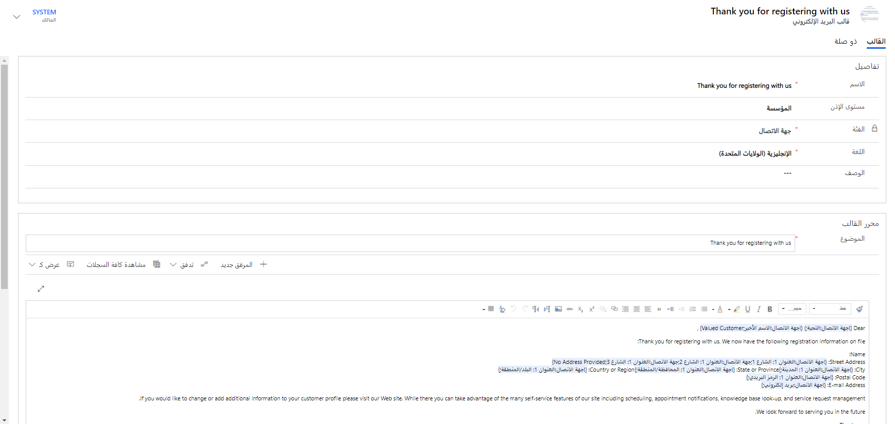

تتم إضافة حقول البيانات لإدراج نص ديناميكي في رسالة البريد الإلكتروني. استخدم مربع النص الافتراضي لإظهار النص الذي يجب استخدامه إذا كان الحقل المحدد فارغاً. 

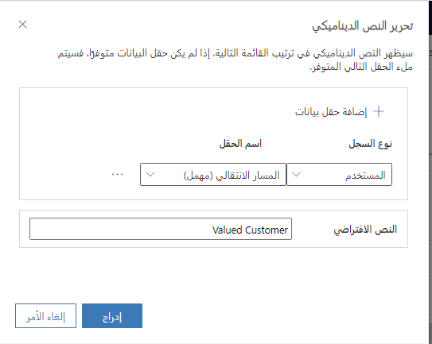

تدير أدوار الأمان الأذونات لإنشاء قوالب البريد الإلكتروني واستخدامها. يستطيع المستخدمون الذين لديهم أذونات كافية إنشاء قوالب بريد إلكتروني شخصية واختيار مشاركة قوالبهم مع مستخدمين آخرين. القوالب التنظيمية مدركة للحلول ويمكن نقلها بسهولة إلى بيئة أخرى من خلال إطار عمل الحل. 

## الاعتبارات

لا يتم قفل رسائل البريد الإلكتروني الناتجة من نماذج البريد الإلكتروني، لذا لا شيء يمنع المستخدم من تعديل الرسالة قبل إرسالها. في بعض البيئات شديدة التنظيم، قد يلزم إنشاء رسائل بريد إلكتروني وإرسالها عبر سير العمل لفرض العلامة التجارية أو منع العبث. 

لا يوجد زر لإدراج الصور أو كود HTML في نص قالب البريد الإلكتروني، ولكن يمكن لصقها في المصمم من مصدر آخر. يمكن استضافة صورة عبر الإنترنت وإضافتها ؛ ستكون هذه الصورة متاحة طالما أن الموقع يمكن الوصول إليه. يمكن أيضاً تضمين الصور والملفات الأخرى كمرفقات. 

انتبه لقلة التدقيق الإملائي. قد يكون من المفيد صياغة بريدك الإلكتروني في تطبيق آخر مثل Microsoft Word ولصق الرسالة في القالب للاستفادة من دعم التدقيق الإملائي والنحوي. يسمح النسخ من Word أيضاً بمزيد من خيارات تنسيق النص التي لا تتوفر من محرر قالب البريد الإلكتروني ولكن يُسمح بها إذا تم لصقها من تطبيق آخر. 

قوالب البريد الإلكتروني العمومية مقصورة على الحقول من كيان المستخدم. إذا كانت هناك حاجة إلى بريد إلكتروني قياسي لكيان مخصص، ففكر في استخدام سير عمل لإنشاء البريد الإلكتروني وإرساله بحيث يمكنك الاستفادة من نموذج البيانات الكامل لهذا الكيان في نص ديناميكي. 

> [!NOTE]
> بمجرد تحديد نوع قالب البريد الإلكتروني، لا يمكن تغييره.
