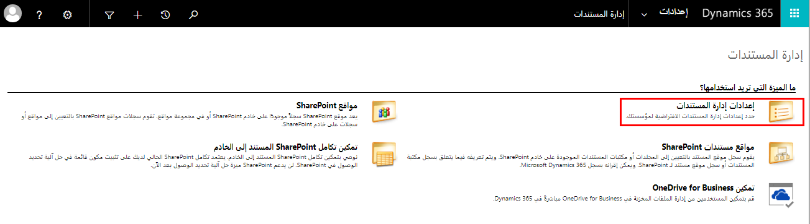
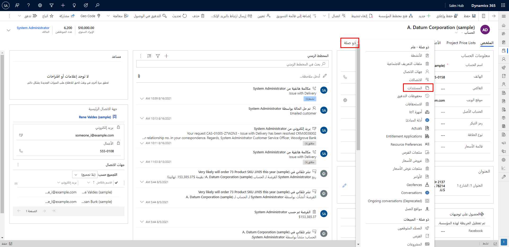

يساعدنا SharePoint في عملنا اليومي مع Dynamics. يمثل الفيديو أدناه نظرة عامة على SharePoint.

> [!VIDEO https://www.microsoft.com/videoplayer/embed/RWrWU1]

## تكوين SharePoint ‏Online

لإعداد Dynamics 365 لاستخدام SharePoint ‏Online، أكمل الخطوات التالية. 

## قم بتعيين أذونات المستخدم لموقع SharePoint للفريق.

لا يُسمح لمستخدمي Dynamics 365 وMicrosoft 365 بالوصول تلقائياً إلى مواقع SharePoint الخاصة بك. يجب أن تعمل داخل موقع SharePoint لتعيين مستويات أذونات معينة للمستخدمين الفرديين أو المجموعات. 

### تعيين المستخدمين إلى موقع الفريق
1. قم بالاستعراض إلى مركز إدارة Microsoft 365 وقم بتسجيل الدخول باستخدام بيانات اعتماد مسؤول Microsoft 365 العمومي.

2. افتح مشغل تطبيقات Microsoft 365، ثم انقر فوق SharePoint. في القائمة اليسرى، انقر فوق موقع الفريق. 

3. في الصفحة الرئيسية، انقر فوق مشاركة (الزاوية العلوية اليمنى). 

 

4. لعرض الأذونات الافتراضية لموقع الفريق، انقر فوق كثير من الأشخاص. 
 

5. بشكل افتراضي، يمكن لجميع المستخدمين في مؤسسة Microsoft 365 إضافة المستندات وتحريرها على موقع SharePoint للفريق. لدعوة آخرين، اختر دعوة الأشخاص وإضافة أشخاص خارج مؤسستك لمشاركة المستندات.

### تكوين مؤسسة جديدة
اتخذ الخطوات التالية لإعداد إدارة مستند SharePoint باستخدام Dynamics 365.

1. انتقل إلى الإعداد في الواجهة الكلاسيكية وحدد "إدارة المستندات".

 

2. انقر فوق إعدادات إدارة المستندات وسيتم فتح النافذة التالية؛ من هنا تحدد الكيانات التي تريد تمكينها لإدارة المستندات باستخدام SharePoint. بشكل افتراضي، تتم إضافة عنوان URL لموقع SharePoint إذا كانت بيئة Dynamics 365 لديك في نفس مستأجر Microsoft 365 مثل SharePoint.

 

3. انقر فوق التالي وسيكون لديك خيار تعيين الكيان الأساسي لبنية المجلد الخاص بك. أيضاً، يتم التحقق من صحة عنوان URL للتأكد من وجود موقع SharePoint، ولديك حق الوصول إليه.

تم دمج SharePoint الآن في Dynamics 365.

### التعامل مع SharePoint من خلال Dynamics 365

سيكون لدى جميع الكيانات التي قمت بتمكينها من إدارة المستندات الآن المستندات ضمن القائمة ذات الصلة.

### التعامل مع المستندات

بعد تكوين تكامل SharePoint من جانب الخادم، تتوفر العديد من أوامر SharePoint من شريط الأوامر. ستكون هذه عادةً إجراءات شائعة مثل التحميل، والسحب، والإيداع.

لا تتوفر عناصر إضافية مثل تنبيهي وتنزيل نسخة ونسخ اختصار وإرسال اختصار وعرض خصائص ومحفوظات الإصدارات مباشرةً من شريط الأوامر، ومع ذلك ستتمكن من الوصول إلى هذه الأوامر بالنقر فوق أمر فتح SharePoint.

### العمل مع السجلات

من المهم أن تتذكر أنه عند توصيل Dynamics 365 بـ SharePoint، فإنك توفر فقط آلية للوصول إلى مكتبة مستندات SharePoint من داخل Dynamics 365. فكر في الأمر على أنه ارتباط بمكتبة مستندات SharePoint.

يتم التحكم في ما يمكن للأشخاص فعله بالمستندات الموجودة في مكتبة المستندات من خلال أذونات المستخدم لتلك المكتبة في SharePoint. يتم الاحتفاظ بأذونات SharePoint وDynamics 365 بشكل مستقل ومناقشتها في درس لاحق. 

تتضمن بعض العناصر الإضافية التي يجب مراعاتها فيما يتعلق بالتكامل ما يلي:

- يؤدي حذف مستند في Dynamics 365 إلى حذف المستند بتنسيق SharePoint.

- لا يؤدي حذف سجل Dynamics إلى إزالة مستندات SharePoint.

- سيؤدي دمج السجلات إلى وجود سجل مدمج يحتوي على مواقع مستندات متعددة.

- يمكن إنشاء موقع المستند تلقائياً عبر سير العمل أو أي رمز مخصص آخر.

## تكوين SharePoint المحلي

يمكن لـ Dynamics 365 الاتصال بـ SharePoint المستضاف في موقع آخر غير Microsoft 365، مثل الموقع المحلي.

شيء واحد يجب مراعاته هو المصادقة كجزء من هذا النموذج. عند استخدام المصادقة المستندة إلى الخادم، يتم استخدام خدمات مجال Azure AD كوسيط ثقة ولا يحتاج المستخدمون إلى تسجيل الدخول إلى SharePoint. تتطلب عملية إعداد هذا الخطوات التي يجب اتباعها بالترتيب الصحيح، وإذا كنت بحاجة إلى مراعاة ذلك من أجلك، فيجب عليك التفكير في إجراء الإعداد التالي خطوة بخطوة.[تكوين المصادقة المستندة إلى الخادم باستخدام تطبيقات Dynamics 365 Customer Engagement](https://docs.microsoft.com/dynamics365/customer-engagement/admin/configure-server-based-authentication-sharepoint-on-premises) 

بغض النظر عن هذا، ستكون التجربة مماثلة للعمل مع SharePoint الموجود في Microsoft 365.

## تكوين أمان SharePoint

من المهم ملاحظة أن أمان SharePoint وDynamics 365 يُداران بشكل مختلف. لا توجد حالياً مزامنة لامتياز الأمان بين Dynamics 365 وSharePoint. ما يعنيه هذا هو أنه إذا قمت بتقييد الوصول إلى سجلات معينة في Dynamics 365 المرتبطة بالملفات المحددة في SharePoint، فلن يتم تطبيق الوصول المقيد المطبق في Dynamics 365 على موقع SharePoint والعكس بالعكس. يتيح تكامل SharePoint إمكانات إدارة المستندات في Dynamics 365. 

### إعداد تكامل SharePoint

يقوم مسؤول النظام بإعداد بيئة خادم SharePoint. يحدد مسؤول Dynamics 365 (مستخدم لديه دور مسؤول مجموعة مواقع SharePoint) كيانات Dynamics 365 التي من أجلها يتم تمكين ميزة إدارة المستندات ويحدد خادم SharePoint الهدف. كجزء من تحديد الخادم الهدف، يحدد مسؤول تطبيقات Dynamics 365 Customer Engagement مجموعة مواقع خادم SharePoint أو عنوان URL لموقع خادم SharePoint.

يمكن لمستخدمي Dynamics 365 إنشاء وإدارة سجلات مواقع مستندات خادم SharePoint بعد تمكين تكامل خادم SharePoint. يسمح Dynamics 365 أيضاً بالإنشاء التلقائي للمجلدات على الخادم الذي يقوم بتشغيل خادم SharePoint لسجلات الكيانات في ظل ظروف معينة. ومع ذلك، لا يمكن إنشاء المجلدات تلقائياً من خلال خدمات ويب تطبيقات Dynamics 365 Customer Engagement.

### مفاهيم تخزين SharePoint

باستخدام إمكانات إدارة مستندات خادم SharePoint، يمكنك التحكم في دورة حياة المستندات في مؤسستك: كيف يتم إنشاؤها ومراجعتها ونشرها والتخلص منها أو أرشفتها. يستخدم خادم SharePoint نموذج تخزين هرمي لتخزين المستندات وإدارتها. فيما يلي بعض مفاهيم تخزين خادم SharePoint التي يجب أن تعرفها: 

- مجموعة المواقع

- الموقع

- مكتبة المستندات

- مجلد المستندات

توفر كائنات التخزين هذه إطار عمل للبنية الأساسية لإدارة المحتوى التي يوفرها خادم SharePoint. 

لمزيد من المعلومات، راجع [الأذونات المطلوبة لإدارة المستندات](https://docs.microsoft.com/dynamics365/customer-engagement/admin/permissions-required-document-management-tasks) 

## التعامل مع مواقع المستندات

باستخدام Dynamics 365 وSharePoint، لديك خيارات عندما يتعلق الأمر بالتعامل مع مواقع المستندات. يمكنك تحديد مواقع ومجلدات SharePoint مختلفة عن الإعدادات الافتراضية.  
‎  
‎

إذا قمت بالوصول إلى أي كيان مُمكّن لـ SharePoint وانتقلت إلى "ذات صلة"، فسترى أن لديك حق الوصول إلى المستندات الخاصة بهذا السجل.

من هنا يمكنك إنشاء مستندات جديدة باستخدام القائمة الجديدة أو يمكنك تحميل المستندات من هذا الموقع. لاحظ أنه يمكنك أيضاً إنشاء مجلدات فرعية من القائمة الجديدة.

من قائمة المستندات، لديك أربعة عناصر أخرى في القائمة يمكن استخدامها فيما يتعلق بموقع المستندات.

- **موقع المستند** - سيسمح لك هذا بالتبديل بين عرض موقع المستند في Dynamics 365 وموقع آخر إذا قمت بإعداد أكثر من موقع مستند واحد.

- **فتح الموقع** – سيؤدي ذلك إلى فتح موقع المستند الحالي المعروض في SharePoint.

- **إضافة الموقع** – سيتيح لك إضافة موقع مستند آخر على SharePoint وإعطائه اسماً سيتم عرضه في Dynamics 365.

- **تحرير الموقع** - سيتيح لك إعادة تسمية الموقع وتحرير الموقع على SharePoint.

