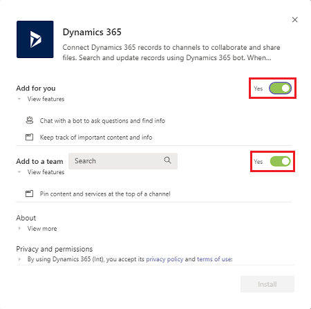
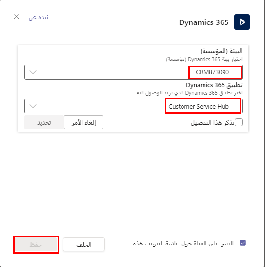
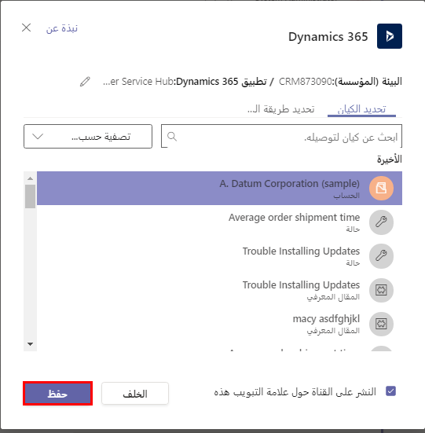
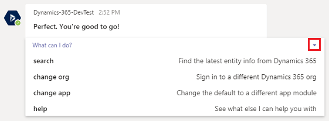

> [!VIDEO https://www.microsoft.com/videoplayer/embed/RWrWU0]

## تكوين Teams

لكي يتمكن المستخدمون من استخدام تكامل Dynamics 365 مع Microsoft Teams في بيئتك، يجب عليك إكمال بعض الأعمال التمهيدية. 

فيما يلي الخطوات عالية المستوى لتمكين التكامل للمستخدمين:

- في إعدادات نظام Dynamics 365، قم بتمكين إصدار أولي Microsoft Teams.

- من Microsoft Teams، ثبت تطبيق Dynamics 365 Teams.

- أنشئ فرق وتكوين علامة تبويب للاتصال بسجل Microsoft Dataverse.

## المتطلبات
يجب أن يكون لديك إصدار 9.0 أو أكثر من تطبيقات Dynamics 365 Customer Engagement أو إصدار أحدث في بيئة Dataverse التي تقوم بتكوينها. التكامل غير مدعوم حالياً في بيئات Dataverse التي لا تحتوي على تطبيق Dynamics 365. حتى كتابة هذه السطور، لا تتوفر بعض الميزات مثل عرض الملفات وإقرانها وروبوت Dynamics 365 إلا في أمريكا الشمالية.

## تثبيت تطبيق Teams
يمكن تثبيت تطبيق Dynamics 365 لـ Microsoft Teams بالنقر فوق ارتباط المتجر من داخل تطبيق Microsoft Teams. سيتم تثبيته أيضاً إذا أضفت علامة تبويب إلى قناة فريق وحدد Dynamics 365. بمجرد تحديد التطبيق للتثبيت، سترى مربع الحوار التالي الذي يطالبك بتهيئة التثبيت.

يمكن تثبيت التطبيق للمستخدم الحالي فقط أو للفريق. إذا تم تثبيته للاستخدام الشخصي، يمكن إضافة الفريق لاحقاً. إذا اخترت الإضافة إلى فريق الآن، فستظهر لك قائمة بالفرق التي يمكنك إضافة علامة تبويب Dynamics 365 إليها.

إذا لم يكن شخص ما قد أجرى بالفعل الموافقة على إذن للمؤسسة، فستتم مطالبتك بقبول الأذونات التي يطلبها التطبيق.

بعد ذلك، ستظهر لك مطالبة لتحديد بيئة Dataverse المتاحة (أو المؤسسة) التي تريد الاتصال بها لربط سجل في Microsoft Teams بسجل Dataverse. ستختار أيضاً وحدة تطبيق الواجهة الموحدة التي تريد تحميلها في علامة التبويب في تطبيق Microsoft Teams. هذا الاختيار مهم لأنه سيحدد طرق العرض والنماذج التي يتم عرضها للسجل المرتبط. على سبيل المثال، إذا كنت تنفذ تعاون المبيعات على سجلات الفرصة، فسيكون اختيار تطبيق مركز المبيعات هو الخيار المنطقي. فيما يلي مثال على ذلك الحوار.

بعد ذلك، سيُطلب منك تحديد السجل لربط علامة التبويب فريق Microsoft بـ Dataverse. يمكنك البحث عن السجلات واستخدام عامل التصفية من خلال القائمة المنسدلة لقصره على كيانات محددة فقط.

هذه نفس العملية التي تمر بها إذا بدأت من قناة Teams موجودة وانقر فوق + لإضافة علامة تبويب وتحديد Dynamics 365. يمكنك أيضاً بدء هذه العملية من أحد الكيانات التالية في Dynamics 365 وسيأخذك إلى Teams لإنهاء التكوين:

- الحساب

- تعليق توضيحي

- الموعد

- وحدة العمل

- حملة

- فئة

- المنافس

- جهة الاتصال

- البريد الإلكتروني

- الحادث

- مقالة قاعدة المعارف

- مقالة معرفية

- العميل المتوقع

- فرصة

- منتج الفرصة

- المنتج

- عرض الأسعار

- أمر المبيعات

- المهمة

- فريق

## تكوين روبوت Dynamics 365

يصبح الروبوت متاحاً بمجرد تثبيت تطبيق Dynamics 365 في Microsoft Teams. يمكنك الوصول إليه من التنقل عبر الدردشة ومحاولة الدردشة مع Dynamics 365. في المرة الأولى التي يتم فيها استخدامه، سيطالبك بتكوين معلومات بيئتك. بمجرد اتصال المستخدمين ببيئة، يمكنهم إصدار أوامر مثل "ما فرصي؟". يمكنهم الحصول على المساعدة بشأن الأوامر المتوفرة بالنقر فوق ارتباط ماذا يمكنني أن أفعل. 

لتغيير التطبيق أو المؤسسة التي يتصل بها الروبوت، يمكنك ببساطة إصدار تغيير المؤسسة أو تغيير التطبيق.
