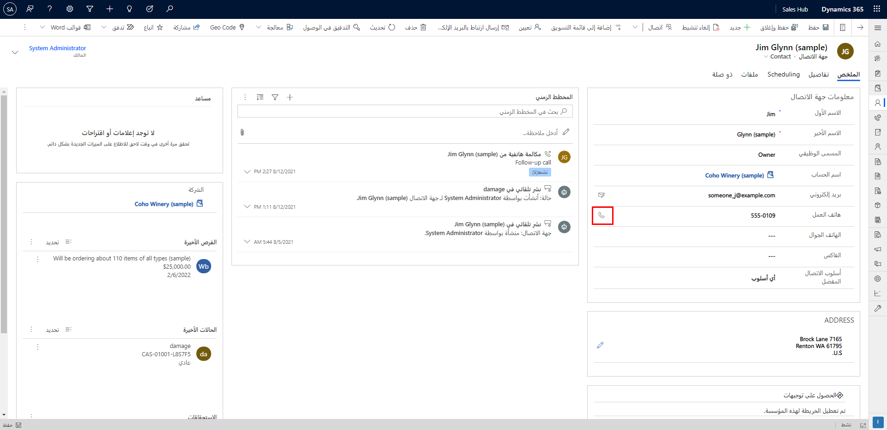
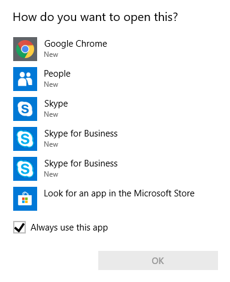
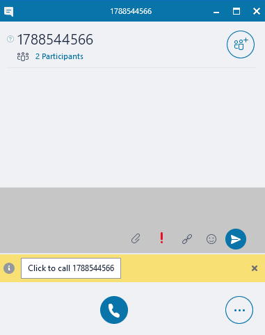
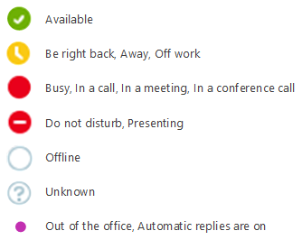

إذا كانت مؤسستك تستخدم Skype for Business أو Skype، فيمكنك الاستفادة من ميزات الاتصال مثل النقر للاتصال أو التحقق من توفر المستخدم من داخل تطبيقات Dynamics 365 Customer Engagement أو Microsoft Dynamics 365 for Outlook. 

### المتطلبات الأساسية

يجب أن يكون لدى مؤسستك أحد المنتجات أو الاشتراكات التالية:

- Skype for Business

- Skype for Business Server 2015

- Lync Server 2013

- Lync Server 2010

### متطلبات العميل وتكوين Dynamics 365

- لاستخدام **انقر للاتصال**، يجب تحديد Skype for Business كموفر خدمة الهاتف في تطبيقات Dynamics 365 Customer Engagement. يمكنك تعيين هذا في **علامة التبويب عام** في **الإعدادات &gt; الإدارة &gt; إعدادات النظام**.

- بشكل افتراضي، يتم تمكين وجود Skype for Business في تطبيقات Dynamics 365 Customer Engagement. يمكن لمسؤولي النظام تمكين أو تعطيل التواجد في تطبيقات Dynamics 365 Customer Engagement. للقيام بذلك، انقر فوق **إعدادات &gt; الإدارة &gt; إعدادات النظام** وفي **علامة التبويب عام**، قم بتعيين IM خيار التواجد إلى "نعم" أو "لا".

- يجب أن يكون لدى كل مستخدم عميل Skype for Business مثبتاً وقيد التشغيل على أجهزة الكمبيوتر الخاصة به.

### اضغط للاتصال

عند استخدام "انقر للاتصال" لأول مرة، ستتم مطالبتك بما تريد حدوثه عند النقر فوق رمز رقم الهاتف. (ستختلف العناصر الموجودة في هذه القائمة بناءً على التطبيقات الموجودة على جهاز الكمبيوتر الخاص بك). حدد البرنامج المفضل لديك لإجراء المكالمات، وفي هذه الحالة سأحدد Skype for Business.

بعد ذلك تفتح نافذة Skype for Business مما يسمح لك بالنقر للاتصال.

### متواجد

يُشار إلى التحقق من توفر شخص ما على أنه حالة "متواجد" ويستخدم Skype for Business أيقونات ملونة لعرض ذلك.

للحصول على معلومات إضافية، الرجاء مراجعة [تكامل Skype for Business وSkype](/dynamics365/customerengagement/on-premises/admin/skype-business-integration) و [إعداد تطبيقات (عبر الإنترنت) لاستخدام Skype أو Skype for Business](/dynamics365/customer-engagement/admin/set-up-skype-or-skype-for-business). 
