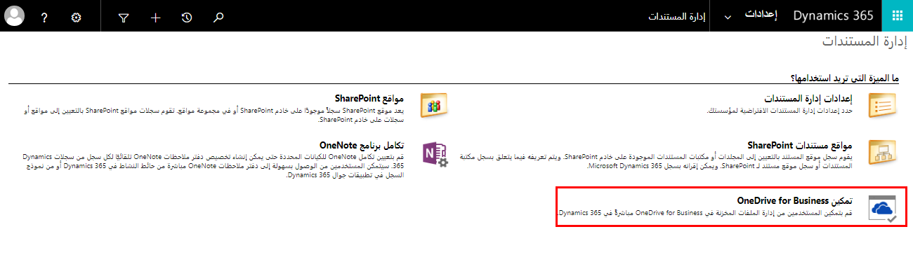

ميزة أخرى لتمكين تكامل SharePoint هي القدرة على تمكين تكامل OneDrive للأعمال. يمكن للمستخدمين إنشاء وإدارة مستندات خاصة باستخدام OneDrive للأعمال في سياق سجل Dynamics 365. يمكن مشاركة هذه المستندات مع مستخدمي Dynamics 365 وغير مستخدمي Dynamics 365. يستخدم تكامل OneDrive للأعمال كيان موقع المستند لتتبع الاقتران، على غرار طريقة عمل تكامل SharePoint. 

### المتطلبات

يلزم ما يلي لاستخدام OneDrive للأعمال مع Dynamics 365: 

- قم بتكوين المصادقة المستندة إلى الخادم مع Dynamics 365 (online) وSharePoint عبر الإنترنت. 

- رخصة OneDrive للأعمال لكل مستخدم. 

- ترخيص SharePoint لكل مستخدم. يمكن للمستخدمين الذين لديهم ترخيص SharePoint استخدام OneDrive للأعمال. بالنسبة لـ SharePoint عبر الإنترنت، تأتي اشتراكات Microsoft 365 مع SharePoint تراخيص عبر الإنترنت. 

- للحصول على تكامل كامل لميزات Microsoft 365 مع Dynamics 365، ستحتاج إلى Microsoft 365 Enterprise E3 أو أفضل. يتطلب إجراء المكالمات والمؤتمرات عبر شبكة PSTN من Skype for Business Microsoft 365 Enterprise E5. خطط Microsoft 365 الأخرى غير مدعومة. 

- قبل استخدام OneDrive في Dynamics 365، يجب على مسؤول Dynamics 365 والمستخدمين النهائيين الوصول إلى OneDrive للأعمال من خلال واجهة الويب. على سبيل المثال، إذا كنت تستخدم SharePoint عبر الإنترنت، فانتقل إلى https://portal.office.com >مشغل التطبيقات > OneDrive. يتم إنشاء الموقع والمعلومات الأخرى المطلوبة بواسطة Dynamics 365 لتمكين OneDrive للأعمال لتكامل الأعمال فقط عند الوصول إلى الموقع لأول مرة. 

### تمكين OneDrive للأعمال

يمكنك تمكين OneDrive للأعمال على النحو التالي. 

1. انقر فوق **إعدادات &gt; إدارة المستندات &gt;** تمكين OneDrive للأعمال. 

2. انقر فوق **تمكين OneDrive للأعمال** لتمكينه، ثم اختر **موافق**.   
‎  
‎

### التحكم في الوصول إلى OneDrive للأعمال في Dynamics 365

يمكنك تبديل توفر OneDrive في Dynamics 365 للمستخدمين النهائيين من خلال امتياز OneDrive للأعمال. 

1. انقر فوق **الإعدادات &gt; الأمان &gt; أدوار الأمان**. 

2. حدد دور أمان، ثم انقر فوق **علامة التبويب "السجلات الأساسية"**. 

3. ضمن **امتيازات متنوعة**، قم بتبديل امتياز OneDrive للأعمال إلى التوفر المطلوب. 

### العمل مع السجلات

من المهم أن تتذكر أنه عند تمكين OneDrive للأعمال للتكامل مع Dynamics 365، فإنك توفر فقط آلية للوصول إلى ملفات OneDrive من داخل Dynamics 365. 

يتم التحكم في ما يمكن للأشخاص فعله بالمستندات الموجودة في مكتبة المستندات من خلال أذونات المستخدم لهذه المكتبة في OneDrive للأعمال. يتم الاحتفاظ بأذونات OneDrive للأعمال وDynamics 365 بشكل مستقل. 

تتضمن بعض العناصر الإضافية التي يجب مراعاتها فيما يتعلق بالتكامل ما يلي:

- يؤدي حذف مستند في Dynamics 365 إلى حذف المستند في OneDrive

- لا يؤدي حذف سجل Dynamics 365 إلى إزالة مستندات OneDrive

- سيؤدي دمج السجلات إلى وجود سجل مدمج يحتوي على مواقع مستندات متعددة.

للحصول على معلومات إضافية، يرجى الاطلاع على [تمكين OneDrive (عبر الإنترنت)](/dynamics365/customer-engagement/admin/enable-onedrive-for-business). 
