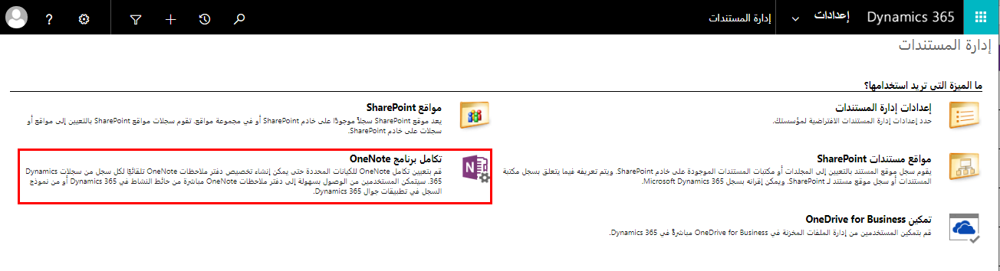
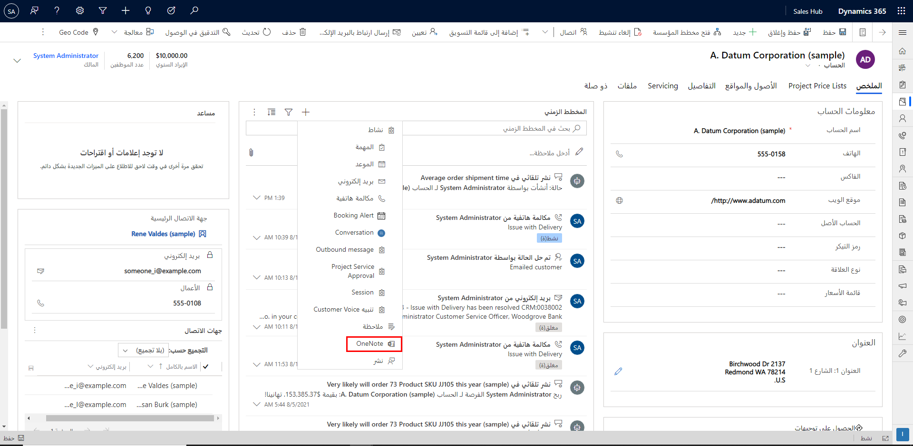

يحتوي Microsoft Dataverse على كيان Notes يمكن تمكينه لمعظم الكيانات في التطبيق. يعتبر كيان Notes طريقة رائعة لإضافة ملاحظات محددة حول سجل معين. لا يوفر كيان Notes الكثير من الإمكانات للمشاركة أو التعاون في هذه الملاحظات مع مستخدمين آخرين بخلاف Dynamics. 

إذا كنت تبحث عن طريقة أفضل لتجميع خواطرك وأفكارك وخططك وأبحاثك في مكان واحد، ولديك القدرة على التعاون مع غير مستخدمي Dynamics 365، فيمكنك التفكير في تمكين OneNote Integration. 

عندما تقوم بتشغيل تكامل OneNote في Dynamics 365، فإنك تتمتع بمزايا استخدام OneNote لتدوين ملاحظات العملاء أو مراجعتها من داخل سجلات Dynamics 365 الخاصة بك. 

يمكنك تكوين OneNote في Dynamics 365 عندما تستخدم أيضاً SharePoint. يجب أن يكون لديك اشتراك في Microsoft 365 لاستخدام OneNote في Dynamics 365. 

### تمكين OneNote Integration

قبل تمكين التكامل OneNote تحتاج إلى تكوين تكامل SharePoint المستند إلى الخادم. 

تأكد من أن لديك دور أمان مسؤول النظام أو أذونات مكافئة في Microsoft Dynamics 365. بدلاً من ذلك، تأكد من أن لديك امتيازات القراءة والكتابة على جميع أنواع السجلات القابلة للتخصيص. 

تبع الخطوات الموضحة في القسم السابق لتمكين تكامل SharePoint لمؤسستك. 

عند تشغيل تكامل SharePoint المستند إلى الخادم، يتم إدراج تكامل OneNote في إدارة المستندات. 

1. انتقل إلى **إعدادات &gt; إدارة المستندات**.

2. حدد **OneNote تكامل‎**. 

3. اتبع الإرشادات الموجودة في المعالج لتشغيل تكامل OneNote لكيانات المحددة. اختر الكيانات التي تحتاج إلى دفتر ملاحظات كامل لكل سجل. يتم سرد الكيانات التي تم تمكينها بالفعل لإدارة المستندات فقط. حدد **إنهاء**. 

4. يمكنك أيضاً تمكين تكامل OneNote لكيان من نموذج التخصيص، طالما تم تمكين إدارة المستندات لهذا الكيان. 

5. يتم إنشاء دفتر ملاحظات OneNote تلقائياً لسجل في المرة الأولى التي تحدد فيها علامة التبويب OneNote في منطقة الأنشطة في Dynamics 365. بعد إنشاء دفتر الملاحظات OneNote المخصص لسجل Dynamics 365 هذا، يمكنك عرض دفتر الملاحظات هذا والتنقل إليه من أي عميل Dynamics 365.   
‎  
‎

6. بمجرد اكتمال الإعداد، سترى في الواجهة تمت إضافة الرمز OneNote.   
‎  
‎

### حذف السجلات

تكاملOneNote مشابه لتكامل SharePoint من حيث أنك توفر فقط القدرة على إنشاء واستخدام دفتر ملاحظات مشترك OneNote من داخل Dynamics 365. المفكرة الفعلية ستكون موجودة في SharePoint عبر الإنترنت. 

لهذا السبب، سيؤدي حذف سجل Dynamics 365 المرتبط بدفتر الملاحظات OneNote إلى إزالة الارتباط الذي يشير إلى ملفات OneNote فقط. ستبقى ملفات OneNote في SharePoint حتى يتم حذفها. 

### العمل مع السجلات

نظراً لأن التكامل OneNote يستخدم تكامل SharePoint باعتباره العمود الفقري لتخزين المعلومات، يتم تطبيق نفس قواعد العمل مع أجهزة الكمبيوتر المحمولة. 

تذكر أن نموذج أمان Dynamics 365 يختلف عن نموذج الأمان SharePoint. يفترض التكامل أن المستخدمين لديهم أذونات على كلا الجانبين لتنفيذ الإجراءات. لا توجد مزامنة أمنية تحدث. 

### لإيقاف تشغيل تكامل OneNote

1. انتقل إلى **إعدادات &gt; إدارة المستندات**.

2. حدد **OneNote تكامل‎**. 

3. في مربع الحوار تكامل OneNote الإعداد، **امسح** **خانات الاختيار** لجميع الكيانات، ثم حدد إنهاء.

للحصول على معلومات إضافية، يرجى الاطلاع على [إعداد OneNote تكامل](/dynamics365/customer-engagement/admin/set-up-onenote-integration-in-dynamics-365). 
