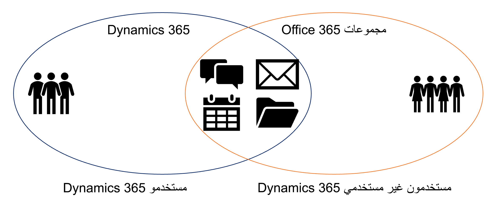
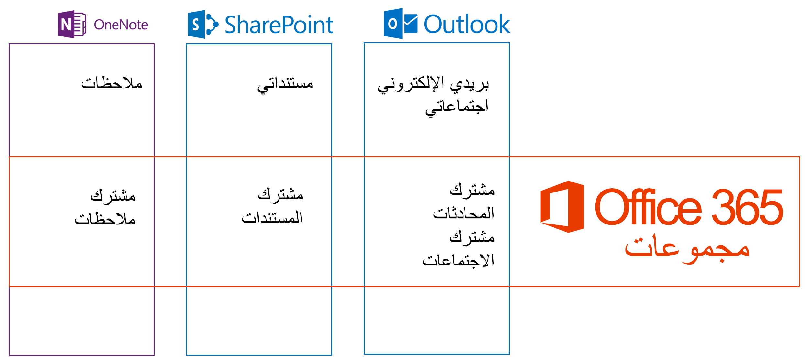
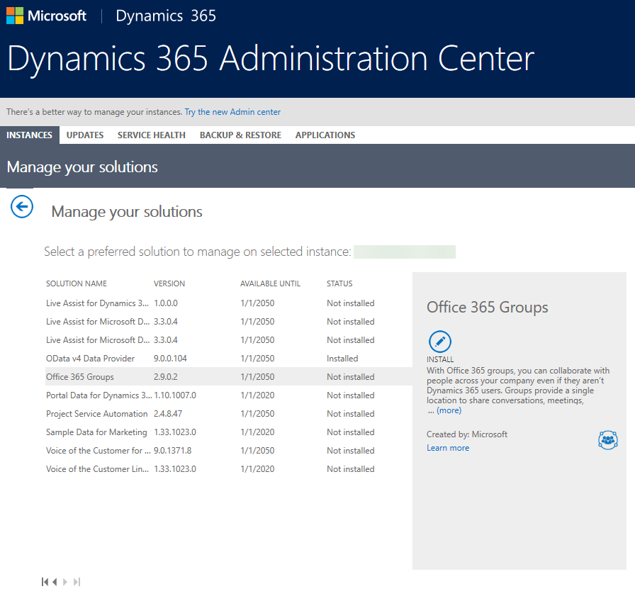
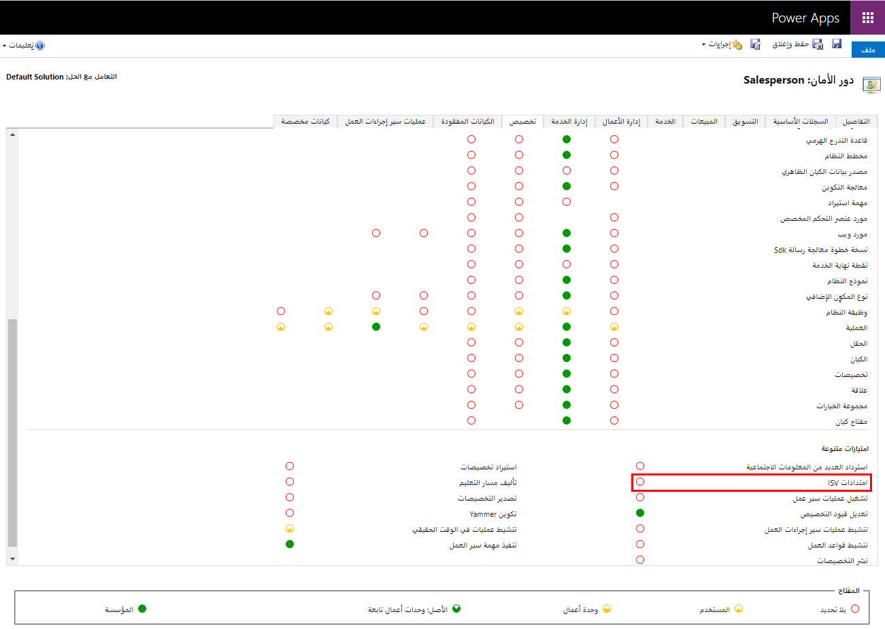
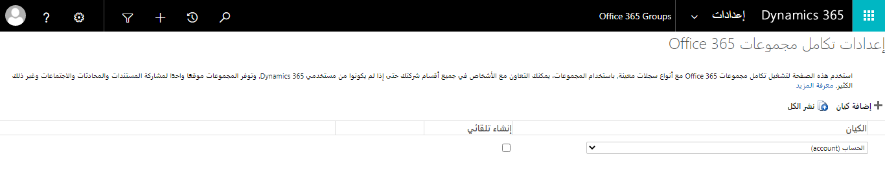
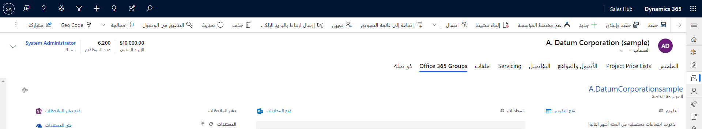

## مجموعات Microsoft 365

توفر مجموعات Microsoft 365، المتوفرة مع Dynamics 365، بيئة للتعاون مع مستخدمي Microsoft 365 الذين لا يستخدمون Dynamics 365. على سبيل المثال، استخدم مجموعات Microsoft 365 عندما يكون لدى فريق المبيعات فرصة كبيرة تتطلب مدخلات من عدة أشخاص ليس لديهم حق الوصول إلى Dynamics 365. توفر مجموعات Microsoft 365 موقعاً واحداً لمشاركة المستندات والمحادثات والاجتماعات والملاحظات. يمكنك تمكين مجموعات Microsoft 365 لأي كيان.

عند النظر إلى خيارات التعاون، يجب أن تفكر في Microsoft Teams التكامل مع Dynamics 365 كتجربة تعاون أكثر حداثة. 

تعاون مع الأشخاص داخل وخارج مؤسسة Dynamics 365 الخاصة بك.

#### مجموعات Microsoft 365 في Dynamics 365

- يسمح بعرض معلومات المجموعة في Dynamics 365 في سياق سجل

- يتطلب تثبيت حل Dynamics 365 المقدم من Microsoft

- يسمح بالإنشاء التلقائي للمجموعة بدءاً من Dynamics 365

#### رابط مجموعات Microsoft 365

- يتم إرسال كل نشاط المهمة لسجل ما إلى مجموعة جديدة أو موجودة

- يبدأ التكوين من Microsoft 365 Outlook Web App

- يحتوي Microsoft 365 على أكثر من 60 موصلاً آخر يمكن استخدامها لإحضار بيانات أخرى إلى طريقة عرض المجموعة

### متطلبات Microsoft 365

ما يلي مطلوب لاستخدام مجموعات Microsoft 365 مع Dynamics 365: 

- Dynamics 365

- تتطلب هذه الميزة أن يكون لديك اشتراك Microsoft 365 أو اشتراك في خدمة عبر الإنترنت مثل SharePoint عبر الإنترنت أو Exchange Online. 

- للحصول على تكامل كامل لميزات Microsoft 365 مع Dynamics 365 (online) وDynamics 365 (on-premises)، ستحتاج إلى Microsoft 365 Enterprise E3 أو أفضل منه. يتطلب إجراء المكالمات والمؤتمرات عبر شبكة PSTN من Skype for Business Microsoft 365 Enterprise E5. خطط Microsoft 365 الأخرى غير مدعومة. 

- Exchange Online

- لاستخدام تخزين المستندات مع مجموعات Microsoft 365، ستحتاج إلى SharePointمتصل بالإنترنت والوصول إلى دفتر ملاحظات المجموعة OneNote.

### تثبيت Microsoft 365

مجموعات Microsoft 365 هي أحد حلول Dynamics 365 التي توفرها من مدخل مسؤول Microsoft 365. 

1. قم بالاستعراض إلى مركز إدارة Microsoft 365 وقم بتسجيل الدخول باستخدام بيانات اعتماد مسؤول Microsoft 365 العمومي.

2. انقر فوق **مراكز الإدارة &gt; Dynamics 365**.

3. انقر فوق علامة التبويب **مثيلات**. 

4. اختر المثيل الخاص بك، ثم انقر فوق **حلول**. 

5. حدد **مجموعات Microsoft 365** ثم انقر فوق **تثبيت**. 

6. راجع شروط الخدمة ثم انقر فوق **تثبيت**. 

بمجرد اكتمال تثبيت الحل، يمكنك تكوين مجموعات Microsoft 365.

### الامتيازات المطلوبة

امتياز الأمان، **امتدادات ISV** مطلوب لاستخدام مجموعات Microsoft 365. يمكنك إضافة أو إزالة هذا الامتياز من أدوار الأمان المخصصة أو الافتراضية لتلبية احتياجات عملك. إذا لم يكن لدى المستخدم هذا الامتياز، فلن يتمكن من رؤية عنصر مجموعات Microsoft 365 في قائمة التنقل الخاصة بالسجل. 

1. من https://admin.powerplatform.microsoft.com 

2. انتقل إلى **البيئات &gt; حدد البيئة &gt;الأمان**. 

3. انقر فوق **أدوار الأمان**. 

4. اختر دور الأمان الذي تريد التحقق منه ثم انقر فوق علامة التبويب **التخصيص**. 

5. في قسم **امتيازات متنوعة** راجع إعداد امتياز **امتدادات ISV**. إذا لم يكن لدور الأمان امتياز **امتدادات ISV** فحدده لتعيينه على المؤسسة. 

6. انقر فوق **حفظ وإغلاق**.

### تكوين Microsoft 365

بمجرد توفير مجموعات Microsoft 365، يمكنك تمكينها لأي كيان. ترتبط عضوية مجموعة الأمان بالكيان. تقوم بتكوين مجموعات Microsoft 365 في Dynamics 365. 

1. في Dynamics 365 Classic، انقر فوق **إعدادات &gt; مجموعات Microsoft 365**. 

2. في صفحة **إعدادات مجموعات Microsoft 365**، انقر فوق **إضافة كيان** واختر كياناً من القائمة. كرر هذه الخطوة لكل كيان تريد تمكينه، بما في ذلك الكيانات المخصصة. 

3. اختيارياً، يمكنك النقر فوق **إنشاء تلقائي** لكيان ما لإنشاء مجموعة جديدة تلقائياً عند إنشاء سجل جديد لهذا الكيان. ومع ذلك، نوصي بتحديد هذا الخيار فقط للكيانات التي تتطلب عادةً مجموعات كبيرة للتعاون. 

4. عندما تقوم بإضافة جميع الكيانات التي تريد تمكينها لمجموعات Microsoft 365، انقر فوق **نشر الكل**.   
سيتم نشر جميع تخصيصات نظامك المعلقة، بما في ذلك تلك التخصيصات التي ربما تكون قد حفظتها ولكن لم يتم نشرها في منطقة أخرى. 

5. أنت الآن جاهز لاستخدام مجموعات Microsoft 365.

استخدم موصلات Microsoft 365 للمجموعات

استخدم Microsoft 365 Connectors for Groups لتوصيل مجموعات Microsoft 365 الجديدة أو الحالية مع Dynamics 365 بحيث يتم إعلام المجموعة عند نشر أنشطة جديدة. لإعداده، اتبع الخطوات التالية: 

1. قم بتسجيل الدخول إلى Microsoft 365 Outlook الخاص بك. 

2. أنشئ مجموعة Microsoft 365 أو اخترها. 

3. انقر فوق **موصلات**.

4. حدد موقع **Dynamics 365**، ثم انقر فوق **إضافة**. 

5. إذا كان لديك حق الوصول إلى أكثر من مثيل Dynamics 365، فاختر المثيل الذي تريد الاتصال بمجموعة Microsoft 365 هذه. إذا كان لديك حق الوصول إلى مثيل Dynamics 365 واحد فقط، فسيتم تخطي هذه الخطوة، وستنتقل إلى الخطوة التالية. 

6. اختر سجل Dynamics 365 الذي تريد توصيل مجموعة Microsoft 365 به، ثم انقر فوق **حفظ**. 

7. بمجرد الاتصال، يظهر موصل Dynamics 365 في أعلى قائمة الاتصال مع ملخص للسجلات المتصلة. 

8. لحذف سجل متصل، انقر فوق **عرض**، ثم انقر فوق **إزالة**. 

**ملاحظة**: ما يلي حول موصلات Microsoft 365 للمجموعات: 

- يتم دعم سجلات الحساب والعملاء المتوقعين والفرصة فقط. 

- يمكنك توصيل ما يصل إلى خمسة سجلات. 

- يتم إرسال أنشطة نوع المهمة فقط إلى المجموعة كبطاقات موصل. 

- يظهر النشاط كمحادثة جديدة بتنسيق بطاقة في المجموعة.

- الحقول الموجودة في البطاقة المعروضة في محادثة المجموعة غير قابلة للتخصيص. 

- لا يوجد شيء مطلوب في Dynamics 365 لجعل الموصل يعمل. 

- للحصول على معلومات حساسة، يجب عليك توصيل سجل Dynamics 365 الخاص بك بمجموعة خاصة حيث يمكن للأعضاء المعتمدين فقط عرض المحتويات.

### عرض في Dynamics 365

من خلال Dynamics 365، افتح السجل الذي تريد الوصول إلى المجموعات عليه والسجلات ذات الصلة المحددة. من القائمة حدد **مجموعات Microsoft 365**.

