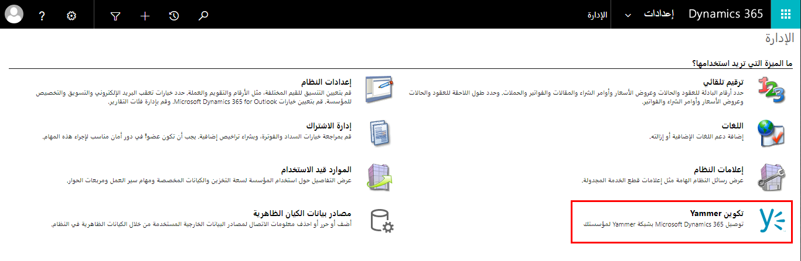
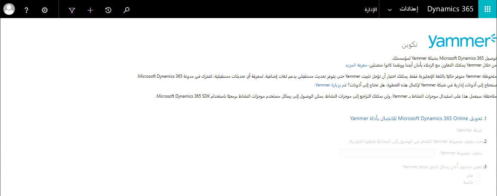
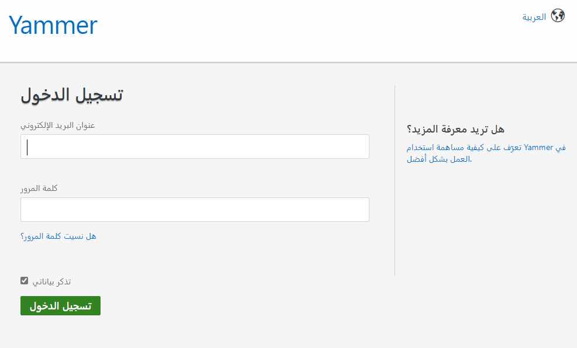

لتعزيز تعاون مؤسستك، استخدم تطبيقات Dynamics 365 للاتصال مباشرة بـ Yammer. Yammer هي أداة تركز على التعاون الداخلي داخل المؤسسة. يمكن تكوينه للعمل من داخل Dynamics 365.

لعمليات التوزيع الجديدة، يجب اعتبار تكامل Microsoft Team مع Dynamics 365 أكثر من Yammer لأنه يوفر تجربة تعاون أكثر حداثة.

### المتطلبات الأساسية
- قبل أن تتمكن مؤسستك من استخدام Yammer في تطبيقات Dynamics 365 Customer Engagement، تحتاج مؤسستك إلى تراخيص Yammer مؤسسية.

- لا يتوفر دمج Yammer إلا لتطبيقات Dynamics 365 Customer Engagement.

- تأكد من أن لديك دور أمان مسؤول النظام أو أذونات مكافئة في Microsoft Dynamics 365.

- ستحتاج أيضاً إلى التحقق من امتيازات مسؤول النظام لحساب Yammer لمؤسستك.

- قم بتثبيت آخر تحديثات المنتج لتطبيقات Dynamics 365 Customer Engagement.

**ملاحظة:** الاتصال بـ Yammer عملية أحادية الاتجاه. بعد إنشاء الاتصال، لا يمكن إزالته.

### تكوين Yammer للعمل مع Dynamics 365
1. من الواجهة الكلاسيكية، انتقل إلى **الإعدادات&gt;الإدارة**.   
‎  
‎

2. انقر فوق **تكوين Yammer.**

3. اقرأ إخلاء المسؤولية وحدد **متابعة**.

4. انقر فوق **تخويل Microsoft Dynamics 365 Online للاتصال بـ Yammer**   
‎  
‎

5. املأ بيانات الاعتماد. **ملاحظة:** يجب أن تكون قد تحققت من امتيازات مسؤول النظام لحساب Yammer لمؤسستك.  
‎  
‎ 

6. عند الانتهاء من ذلك، ستكون قد قمت بتكوين التكامل بين Yammer وDynamics 365.

> [!NOTE]
> لا تدعم تطبيقات Dynamics 365 Customer Engagement إلا الاتصال بشبكة Yammer الأساسية. الاتصال بالشبكات الخارجية في Yammer غير مدعوم.

### تمكين كيانات Dynamics 365 لـ Yammer
بمجرد توصيل تطبيقات Dynamics 365 Customer Engagement بـ Yammer، يلزمك تحديد كيانات التطبيقات Dynamics 365 Customer Engagement التي تم تمكينها للاستخدام مع Yammer. يمكن متابعة الكيانات الممكّنة من قبل المستخدمين.

1. انتقل إلى **إعدادات &gt; النظام**.

2. اختر **تهيئة موجز النشاط &gt; تكوينات المشاركة**

3. اختر الكيان، ثم اختر **تنشيط**.

4. قم بتأكيد التنشيط، ثم اختر **المزيد من الأوامر** (…) > **نشر كافة التخصيصات**

للحصول على معلومات إضافية، يرجى الاطلاع على [الاتصال بـ Yammer](/dynamics365/customer-engagement/admin/connect-yammer).
