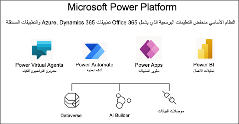
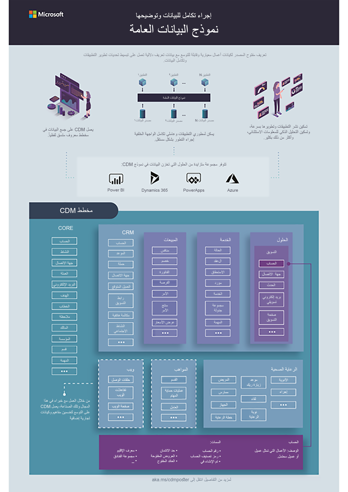

Dataverse هو أحدث جيل من النظام الأساسي طويل الأجل للتطبيقات‬ الذي عملت Microsoft على بنائه وتم تطويره من النظام الأساسي لتطبيقات Dynamics 365 الثابت فعاليتها. نموذج قابلية التوسعة قوي ويمكن استخدامه لبناء عدد كبير من حلول تطبيقات الأعمال. يمكن توسيع النظام الأساسي من خلال بناء تطبيقات وحلول خاصة بالمجال (قابلية توسعة رأسية) وكذلك عن طريق إنشاء مكونات عامة وكتل إنشائية (قابلية توسعة أفقية).

> [!div class="mx-imgBorder"]
> 

## مزايا Dataverse

يأتي Dataverse مزوداً بمجموعة موحدة من الميزات التي تُمكِّنك من إنشاء تعريفات تركز على الأعمال لبيانات مؤسستك وعمليات الأعمال داخل تطبيقات مختلفة. نظراً إلى أن البيانات وبيانات التعريف مخزنة في السحابة، فإنه يسهل التعامل مع التطبيقات وإدارتها. إضافة إلى ذلك، يتيح لك نموذج الأمان المدمج إمكانية التحكم في الوصول إلى الجداول والوظائف استناداً إلى أدوار المستخدم داخل مؤسستك.

قامت Microsoft بالفعل ببناء العديد من تطبيقات الطرف الأول في Dataverse، بما في ذلك Dynamics 365 for Sales وService وField Service وMarketing. من خلال إنشاء جميع التطبيقات استناداً إلى النظام الأساسي Dataverse نفسه، يمكنك توسيع نطاق تطبيقات أخرى أو التفاعل مع بياناتها داخل Dataverse.

### التعامل مع أي نوع من البيانات

يهدف تصميم Dataverse إلى معالجة أنواع البيانات الأكثر شيوعاً ويتضمن جميع الفئات الرئيسية لتقنيات البيانات التي تحتاج إليها مؤسستك؛ علائقية وغير علائقية وملف وصورة وبحث ومستودع بيانات. بصفة عامة، يستلزم ذلك من المطورين التعامل مع واجهات برمجة تطبيقات متعددة من محركات بيانات مختلفة. يوفر Dataverse واجهة برمجة تطبيقات (API)‏ موحدة أمام جميع البيانات التي تضمن التنفيذ المتناسق لأي منطق عمل مخصص يوسع السلوك الافتراضي.

يتضمن Dataverse مجموعة من المصممين المرئيين لإنشاء البيانات ونموذج البيانات وتحريرهما والتفاعل معهما. وهذا يسهل تحديد الجداول والعلاقات وقواعد العمل والنماذج وطرق العرض وعمليات سير العمل التي تمثل أعمالك بطريقة سريعة. يستطيع المطورون كذلك استخدام واجهة برمجة تطبيقات (API)‏ للتفاعل برمجياً مع بيانات تعريف النظام الأساسي مثل إنشاء الجداول والأعمدة.

يعمل Dataverse أيضاً على دعم الجداول الافتراضية. تعمل الجداول الافتراضية على تعيين البيانات في مصدر بيانات خارجي بحيث تظهر في Dataverse. وهذا يُمكّن Dataverse من تنفيذ عمليات البيانات في الوقت الحقيقي مقابل مصدر البيانات الخارجي. المزيد من المعلومات: [إنشاء الجداول الافتراضية التي تتضمن بيانات من مصدر بيانات خارجي وتحريرها](/powerapps/maker/data-platform/create-edit-virtual-entities/?azure-portal=true).

### التعامل مع أي نوع من التطبيقات

عندما ترغب مؤسسة في إنشاء تطبيق جديد، يمكنها تحقيق مكاسب إنتاجية أخرى باستخدام Dataverse مع Power Apps. يقوم Power Apps باستيعاب بيانات التعريف الغنية المضمنة في Dataverse واستخدامها بطرق متعددة لمساعدتك على بناء تطبيقات رائعة المظهر آمنة وقابلة للتوسيع بطريقة سريعة وإتاحتها عبر سطح المكتب والويب والجهاز المحمول وMicrosoft Teams.

بالنسبة إلى المطورين الذين يرغبون في دمج بيانات Dataverse في التطبيقات الحالية أو كتابة تطبيقات جديدة باستخدام كود مخصص، يقوم Dataverse بتوفير واجهة برمجة تطبيقات (API)‏ مستندة إلى REST لتسهيل التكامل. توفر واجهة برمجة تطبيقات (API)‏ REST تغطية كاملة لقدرات Dataverse ومن ثمَّ توفر نموذج قابلية توسعة غير مقيد لبناء تجارب مخصصة بالكامل.

## نموذج الأمان المدمج

بصفتك مطور بناء تطبيق، كنت معتاداً على الحاجة إلى تصميم نموذج الأمان الخاص للتطبيق وإنشائه. Dataverse يتضمن مجموعة من البنيات المنشأة سابقاً للسماح بتكوين نموذج أمان التطبيق. يستخدم Dataverse الأمان المستند إلى الدور لدمج مجموعة من الامتيازات التي تغطي الوصول إلى البيانات مع وظائف التفاصيل والأعمال على مستوى الصف التي يمكن أن تمتد عبر جداول متعددة. يمكن ربط أدوار الأمان هذه مباشرة بالمستخدمين أو يمكن إقرانها بفرق Dataverse ووحدات الأعمال.

نظراً إلى أن التحكم في الوصول على مستوى الصف قد لا يكون كافياً في بعض سيناريوهات الأعمال، يتضمن Dataverse ميزة أمان على مستوى العمود للسماح بمزيد من التحكم الدقيق في الأمان على مستوى العمود.

يشتمل Dataverse أيضاً على اثنين من بنيات الأمان التي يمكن استخدامها للتدرجات الهرمية: التدرج الهرمي للمدير والتدرج الهرمي للمنصب. باستخدام التدرج الهرمي للمدير، يجب أن يكون المدير ضمن وحدة العمل نفسها مثل التقرير، أو في وحدة العمل الأصلي لوحدة أعمال التقرير، للوصول إلى بيانات التقرير. يتيح التدرج الهرمي للمنصب الوصول إلى البيانات عبر وحدات الأعمال. ويمكن أن تكون هذه مفيدة في بناء نماذج أمان أكثر تعقيداً.

يستطيع المطورون أيضاً أتمتة مهام الأمان باستخدام واجهة برمجة تطبيقات (API)‏.

## وقت كتابة الكود

بصفتك مطور Microsoft Power Platform، تحتاج إلى فهم الفجوات الموجودة بين ما يمكن إنجازه من خلال التكوين مقابل الكود. في بعض الأحيان، يمكن ألا توفر الميزات الحالية الوظائف اللازمة لتلبية المتطلبات ويوفر Dataverse نقاطاً متعددة حيث يمكن للمطورين توسيع الوظائف المشتركة باستخدام الكود.

لتحديد الفجوات حيث لا توجد ميزات بالفعل، فمن المهم لجميع مطوري Microsoft Power Platform التعرف على قدرات Dataverse. إذا لم تكن على دراية ببناء التطبيقات باستخدام Power Apps التي تستخدم Dataverse, فإننا نوصيك بإكمال مسار التعليم [إنشاء تطبيق مستند إلى النموذج في Power Apps](/learn/paths/create-app-models-business-processes/?azure-portal=true) واستعراض [إنشاء تطبيق اللوحة من البداية باستخدام Microsoft Dataverse](/powerapps/maker/canvas-apps/data-platform-create-app-scratch/?azure-portal=true) في Power Apps وثائق المنشئ.

## أنواع قابلية التوسعة

بشكلٍ عام، يشار إلى أي أنشطة تخصيص مستندة إلى الكود على أنها "تمديد" تطبيق. لذلك، إذا لاحظت مصطلحات مثل قابلية التوسعة، فهذا يعني عادةً الكود فيما يتعلق بتطوير Power Apps. ضمن نموذج قابلية التوسعة، يتم تقسيم الأنشطة إلى مجموعتين أوسع: توسيع تجربة المستخدم وتوسيع النظام الأساسي أو Dataverse نفسه.

### توسيع تجربة مستخدم Power Apps

لتوسيع تجربة مستخدم تطبيق Power Apps، يمكنك استخدام Power Apps Component Framework (PCF) لإنشاء مكونات يمكن استخدامها عبر جميع أنواع Power Apps. يعرض Power Apps المستند إلى النماذج‬‏‫ واجهة برمجة تطبيقات (API)‏ عميل JavaScript التي تسمح لك بالتفاعل مع صفحات التطبيق لتنفيذ منطق الأعمال في نماذج التطبيق.

تقوم مداخل Power Apps باستخدام [لغة قوالب Liquid](/powerapps/maker/portals/liquid/liquid-overview/?azure-portal=true) لبناء محتوى ويب ديناميكي قائم على Dataverse وJavaScript لتوسيع تجربة المستخدم على صفحات الويب التي تتفاعل مع Dataverse.

في حين أن تطبيقات اللوحة لا توفر قدرات البرمجة النصية، إلا أنها مبنية باستخدام [Microsoft Power Fx](/power-platform/power-fx/overview/?azure-portal=true). Power Fx هي لغة ذات عدد قليل من الأكواد سيتم استخدامها عبر Microsoft Power Platform. إنها لغة برمجة ذات أغراض عامة وكتابة قوية وتوضيحية وعملية. يجب أن يشعر مطورو النظام الأساسي الأكفاء بالراحة عند استخدام اللغة وتحريرها في ملفات المصدر إذا لزم الأمر، ويكونوا قادرين على تصحيح التطبيقات باستخدام أدوات مثل Monitor. راجع [نظرة عامة على Power Apps مع Monitor](/powerapps/maker/monitor-overview/?azure-portal=true) للحصول على مزيد من المعلومات.

TypeScript هي لغة مُوصى باستخدامها في العديد من سيناريوهات البرمجة النصية. نظراً إلى أن TypeScript تقوم بالتجميع إلى JavaScript، يتم تعميم كلتا اللغتين في مصطلح "برنامج نصي للعميل". باستخدام البرنامج النصي للعميل، يمكنك تكوين معالجات أحداث النماذج بالطريقة نفسها التي تستخدمها لتكوين عنصر نموذج HTML. يمكنك أيضاً استدعاء وظائف البرنامج النصي من داخل شريط الأوامر (الشريط) ويمكن أن تستهلك موارد ويب البرنامج النصي للعميل من داخل موارد ويب HTML.

موارد ويب HTML هي البديل السابق لمكونات PCF وتستخدم أيضاً لعرض منطق العرض المخصص داخل نموذج في تطبيقات مستندة إلى نماذج عندما توجد متطلبات أكثر تقدماً لا يمكن تلبيتها باستخدام نماذج مبتكرة قياسية. يمكن أن تواجهها عند التعامل مع التطبيقات التي تم إنشاؤها قبل توفير مكونات PCF.

### توسيع Dataverse 

يلزم توسيع Dataverse كنظام أساسي كلما كانت هناك حاجة إلى مستوى معين من الأتمتة أو سلوك غير معتمد من جانب الميزات الحالية. تعمل هذه الأنواع من نقاط قابلية التوسعة ككود من جانب الخادم من خلال بناء يسمى المكون الإضافي. يعمل Power Automate والخيارات الأخرى على تمكين الأتمتة غير المتزامنة والمنطق، لكنها لم تكن قادرة على تنفيذ كل ما تستطيع المكونات الإضافية تنفيذه من حيث السلوك المتزامن. عندما تتوفر متطلبات العمليات المتزامنة داخل تطبيق، تظل المكونات الإضافية مطلوبة. تسمح المعالجة المتزامنة باستخدام المكونات الإضافية بمعاملة أي تعديلات Dataverse على أنها وحدة عمل واحدة في الحركة.

يعد تطوير المكونات الإضافية مهارة أساسية ومهمة شائعة يقوم بها مطور Microsoft Power Platform.

## حلول Dataverse

يتمثل أحد المفاهيم الأساسية عندما يتعلق الأمر بتطوير Dataverse وتوسيعه في بناء الحلول. حلول Dataverse هي حاويات للتطبيقات والمكونات الأخرى مثل مخططات الموقع والجداول والعمليات وموارد الويب والخيارات والتدفقات والمزيد. تستخدم الحلول لنقل التطبيقات والمكونات من بيئة إلى أخرى أو بهدف تطبيق مجموعة من التخصيصات على تطبيقات موجودة. الحلول هي كيفية تثبيت تطبيقات الطرف الأول من Microsoft وتطبيقات من موردي البرامج المستقلين في بيئتك.

الحلول هي آلية لتنفيذ إدارة دورة حياة التطبيق (ALM) في Microsoft Power Platform. للحصول على معلومات تفصيلية حول مفاهيم الحل، راجع [الحلول في Power Apps](/powerapps/maker/data-platform/solutions-overview/?azure-portal=true) في وثائق Dataverse. للحصول على مزيد من المعلومات حول كيفية استخدام الحلول لإدارة دورة حياة التطبيق، راجع [نظرة عامة على إدارة دورة حياة التطبيق (ALM) باستخدام Microsoft Power Platform](/power-platform/alm/overview-alm/?azure-portal=true) في دليل إدارة دورة حياة التطبيق (ALM) Microsoft Power Platform.

سنتحدث بإسهاب عن الحلول ونتعامل معها في المحتوى خلال هذه الوحدة.

## نظرة عامة على Common Data Model

دعماً لـ Open Data Initiative من Microsoft، يتوفر لدينا الآن Common Data Model الذي يتألف من مجموعة قابلة للتوسعة من المخططات التي تمثل مفاهيم الأعمال الشائعة. باستخدام مخطط شائع عبر كافة تطبيقات الأعمال مثل جهات الاتصال أو العملاء المتوقعين أو الحسابات أو المنتجات، يتم تبسيط إمكانية التشغيل المتداخل للبيانات بدرجة كبيرة.

فيما يأتي مخطط معلومات رسومي يمثل بشكلٍ فعال الوضع الحالي المتوفر لمخططات Common Data Model الأساسية. وهذا هو النظام البيئي المتطور، وهناك أخرى كثيرة ستظهر مع تقدم الوقت.

> [!div class="mx-imgBorder"]
> 

## استخدام Common Data Model

يتم الاحتفاظ بCommon Data Model في [GitHub](https://github.com/microsoft/CDM/?azure-portal=true). يتم الاحتفاظ بالمخططات على أنها ملفات بتنسيق json. يمكن العثور على مرجع الكيان الكامل في [Microsoft Docs](/common-data-model/schema/core/applicationCommon/overview/?azure-portal=true). توفر Microsoft أيضاً [متصفح الكيان المرئي](https://microsoft.github.io/CDM/?azure-portal=true) الذي يسمح للمستخدمين بالتنقل بشكلٍ مرئي بين كيانات Common Data Model.

عند البناء مقابل Common Data Model، تحتاج إلى فهم نهج الطبقات التي يتم اتباعه لبناء مخطط التطبيق المخصص. في أساس تطبيق Common Data Model يوجد مخطط أساسي يحتوي على كيانات شائعة الاستخدام مثل "الحساب" و"جهة الاتصال". ومن ثمَّ، يمكنك وضع وظيفة أو نماذج خاصة بالمجال لزيادة تسريع تطوير التطبيق المخصص الخاص بك، وبعد ذلك يمكنك بناء النماذج الخاصة بك. نوصيك بأنه إذا كان لديك سيناريو شائع تكون على أساسه إعادة استخدام البيانات ذات قيمة، فيجب عليك الانضمام إلى Open Data Initiative وبدء الإسهام في Common Data Model أيضاً.
