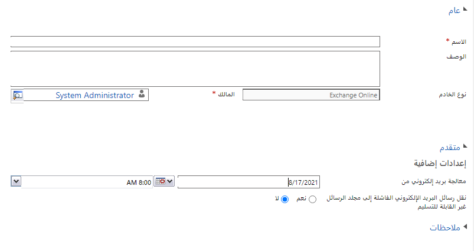
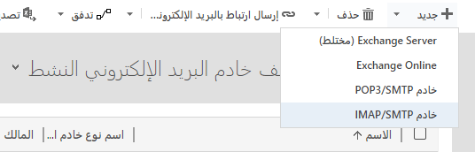

> [!VIDEO https://www.microsoft.com/videoplayer/embed/RWrMjF] 

## Microsoft Exchange ‏Online

يعد كل من Microsoft Dataverse للتطبيقات وMicrosoft Exchange ‏Online خدمات عبر الإنترنت ويعد توصيلهما تكويناً مباشراً للغاية. لاستخدام Exchange Online مع Dataverse للتطبيقات، يجب أن يكون لديك اشتراك Exchange Online 

> [!IMPORTANT]
> يدعم Dataverse للتطبيقات المزامنة من جانب الخادم مع Exchange Online في نفس المستأجر فقط. لا يتم دعم توصيل Dataverse بـ Exchange Online في مستأجر مختلف. 

عند توفير قاعدة بيانات Dataverse للتطبيقات، يتم تلقائياً إنشاء ملف التعريف الافتراضي لاتصال البريد الإلكتروني بـ Exchange Online. للتحقق من ملف التعريف هذا، انتقل إلى إعدادات البيئة في مركز إدارة Power platform، ثم حدد ملفات تعريف الخادم في قسم البريد الإلكتروني.

يجب أن يكون ملف تعريف Microsoft Exchange ‏Online في قائمة ملفات التعريف النشطة. إذا كان ملف تعريف Microsoft Exchange ‏Online مفقوداً، فتأكد من أن لديك اشتراك في Exchange Online وأنه موجود في نفس المستأجر مثل اشتراك Dataverse للتطبيقات.

الاتصال بـ Microsoft Exchange ‏Online باستخدام أي أنواع خوادم أخرى مثل Exchange Server (مختلط) أو خادم POP3/SMTP غير مدعوم.

بمجرد التحقق من ملف تعريف Microsoft Exchange ‏Online، يمكن استخدامه كملف تعريف افتراضي لصناديق البريد الجديدة المضافة إلى النظام. إذا كان هناك العديد من ملفات تعريف البريد الإلكتروني الموجودة في النظام، فحدد ملف تعريف Microsoft Exchange ‏Online في القائمة وحدد **تعيين كافتراضي**.

## الإعدادات المتقدمة

يسمح نموذج ملف تعريف الخادم لملف تعريف Microsoft Exchange ‏Online ببعض الإعدادات الإضافية في القسم "خيارات متقدمة".

يوجه خيار **معالجة البريد الإلكتروني من** عملية المزامنة فقط لمعالجة رسائل البريد الإلكتروني بعد التاريخ والوقت المحددين لجميع صناديق البريد المرتبطة بملف التعريف هذا. يكون هذا مفيداً إذا أضافت المؤسسة تطبيقات Dataverse للتطبيقات أو تطبيقات Dynamics 365 Customer Engagement إلى المستأجر بعد أن كانوا يستخدمون Exchange Online، وترغب في تتبع بعض رسائل البريد الإلكتروني السابقة فقط في سياق تطبيقات Dataverse. لاحظ أنه ستتم فقط معالجة الرسائل الإلكترونية السابقة التي لا تزال في البريد الوارد للمستخدم. سيؤدي ترك الحقل فارغاً إلى معالجة كل رسائل البريد الإلكتروني الموجودة في صناديق البريد الوارد للمستخدمين.

سينشئ خيار **نقل رسائل البريد الإلكتروني الفاشلة إلى مجلد غير قابل للتسليم** مجلداً غير قابل للتسليم في صناديق بريد المستخدمين وينقل رسائل البريد الإلكتروني التي لا يمكن تعقبها في Dataverse إلى هذا المجلد. لاحظ أن تمكين هذا الخيار قد يؤدي إلى نقل بعض رسائل البريد الإلكتروني المستلمة من مجلد البريد الوارد للمستخدم. على سبيل المثال، إذا تجاوز حجم المرفق الحد الأقصى للمرفقات المعين في Dataverse للتطبيقات.

## Microsoft Exchange المحلي

لمعالجة البريد في Dataverse للتطبيقات، يمكنك توصيل تطبيقاتك بـ Microsoft Exchange Server المحلي.

قبل الاتصال، يجب عليك التأكد من استيفاء المتطلبات الأساسية التالية:

| **Exchange Server**| يتم دعم الإصدارات التالية فقط: Exchange Server 2010 SP3 أو Exchange Server 2013 SP1 أو Exchange Server 2016 |
| - |
| **المصادقة**| يجب تمكين Windows أو المصادقة الأساسية في Exchange Server |
| **انتحال شخصية التطبيق**| عند الاتصال بخادم Exchange المحلي، يحتاج Dataverse للوصول إلى صناديق بريد المستخدمين. يتم ذلك باستخدام حساب خدمة مع دور ApplicationImpersonation. لمزيد من التفاصيل، راجع [انتحال الشخصية وEWS في Exchange](https://docs.microsoft.com/exchange/client-developer/exchange-web-services/impersonation-and-ews-in-exchange). |
| **اتصال آمن**| يجب أن يدعم خادم Exchange الاتصالات الآمنة (https) |
| **‏‫خدمات Exchange عبر الويب‬ (EWS)**| يجب أن يكون خادم Exchange يمكن الوصول إليه خارجياً باستخدام بروتوكول EWS. |

قد تحتاج إلى العمل مع مسؤول Exchange Server للتأكد من تلبية جميع هذه المتطلبات الأساسية.

### إنشاء ملف تعريف الخادم

للاتصال بخادم Exchange Server، يلزم وجود ملف تعريف خادم بريد إلكتروني جديد. لإنشاء ملف تعريف جديد، انتقل إلى إعدادات البيئة في مركز إدارة Power platform، ثم حدد ملفات تعريف الخادم في قسم البريد الإلكتروني.

في عرض القائمة، حدد جديد> Exchange Server (مختلط) لإنشاء ملف التعريف.

كحد أدنى، تحتاج إلى تحديد اسم ملف التعريف وبيانات الاعتماد لحساب خدمة Exchange الذي تم منحه دور ApplicationImpersonation. عادةً ما يكون هذا كافياً لعمليات النشر المحلية القياسية لـ Exchange Server التي تم تكوينها بشكل صحيح؛ ومع ذلك، قد تحتاج إلى مراجعة بعض الإعدادات المتقدمة وضبطها. راجع [الوثائق](https://docs.microsoft.com/dynamics365/customer-engagement/admin/connect-exchange-server-on-premises) للحصول على التفاصيل.

بعد حفظ ملف التعريف، يمكنك استخدام أمر اختبار الاتصال للتحقق من ملف التعريف. إذا كنت قد شغلت اختبار الاتصال ولديك مشكلات في اتصال ملف Exchange Server (المختلط)، فاستخدم المعلومات الموجودة في مربع الحوار اختبار الاتصال لتشخيص الاتصال وإصلاحه. 

بمجرد التحقق من ملف تعريف Microsoft Exchange (المختلط)، يمكن استخدامه كملف تعريف افتراضي لصناديق البريد الجديدة المضافة إلى النظام. إذا كان هناك العديد من ملفات تعريف البريد الإلكتروني الموجودة في النظام، فحدد ملف تعريف Microsoft Exchange ‏(المختلط) في القائمة وحدد **تعيين كافتراضي**.

## خوادم البريد الإلكتروني الأخرى

يدعم Dataverse للتطبيقات الاتصالات بخوادم البريد باستخدام بروتوكولات POP3 وSMTP. يتيح ذلك إمكانية التكامل مع أنظمة البريد الإلكتروني التابعة لجهات خارجية مثل Gmail أو Outlook.com.

تضيف القدرة على استخدام اتصالات POP3/SMTP المرونة إلى Dataverse للتطبيقات وعمليات نشر تطبيقات Dynamics 365 Customer Engagement.

- استخدم Dataverse للتطبيقات في عمليات النشر الحالية حيث تكون تقنيات الاتصال غير التابعة لـ Microsoft قيد الاستخدام بالفعل.

- تكوين أنظمة منفصلة لإرسال واستقبال رسائل البريد الإلكتروني، مع آليات مصادقة منفصلة؛ أو تكوين خادم غرض واحد فقط. على سبيل المثال، أنشئ للوارد فقط أو للصادر فقط. 

- استخدم أنظمة حركات الجهات الخارجية لإرسال رسائل البريد الإلكتروني التي لها حدود أعلى لمعالجة حجم البريد الإلكتروني من Exchange Online.

- تحديد واستخدام منافذ الاتصال غير القياسية.

عند تحديد النظام الخارجي وتكوينه، يمكنك أيضاً مراعاة القيود التالية:

- تحتاج خوادم البريد إلى دعم آلية المصادقة الأساسية.

- يتم دعم اتصالات TLS/SSL الآمنة فقط.

- يجب استخدام أسماء النطاقات المؤهلة بالكامل لمواقع الخادم، ولا يتم دعم الاتصالات باستخدام عناوين IP.

- الاتصالات المجهولة غير مدعومة.

- يجب استخدام بيانات اعتماد صندوق البريد لكل مستخدم لاتصال POP3، ولا يُسمح ببيانات اعتماد ملف التعريف. 

- هل يتطلب نشرك الامتثال لمعايير الأمان مثل [FIPS 140-2](https://en.wikipedia.org/wiki/FIPS_140-2)؟ يتوافق Dataverse للتطبيقات مع هذا المعيار ولكن بعض الأنظمة الخارجية فقط، على سبيل المثال Gmail أو Yahoo! البريد. 

- تم التحقق من صحة واختبار عدد محدود فقط من التكوينات بواسطة Microsoft. راجع [تكوين خدمة البريد الإلكتروني المدعوم](https://docs.microsoft.com/dynamics365/customerengagement/on-premises/admin/supported-email-service-configurations-server-side-synchronization) للتحقق مما إذا كان قد تم اختبار تكوين POP3/SMTP الخاص بك ودعمه.

قبل تكوين ملف تعريف خادم POP3/SMTP، يجب أن يكون لديك المعلومات التالية على الأقل:

- مواقع خوادم البريد الواردة و/أو الصادرة 

- معلومات المنفذ الواردة و/أو الصادرة (في حالة استخدام المنافذ غير القياسية)

- ما إذا كنت تريد استخدام بيانات الاعتماد لكل صندوق بريد مستخدم (محدد من قِبل كل مستخدم) أو الوصول إلى الخوادم باستخدام بيانات الاعتماد المحددة في ملف التعريف. 

### إنشاء ملف تعريف الخادم
للاتصال بخادم POP3/SMTP، يلزم وجود ملف تعريف خادم بريد إلكتروني جديد. لإنشاء ملف تعريف جديد، انتقل إلى إعدادات البيئة في مركز إدارة Power platform، ثم حدد ملفات تعريف الخادم في قسم البريد الإلكتروني

في عرض القائمة، حدد جديد > خادم POP3/SMTP لإنشاء ملف التعريف.

 

كحد أدنى، تحتاج إلى تحديد اسم ملف التعريف ومواقع خادم البريد الوارد و/أو الصادر. لاحظ أنه ليس عليك تحديد كلا الموقعين. سيؤدي هذا إلى إنشاء ملف تعريف لغرض واحد، سواء الوارد أو الصادر فقط. اعتماداً على النظام الخارجي، قد تحتاج إلى تحديد بعض المعلمات الإضافية. راجع [الاتصال بـ pop3 لخوادم SMTP](https://docs.microsoft.com/dynamics365/customer-engagement/admin/connect-to-pop3-or-smtp-servers) لمزيد من التفاصيل.

لا يوجد اختبار اتصال محدد لملف تعريف POP3/SMTP، ولكن يمكن اختبار صناديق البريد المرتبطة بملف التعريف. بعد إنشاء ملف التعريف، يمكن استخدامه كإعداد افتراضي لصناديق البريد الجديدة أو مقترن بصناديق البريد الموجودة لمعالجة البريد الإلكتروني. لاستخدام ملف التعريف افتراضياً عند وجود ملفات تعريف بريد إلكتروني متعددة في النظام، حدد ملف تعريف POP3/SMTP في القائمة، وحدد **تعيين كافتراضي**. 
 
