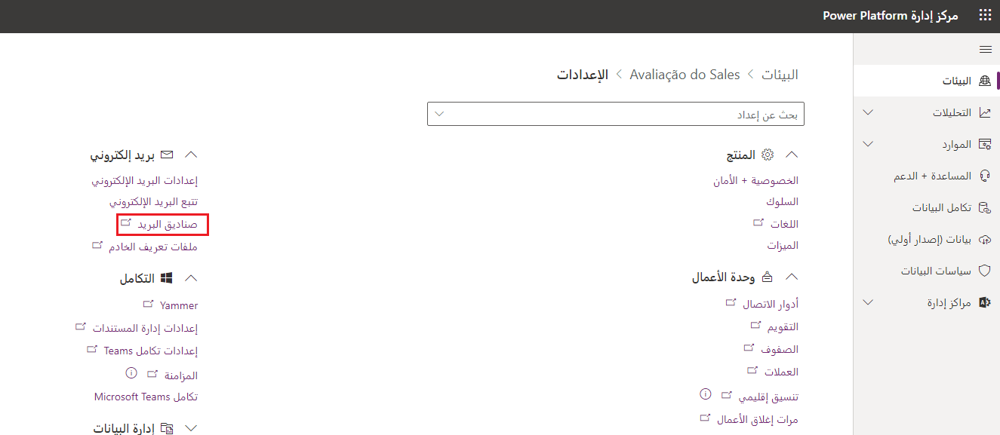
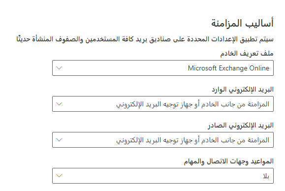
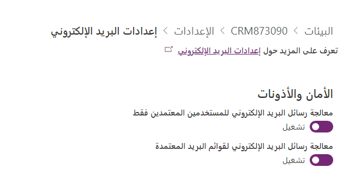
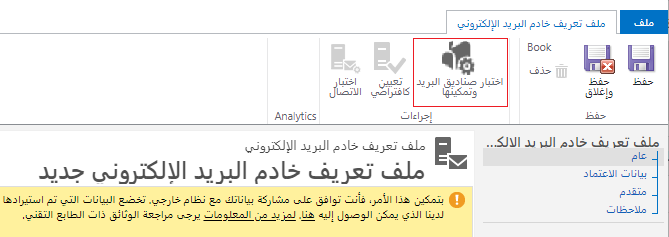
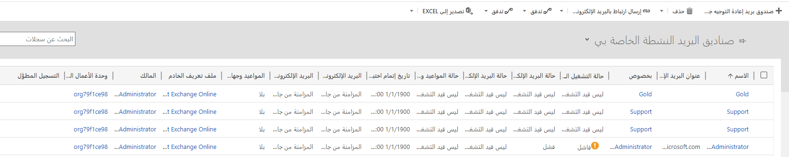

تُستخدم صناديق البريد في Microsoft Dataverse للتطبيقات لتوصيل سجلات المستخدم وقائمة الانتظار بصناديق البريد الخاصة بها على خادم البريد الإلكتروني لغرض تتبع الأنشطة مثل رسائل البريد الإلكتروني أو المواعيد. لا تقوم بتخزين أي معلومات حول الأنشطة المتعقبة بأنفسها. يتم إنشاء صناديق البريد تلقائياً عند إضافة مستخدمين جدد أو قوائم انتظار إلى النظام. يقترن كل مستخدم وكل سجل قائمة انتظار بصندوق بريد واحد فقط. 

تحتوي سجلات صندوق البريد هذه على معلومات التكوين الخاصة بصندوق بريد فردي على خادم البريد الإلكتروني، مثل عنوان البريد الإلكتروني وبيانات اعتماد صندوق البريد وطريقة مزامنة البريد الإلكتروني. لمعالجة رسائل البريد الإلكتروني باستخدام المزامنة من جانب الخادم للمستخدمين وقوائم الانتظار، يجب ربط سجلات صندوق البريد الخاصة بهم بسجل ملف تعريف خادم البريد الإلكتروني في Dataverse للتطبيقات.

يمكن الوصول إلى معلومات حول صناديق البريد والإعدادات ذات الصلة في قسم البريد الإلكتروني من إعدادات البيئة في [مركز إدارة Power Apps](https://admin.powerplatform.microsoft.com/).

يمكنك تكوين الإعدادات الافتراضية لصناديق البريد التي تم إنشاؤها حديثاً عن طريق تحديد إعدادات البريد الإلكتروني وتكوين طرق المزامنة.

### تكوين صناديق البريد
بالنسبة للمستخدمين الحاليين الذين تمت إضافتهم إلى النظام قبل الإعدادات المذكورة أعلاه، يجب عليك تعيين ملف تعريف الخادم وطريقة التسليم للبريد الإلكتروني والمواعيد وجهات الاتصال والمهام. يمكن الوصول إلى سجلات صندوق البريد الفردية عن طريق تحديد ارتباط صناديق البريد في الإعدادات.

يمكنك تغيير الإعدادات الخاصة بصناديق البريد المتعددة عن طريق تحديد صناديق البريد الهدف وإما باستخدام الأمر "تطبيق إعدادات البريد الإلكتروني الافتراضية" أو باستخدام أمر التحرير وتغيير الإعدادات الفردية.

### الموافقة على البريد الإلكتروني
يحدد قسم الأمان والأذونات في إعدادات البريد الإلكتروني ما إذا كانت المزامنة من جانب الخادم ستعالج البريد الإلكتروني للمستخدمين أو قوائم الانتظار التي لم تتم الموافقة على عناوين بريدهم الإلكتروني من قِبل مسؤول النظام.

عند استخدام Microsoft Exchange Online كملف تعريف خادم، تتم الموافقة تلقائياً على عناوين البريد الإلكتروني للمستخدمين الجدد. ومع ذلك، في ظل ظروف معينة، قد تظل بحاجة إلى الموافقة على عنوان البريد الإلكتروني لكل صندوق بريد مستخدم أو قائمة انتظار قبل أن يتمكن صندوق البريد من معالجة البريد الإلكتروني. على سبيل المثال، الموافقة مطلوبة إذا تغير عنوان البريد الإلكتروني للمستخدم ولم يُسمح بصناديق البريد التي لم تتم الموافقة عليها في النظام.

> [!NOTE]
> يجب أن تكون مسؤول Microsoft 365 العمومي أو مسؤول Dynamics 365 Service للموافقة على رسائل البريد الإلكتروني.

حدد صناديق البريد التي تريد الموافقة عليها، ثم حدد الموافقة على البريد الإلكتروني.

### اختبار تكوين صناديق البريد
قبل معالجة النظام لصناديق البريد التي تمت الموافقة عليها، يجب اختبارها وتمكينها. يمكنك أن تفعل ذلك:

- بالنسبة لصندوق البريد الفردي عن طريق فتح سجل صندوق البريد وتحديد اختبار وتمكين صندوق البريد. 

- بالنسبة لصناديق البريد المتعددة عن طريق تحديد صناديق البريد التي تريد اختبارها، ثم تحديد اختيار وتمكين صناديق البريد.

- لجميع صناديق البريد المرتبطة بملف تعريف خادم البريد الإلكتروني عن طريق فتح ملف التعريف وتحديد اختبار وتمكين صناديق البريد.

سيؤدي هذا إلى اختبار تكوين البريد الإلكتروني الوارد والصادر لصناديق البريد المحددة وتمكينها من معالجة البريد الإلكتروني. عند اختبار تكوين البريد الإلكتروني، يتم تشغيل مهمة غير متزامنة في الخلفية. قد يستغرق إكمال الاختبار بضع دقائق.

في حالة حدوث خطأ في صندوق بريد، يتم عرض تنبيه على جدار التنبيهات الخاص بصندوق البريد ومالك ملف التعريف. اعتماداً على طبيعة الخطأ، قد يقوم Dataverse للتطبيقات بإعادة محاولة المعالجة أو تعطيل صندوق البريد لمعالجة البريد الإلكتروني. 

يمكنك الوصول إلى جميع صناديق البريد الفاشلة من خلال عرض الاختبار وتمكين العرض الفاشل.

يتم عرض نتيجة اختبار تكوين البريد الإلكتروني في الحقول حالة البريد الإلكتروني الوارد وحالة البريد الإلكتروني الصادر والمواعيد وجهات الاتصال وحالة المهام في سجل صندوق البريد.

### صندوق بريد إعادة التوجيه
قد تتطلب مراقبة العديد من صناديق البريد في بعض الأحيان الحفاظ على بيانات اعتماد الوصول في ملفات تعريف تكوين واردة متعددة. لتقليل الجهود الإدارية، قد تختار مؤسستك استخدام صندوق بريد إعادة توجيه لمعالجة رسائل البريد الإلكتروني الواردة بدلاً من صناديق البريد الفردية. يتم استخدام صندوق بريد إعادة التوجيه كمربع تجميع لرسائل البريد الإلكتروني التي يتم نقلها من صندوق بريد كل مستخدم على نظام البريد الإلكتروني بواسطة قاعدة من جانب الخادم. يجب تخصيص صندوق بريد إعادة التوجيه للمزامنة على جانب الخادم ويجب ألا يتم استخدامه كصندوق بريد عامل من قِبل مستخدم فردي. يمكن استخدام هذا لمعالجة رسائل البريد الإلكتروني للمستخدمين وقوائم الانتظار التي تحتوي صناديق البريد الخاصة بها على أسلوب مزامنة البريد الإلكتروني الوارد المعين على إعادة توجيه صندوق البريد. يجب عليك إقران سجل صندوق البريد لإعادة التوجيه بسجل ملف تعريف خادم البريد الإلكتروني لمعالجة البريد الإلكتروني باستخدام المزامنة على جانب الخادم.

> [!NOTE]
> يمكنك استخدام صندق بريد Microsoft 365 مشترك وعدم استهلاك ترخيص Microsoft 365 لحساب إعادة توجيه البريد الإلكتروني.

بخلاف صناديق بريد المستخدم أو قائمة الانتظار، يجب إنشاء صندوق بريد إعادة توجيه يدوياً باستخدام أمر صندوق بريد إعادة توجيه جديد في عرض صناديق البريد. بمجرد إنشائه، يمكن الموافقة على صندوق بريد إعادة التوجيه واختباره كمستخدم عادي أو صندوق بريد في قائمة الانتظار.
