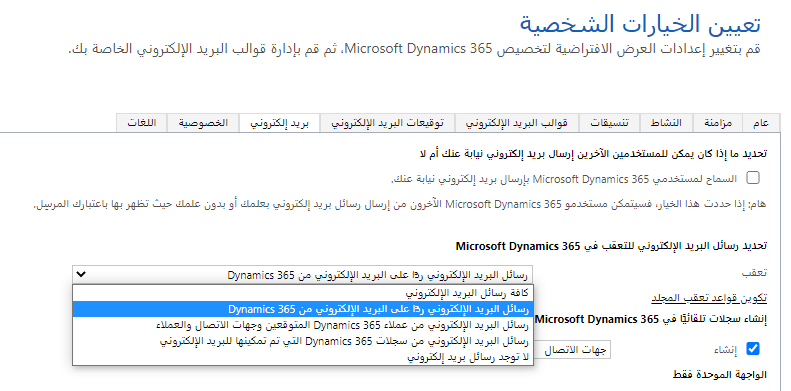

يمكنك استخدام المزامنة من جانب الخادم لمزامنة نظام البريد الإلكتروني الخاص بك مع Microsoft Dataverse للتطبيقات على مستوى الخادم. تعتمد كيفية معالجة رسائل البريد الإلكتروني والميزات المتوفرة لمستخدمي Dataverse على خيارات معالجة البريد الإلكتروني التي تم تكوينها في مركز إدارة Power platform ضمن إعدادات البيئة المحددة.

### إعدادات البريد الإلكتروني
هذه هي القرارات الأساسية التي تحتاج إلى اتخاذها فيما يتعلق بإعدادات البريد الإلكتروني:

- هل الموافقة الإدارية مطلوبة قبل معالجة رسائل البريد الإلكتروني لصناديق البريد الفردية؟

- ما إعدادات المزامنة الافتراضية لصناديق البريد الجديدة؟

- ما الحجم الأقصى للمرفقات (لن تتم مزامنة رسائل البريد الإلكتروني التي تحتوي على مرفقات تتجاوز الحد الأقصى)؟

- ما إذا كنت تريد السماح لمستخدمي Dataverse للتطبيقات بإنشاء رسائل بريد إلكتروني وإرسالها باستخدام عناوين البريد الإلكتروني فقط التي لا تتوافق مع سجل Dataverse الحالي مثل كجهة اتصال أو حساب أو مستخدم أو أي جدول آخر يدعم البريد الإلكتروني؟

- ماذا تفعل عندما يتطابق عنوان البريد الإلكتروني للمستلم مع سجلات متعددة في Dataverse للتطبيقات؟

راجع [إدارة إعدادات البريد الإلكتروني](/power-platform/admin/settings-email) لمزيد من المعلومات حول كيفية استخدام إعدادات البريد الإلكتروني الفردية.

### تعقب البريد الإلكتروني
عند معالجة البريد الإلكتروني الوارد بواسطة المزامنة على جانب الخادم، تحتاج العملية إلى اتخاذ بعض القرارات بشأن ما إذا كان البريد الإلكتروني بحاجة إلى التعقب (أي، تحويله إلى سجل نشاط في Dataverse للتطبيقات) وكيفية ربط البريد الإلكتروني بسجلات أخرى في تطبيقك. على سبيل المثال، عند التواصل مع أحد العملاء بشأن حالة دعم حالية، من المهم التعامل مع جميع رسائل البريد الإلكتروني ذات الصلة كمحادثة واحدة بخصوص الحالة.

### الخيارات الشخصية

يتم تكوين رسائل البريد الإلكتروني التي يتم تعقبها لكل مستخدم أو أساس قائمة الانتظار باستخدام إعدادات المستخدم الشخصية أو خصائص سجل قائمة الانتظار، على التوالي. 

توضح هذه الصورة إعدادات المسار الخاصة بالمستخدم الفردي، وتتوفر إعدادات مسار مماثلة عند تحرير سجل قائمة الانتظار. خيارات المسار المتاحة هي:

- جميع رسائل البريد الإلكتروني. كما يوحي الاسم، سيتم تعقب جميع رسائل البريد الإلكتروني المستلمة في صندوق البريد على أنها أنشطة Dataverse للتطبيقات.

- رسائل البريد الإلكتروني رداً على البريد الإلكتروني من Dynamics 365. تقرر العملية ما إذا كنت تريد تعقب بريد إلكتروني باستخدام إعدادات تعقب المحادثة للبيئة (انظر أدناه).

- رسائل البريد الإلكتروني من عملاء Dynamics 365 المتوقعين وجهات الاتصال والحسابات. سيتم استخدام عنوان البريد الإلكتروني للمرسل للبحث في هذه الكيانات فقط وتعقب البريد الإلكتروني، إذا تم العثور على تطابق.

- رسائل البريد الإلكتروني من سجلات Dynamics 365 التي تم تمكينها للبريد الإلكتروني. سيتم استخدام عنوان البريد الإلكتروني الخاص بالمرسل للبحث في جميع الكيانات التي تدعم البريد الإلكتروني وتعقب البريد الإلكتروني إذا تم العثور على تطابق.

بالإضافة إلى إعدادات التعقب هذه، يمكن للمستخدمين أيضاً تكوين قواعد تعقب المجلد إذا تم تمكين التعقب على مستوى المجلد داخل البيئة. تعقب المجلد هو آلية تعقب بديلة تعتمد على مجلدات خادم Exchange حيث يتم تخزين رسائل البريد الإلكتروني بدلاً من المعلومات داخل البريد الإلكتروني نفسه.

### إنشاء سجلات تلقائياً في Microsoft Dynamics 365

بشكل افتراضي، عند استلام المستخدم لرسالة متعقبة أو طلب اجتماع من مرسل غير معروف، يظل سجل المرسل دون حل حتى يربطه المستخدم يدوياً بسجل موجود ممكّن بواسطة البريد مثل جهة الاتصال. 

يؤدي تحديد خانة الاختيار إنشاء إلى تمكين إنشاء السجل تلقائياً لمرسلين غير معروفين. يمكن للمستخدم تحديد ما إذا كان سيتم إنشاء جهة اتصال أو عميل متوقع (إذا كان متاحاً) تلقائياً. سيتم تعيين جهة الاتصال أو سجلات العملاء المتوقعين التي تم إنشاؤها تلقائياً كمرسلين للبريد الإلكتروني أو طلبات الاجتماع المقابلة.

### الإعدادات العمومية

تحدد إعدادات تعقب البريد الإلكتروني العالمية داخل البيئة كيفية تجميع رسائل البريد الإلكتروني في محادثات وما إذا كانت رسائل البريد الإلكتروني "رداً على" رسائل البريد الإلكتروني، عندما يتم تحديد هذا الخيار من قِبل المستخدمين الفرديين. حدد خيار تعقب البريد الإلكتروني في إعدادات المؤسسة في مركز إدارة النظام الأساسي للطاقة لتكوين هذه الخيارات.

### تعقب محادثات البريد الإلكتروني

يسمح لك قسم تعقب محادثات البريد الإلكتروني بتكوين كيفية اتخاذ القرار بشأن البريد الإلكتروني الوارد كجزء من محادثة موجودة. يمكن تعقب رسائل البريد الإلكتروني باستخدام الطرق التالية:

- استخدام الارتباط. عند التمكين، سيحاول النظام تجميع رسائل البريد الإلكتروني في محادثات باستخدام خصائص البريد الإلكتروني المتاحة في رؤوس البريد الإلكتروني. 

- الرمز المميز للتعقب. كل بريد إلكتروني يتم إرساله أو استلامه سيكون له رمز مميز يضاف إلى سطر الموضوع. يضمن تعقب الرموز، ما لم يتم تعديلها يدوياً من قبل المستخدمين، دقة التعقب ولكنك تحتاج إلى مراعاة الآثار المترتبة على الموضوعات المعدلة. على سبيل المثال، عند التمكين، قد يبدو الموضوع مثل "Sale Pricing CRM: 0123456" حيث CRM: 0123456 هو رمز التعقب.

- استخدام المطابقة الذكية. سيستخدم النظام مجموعة من الموضوع والمرسل والمستلم لمطابقة رسائل البريد الإلكتروني المستلمة مع أنشطة البريد الإلكتروني داخل Dataverse للتطبيقات.

### تعقب المجلد

تمكين التعقب على مستوى المجلد لمجلدات Exchange عند تمكين المزامنة من جانب الخادم. سيتم تلقائياً تعقب جميع رسائل البريد الإلكتروني التي تظهر في مجلدات تم تكوينها مسبقاً. يتم تكوين المجلدات من قِبل المستخدمين في إعدادات البريد الإلكتروني الشخصية. 

### استخدام الفئات

بالنسبة لمستخدمي Outlook، يمكن للمسؤولين تمكين تعقب رسائل البريد الإلكتروني باستخدام فئة Outlook المكونة مسبقاً. إذا تم تمكين تعقب الفئات على مستوى المؤسسة، فاستخدم هذه الخيارات للسماح للمستخدمين بتعقب رسائل البريد الإلكتروني باستخدام فئة Outlook.

لا يتطلب تعقب الفئات ولكنه يعمل مع Dynamics 365 App for Outlook. راجع [استخدام فئة Outlook لتعقب المواعيد ورسائل البريد الإلكتروني](/dynamics365/customer-engagement/admin/use-outlook-category-track-appointments-emails) للمسؤولين حول تفاصيل كيفية تعامل Dynamics 365 App for Outlook مع تعقب الفئات.

> [!NOTE]
> التعقب المستند إلى الفئات غير مدعوم في Dynamics 365 for Outlook ويوصى بعدم تمكينه في مؤسسة تطبيقات Dataverse التي تم إعدادها لاستخدام Dynamics 365 for Outlook.

### التعقب بين الأشخاص

عند إرسال بريد إلكتروني بين مستخدمي Dataverse للتطبيقات أو قوائم الانتظار، يمكن تسجيله كنشاط واحد أو نشاطين، صادر ووارد. عادةً ما يعتمد تحديد كيفية تعقب رسائل البريد الإلكتروني بين مستخدمي Dataverse للتطبيقات على متطلبات التنفيذ التلقائي واحتياجات تعقب.

راجع [إدارة إعدادات تعقب البريد الإلكتروني](/power-platform/admin/settings-email-tracking) لمزيد من المعلومات حول كيفية استخدام إعدادات تعقب البريد الإلكتروني الفردية.
