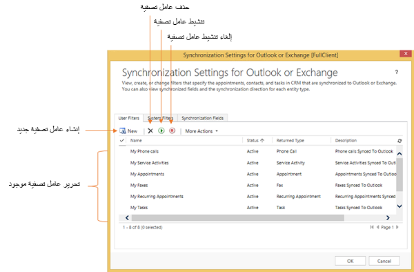

> [!VIDEO https://www.microsoft.com/videoplayer/embed/RWrUh7]

### تفعيل التطبيق لبرنامج Outlook

لكي يتمكن المستخدمون من استخدام Dynamics 365 App for Outlook مع بيئتك، يجب عليك إكمال بعض الأعمال التمهيدية. في العديد من عمليات التوزيع، ستحتاج إلى التنسيق مع واحد أو أكثر من مسؤولي النظام للتطبيقات لتمكين التطبيق للمستخدمين بنجاح.

فيما يلي الخطوات عالية المستوى لتمكين التطبيق للمستخدمين:

- قم بتأكيد الحد الأدنى من المتطلبات لاستخدام التطبيق

- تأكد من حصول المستخدمين على الامتيازات المطلوبة في أدوار الأمان المعينة لهم 

- أكمل أي تخصيص لتطبيق Outlook لتوزيعك

- ادفع التطبيق إلى بعض أو كل المستخدمين في مؤسستك أو اسمح لهم بالتثبيت حسب الحاجة.

### المتطلبات

من أجل استخدام التطبيق، يجب أن يكون للتوزيع مزامنة لرسائل البريد الإلكتروني من خلال المزامنة على جانب الخادم التي تم تكوينها وتمكينها للمستخدمين. يجب أن تملك أيضاً الإصدار 9.0 من تطبيقات Dynamics 365 for Customer Engagement أو إصدار أحدث في بيئة Microsoft Dataverse التي تقوم بتكوينها. يجب أن يكون لدى المستخدمين إما تطبيق Outlook لسطح المكتب، أو Outlook لنظام التشغيل iOS، أو Outlook لـ Android، أو يمكنهم استخدام Outlook Web Access عبر أحد المستعرضات المدعومة. إذا كنت تقوم بتكوين عملية توزيع Exchange Online باستخدام الإصدارات الحالية لما سبق، فلا داعي لاعتبارات خاصة. بالنسبة لعمليات توزيع Exchange المحلية أو تفاصيل دعم إصدار أقدم محدد، قم بمراجعة متطلبات الإصدار التفصيلية لـ [توزيع Dynamics 365 App for Outlook](/dynamics365/customer-engagement/outlook-app/deploy-dynamics-365-app-for-outlook). 

### امتيازات الأمان المطلوبة

يتم التحكم في الوصول إلى Dynamics 365 App for Outlook بشكل أساسي من خلال امتياز استخدام دور الأمان Dynamics 365 App for Outlook. تم تمكين هذا افتراضياً في العديد من أدوار الأمان الافتراضية التي تأتي مع تطبيقات Dynamics 365. إذا كنت تعمل بأدوار أمان مخصصة أو دور افتراضي مع عدم تمكين الامتياز، فستحتاج إلى التأكد من تمكين هذا للمستخدمين الذين ترغب في استخدام التطبيق. يوجد الامتياز في علامة التبويب إدارة الأعمال كما ترى في الصورة التالية.

سيرى المستخدمون الذين ليس لديهم هذا الخطأ التالي "لم يتم تخويلك لاستخدام هذا التطبيق. تحقق مع مسؤول النظام لتحديث إعداداتك

بالإضافة إلى ذلك، إذا كنت تستخدم أدوار أمان مخصصة أو دوراً افتراضياً لم يتم تكوينه بالفعل للتطبيق، فأنت بحاجة إلى التأكد من توفير حقوق الوصول التالية للمستخدمين أيضاً.

- علامة التبويب "إدارة الأعمال": وصول القراءة / الكتابة إلى مستوى مستخدم جدول "صندوق البريد"

- علامة تبويب التخصيصات: الوصول للقراءة / الكتابة على مستوى المستخدم لجدول بيانات تعريف تطبيق المستخدم

- علامة تبويب التخصيصات: يجب أن يكون للجدول، والعمود، والتطبيق المستند إلى النموذج، والعلاقة، والبيانات التعريف لتطبيق النظام، ونموذج النظام والعرض حق الوصول للقراءة على مستوى المستخدم.

إذا كان لديك العديد من أدوار الأمان المخصصة، فيمكنك أيضاً التفكير في إنشاء وظيفة مستهدفة محددة، على سبيل المثال التطبيق لـ Outlook Access الذي تم تكوين استحقاقات الأمان هذه ثم قم بتعيين هذا الدور بالإضافة إلى الأدوار المخصصة الحالية.

تم تكوين وحدة التطبيق Dynamics 365 App for Outlook أيضاً لتقييد رؤية التطبيق للمستخدمين الذين لديهم أحد أدوار الأمان التي تم تكوينها في قائمة أدوار وحدة التطبيق. تم تكوين التطبيق مبدئياً ليشمل أدوار الأمان التي تم تمكين امتياز Dynamics 365 App for Outlook لها. إذا كنت تستخدم دور أمان مختلفاً، فستحتاج إلى تمكينه لوحدة التطبيق. يمكنك القيام بذلك عن طريق النقر فوق إدارة الأدوار من التطبيق كما ترى في الصورة التالية. يمكنك الوصول إلى هذه القائمة على موقع. 

 

في قائمة أدوار الأمان للتطبيق، حدد دور الأمان الخاص بك وتأكد من فحصه.

### تخصيص التطبيق لبرنامج Outlook

إن التطبيق الذي يتفاعل معه المستخدم في Outlook هو ببساطة تطبيق Power Apps يستند إلى نموذج يتم عرضه في سياق تطبيق Outlook. قد تجد أن التهيئة الافتراضية ليست مثالية للتوزيع لأنها تعرض أشياء كثيرة جداً أو لا تعرض الأشياء المناسبة للمستخدمين. يمكنك تخصيص وحدة التطبيق هذه باستخدام نفس مصمم التطبيق الذي تستخدمه لإنشاء تطبيقات أخرى تعتمد على النموذج. يمكنك اختيار إجراء هذا التخصيص في أي وقت، وغالباً ما يكون مطلوباً قبل تمكين التطبيق للمستخدمين. سنغطي هذا بمزيد من التفصيل في موضوع منفصل في هذه الوحدة.

### تمكين التطبيق للمستخدمين

بمجرد التأكد من استيفاء المتطلبات الأساسية وحصول المستخدمين المستهدفين على استحقاقات الأمان المطلوبة، فإن الخطوة التالية هي دفع التطبيقات إلى المستخدمين إذا كنت تريد ذلك. يتم ذلك عبر الإعدادات -> Dynamics 365 App for Outlook. من هنا يمكنك القيام بما يلي

- قم بتمكين التثبيت التلقائي للتطبيق للمستخدمين المؤهلين - وهذا يضمن للمستخدمين الجدد الحصول على الإعداد تلقائياً

- دفع التطبيق لجميع المؤهلين

- حدد المستخدمين المؤهلين من القائمة وادفع التطبيق تحديداً إليهم.

ليس مطلوباً دفع التطبيق إلى المستخدمين، يمكنهم إضافة التطبيق عبر إدارة الوظائف الإضافية في Outlook إذا كانوا مؤهلين.

### تكوين الوظيفة الإضافية لبرنامج Outlook

Dynamics 365 for Outlook هي وظيفة إضافية لبرنامج Outlook يتم تثبيتها فعلياً على جهاز عميل يقوم بتشغيل عميل سطح مكتب Outlook. تستخدم هذه الوظيفة الإضافية تقنية تكامل قديمة للعمل مع Outlook. هذا يختلف عن Dynamics 365 App for Outlook الذي تم تناوله في الموضوع السابق الذي يستخدم تقنية تكامل Outlook الحديثة. سيستمر دعم Dynamics 365 for Outlook الذي تمت مناقشته في هذا الموضوع ولكنه لن يتلقى الميزات الجديدة.   

راجع [الدعم المتواصل لوظيفة Outlook الإضافية](https://blogs.msdn.microsoft.com/crm/2018/01/29/continued-support-for-outlook-add-in-dynamics-365-for-outlook/) لمزيد من التفاصيل. 

يجب أن تستخدم عمليات التوزيع الجديدة Dynamics 365 App for Outlook الجديدة حيثما أمكن ذلك.

في هذا الموضوع، سوف نغطي بعض الأشياء التي يجب أن تكون على دراية بها إذا كنت تعمل على توزيع مع Dynamics 365 for Outlook.

يسمح Dynamics 365 for Outlook بالوصول إلى تطبيق Customer Engagement من داخل سياق تطبيق Outlook. بالإضافة إلى ذلك، فإنه يوفر دعماً لتتبع البريد الإلكتروني والمواعيد والمهام دون تثبيت المزامنة على جانب الخادم. يعد الدعم غير المتصل لبيانات Dynamics 365 أيضاً ميزة أساسية. يتيح Dynamics 365 for Outlook أيضاً دمج البريد Microsoft Word مع بيانات Dynamics 365.

### التثبيت Dynamics 365 for Outlook

يجب تثبيت Dynamics 365 for Outlook على جهاز كمبيوتر كل مستخدم ثم يحتاج بعد ذلك إلى التهيئة. لإجراء التثبيت على الكمبيوتر، يجب أن تتمتع بإمكانية تسجيل الدخول إلى الكمبيوتر كمسؤول محلي. بالإضافة إلى التثبيت باستخدام المثبت، يمكنك أيضاً التثبيت من موجه الأوامر أو باستخدام System Center Configuration Manager (SCCM). 

### التكوين

بعد اكتمال التثبيت، سترى مربع الحوار التالي يطالبك بتكوين التطبيق. 

يمكنك الإلغاء في هذه المرحلة وتشغيل التهيئة لاحقاً. يمكنك أيضاً تكوين بيئات Dataverse إضافية مؤهلة عن طريق إعادة تشغيل معالج التكوين. يمكنك القيام بذلك من ابدأ -> كافة البرامج -> Microsoft Dynamics 365 for Customer Engagement، ثم انقر فوق معالج التكوين.

### متطلبات إذن أمان المستخدم

لتنفيذ إجراءات مختلفة مع Dynamics 365 for Outlook، يجب أن يكون لدى المستخدمين امتيازات أمان مناسبة لأدوار الأمان المعينة لهم. يتم تكوين العديد من أدوار أمان Dynamics 365 الافتراضية مسبقاً مع الأذونات المطلوبة لـ Dynamics 365 for Outlook. إذا كنت تستخدم أدوار أمان مخصصة فقط، فالرجاء الاطلاع على [الأذونات المطلوبة لـ Dynamics 365 for Outlook مهام](/dynamics365/customer-engagement/outlook-addin/admin-guide/permissions-required-tasks).

### تكوين التزامن

يستخدم Dynamics 365 for Customer Engagement عوامل تصفية المزامنة لتحديد الصفوف المراد مزامنتها مع Outlook أو Exchange (عند استخدام المزامنة على جانب الخادم). في Dynamics 365 for Outlook يمكنك تكوين الإعدادات عبر ملف -> تطبيقات Dynamics 365 for Customer Engagement -> خيارات. سيؤدي هذا إلى تشغيل مربع الحوار التالي الذي يسمح لك بتهيئة عوامل التصفية.

من هنا يمكنك تكوين عوامل تصفية المستخدم، أو إذا كان لديك أذونات إدارية، يمكنك تكوين عوامل تصفية النظام والتحكم في الأعمدة التي تتم مزامنتها. يمكن لمسؤولي النظام تعديل عوامل التصفية على مستوى المؤسسة باستخدام SDK أو أدوات المجتمع.

بالإضافة إلى هذه الإعدادات، يمكنك أيضاً تكوين إعدادات إضافية للنظام تتعلق بالمزامنة. يمكن الوصول إليها من إعدادات النظام -> علامة التبويب التزامن. تتحكم هذه الإعدادات في قواعد المؤسسة بأكملها للمواعيد وجهات الاتصال والمهام. 

الرجاء مراجعة [مربع حوار إعدادات النظام - علامة التبويب "التزامن"](/dynamics365/customer-engagement/outlook-addin/user-guide/system-settings-dialog-box-synchronization-tab) لمزيد من المعلومات.

### العمل بغير الاتصال بالإنترنت

Dynamics 365 for Outlook لديه القدرة على أخذ مجموعة فرعية من البيانات الإجمالية دون اتصال بالإنترنت. يتم تعقب التغييرات على البيانات غير المتصلة وتشغيلها عندما يتصل المستخدم بالخادم. لاستخدام هذه الميزة، يجب عليك تحديد البيانات التي سيتم التقاطها في وضع عدم الاتصال ويجب أن يمتلك المستخدم امتياز Go Offline. لتحديد مجموعة فرعية من البيانات، يتم تكوين عوامل التصفية دون اتصال للمستخدم.

إذا كان لديك مستخدمون يعملون دون اتصال، فاعلم أن أي أتمتة قمت بتكوينها للتشغيل لن يتم تشغيلها حتى يتصل المستخدم مرة أخرى بالخادم ويتم تطبيق تغييرات الصف.

### تخصيص التطبيق لبرنامج Outlook

Dynamics 365 App for Outlook هو تطبيق Power Apps يستند إلى نموذج تم تكوينه مسبقاً للتشغيل في سياق Microsoft Outlook بما في ذلك Outlook Web Access. قد تجد أن التهيئة الافتراضية ليست مثالية للتوزيع لأنها تعرض أشياء كثيرة جداً أو لا تعرض الأشياء المناسبة للمستخدمين. يمكنك تخصيص هذا التطبيق باستخدام نفس مصمم التطبيق الذي تستخدمه لإنشاء تطبيقات أخرى تعتمد على النموذج. يمكنك اختيار إجراء هذا التخصيص في أي وقت، وغالباً ما يكون مطلوباً قبل تمكين التطبيق للمستخدمين. 

فيما يلي الأنواع الشائعة من التخصيصات المدعومة:

- أزل الكيانات الافتراضية من التطبيق التي لم يتم استخدامها

- تمكين الجدول المخصص لتظهر في التطبيق

- تكوين طرق العرض التي تظهر في التطبيق لـ Outlook

- تكوين البحث في الأعمدة المخصصة

- تخصيص المسار المتعلق بالبطاقة.

التخصيصات التالية غير مدعومة حالياً وقد تؤدي إلى تطبيق غير مستقر:

- تخصيص مخطط الموقع لوحدة التطبيق App for Outlook

- تغيير التطبيق للوحة المعلومات الافتراضية في Outlook.

### التحكم في الكيانات التي تظهر في التطبيق

من قائمة التطبيقات في بيئتك، حدد موقع التطبيق Dynamics 365 App for Outlook وحدد تحرير. بمجرد تحميل التطبيق في المصمم، سترى شيئاً مثل الصورة التالية:

عند تحديد الكيانات في لوحة المكونات اليمنى، يمكنك رؤية قائمة بما يتم تضمينه وما هو غير موجود وإجراء التعديلات اللازمة لمتطلباتك.

أهم شيء يجب تذكره هو مشاركة هذا التطبيق مع جميع المستخدمين، لذا فإن أي تغيير تقوم بإجرائه يؤثر على جميع المستخدمين في تلك البيئة. على سبيل المثال، إذا كان لديك بعض المستخدمين الذين يحتاجون إلى الوصول إلى جدول وآخرون لا يحتاجون إليه، فإن تخصيص التطبيق ليس أداة مناسبة وسيكون من الأفضل لك استخدام أدوار الأمان للتحكم في رؤية الجدول.

إذا كنت تضيف كيانات مخصصة جديدة لتظهر في قائمة الإنشاء السريع، فتأكد من تمكين الإنشاء السريع في الجدول ومن وجود نموذج إنشاء سريع تم تكوينه بشكل صحيح.

لكي تظهر الكيانات المخصصة في البحث بخصوص عنصر متعقب، يجب أن يكون لديك الجدول المخصص ممكّناً للأنشطة.

### تكوين وجهات النظر

لزيادة قابلية استخدام التطبيق، قم بإزالة العناصر التي لا يحتاجها المستخدمون أو لا يستخدمونها. في كثير من الأحيان، تحتوي التطبيقات على العديد من طرق العرض المتوفرة ولكن ليس جميعها منطقية في سياق العمل مع تطبيق Outlook. من خلال تحديد موقع الجدول في اللوحة الرئيسية للمصمم والنقر فوق طرق العرض، يمكنك تكوين طرق العرض المضمنة في التطبيق لـ Outlook.

### تكوين عمود البحث المخصص

يستخدم تطبيق Outlook طريقة عرض البحث لتحديد الأعمدة التي يبحث عنها عند إجراء بحث لتعيين ما يتعلق بالنشاط. بالنسبة للأعمدة المخصصة في جدول، يجب عليك تحرير طريقة عرض البحث التي تم إنشاؤها وإضافة أي أعمدة مخصصة تريد البحث عنها في طريقة العرض.
