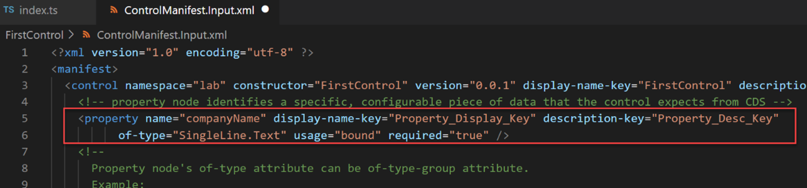

يشارك المطورون بشكل عام عندما يكون من الصعب أو المستحيل تحقيق تجربة المستخدم المطلوبة باستخدام نهج التعليمات البرمجية المنخفضة. تتمثل طريقتان من أكثر الطرق شيوعاً للمطور لتحسين تجربة المستخدم في إنشاء مكون تعليمات برمجية لـ Power Apps Component Framework أو تنفيذ بعض البرامج النصية للعميل. مكونات التعليمات البرمجية تسمح لك بتنفيذ مرئيات مخصصة يمكن استخدامها بواسطة اللوحة أو التطبيقات التي تعتمد على النموذج تماماً مثل أي من عناصر التحكم الجاهزة. ليس المقصود من البرمجة النصية للعميل أن تكون مرئية ولكن المقصود منها تطبيق قواعد العمل بطريقة برمجية. تنطبق البرمجة النصية للعميل فقط على المداخل والتطبيقات التي تعتمد على النموذج. يتبع كلا الأسلوبين الأنماط الإرشادية ونماذج الكائنات التي يجب أن تكون على دراية بها عند استخدام أي منهما للتوسعة. وفي بقية هذا الموضوع، سنستكشف المزيد عن كلا الخيارين بمزيد من التفصيل.

## <a name="power-apps-component-framework"></a>Power Apps component framework

يتم تطبيق مكونات التعليمات البرمجية باستخدام HTML وCSS وTypeScript. على الرغم من عدم مطالبتك باستخدام أي إطار عمل خاص لواجهة المستخدم، [إلا أن React](https://reactjs.org/?azure-portal=true) هو خيار شائع.

> [!div class="mx-imgBorder"]
> [](../media/component-framework.png#lightbox)

لإنشاء مكون تعليمات برمجية، تحتاج إلى تنفيذ واجهة توفر طريقة متسقة لتطبيق الاستضافة للتفاعل مع المكون الخاص بك. لبدء تطوير مكون التعليمات برمجية الذي يقوم بتطبيق تلك الواجهة، استخدم أداة واجهة سطر الأوامر (CLI) Power Apps لتهيئة ملفات المكون الخاص بك من قالب عمود أو مجموعة بيانات. يحتوي هذا القالب على عناصر نائبة لتطبيق الواجهة المطلوبة.

تنشئ أداة CLI ملف بيان يصف الملفات التي يتكون منها المكون الخاص بك كموارد. يحدد البيان أيضاً أي خصائص متاحة للاستخدام بواسطة التطبيق الذي يستضيف المكون. في المثال التالي، تم تعريف خاصية اسم الشركة (companyName).

> [!div class="mx-imgBorder"]
> [](../media/manifest.png#lightbox)

عند استخدام هذا المكون من قبل صانعي التطبيقات، سيكون لديهم خيارات إما تعيين قيمة لاسم الشركة بشكل ثابت أو ربطها بشكل ديناميكي بأحد أعمدة البيانات المتوفرة في التطبيق. تسمح الخصائص للتطبيق والمكون بالاتصال بالبيانات دون الحاجة إلى فهم التطبيق لتنفيذ المكون.

كما يسمح لك البيان بتمكين الميزات. عندما يتم تمكين ميزة عن طريق وضع علامة على أنها مطلوبة في البيان، يمكن لمنطق مكون التعليمات البرمجية استخدام واجهة برمجة تطبيقات (API)‏ الأصلية (API) المرتبطة بالميزة. على سبيل المثال، يتيح تمكين ميزة Device.captureAudio التحكم في التعليمات البرمجية لاستدعاء ميكروفون الجهاز لتسجيل الصوت.

`
<feature-usage>
   <uses-feature name="Device.captureAudio" required="true" />
    <uses-feature name="Device.captureImage" required="true" />
    <uses-feature name="Device.captureVideo" required="true" />
    <uses-feature name="Device.getBarcodeValue" required="true" />
    <uses-feature name="Device.getCurrentPosition" required="true" />
    <uses-feature name="Device.pickFile" required="true" />
    <uses-feature name="Utility" required="true" />
    <uses-feature name="WebAPI" required="true" />
 </feature-usage>
`

يدير وقت تشغيل التطبيق دورة الحياة والتواصل مع مكون التعليمات البرمجية المستضاف. يتم تحقيق ذلك من خلال فئة مكون التعليمات البرمجية الخاصة بك التي تقوم بتنفيذ واجهة StandardControl.

`export class FirstControl implements ComponentFramework.StandardControl<IInputs, IOutputs> {}`

تتطلب هذه الواجهة تنفيذ الطرق التالية:

-   **init** - يستخدم لتهيئة مثيل المكون. يمكن للمكونات بدء تشغيل مكالمات الخادم البعيد وإجراءات التهيئة الأخرى.

-   **updateView** - سيتم استدعاء هذا الأسلوب عند تغيير أي قيمة في حقيبة الخصائص. يتضمن ذلك قيم الأعمدة ومجموعات البيانات والقيم العمومية مثل ارتفاع الحاوية وعرضها وحالة عدم الاتصال وقيم بيانات التعريف للمكونات مثل التسمية والقيمة المرئية وما إلى ذلك.

-   **إتلاف** - يتم استدعاء هذا الأسلوب عند إزالة المكون من شجرة DOM. استخدمه لتنظيف وتحرير أي ذاكرة يستخدمها المكون.

-   **getOutputs (اختياري)** - يتم استدعاؤه بواسطة إطار العمل قبل أن يتلقى المكون البيانات الجديدة. يُرجع كائناً بناءً على nomenclature المحدد في البيان، ويتوقع كائنات للخاصية التي تم وضع علامة عليها على أنها مرتبطة.

تتطلب منك مكونات التعليمات البرمجية فقط تنفيذ الحد الأدنى الضروري للسماح بالاتصال المتسق والتجربة المتوافقة مع تطبيق الاستضافة.

## <a name="client-scripting"></a>البرمجة النصية للعميل

تتيح لك البرمجة النصية للعميل استخدام JavaScript في تطبيقات Power Apps المستندة إلى نموذج لتنفيذ قواعد العمل. يجب استخدام البرمجة النصية للعميل كبديل عندما لا تفي قواعد العمل التعريفية بالمتطلبات. تعمل البرمجة النصية للعميل على نموذج يستند إلى نموذج استجابة لأحداث النموذج التالية:

-   تحميل النموذج

-   تغيير البيانات في عمود

-   يتم حفظ النموذج

بالإضافة إلى ذلك، يمكن تكوين زر شريط أوامر لاستدعاء برنامج نصي للعميل عند الضغط عليه.

أثناء كتابة المنطق الخاص بك في JavaScript من المهم أن نلاحظ أنه على الرغم من أن النموذج هو HTML فقط، فلا يُسمح لك بمعالجة محتويات النموذج مباشرةً. توفر البرمجة النصية للعميل نموذج كائن مع استدعاءات الأسلوب للتفاعل مع مكونات النموذج المختلفة. يضمن ذلك عزل منطق عملك عن أي تغييرات في التخطيط أو HTML المحدد الذي يُستخدم في عرض النموذج.

فيما يلي مثال على البرمجة النصية للعميل التي تعالج كلاً من تحميل النموذج وتغيير العمود.

```
// A namespace defined for the sample code
// As a best practice, you should always define 
// a unique namespace for your libraries
var Sdk = window.Sdk || {};
(function () {
    // Define some global variables
    var myUniqueId = "_myUniqueId"; // Define an ID for the notification
    var currentUserName = Xrm.Utility.getGlobalContext().userSettings.userName; // get current user name
    var message = currentUserName + ": Your JavaScript code in action!";

    // Code to run in the form OnLoad event
    this.formOnLoad = function (executionContext) {
        var formContext = executionContext.getFormContext();

        // display the form level notification as an INFO
        formContext.ui.setFormNotification(message, "INFO", myUniqueId);

        // Wait for 5 seconds before clearing the notification
        window.setTimeout(function () { formContext.ui.clearFormNotification(myUniqueId); }, 5000);
    }

    // Code to run in the attribute OnChange event 
    this.attributeOnChange = function (executionContext) {
        var formContext = executionContext.getFormContext();

        // Automatically set some column values if the account name contains "Contoso"
        var accountName = formContext.getAttribute("name").getValue();
        if (accountName.toLowerCase().search("contoso") != -1) {
            formContext.getAttribute("websiteurl").setValue("https://www.contoso.com");
            formContext.getAttribute("telephone1").setValue("425-555-0100");
            formContext.getAttribute("description").setValue("Website URL, Phone and Description set using custom script.");
        }
    }

    // Code to run in the form OnSave event 
    this.formOnSave = function () {
        // Display an alert dialog
        Xrm.Navigation.openAlertDialog({ text: "Record saved." });
    }
}).call(Sdk);
```

يمكنك متابعة [معاينة كاملة](/powerapps/developer/model-driven-apps/clientapi/walkthrough-write-your-first-client-script/?azure-portal=true) لهذا المثال للحصول على تفاصيل حول كيفية ربطه بالنموذج.

باستخدام البرمجة النصية للعميل، يمكن للمطور أن يجعل النموذج أكثر سهولة من قبل المستخدم عن طريق إخفاء الأعمدة المناسبة وعرضها، والتحقق من صحة البيانات، والمهام الشائعة الأخرى المطلوبة لتحسين تجربة المستخدم.
