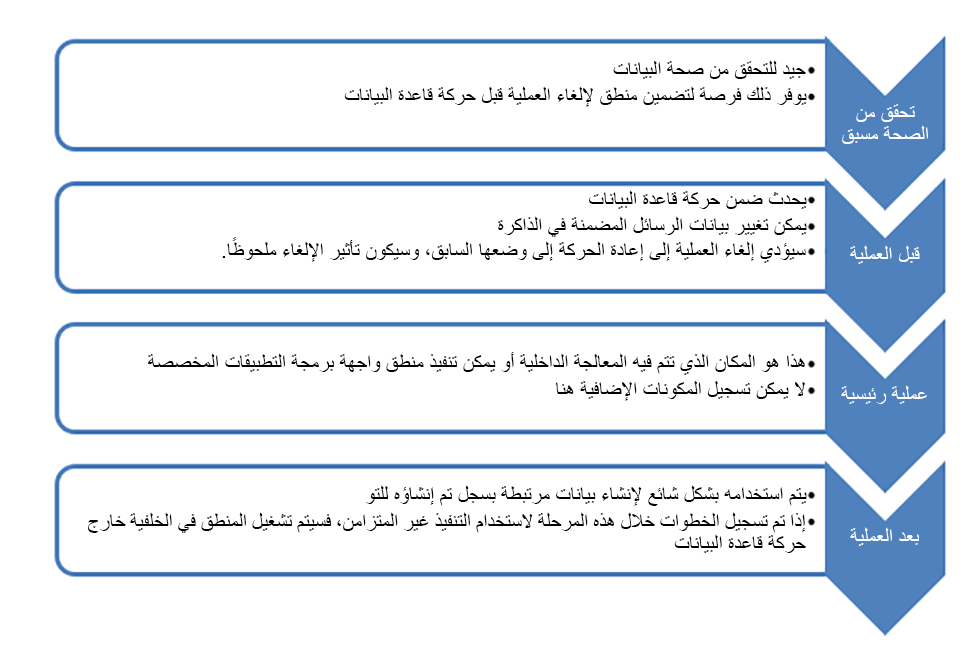

في هذا الموضوع، سوف نستكشف نقاط التوسعة في Dataverse المتاحة للمطورين. تضع بنية Dataverse بنية قائمة على الرسائل لمعالجة الطلبات. تتم معالجة كل رسالة طلب من خلال البنية الأساسية لبرنامج ربط العمليات التجارية للحدث والذي يحتوي على نقاط امتداد لتشغيل منطق عمل مخصص يتم تنفيذه بواسطة المكونات الإضافية. وهناك العديد من الرسائل المقدمة الجاهزة وفي كل مرة يتم فيها إنشاء جدول جديد تتم إضافة رسائل جديدة لدعم هذا الجدول. من خلال إنشاء API مخصصة، يمكنك أيضاً إنشاء رسالة جديدة.

المفهوم الأساسي هو أنه بغض النظر عن كيفية الوصول إلى البيانات، تتم معالجتها دائماً كرسالة عبر البنية الأساسية لبرنامج ربط العمليات التجارية للحدث، ويتم تنفيذ أي منطق عمل مخصص. وهذا صحيح سواء كنت تستخدم واجهة المستخدم للتطبيق، أو إحدى واجهات برمجة التطبيقات (API)، أو تقوم بتنفيذ عمليات إدارية مثل استيراد البيانات. لا توجد طريقة مباشرة لتعديل بيانات Dataverse من شأنها تجاوز نظام التشغيل أو المنطق المخصص المسجل.

## استخدام API

يوفر Dataverse نمطين من API التي يمكن للمطورين استخدامها للتفاعل مع البيانات: عنوان API للويب وخدمة Organization. فيما يلي نظرة عامة فاحصة لكل منهما:

-   **عنوان API للويب** - [عنوان API للويب](https://docs.microsoft.com/powerapps/developer/data-platform/webapi/overview/?azure-portal=true) متاح على نقطة نهاية OData v4 RESTful. استخدم هذا لأي لغة برمجة تدعم طلبات ومصادقة HTTP باستخدام OAuth 2.0. يمكنك الحصول على أمثلة [هنا](https://github.com/microsoft/PowerApps-Samples/tree/master/cds/webapi/C%23/?azure-portal=true).

-   **خدمة Organization** - [خدمة Organization](https://docs.microsoft.com/powerapps/developer/data-platform/org-service/overview/?azure-portal=true) هي .NET Framework SDK مع تجميعات NET المقدمة من Microsoft مع مولدات الفئات المكتوبة لفئات الجدول. عند الوصول إلى البيانات من أحد المكونات الإضافية، فهذه هي طريقة الوصول إلى البيانات. يتم إنشاء مثيل الخدمة وتوفيرها لرمز المكون الإضافي دون الحاجة إلى المصادقة. تتوفر الخدمة أيضاً للاستخدام على عميل Windows. يمكنك الحصول على أمثلة [هنا](https://github.com/microsoft/PowerApps-Samples/tree/master/cds/orgsvc/C%23/?azure-portal=true).

تدعم كل من APIs أساليبها الخاصة لبناء استعلامات البيانات بالإضافة إلى الدعم [FetchXML](https://docs.microsoft.com/powerapps/developer/data-platform/use-fetchxml-construct-query/?azure-portal=true). FetchXML هي لغة استعلام مملوكة يتم استخدامها في Dataverse. تسمح لغة FetchXML بصياغة الاستعلامات المعقدة عبر الجداول ذات الصلة واستخدام شروط وعوامل تشغيل Dataverse المحددة. يدعم موصل Power Automate Dataverse أيضاً FetchXML.

## البنية الأساسية لبرنامج ربط العمليات التجارية للحدث

عند تنفيذ إجراء مثل إنشاء سجل في تطبيق أو إنشاء سجل باستخدام واجهة برمجة التطبيقات (API)‏، تتم معالجة رسالة إنشاء بواسطة Dataverse. تتم معالجة الرسالة في البنية الأساسية لبرنامج ربط العمليات التجارية للحدث والذي يوفر مجموعة متسقة من المراحل التي تمر بها الرسالة. يمكن أن تحتوي كل مرحلة باستثناء العملية الرئيسية على مكون إضافي متصل بها لتشغيل منطق مخصص. فيما يلي المراحل المدعومة كرسالة تبدأ من الأعلى وتتقدم عبر مراحل البنية الأساسية لبرنامج ربط العمليات التجارية:

> [!div class="mx-imgBorder"]
> 

يمكن أن يساعدك الفهم القوي لكيفية معالجة الرسائل على فهم السلوكيات، وكيفية تنفيذ المنطق المخصص والمكان الأفضل له. يعد فهم البنية الأساسية لبرنامج ربط العمليات التجارية ضرورياً أيضاً للتعرف على كيفية ملاءمة المكونات الإضافية وواجهات برمجة التطبيقات (APIs) المخصصة. يمكنك قراءة المزيد عن تفاصيل إطار عمل الحدث [هنا](https://docs.microsoft.com/powerapps/developer/data-platform/event-framework/?azure-portal=true).

## بناء المكونات الإضافية

المكونات الإضافية هي فئات .NET التي تنفذ واجهة **IPlugin** المقدمة من قبل تجميعات SDK في Dataverse. تتطلب هذه الواجهة تنفيذ أسلوب واحد فقط يسمى "التنفيذ". فيما يلي مثال على الحد الأدنى من التنفيذ:

`
    public sealed class MyFirstPlugin : IPlugin
    {
        public void Execute(IServiceProvider serviceProvider)
        {
               //Business Logic 
         }
    }
`

تحتوي طريقة **التنفيذ** على معلمة واحدة من نوع **IServiceProvider**. تحتوي هذه الواجهة على أسلوب واحد **GetService** يمكنك استخدامه لاسترداد الخدمات المتاحة للمكوِّن الإضافي. فيما يلي أمثلة على الخدمات المتاحة:

-   **IPluginExecutionContext** - يمنحك هذا الوصول إلى الرسالة التي تتم معالجتها ومعلومات حول مقدم الطلب.

-   **ITracingService** - يمنحك هذا الوصول للكتابة في سجل التتبّع لأغراض التشخيص.

-   **IOrganizationServiceFactory** - يمنحك هذا الوصول لاسترداد **OrganizationService** لاستخدامها في الوصول إلى البيانات من المكون الإضافي.

فيما يلي مثال على استخدام **GetService** للحصول على سياق التنفيذ:

`IPluginExecutionContext context = (IPluginExecutionContext)                        serviceProvider.GetService(typeof(IPluginExecutionContext));`

يمكن أن يمنحك استخدام context.InputParameters حق الوصول إلى الرسالة الأصلية وتمنحك context.OutputParameters إمكانية الوصول إلى ما يتم إرجاعه إلى المتصل.

يعد الفهم الجيد لسياق التنفيذ أمراً أساسياً لمطور المكون الإضافي. يمكنك معرفة المزيد عن سياق التنفيذ [هنا](https://docs.microsoft.com/powerapps/developer/data-platform/understand-the-data-context/?azure-portal=true).

لكي يتم تنفيذ مكون إضافي، يجب أن يتم تسجيله ليتم تشغيله لرسالة معينة. يمكن تحقيق ذلك باستخدام أداة Plugin Registration tool.

## واجهات APIs مخصصة

يتم تعريف العمليات في Dataverse كرسائل. توفر واجهات APIs طريقة أولية للتعليمة البرمجية لتعريف الرسائل الجديدة التي يمكنك توسيع خدمات الويب في Dataverse عليها. يمكن بعد ذلك استدعاء هذه الرسائل، مثل رسائل النظام تماماً، ولكن لتنفيذ منطق عمل مخصص. على سبيل المثال، إذا كانت لديك متطلبات معينة للبحث عن عميل باستخدام تسلسل محدد مسبقاً لمكالمات API، بدلاً من أن يقوم كل متصل لدى API بتنفيذ هذا التسلسل، يمكنك تنفيذ API مخصصة لـ *findcustomer*. ستقوم API الخاصة بـ *findcustomer* الآن بتنفيذ المنطق المطلوب للبحث عن العميل وإرجاع النتائج. سيضمن ذلك أنه بدلاً من أن يقوم كل تطبيق بمعرفة كيفية العثور على عميل والقيام بذلك بشكل غير متسق، يمكنه استدعاء API المخصصة التي من شأنها معالجة طلبات البحث بنفس الطريقة في كل مناسبة. وإذا كانت هناك حاجة إلى أي تغييرات، فسيلزم تنفيذها في مكان واحد فقط.

لتعريف API مخصصة جديدة، عليك أن تبدأ بإنشاء سجل API المخصصة. يمكن القيام بذلك من خلال مدخل الصانع، من خلال الكود، أو باستخدام حلول Dataverse. كجزء من إنشاء السجل، يمكنك تحديد اسم API المخصصة ومعلمات الطلب والاستجابة.

لتنفيذ منطق API المخصصة، يمكنك إنشاء مكون إضافي وتسجيله في مرحلة التشغيل الرئيسية للبنية الأساسية لبرنامج ربط العمليات التجارية. تنفيذ API المخصصة هو السيناريو الوحيد حيث يمكن تسجيل مكون إضافي في مرحلة التشغيل الرئيسية. سنعرض لك مثالاً على القيام بذلك لاحقاً في التدريب. لا يمكنك أيضاً تنفيذ مكون إضافي والسماح باستخدام API المخصصة لتشغيل أتمتة أخرى. على سبيل المثال، قد يؤدي إنشاء API مخصصة تحتوي على بيانات حول حدث وقع في نظام آخر إلى السماح لهذا النظام باستدعاء API في Dataverse، حيث توجد العديد من نقاط التكامل المختلفة مع Azure أو Web Hooks أو Power Automate، أو المكونات الإضافية غير المتزامنة على API ستتمكن من بدء عمليات أتمتة أخرى.
