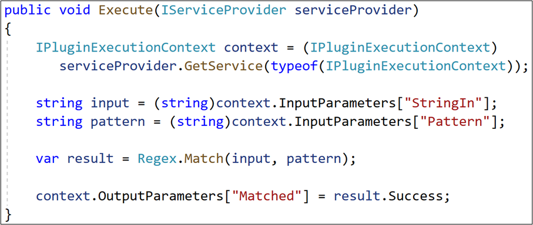
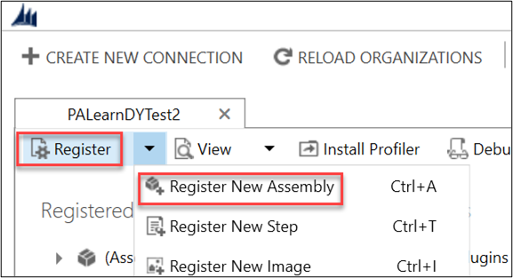
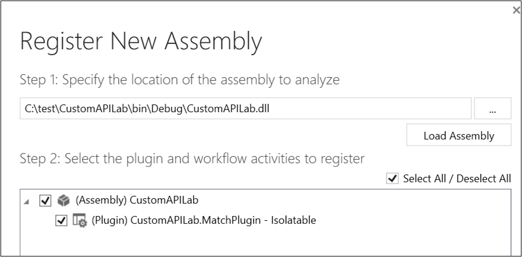
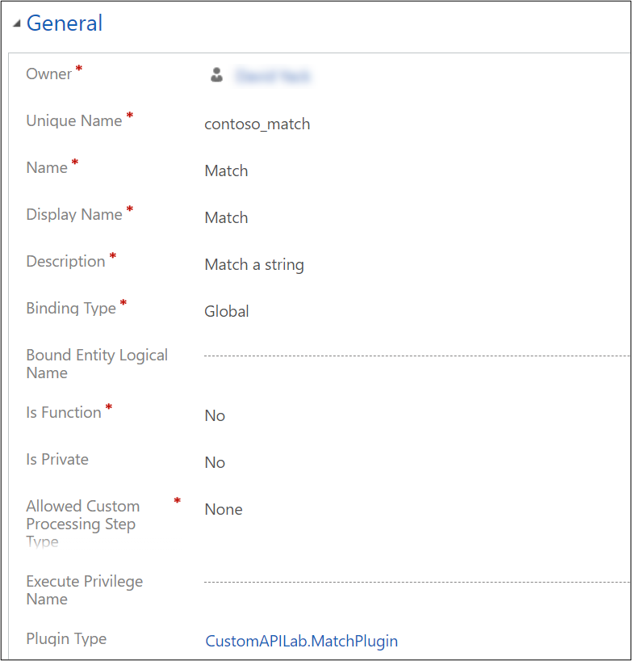

في هذا التمرين، سيتم إنشاء واجهة API مخصصة لتنفيذ بعض المنطق المخصص. بعد ذلك، ستستخدم واجهة API المخصصة من إحدى خطوات تدفق في Power Automate.

> [!IMPORTANT]
> استخدام بيئة اختبار مع توفير Microsoft Dataverse. وإذا لم يتوفر لديك، يمكنك الاشتراك في خطة المجتمع [هنا](https://powerapps.microsoft.com/communityplan/?azure-portal=true).

## المهمة 1: إنشاء مشروع واجهة API المخصصة

1.  في Visual Studio حدد **ملف > مشروع جديد**.

1.  حدد قالب مشروع من **مكتبة الصنف (NET Framework.)** وانقر فوق "التالي".

    > [!IMPORTANT]
    > تأكد من تحديد إصدار NET Framework. لقالب مكتبة الصنف وليس الإصدار NET Standard. وNET Core.

1.  أطلق على المشروع اسم **CustomAPILab**.

1.  حدد **.NET Framework 4.6.2**.

1.  انقر فوق **إنشاء**.

1.  أعِد تسمية ملف **class1.cs** إلى **MatchPlugin.cs**.

1.  انقر فوق **نعم** لإعادة تسمية مربع حوار ملف.

1.  انقر بزر الماوس الأيمن على **Project CustomAPILab** وحدد **الخصائص**.

1.  انقر فوق **توقيع** ثمّ حدد خانة الاختيار **توقيع التجميع**. يلزم التوقيع على الإضافات بواسطة مفتاح اسم قوي.

1. في القائمة المنسدلة **اختر اسم قوي** حدد **جديد**.

1. استخدم **CustomAPILab.snk** لاسم الملف الرئيسي.

1. ألغِ تحديد **حماية ملفي الرئيسي بكلمة مرور**.

1. انقر فوق **موافق**.

    > [!div class="mx-imgBorder"]
    > 

1. انقر بزر الماوس الأيمن فوق **مراجع** داخل مشروع CustomAPILab وحدد **إدارة حزم NuGet**.

    > [!div class="mx-imgBorder"]
    > 

1. حدد علامة التبويب **استعراض** واكتب **crmsdk** في حقل البحث، ثم حدد **Microsoft.CrmSdk.CoreAssemblies**.

    > [!div class="mx-imgBorder"]
    > 

1. في لوحة التفاصيل، انقر فوق **تثبيت**. قم بتأكيد التثبيت، ومراجعة الترخيص وقبوله عند مطالبتك بذلك.

1. ابحث عن **System.Text.RegularExpressions** وانقر فوق **تثبيت**.

1. افتح الملف **MatchPlugin.cs**

1. قم بإضافة ما يلي باستخدام عبارات تلو الأخرى في الجزء العلوي من الملف.

    `
    using Microsoft.Xrm.Sdk;
    using System.Text.RegularExpressions;
    `

1. غيّر تعريف الفئة لتطبيق واجهة **IPlugin**.

1. قم بإضافة طريقة التنفيذ التالية داخل الفئة.

    `
        public void Execute(IServiceProvider serviceProvider)
        {
        }
    `

1. يجب أن تبدو الفئة الخاصة بك كالتالي:

    > [!div class="mx-imgBorder"]
    > 

1. قم بإضافة الأسطر التالية إلى طريقة التنفيذ للحصول على سياق تنفيذ المكون الإضافي.

    `
                IPluginExecutionContext context = (IPluginExecutionContext)
                    serviceProvider.GetService(typeof(IPluginExecutionContext));
    `

1. قم بإضافة الأسطر التالية بعد الحصول على السياق. تحصل هذه الأسطر على القيمة من معلمات الإدخال التي تمّ تمريرها على استدعاء واجهة API المخصصة.

    `
                string input = (string)context.InputParameters["StringIn"];
                string pattern = (string)context.InputParameters["Pattern"];
    `

1. قم بإضافة السطر التالي لاحقاً لاستدعاء طريقة Regex.Match.

    `            var result = Regex.Match(input, pattern);`

1. وأخيراً، قم بإضافة السطر التالي لتعيين معلمة الإخراج باعتبارها "مطابقة".

    `            context.OutputParameters["Matched"] = result.Success;`

1. يجب أن تبدو طريقة التنفيذ الخاصة بك الآن كالتالي:

    > [!div class="mx-imgBorder"]
    > 

1. انقر فوق **بناء > بناء حل**

## المهمة 2: تسجيل المكون الإضافي لواجهة API المخصصة

1.  إذا لم تكن أداة **PluginRegistration** مُثبّتة لديك، فاتبع [هذه الإرشادات](https://docs.microsoft.com/powerapps/developer/data-platform/download-tools-nuget/?azure-portal=true) لتنزيل أدوات SDK وتثبيتها بما في ذلك **PluginRegistration**.

1.  ابدأ تشغيل أداة **PluginRegistration**.

1.  قم بتسجيل الدخول باستخدام بيانات اعتماد الاختبار الخاصة بك. وحدد بيئة الاختبار إذا طلب منك ذلك.

1.  اختر **تسجيل > تسجيل تجمع جديد**

    > [!div class="mx-imgBorder"]
    > 

1.  انقر فوق ... ثم استعرض للوصول إلى المجلد bin\Debug في المشروع.

1.  حدد **CustomAPILab.dll**

1.  انقر فوق **موافق**

    > [!div class="mx-imgBorder"]
    > 

1.  انقر فوق **تسجيل المكونات الإضافية المُحددة**.

1.  انقر فوق **موافق** في رسالة النجاح. المكون الإضافي الخاص بك جاهز للاتصال بواجهة API المخصصة التي سنقوم بإنشاء في المهمة التالية.

## المهمة 3: إنشاء واجهة API المخصصة

1.  انتقل إلى [Power Apps بوابة الشركة المصنّعة](https://make.powerapps.com/?azure-portal=true) وتأكد من وجودك في البيئة الصحيحة.

1.  حدد "الحلول: في جزء التنقل الأيمن.

1.  انقر فوق **+ حل جديد**.

1.  أدخل **معمل واجهة API مخصصة** في اسم العرض.

1.  حدد **ناشر CDS الافتراضي** في القائمة المنسدلة "الناشر".

1.  انقر فوق **إنشاء**. يؤدي هذا إلى إنشاء حل مُخصص يشتمل على مكوناتنا.

1.  في قائمة الحلول انقر فوق اسم العرض **معمل واجهة API مخصصة** لفتحه.

1.  انقر فوق **جديد > واجهة API مخصصة**

1.  أدخِل المعلومات التالية:

    - **الاسم الفريد:** contoso_match
    
    - **الاسم**: تطابق
    
    - **اسم العرض:** تطابق
    
    - **الوصف**: تطابق سلسلة
    
    - **نوع الربط**: عمومي

1. في "نوع المكون الإضافي" انقر فوق رمز البحث وحدد موقع المكون الإضافي.

    > [!div class="mx-imgBorder"]
    > 

1. انقر فوق **حفظ وإغلاق.**

1. انقر فوق **تم** لإغلاق مربع الحوار "يجري الإنشاء حالياً".

1. إذا لم تظهر واجهة API المخصصة في قائمة مكونات الحل، فما عليك سوى النقر على **إضافة موجود > واجهة API مخصصة** ثم حددها مرة أخرى. هذا هو الحل البديل لمشكلة معروفة.

1. انقر فوق **جديد > مُعلمة طلب واجهة API المخصصة**

1. بالنسبة لواجهة API المخصصة، انقر فوق رمز البحث وحدد "مطابقة" (واجهة API المخصصة).

1. أدخل StringIn للاسم الفريد، والاسم، واسم العرض، والوصف من أجل البساطة.

1. حدد **سلسلة** للنوع.

1. انقر فوق **حفظ وإغلاق**.

1. إذا لم تظهر معلمة طلب واجهة API المخصصة في القائمة، فما عليك سوى النقر على **إضافة موجود > معلمة طلب واجهة API المخصصة** ثم حددها مرة أخرى. هذا هو الحل البديل لمشكلة معروفة.

1. كرر الخطوات 14-19 وقم بإضافة معلمة طلب واجهة API مخصصة أخرى باسم "النمط".

1. انقر فوق **جديد > خاصية استجابة واجهة API المخصصة**

1. بالنسبة لواجهة API المخصصة، انقر فوق رمز البحث وحدد "مطابقة" (واجهة API المخصصة).

1. أدخل **تمت المطابقة** **للاسم الفريد**، و **الاسم، واسم العرض** و **الوصف** من أجل البساطة.

1. حدد **منطقي** **للنوع.**

1. انقر فوق **حفظ وإغلاق**.

1. إذا لم تظهر خاصية استجابة واجهة API المخصصة في القائمة، فما عليك سوى النقر على **إضافة موجود > خاصية استجابة واجهة API المخصصة** ثم حددها مرة أخرى. هذا هو الحل البديل لمشكلة معروفة.

1. يجب أن تبدو قائمة مكون الحلّ لديك كالتالي:

    > [!div class="mx-imgBorder"]
    > 

## المهمة 4: استخدام واجهة API مخصصة من Power Automate

1.  في الحل، انقر فوق **جديد > تدفق السحابة**.

1.  حدد **تشغيل سير عمل يدوياً**.

    > [!div class="mx-imgBorder"]
    > 

1.  انقر فوق **+ خطوة جديدة.**

1.  انقر فوق موصّل Common Data Service (البيئة الحالية). 

    > [!NOTE]
    > ستتم قريبا إعادة تسمية هذا الموصل إلى Microsoft Dataverse.

    > [!div class="mx-imgBorder"]
    > 

1.  في قائمة الإجراءات، اختر **تنفيذ إجراء غير مرتبط**

    > [!div class="mx-imgBorder"]
    > 

1.  في قائمة "اسم الإجراء" حدد **contoso_match**.

1.  أدخل أي عنوان بريد إلكتروني صالح في **StringIn**.

1.  أدخل التعبير العادي التالي في "النمط". هذا هو نمط بسيط للبريد الإلكتروني. يُمكنك الحصول على أمثلة أخرى [هنا](https://regexlib.com/DisplayPatterns.aspx/?azure-portal=true).

    `^\w+@[a-zA-Z_]+?\.[a-zA-Z]{2,3}$`

1.  يجب أن يبدو التدفق الخاص بك كالتالي:

    > [!div class="mx-imgBorder"]
    > 

1. أعلى الجانب الأيسر، انقر فوق **حفظ**.

1. بعد اكتمال الحفظ، انقر فوق **اختبار**.

1. حدد **يدوياً**، ثم انقر فوق **حفظ واختبار**.

1. انقر فوق **تشغيل سير عمل**.

1. انقر فوق **تم**.

1. بعد اكتمال سير العمل، انقر فوق **تنفيذ إجراء** **غير مرتبط** للتوسيع ورؤية النتائج

    > [!div class="mx-imgBorder"]
    > 

لقد أكملت الآن إنشاء إجراء مخصص واستخدامه من سير عمل Power Automate. يتوفر الآن إجراء واجهة API المخصصة contoso_match أيضا للاستدعاء مباشرة باستخدام واجهة API للنظام الأساسي.
