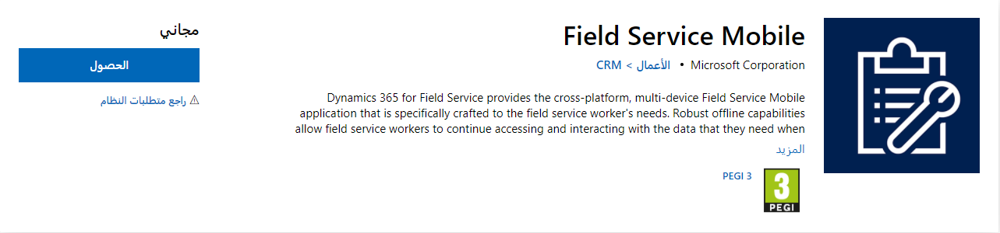
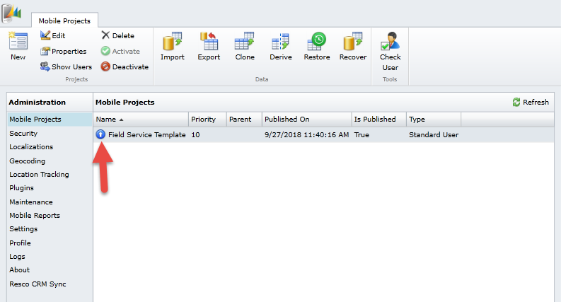
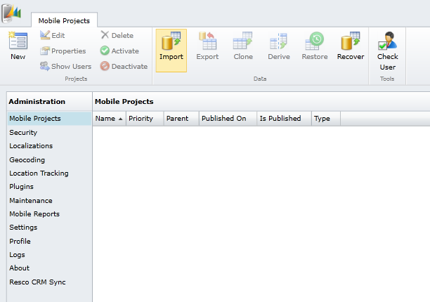
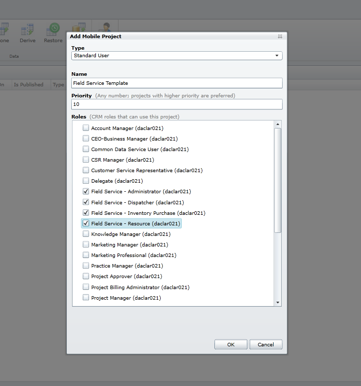
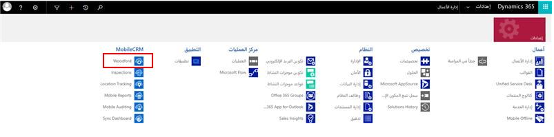
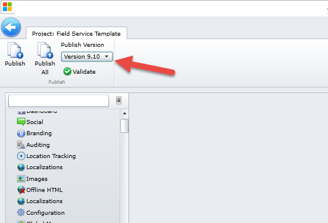
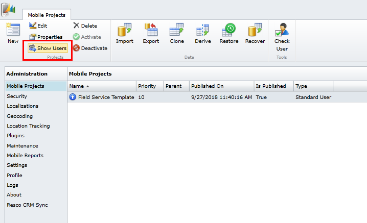
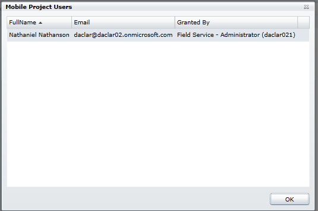
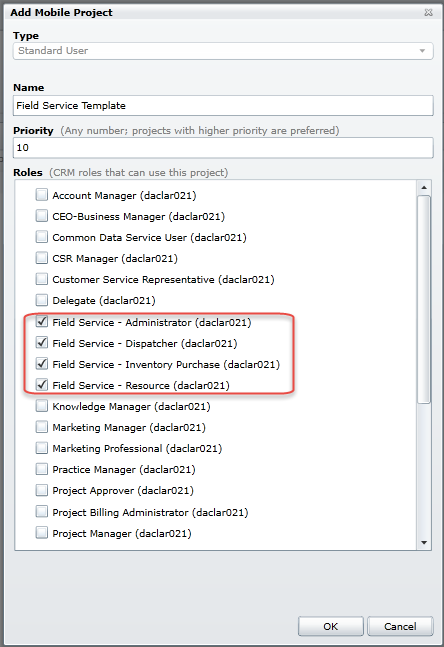

يوفر تطبيق Field Service Mobile للفنيين الميدانيين المعلومات التي يحتاجونها للوصول إلى موقع العميل وإكمال أوامر العمل بسرعة.

قبل أن يتمكن الفنيون الميدانيون من استخدام تطبيق Field Service Mobile، يحتاج المسؤول إلى تثبيت أداة تكوين Field Service Mobile والمشروع المتنقل ذي الصلة.

### تثبيت تطبيق الأجهزة المحمولة في هاتف أو كمبيوتر لوحي

للحصول على تطبيق الأجهزة المحمولة، ابحث عن **Field Service Mobile** وقم بتنزيله من متجر تطبيقات Windows أو Apple أو Google Play، أو تفضل بزيارة الروابط التالية. يتطلب **Field Service Mobile** إصدارات Field Service **7.5.5** أو **8.2+**.

- [تنزيل من أجل Windows](https://aka.ms/fsmobile-windows)

- [تنزيل من أجل iOS (Apple)](https://aka.ms/fsmobile-iOS)

- [تنزيل من أجل Android](https://aka.ms/fsmobile-android)

لاستخدام تطبيق Field Service Mobile، يجب أن يكون سجل الموارد (الفني الميداني) القابل للحجز **قد تم تمكينه من أجل تطبيق Field Service Mobile** وضبطه على **نعم**.

### تسجيل الدخول ومزامنة البيانات

لتسجيل الدخول، تحتاج إلى عنوان URL لتطبيق Dynamics 365 Customer Engagement في مؤسستك واسم المستخدم وكلمة المرور. اتصل بالمسؤول إذا لم تكن لديك هذه المعلومات. لمزيد من المعلومات، راجع [البحث عن المسؤول أو المسؤول عن الدعم](https://docs.microsoft.com/dynamics365/customer-engagement/basics/find-administrator-support).

1. افتح التطبيق وأدخل بيانات الاعتماد. تظهر الشاشة الرئيسية.

2. لمزامنة الجهاز مع الخادم، اضغط على زر **المزامنة** لتنزيل التغييرات التي أُجريت على الخادم في هاتفك أو الكمبيوتر اللوحي، وتحميل المعلومات من الجهاز إلى الخادم.

### العمل في حالة الاتصال بالإنترنت أو انقطاعه

يسمح تطبيق Field Service Mobile (مع الأجهزة المحمولة) للمستخدمين العمل في حالة الاتصال بالإنترنت أو انقطاعه. يتطلب الوضع عبر الإنترنت توفير الاتصال بالإنترنت؛ ولا يتطلب وضع عدم الاتصال ذلك.

يبدأ مسؤول النظام بتكوين التطبيق للمزامنة عند تشغيله أو عند تغيير المعلومات أو كل بضع دقائق.

### وضع الاتصال بالإنترنت

عند العمل في وضع الاتصال بالإنترنت، تتزامن المعلومات باستمرار مع الخادم، لذلك لا تحتاج إلى مزامنة الجهاز يدوياً.

- وللعمل عبر الإنترنت، اضغط على زر وضع **الاتصال/عدم الاتصال بالإنترنت**. تظهر لقطة الشاشة كيف يبدو الزر عندما تكون متصلاً بالإنترنت.

### وضع عدم الاتصال

عند العمل دون اتصال بالإنترنت، يتم تنزيل المعلومات التي تحتاجها إلى جهازك. وبهذه الطريقة، يُمكنك متابعة عملك حتى دون اتصال بالإنترنت. عند إدخال المعلومات، تُحفظ في جهازك وتُرسل إلى الخادم في المزامنة التالية.

- للعمل دون اتصال بالإنترنت، اضغط على زر وضع **الاتصال/عدم الاتصال بالإنترنت**. تظهر لقطة الشاشة كيف يبدو الزر عندما تكون غير متصل بالإنترنت.

### العمل باستخدام التطبيق

بصفتك مستشار وظيفي، تحتاج إلى فهم إمكانات هذا التطبيق بحيث يُمكنك دعم موارد الخدمة الميدانية على نحوٍ أفضل.

لمعرفة المزيد عن إمكانات هذا التطبيق، راجع [التعرّف على التطبيق (لمعرفة جميع أدوار الأمان)](https://docs.microsoft.com/dynamics365/customer-engagement/field-service/field-service-mobile-app-user-guide#get-around-the-app-for-all-security-roles).

### استكشاف مشكلات التثبيت وإصلاحها

هناك بعض الأسباب التي قد تجعل تطبيق الأجهزة المحمولة غير متزامن (أو تعطل عند تشغيله):

- عنوان URL غير صحيح أو اسم المستخدم غير صحيح أو كلمة المرور غير صحيحة. هذا هو السبب الأكثر شيوعا لفشل المزامنة.
- لا يوجد مشروع متنقل في Woodford، أو أن المشروع المتنقل غير منشور.
- يُنشر المشروع المتنقل في إصدار أحدث من تطبيق الأجهزة المحمولة.
- لا يملك المستخدم دور الأمان الصحيح للوصول إلى تطبيق الأجهزة المحمولة.

يوفر القسم التالي تفاصيل عن استكشاف أخطاء كل سيناريو وإصلاحها.

### عنوان URL غير صحيح أو اسم المستخدم غير صحيح أو كلمة المرور غير صحيحة

في تطبيق Field Service Mobile، تحقق من صحة عنوان URL واسم المستخدم وكلمة المرور. انتقل إلى **الإعداد** للعثور على هذه الحقول، كما هو موضح في لقطة الشاشة التالية. يتميز اسم المستخدم وكلمة المرور بتحسس حالة الأحرف.

### لا يوجد مشروع متنقل في Woodford، أو أن المشروع المتنقل غير منشور

Woodford عبارة عن أداة تكوين قائمة على المتصفح لبناء مشروعات التطبيقات وإدارتها باستخدام منصة Resco. ويسمح لك أيضاً بإدارة الأجهزة المحمولة المتصلة والتراخيص. يُمكن الاطلاع على تفاصيل إضافية عن المشروعات والأولويات في [Woodford Guide (بصيغة PDF)](https://www.resco.net/downloads/Woodford_Guide.pdf).

لإصلاح مشروع مفقود، سجّل الدخول على أنك مسؤول في جلسة Internet Explorer غير خاصة وانتقل إلى **الإعدادات > Woodford > MobileCRM Woodford** للتحقق من مشروع متنقل. تشير دائرة زرقاء بسهم يشير لأعلى إلى أنها منشورة، كما هو موضح في لقطة الشاشة التالية. سيتم تعيين قيمة "تم النشر" أيضا إلى "True".

**في حالة عدم وجود مشروع متنقل**، فستحتاج إلى تنزيل ملف القالب وحفظه:

- إذا كنت تستخدم تحديث ديسمبر 2016 لتطبيق Dynamics 365 Customer Engagement (عبر الإنترنت)، استخدم قالب [المشروع المتنقل](https://go.microsoft.com/fwlink/p/?linkid=836310).
- إذا كنت تستخدم تحديث Dynamics CRM Online 2016 رقم 1، استخدم [قالب المشروع المتنقل](https://go.microsoft.com/fwlink/p/?LinkId=808250).

> [!Note] 
> قد تحتاج إلى حفظ ملف القالب في موقع ملف على الكمبيوتر، بدلاً من مجلد التنزيلات.

بعد ذلك، يجب استيراد هذا الملف إلى Woodford عن طريق تحديد **استيراد** في قائمة الرأس.

بعد ذلك، يجب تسمية المشروع المتنقل وتعيين أولوية أكبر من 0 وتعيينه إلى كل أدوار أمان خدمة Field Service المتوفرة في القائمة التالية.

يُمكن الاطلاع على تفاصيل إضافية عن المشروعات والأولويات في [Woodford Guide (بصيغة PDF)](https://www.resco.net/downloads/Woodford_Guide.pdf). انقر نقراً مزدوجاً على (قالب) المشروع لعرضه. حدد **نشر**

### يُنشر المشروع المتنقل في إصدار أحدث من تطبيق الأجهزة المحمولة

كي يعمل تطبيق الأجهزة المحمولة، يجب ألا يتجاوز رقم إصدار حل Woodford رقم إصدار تطبيق الأجهزة المحمولة. مثال، إذا كان تطبيق الأجهزة المحمولة هو الإصدار 9.1، وتم نشر حل Woodford في إصدار 9.2 أو أعلى، سيؤدي هذا الإصدار إلى خطأ "إصدار غير مدعوم"، كما هو موضح أدناه.

لإصلاح الحل، تحقق أولاً من إصدار تطبيق الأجهزة المحمولة. افتح تطبيق الأجهزة المحمولة، ثم مرر لأسفل وصولاً إلى خيار قائمة **حول**. حددها لعرض رقم الإصدار.

بعد ذلك، ستحتاج إلى التحقق من رقم إصدار Woodford. افتح تطبيق Dynamics 365 Customer Engagement في نافذة Internet Explorer غير خاصة وانتقل إلى **الإعدادات > Woodford > MobileCRM Woodford**.

ابحث عن المشروع المتنقل ذي الصلة وتأكد من عدم نشره في إصدار أعلى. في لقطة الشاشة التالية، يُنشر المشروع المتنقل في إصدار 9.1، ولا يتجاوز إصدار تطبيق Field Service Mobile (لعام 2017).

### لا يملك المستخدم دور الأمان الصحيح للوصول إلى تطبيق الأجهزة المحمولة

عند إعداد المسؤول تطبيق الأجهزة المحمولة Woodford، عليه تعيين مجموعة من أدوار الأمان لمشروع متنقل (تكوينات افتراضية). تُحدد أدوار الأمان المستخدمين الذين يحصلون على إمكانية الوصول إلى تخصيصات المشروع. إذا سجّل مستخدم الدخول إلى تطبيق الأجهزة المحمولة وليس لديه دور أمان يتوافق مع مشروع متنقل منشور، فلن يتمكن المستخدم من المزامنة مع الخادم.

في جلسة متصفح Internet Explorer غير خاصة، انتقل إلى **الإعدادات > Woodford > MobileCRM Woodford**.

حدد وميّز المشروع المتنقل الذي يجب أن يتمكن مستخدمو الأجهزة المحمولة من الوصول إليه وحدد **إظهار المستخدمين** في قائمة الرأس.

إذا لم يظهر المستخدم الذي لا يستطيع المزامنة هنا، فلن يتمكن من الوصول إلى المشروع المتنقل ولن يتمكن من الاتصال.

لإصلاح مستخدم لا يستطيع المزامنة، حدد المشروع المتنقل وحدد **الخصائص** في قائمة الرأس لعرض أدوار الأمان التي تمنح إمكانية الوصول إلى المشروع المتنقل.

طابق أدوار الأمان المحددة (كما هو موضح أعلاه) مع أدوار أمان المستخدم في **D 365 > الإعدادات > الأمان > المستخدمون**.
