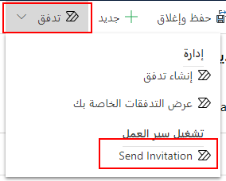
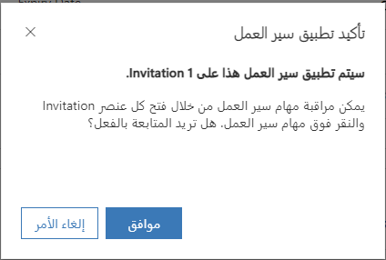
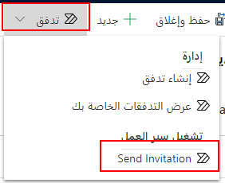
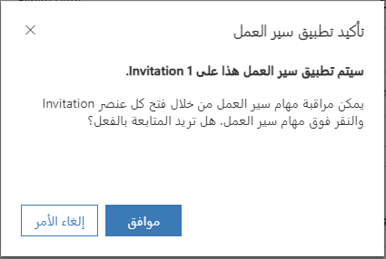
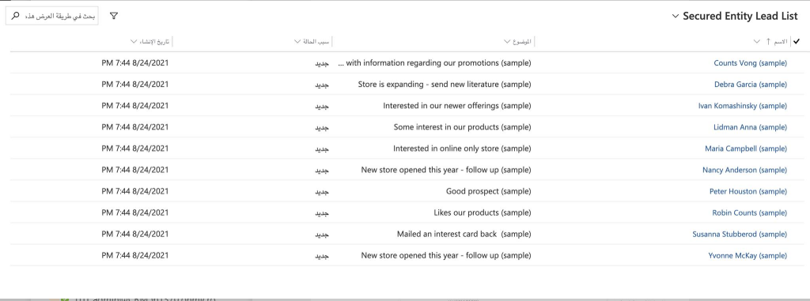

في تطبيق للمداخل، يتم إقران مستخدم المدخل المصدق عليه بجهة اتصال تطبيقات Dynamics 365 Customer Engagement أو مستخدم النظام.

يستند التكوين الافتراضي للمداخل إلى جهة الاتصال. وهذا يعني أنه لتسجيل الدخول، يجب أن يتم تكوين معلومات مصادقة الويب المناسبة لجهة الاتصال.

ويجب تعيين مستخدمي المدخل إلى دور ويب للحصول على أذونات تتجاوز أذونات المستخدمين غير المصدق عليهم. لتكوين أذونات لدور ويب، يجب تكوين قواعد التحكم بالوصول إلى صفحة الويب وموقع الويب.

تسمح أحدث تجربة لمصادقة المداخل لمستخدمي المدخل بتسجيل الدخول وفقاً لاختيارهم، إمّا باستخدام حساب محلي لجهة الاتصال مُستنِد إلى موفر العضوية أو حساب خارجي مُستند إلى ‪ASP.NET Identity‬.

- **المصادقة المحلية** - تستخدم هذه المصادقة الشائعة المستنِدة إلى النماذج سجلات جهات اتصال إحدى مؤسسات Dynamics 365 for Customer Engagement للمصادقة. ولإنشاء تجارب مصادقة مخصصة، يمكن للمطورين استخدام ASP.Net Identity API لإنشاء أدوات وصفحات تسجيل دخول مخصصة.

- **المصادقة الخارجية** - يتم توفيرها بواسطة ‪ASP.NET Identity API‬. في هذه الحالة، تتم معالجة إدارة بيانات اعتماد الحساب وكلمة مروره بواسطة موفر هوية تابع لجهة خارجية. ويشمل ذلك موفري الهوية المستندِين إلى OpenID، مثل Yahoo وGoogle وموفري الهوية المستندِين إلى OAuth 2.0، مثل Twitter وFacebookوMicrosoft. يسجّل المستخدمون الدخول إلى المدخل عن طريق تحديد هوية خارجية للتسجيل في المدخل.
بعد التسجيل، يمكن للهوية الخارجية الوصول إلى الميزات نفسها التي يصل إليها الحساب المحلي.

يمكن تسجيل الاشتراك باستخدام رموز الدعوة، إلى جانب سير عمل تأكيد البريد الإلكتروني، وذلك لعمليات تسجيل الحسابات المحلية والخارجية على حدٍ سواء. بالإضافة إلى ذلك، يمكن لمسؤولي المدخل تمكين أو تعطيل أي مجموعة من خيارات المصادقة من خلال إعدادات موقع المدخل.

### تسجيل اشتراك الحساب (التسجيل)

تتوفّر لمسؤولي المدخل عدة خيارات للتحكم في سلوك تسجيل الاشتراك في الحساب. التسجيل المفتوح هو تكوين تسجيل الاشتراك الأقل تقييداً، حيث يسمح المدخل بتسجيل حساب مستخدم بمجرد توفير هوية المستخدم. يمكن أن تتطلب التكوينات البديلة من المستخدمين تقديم رمز دعوة أو عنوان بريد إلكتروني صالح للتسجيل في المدخل. وبغض النظر عن تكوين التسجيل، تشارك الحسابات المحلية والخارجية في سير عمل التسجيل على حدٍ سواء. بمعنى أنه يتوفّر للمستخدمين خيار يتيح لهم اختيار نوع الحساب الذي يرغبون في تسجيله.

### التسجيل المفتوح

أثناء التسجيل، يتوفّر للمستخدم خيار إنشاء حساب محلي (بتوفير اسم مستخدم وكلمة مرور) أو تحديد هوية خارجية من قائمة موفري الهوية. إذا تم تحديد هوية خارجية، يكون على المستخدم تسجيل الدخول من خلال موفر الهوية المختار لإثبات امتلاكه للحساب الخارجي. وفي كلتا الحالتين، يتم على الفور تسجيل المستخدم ومصادقته مع المدخل. ويتم إنشاء سجل جهة اتصال جديد في المؤسسة عند تسجيل الاشتراك.

في حالة تمكين التسجيل المفتوح، لا يكون على المستخدمين تقديم رمز دعوة لإكمال عملية تسجيل الاشتراك.

### تكوين جهة اتصال للاستخدام على أحد المداخل

بعد ملء المعلومات الأساسية لجهة اتصال، (أو ملء مستخدم لنموذج تسجيل الاشتراك في مدخل)، انتقل إلى علامة تبويب مصادقة الويب في نموذج جهة اتصال المدخل لتكوين جهة اتصال باستخدام المصادقة المحلية. لمزيد من المعلومات عن خيارات مصادقة جهات الاتصال الخارجية، اطّلع على [تعيين هوية المصادقة لأحد المداخل](/dynamics365/customer-engagement/portals/set-authentication-identity).

لتكوين جهة اتصال للمداخل باستخدام المصادقة المحلية، اتبع الإرشادات التالية:

1. أدخِل **اسم المستخدم**.
2. على شريط الأوامر، انتقل إلى **أوامر إضافية** > **تغيير كلمة المرور**.

أكمِل سير عمل تغيير كلمة المرور، وسيتم تكوين الحقول اللازمة تلقائياً. عند القيام بذلك، سيتم تكوين جهة الاتصال الخاصة بك لمداخلك.

### تغيير كلمة المرور لجهة اتصال في تطبيق مداخل Dynamics 365

1. حدد **سير المهمة** على شريط الأدوات في الأعلى.

2. حدد سير المهمة **تغيير كلمة مرور جهة اتصال المداخل** .
3. في جزء **تغيير كلمة المرور لجهة اتصال المدخل** ، حدد جهة اتصال أو قم بإنشائها لتغيير كلمة المرور، ثم حدد **التالي**.

4. في حقل **كلمة المرور الجديدة** ، أدخِل كلمة مرور جديدة، ثم حدد **التالي**.

إذا لم تقم بإدخال كلمة مرور وحددت **التالي**، فسيُطلب منك تحديد ما إذا كنت تريد إزالة كلمة المرور لجهة الاتصال المحددة.

5. بعد إجراء التغييرات، حدد **تم**.

### دعوة جهات اتصال إلى أحد المداخل

استخدم ميزة الدعوة إلى المداخل لدعوة جهات الاتصال إلى مدخلك من خلال رسائل البريد الإلكتروني المؤتمتة التي يتم إنشاؤها في النظام الخاص بك. يتلقى الأشخاص الذين تدعوهم بريداً إلكترونياً قابلاً للتخصيص بالكامل من قِبلك، مع ارتباط إلى مدخلك ورمز دعوة. يمكن استخدام هذا الرمز للحصول على وصول خاص يتم تكوينه من قِبلك. باستخدام هذه الميزة، يمكنك تنفيذ ما يلي:

- إرسال دعوات فردية أو جماعية.
- تحديد تاريخ انتهاء الصلاحية، إذا لزم الأمر.
- تحديد مستخدم أو جهة اتصال للمدخل كمقدم الدعوة، إذا لزم الأمر.
- تعيين جهات الاتصال المدعوة تلقائياً إلى حساب عند ‏‫استرداد الدعوة‬.
- تنفيذ سير عمل تلقائياً عند استرداد الدعوة.
- تعيين جهات الاتصال المدعوة تلقائياً إلى أدوار ويب عند الاسترداد.

يمكن تنفيذ استرداد الدعوة باستخدام أي من خيارات المصادقة العديدة. لمزيد من المعلومات عن مصادقة المداخل، اطّلع على [تعيين هوية المصادقة لأحد المداخل](/dynamics365/customer-engagement/portals/set-authentication-identity). اختَر النموذج القابل للتطبيق على إصدار المدخل الذي تستخدمه وتكوينه.

سيعتمد المستخدم أي إعدادات يقدمها المسؤول عند الاسترداد. وسيتم إنشاء نشاط استرداد دعوة للدعوة وجهة الاتصال.

يتم إرسال الدعوات عبر سير عمل **إرسال دعوة** . يُنشئ سير العمل بشكل افتراضي بريداً إلكترونياً يتضمّن رسالة عامة ويرسله إلى عنوان البريد الإلكتروني الأساسي لجهة الاتصال المدعوة. يحتوي سير عمل **إرسال دعوة** على قالب بريد إلكتروني يلزم تحريره ليحتوي على رسالة محددة لمدخلك والارتباط التشعبي الصحيح إلى **صفحة استرداد الدعوة** في مدخلك.

لتحرير قالب البريد الإلكتروني لسير عمل‏‎ **إرسال دعوة** ، حدد موقعه ثم قم بإلغاء تنشيطه. بعد إلغاء تنشيطه، قم بتحرير قالب البريد الإلكتروني لإرسال الرسالة التي تريدها، ثم قم بتوفير ارتباط إلى **صفحة استرداد الدعوة** في مدخلك.

> [!Note]
> يتم إرسال الدعوة فقط إلى البريد الإلكتروني الأساسي (emailaddress1) لجهة الاتصال. ولن يتم إرسال الدعوة إلى البريد الإلكتروني الثانوي (emailaddress2) أو البريد الإلكتروني البديل (emailaddress3) لسجل جهة الاتصال.

لإنشاء سجل دعوة، حدد الزر **إنشاء دعوة** على شريط الأوامر. يتوفر الزر عند تحديد جهة اتصال واحدة في طريقة عرض جهة اتصال وعند عرض سجل جهة اتصال. سيؤدي تحديد الزر إلى فتح نموذج دعوة جديد لجهة الاتصال. يمكن أيضاً إنشاء الدعوات باستخدام طريقة عرض الدعوات عن طريق تحديد **جديد**. بعد إنشاء سجل الدعوة، سيظهر الزر **تشغيل سير العمل** لتمكينك من إرسال الدعوة إلى جهات الاتصال. لن يتم إرسال الدعوة إلى جهات الاتصال حتى يتم بدء سير عمل **إرسال دعوة** .

1. انتقل إلى **المداخل** > **جهات الاتصال**.
2. حدد جهة اتصال أو افتح سجل جهة الاتصال المطلوب دعوتها.
3. في شريط الأوامر، حدد **إنشاء دعوة**.
4. في صفحة **الدعوة** ، أدخل القيم المناسبة في الحقول. لمزيد من المعلومات، اطّلع على [سمات الدعوة](/dynamics365/customer-engagement/portals/invite-contacts#invitation-attributes).
5. حدد **حفظ**.
6. في شريط الأوامر، حدد **سير العمل** > **إرسال دعوة**.

7. في نافذة التأكيد، حدد "موافق". سيتم إرسال الدعوة إلى جهة الاتصال المحددة.

8. إرسال دعوات متعددة

يمكنك إنشاء دعوات لجهات الاتصال الخاصة بك ثم إرسال كافة الدعوات في الوقت نفسه.

1. أنشئ دعوات لجهات الاتصال المطلوبة ثم انتقل إلى **المداخل** > **الدعوات**.
2. حدد الدعوات التي تم إنشاؤها.
3. في شريط الأوامر، حدد **سير العمل** > **إرسال دعوة**.

4. في نافذة التأكيد، حدد **موافق**. سيتم إرسال الدعوات إلى جهات الاتصال المحددة.

### سمات الدعوة

يوضّح الجدول التالي سمات صفحة **الدعوة** :

| **الاسم**                         |       **الوصف**                                                                            |
| ---------------------------------|--------------------------------------------------------------------------------------------------|
|  الاسم                       |             اسم وصفي للمساعدة في التعرّف على الدعوة.|
|  النوع                        |            **فردية** أو **جماعية**. يسمح لك النوع "فردية" بدعوة جهة اتصال واحدة فقط وإجراء عملية استرداد واحدة فقط. يسمح لك النوع "جماعية" بدعوة جهات اتصال متعددة وبإجراء عمليات استرداد متعددة.|
|  المالك/المُرسل                 |           المستخدم الذي سيكون مُرسل البريد الإلكتروني عند إرسال الدعوة. يمكن تجاوز ذلك في سير عمل **إرسال دعوة** في حال كان البريد الإلكتروني الذي تم إنشاؤه يحتوي على شخص في الحقل "من".|
|  رمز الدعوة              |           رمز فريد للدعوة سيعرفه المدعو فقط. يتم إنشاء هذا الرمز تلقائياً عند إنشاء دعوة جديدة.|
|  تاريخ انتهاء الصلاحية                   |          التاريخ الذي يمثل تاريخ عدم صلاحية الدعوة للاسترداد. اختيارية.|
|  مقدم الدعوة                        |         يمكن استخدامها عندما تكون جهة الاتصال هي مرسل الدعوة. اختيارية.|
|  جهات الاتصال المدعوة              |        جهات الاتصال التي ستتم دعوتها إلى المدخل.|
|  تعيين إلى حساب                |       سجل الحساب الذي سيتم إقرانه كعميل أصلي لجهة الاتصال المستردة عند استرداد الدعوة. اختيارية.  |
|تنفيذ سير العمل في جهة اتصال الاسترداد |  عملية سير عمل سيتم تنفيذها عند استرداد الدعوة. سيتم تمرير سير العمل لجهة الاتصال المستردة بصفتها الكيان الأساسي. اختيارية.|
| ‏‏تعيين إلى أدوار الويب                  |   مجموعة من أدوار الويب التي سيتم إقرانها بجهة الاتصال المستردة عند استرداد الدعوة. اختيارية.
|جهات الاتصال المستردة                    | جهات الاتصال التي نجحت في استرداد الدعوة.|
|الحد الأقصى لعمليات الاسترداد المسموح بها            | عدد المرات التي يمكن فيها استرداد الدعوة. متوفرة للدعوات من النوع "جماعية" فقط.|

### إنشاء أدوار ويب للمداخل

بعد تكوين جهة اتصال لاستخدام المدخل، يجب منحها دور واحد أو أكثر من أدوار الويب لتنفيذ أي إجراءات خاصة أو الوصول إلى أي محتوى محمي على المدخل. على سبيل المثال، للوصول إلى صفحة مقيدة، يجب تعيين جهة الاتصال إلى دور تقتصر قراءة هذه الصفحة عليه. لنشر محتوى جديد، يجب تعيين جهة الاتصال إلى دور لديه أذونات لنشر المحتوى.

لإنشاء دور ويب:

1. قم بتسجيل الدخول إلى تطبيقات Dynamics 365 Customer Engagement.
2. انتقل إلى **المداخل** > **أدوار الويب**.
3. حدد **جديد**.
4. أدخل القيم المناسبة في الحقول.
5. حدد **حفظ**.

### السمات والعلاقات

يوضّح الجدول التالي سمات "دور الويب" التي تستخدمها مداخل تطبيقات Dynamics 365 Customer Engagement.

 | **الاسم**                  | **الوصف**                                                                  |
 | --------------------------| ---------------------------------------------------------------------------------|
 | الاسم                      | الاسم الوصفي لدور الويب|
 | موقع الويب                   | موقع الويب المقترن|
 | الوصف               | شرح للغرض من دور الويب. اختيارية.|
 | دور المستخدمين المُصادقين  |قيمة منطقية. إذا تم تعيينها على "صحيح"، فسيكون هذا هو دور الويب الافتراضي للمستخدمين المُصادقين (انظر أدناه). يجب تعيين دور ويب واحد فقط مع السمة "دور المستخدمين المُصادقين" على "صحيح" لأي موقع ويب معيّن. سيكون هذا هو دور الويب الافتراضي للمستخدمين المُصادقين الذين لم يتم تعيين دور ويب لهم.|
 |دور المستخدمين المجهولين   |    قيمة منطقية. إذا تم تعيينها على "صحيح"، فسيكون هذا هو دور الويب الافتراضي للمستخدمين غير المُصادقين (انظر أدناه). يجب تعيين دور ويب واحد فقط مع السمة "دور المستخدمين المجهولين" على "صحيح" لأي موقع ويب معيّن. سيكون هذا هو دور الويب الافتراضي للمستخدمين غير المُصادقين. سوف يحترم "دور المستخدمين المجهولين" أذونات الكيان فقط.|

الآن، وبعد إنشاء "دور ويب"، ستتمكن من تكوينه لتلبية احتياجاتك عبر أذونات وقواعد وعمليات اقتران متنوعة.

- **دور الويب الافتراضي الاختياري للمستخدمين المُصادقين**: عن طريق تمكين **دور المستخدمين المُصادقين**، سيصبح دور الويب الافتراضي لكافة المستخدمين. يُستخدم هذا الدور بشكل شائع لتوفير وصول محدد مسبقاً للمستخدمين غير المقترنين بأي أدوار أخرى. ضع في اعتبارك أنه يمكن للمستخدمين الحصول على أدوار ويب متعددة، ولكن لا يمكن أن يكون هناك سوى دور ويب واحد من النوع "دور المستخدمين المُصادقين" للمستخدمين المُصادقين.

- **دور الويب الافتراضي الاختياري للمستخدمين غير المُصادقين**: الغرض من **دور المستخدمين المجهولين** هو استخدامه مع أذونات الكيانات. ولن يحترم أي قواعد أو أذونات أخرى. من خلال تمكين "‎‏‎دور المستخدمين المجهولين"، سيصبح دور الويب الافتراضي لجميع المستخدمين. يمكن أن يكون هناك للمستخدمين غير المُصادقين دور ويب واحد فقط للمستخدمين المجهولين.

### إضافة أمان يستند إلى السجلات باستخدام أذونات الكيانات للمداخل

لتطبيق الأمان المستند إلى السجلات في مداخل تطبيقات Dynamics 365 Customer Engagement على السجلات الفردية، يجب استخدم أذونات الكيانات. يمكنك إضافة أذونات الكيانات إلى أدوار ويب بحيث يمكنك تعريف الأدوار في مؤسستك التي تتوافق منطقياً مع امتيازات ومفاهيم ملكية السجل والوصول إليه التي يتم تقديمها باستخدام أذونات الكيانات. تذكر أن أي جهة اتصال معينة يمكن أن تنتمي إلى أي عدد من الأدوار، ويمكن أن يحتوي دور معين على أي عدد من أذونات الكيانات. مزيد من المعلومات: [إنشاء أدوار ويب للمداخل](/dynamics365/customer-engagement/portals/create-web-roles)

على الرغم من منح أذونات لتغيير عناوين URL والوصول إليها في مخطط موقع المدخل عبر "تصريح المحتوى"، فمديري المواقع سيرغبون أيضاً في تأمين تطبيقات الويب المخصصة الخاصة بهم والتي تم إنشاؤها باستخدام نماذج الكيانات وقوائم الكيانات. مزيد من المعلومات: [تعريف نماذج الكيانات والمنطق المخصص ضمن المدخل](/dynamics365/customer-engagement/portals/entity-forms-custom-logic) و [إضافة صفحة ويب لعرض قائمة بالسجلات](/dynamics365/customer-engagement/portals/assign-entity-permissions#add-a-webpage-to-render-a-list-of-records)

لتأمين هذه الميزات، تسمح أذونات الكيانات بمنح حقوق أكثر دقة للكيانات الإجبارية وتمكين الأمان على مستوى السجلات من خلال تعريفات العلاقات.

### إضافة أذونات الكيانات إلى دور ويب

1. انتقل إلى دور الويب الذي تريد إضافة الأذونات إليه. يمكن العثور على أدوار الويب لموقع ويب في **المداخل** > **الويب > الأدوار** أو **المداخل** > **{مدخلك}** > **أدوار الويب**.

2. حدد **إضافة** لإضافة إذن كيان موجود إلى دور ويب.

3. حدد **جديد** لإنشاء سجل جديد لإذن الكيان.

عند إنشاء سجل جديد لإذن الكيان، تتمثل الخطوة الأولى في تحديد الكيان الذي سيتم تأمينه. الخطوة التالية هي تعريف النطاق، كما هو موضح أدناه، و--- لأي نطاق آخر غير "عمومي"--- العلاقات التي تعرف هذا النطاق. وأخيراً، حدد الحقوق الممنوحة للدور من خلال هذا الإذن. لاحظ أن الحقوق تراكمية، لذا إذا كان المستخدم في دور يمنح حق القراءة، وآخر يمنح حق القراءة والتحديث، سيكون للمستخدم حق القراءة وحق التحديث لأي سجلات تتداخل بين الدورين.

> [!Note]
> تحديد كيانات CMS، مثل صفحة ويب وملفات ويب، غير صالح وقد تكون له عواقب أخرى غير مقصودة. سيؤكد المدخل أمان كيانات CMS استناداً إلى عناصر التحكم في الوصول إلى المحتوى، وليس أذونات الكيانات.

### النطاق العمومي

إذا تم منح دور لديه نطاق عمومي سجل إذن كيان حاصل على إذن قراءة، سيكون لأي جهة اتصال في هذا الدور حق الوصول إلى كافة سجلات الكيان المعرف. على سبيل المثال، سيتمكن من رؤية جميع العملاء المتوقعين وجميع الحسابات وما إلى ذلك. سيتم احترام هذا الإذن تلقائياً من قبل أي قوائم كيانات، حيث يتم عرض كافة السجلات بشكل أساسي وفقاً لطرق العرض التي تم تعريفها لتلك القائمة. علاوة على ذلك، إذا حاول مستخدم الوصول إلى سجل عبر نموذج كيان لا يملك حق الوصول إليه، فسيتلقى خطأ في الإذن.

### نطاق جهة الاتصال

باستخدام نطاق جهة الاتصال، سيكون لدى المستخدم الذي سجل الدخول إلى الدور الذي تم تعريف سجل الإذن له الحقوق الممنوحة من قِبَل هذا الإذن فقط للسجلات المرتبطة بسجل جهة اتصال ذلك المستخدم عبر علاقة تم تعريفها في Dynamics 365 for Customer Engagement.

في قائمة الكيان، يعني هذا أنه ستتم إضافة عامل تصفية إلى أي طرق عرض تعرضها تلك القائمة، والتي تقوم باسترداد السجلات المرتبطة مباشرة بالمستخدم الحالي فقط. (اعتماداً على السيناريو، يمكن اعتبار هذه العلاقة حقوق ملكية أو إدارة).

تسمح نماذج الكيانات فقط بالإذن المناسب للقراءة والإنشاء والكتابة، وهكذا إذا كانت هذه العلاقة موجودة عند تحميل السجل. مزيد من المعلومات: [تعريف نماذج الكيانات والمنطق المخصص ضمن أحد المداخل](/dynamics365/customer-engagement/portals/entity-forms-custom-logic).

### نطاق الحساب

باستخدام نطاق الحساب، سيكون لدى المستخدم الذي سجل الدخول إلى الدور الذي تم تعريف سجل الإذن له الحقوق الممنوحة من قِبَل هذا الإذن فقط للسجلات المرتبطة بسجل الحساب الأصلي للمستخدم عبر علاقة تم تعريفها.

### النطاق الذاتي

يسمح لك النطاق الذاتي بتعريف الحقوق التي يمتلكها المستخدم لسجل جهة الاتصال (الهوية) الخاصة به. يسمح هذا للمستخدمين باستخدام نماذج الكيانات أو نماذج الويب لإجراء تغييرات على سجل جهات الاتصال الخاص بهم المرتبط بملف التعريف الخاص بهم. لاحظ أن صفحة ملف التعريف الافتراضية تحتوي على نموذج مضمن خاص يسمح لأي مستخدم بتغيير المعلومات الأساسية لجهة الاتصال الخاصة به، والاشتراك في قوائم التسويق أو إلغاء الاشتراك فيها. إذا تم تضمين هذا النموذج في المدخل الخاص بك (يتم تضمينه بشكل افتراضي)، فلن يكون هذا الإذن مطلوباً من المستخدمين لاستخدامه. ومع ذلك، فسيكون هذا الإذن مطلوباً منهم لاستخدام أي نماذج كيانات أو نماذج ويب مخصصة تستهدف سجل جهة اتصال المستخدم الخاص بهم.

### النطاق الأصلي

في هذه الحالة، وهي أكثر الحالات تعقيداً، يتم منح أذونات لكيان يرتبط بعلاقة مع كيان تم تعريف سجل "إذن الكيان" له بالفعل. هذا الإذن هو في الواقع سجل فرعي لإذن الكيان الأصلي.

يُعرِّف سجل "الإذن الأصلي" إذناً ونطاقاً لكيان (في الأغلب نطاق عمومي أو نطاق جهة اتصال، على الرغم من أن الأصلي ممكن أيضاً). قد يكون ذلك الكيان مرتبطاً بجهة اتصال (في حالة نطاق جهة الاتصال) أو معرَّفاً بشكل عمومي. عند وجود هذا الإذن، يتم إنشاء إذن فرعي يُعرِّف علاقة من كيان آخر إلى الكيان المعرف في العلاقة الأصلية.

وبالتالي، سيكون لدى المستخدمين في دور ويب الذين لديهم حق الوصول إلى السجلات المعرفة من قِبل أذونات الكيان الأصلي أيضاً حقوق، كما هو معرَّف من قِبل سجل الإذن الفرعي، للوصول إلى السجلات المتعلقة بالسجل الأصلي.

### السمات والعلاقات

يوضح الجدول أدناه سمات أذونات الكيانات.

| **الاسم**                                                                               | **الوصف**                   |
|----------------------------------------------------------------------------------------|-----------------------------------|
| الاسم                              | الاسم الوصفي للسجل. هذا الحقل مطلوب.   |
| اسم الكيان                       | الاسم المنطقي للكيان الذي سيتم تأمينه أو الذي سيُعرِّف علاقة جهة الاتصال أو العلاقة الأصلية لتأمين كيان مرتبط على إذن فرعي. هذا الحقل مطلوب.           |
| النطاق (إلزامي)                 | -   **عمومي**: منح امتيازات لسجل الكيان بدون أي متطلبات لمالك (جهة اتصال). |
|                                   | -   **جهة الاتصال**: منح امتيازات لسجل الكيان الذي يمتلك علاقة مباشرة بمالك (جهة اتصال). |       
|                                   | -   **الحساب**: منح امتيازات لسجل الكيان الذي لديه علاقة بأحد الحسابات والذي يمثل المالك بافتراض أن الحساب هو العميل الأصلي لجهة الاتصال.      |
|                                   | -   **الأصل**: منح امتيازات لسجل الكيان من خلال سلسلة علاقات أذونات الأصل.  |
| علاقة جهة الاتصال              | مطلوبة فقط إذا كان النطاق = جهة الاتصال. اسم المخطط للعلاقة بين جهة الاتصال والكيان المحدد من قِبل حقل "اسم الكيان". |
| العلاقة الأصلية               | مطلوبة فقط في حالة تعيين إذن للكيان الأصلي. اسم المخطط للعلاقة بين الكيان المحدد بواسطة حقل "اسم الكيان" والكيان المحدد من بواسطة حقل "اسم الكيان"|
|في سجل إذن    | الكيان الأصلي.                |
| إذن الكيان الأصلي          | مطلوب فقط إذا كان النطاق = الأصل. | 
| قراءة                              | الامتياز الذي يتحكم في ما إذا كان المستخدم يمكنه قراءة سجل.  |
| كتابة                             | الامتياز الذي يتحكم في ما إذا كان المستخدم يمكنه تحديث سجل.     |
| ‏إنشاء                            | الامتياز الذي يتحكم في ما إذا كان المستخدم يمكنه إنشاء سجل جديد. 
|                                   | لا ينطبق حق إنشاء سجل لنوع كيان على سجل فردي، ولكن بدلاً من ذلك على فئة من الكيانات.     |
| حذف                            | امتياز يتحكم في ما إذا كان المستخدم يمكنه حذف سجل.     |
| إلحاق                            | امتياز يتحكم في ما إذا كان بإمكان المستخدم إرفاق سجل آخر بسجل محدد. يعمل حق الوصول من أجل "الإلحاق" و"الإلحاق بـ" معاً. في كل مرة يقوم فيها مستخدم بإرفاق سجل بآخر، يجب أن يكون للمستخدم كلا الحقَّين. على سبيل المثال، عند إرفاق ملاحظة بحالة، يجب أن يكون لديك حق الوصول للإلحاق في الملاحظة وحق الوصول للإلحاق بالحالة حتى تنجح العملية. |
| إلحاق بـ                         | امتياز يتحكم في ما إذا كان بإمكان المستخدم إلحاق السجل المعني بسجل آخر. يعمل حق الوصول من أجل "الإلحاق" و"الإلحاق بـ" معاً. لمزيد من المعلومات، اطّلع على وصف الإلحاق.  |

### الأذونات العمومية للمهام المتعلقة بالعملاء المتوقعين

في أحد السيناريوهات، قد نرغب في استخدام قائمة كيانات ونماذج كيانات لعرض جميع العملاء المتوقعين على المدخل لأي شخص في دور ويب مخصص لإدارة العملاء المتوقعين. في نموذج تحرير العملاء المتوقعين، الذي يتم إطلاقه كلما تم تحديد صف لعميل متوقع في القائمة، ستعرض شبكة فرعية سجلات المهام ذات الصلة. يجب أن تكون إمكانية الوصول إلى هذه السجلات متاحة لأي شخص في دور "‏‫إدارة العملاء المتوقعين‬". كخطوة أولى، سنمنح أذونات عمومية للوصول إلى العملاء المتوقعين لأي شخص في دور "‏‫إدارة العملاء المتوقعين‬".

لدى هذا الدور "إذن كيان" مرتبط لكيان العميل المتوقع، بنطاق عمومي.

يمكن للمستخدمين في هذا الدور الوصول إلى جميع العملاء المتوقعين عبر قوائم الكيان أو النماذج على المدخل.

سنقوم الآن بإضافة إذن فرعي إلى إذن العميل المتوقع العمومي. عند فتح سجل "‏‫الإذن الأصلي‬"، انتقل إلى الشبكة الفرعية **أذونات الكيانات الفرعية** ، وحدد  **جديد** لفتح جزء البحث عن أذونات الكيانات، وحدد العدسة المكبرة، ثم حدد **جديد** ‎‏‎لإضافة سجل جديد.

حدد الكيان على "المهام" والنطاق على "أصل". لاحظ أنه يمكنك بعد ذلك تحديد العلاقة الأصلية (**Lead_Tasks**). هذا الإذن يعني أن أي جهة اتصال في دور ويب بإذن أصلي سيكون لديها إذن عمومي لكافة المهام المرتبطة بالعملاء المتوقعين.

تذكر أنه لكي تحترم قائمتك هذه الأذونات، يجب أن تكون قد مكنت "أذونات الكيانات" في القائمة ويجب أن تكون هناك إجراءات تسمح للمستخدمين بتنفيذ الإجراءات التي تم منح أذونات لها. علاوة على ذلك، يجب تمكين الأذونات أيضاً في سجل [نموذج الكيان](/dynamics365/customer-engagement/portals/entity-forms-custom-logic)، ويجب أن يعرض هذا النموذج صفحة تحتوي على شبكة فرعية للكيان الذي تريد تمكينه بالأذونات الفرعية، في هذه الحالة "المهام". علاوة على ذلك، لتمكين أذونات القراءة أو الإنشاء للمهام، ستحتاج إلى تكوين نماذج الكيانات هذه أيضاً، وتحرير النماذج لإزالة حقل البحث "بخصوص".

يمنح هذا الإجراء بعد ذلك أذونات لكافة المهام المرتبطة بالعملاء المتوقعين. إذا ظهرت المهام على أي قائمة كيانات، تتم إضافة عامل تصفية إلى القائمة بحيث تظهر في القائمة المهام المرتبطة بالعملاء المتوقعين فقط. في المثال، تظهر مع شبكة فرعية في نموذج كيان.

### الأذونات على نطاق جهة الاتصال للمهام

من الأمثلة الأخرى أنك أردت السماح بالوصول إلى المهام التي ترتبط فيها جهة اتصال بالعميل المتوقع الأصلي لهذه المهمة. هذا السيناريو متطابق تقريباً مع القسم السابق، إلا أن الإذن الأصلي في هذه الحالة يكون على نطاق جهة الاتصال بدلاً من النطاق العمومي. يجب تحديد علاقة للعلاقة الأصلية بين كيان العميل المتوقع وكيان جهة الاتصال.

بعد إنشاء هذه الأذونات، يمكن للمستخدمين في دور "إدارة العملاء المتوقعين" الوصول إلى العملاء المتوقعين المرتبطين بهم مباشرة كما هو محدد بواسطة الإذن على نطاق جهة الاتصال، والوصول إلى المهام المتعلقة بهؤلاء العملاء المتوقعين أنفسهم كما هو محدد بواسطة سجل الإذن الفرعي.

لمزيد من المعلومات حول إدارة المستخدمين والأمان في المدخل، راجع [إدارة المستخدمين والأمان في أحد المداخل](/dynamics365/customer-engagement/portals)
