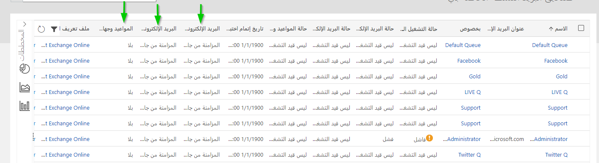
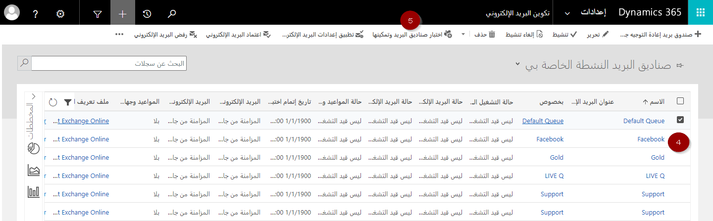
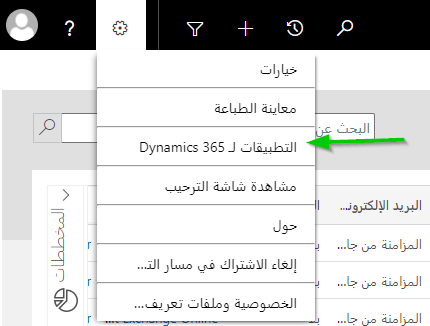

يحقق هذا التمرين أفضل نتيجة إذا كنتَ تستخدم الإصدار 9.0 أو إصدار أحدث من البيئة التجريبية لتطبيقات Microsoft Dynamics 365 Customer Engagement. تحتاج أيضاً إلى ترخيص Microsoft 365 وصندوق بريد Exchange نشط.

### الأهداف التعليمية

ستتمكن في نهاية هذه التمارين من أداء المهمة التالية: توزيع Dynamics 365 App for Outlook إلى مستخدمي Dynamics 365.

الوقت المقدر لإنهاء هذا التمرين العملي: 20 إلى 30 دقيقة

### الخطوات عالية المستوى

1. تأكيد المزامنة على جانب الخادم بوصفها أسلوب المزامنة لصندوق بريد المستخدم.
2. إرسال التطبيق إلى المستخدم.
3. تأكيد توزيع التطبيق.

### الخطوات التفصيلية

تعمل مستشاراً وظيفياً يبدأ العمل في تنفيذ Dynamics 365 CE لعميل جديد. يتضمن هذا التنفيذ توزيع Dynamics 365 App for Outlook إلى المستخدمين داخل المؤسسة. قبل توزيع التطبيق، عليك التأكُّد من أن صناديق بريد المستخدمين تستخدم المزامنة على جانب الخادم بوصفها أسلوب المزامنة.

### ‏‫تأكيد المزامنة على جانب الخادم بوصفها أسلوب المزامنة

1. في Dynamics 365، انتقل إلى **إعدادات -> تكوين البريد الإلكتروني**.
2. افتح **صناديق البريد**.
3 تأكَّد من أن المزامنة على جانب الخادم هي الأسلوب المستخدم من أجل **البريد الإلكتروني الوارد**، و **البريد الإلكتروني الصادر**، و **المواعيد**. إذا لم يكن الأمر كذلك، فافتح صندوق البريد وحدّد **المزامنة على جانب الخادم** عند اللزوم.

4. حدِّد صندوق البريد.
5. انقر فوق **اختبار صناديق البريد وتمكينها**.

6. انتظر بضع دقائق وتأكَّد من نجاح الاختبار.

### إرسال التطبيق إلى المستخدم

7. انتقِل إلى **إعدادات -> Dynamics 365 App for Outlook**.
8. تأكَّد من ظهور المستخدم في قائمة المستخدمين المؤهلين، ومن أن التطبيق لم يُضاف للمستخدم.
9. انقر فوق **إضافة التطبيق لجميع المستخدمين المؤهلين**.

### تأكيد توزيع التطبيق

10. بعد بضع دقائق، عليك توسيع **قائمة الإعدادات الشخصية**، وفتح **التطبيقات لـ Dynamics 365**.

11. تأكَّد من أن التطبيق قد أُضيف إلى Outlook.

