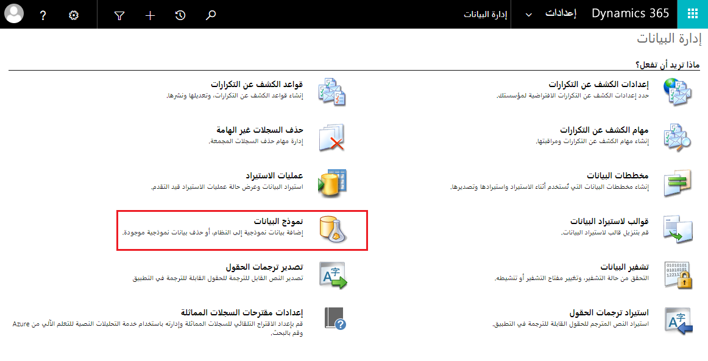

دعنا نلق نظرة على كيفية إدارة بيانات Dynamics 365.

> [!VIDEO https://www.microsoft.com/videoplayer/embed/RWrwR1] 

يمكنك إدارة القدرة الإنتاجية لتخزين البيانات في مؤسستك فيما يتعلق بالاشتراك في Dynamics 365. يحدد نوع الاشتراك الذي تشتريه مقدار مساحة التخزين المخصصة في البداية لمؤسستك. إذا نفدت مساحة التخزين، يمكنك إضافة المزيد.

يمكنك أيضاً الحصول على مساحة تخزين عن طريق حذف أنواع معينة من البيانات غير الضرورية في تطبيقات Dynamics 365 Customer Engagement.

### مراقبة التخزين

راقب تخزين Dynamics 365 لديك للتأكد من أن لديك الكثير من القدرة الإنتاجية للنمو.

إذا كان إجمالي سعة التخزين المستخدمة 80% أو أكثر من القدرة الإنتاجية، فسوف يتلقى مسؤولو Dynamics 365 إعلامات بالبريد الإلكتروني وستظهر التنبيهات على صفحة Service health.

1. انتقل إلى مركز إدارة Microsoft 365 وقم بتسجيل الدخول باستخدام بيانات اعتماد مسؤول Microsoft 365 العمومي.

2. انقر فوق مراكز الإدارة > Dynamics 365.

3. اختر علامة التبويب Service health.

إذا كنت بحاجة إلى تفريغ مساحة تخزين، فإن هذا المستند على Microsoft Docs يُعد نقطة انطلاق جيدة. [تفريغ مساحة التخزين](/dynamics365/customer-engagement/admin/free-storage-space).

### الرؤى المستقبلية للمؤسسة

للحصول على معلومات إضافية، يمكنك الوصول إلى "الرؤى المستقبلية للمؤسسة".

1. انتقل إلى [https://admin.powerplatform.microsoft.com](https://admin.powerplatform.microsoft.com/).

2. حدد "التحليلات" من القائمة اليسرى.

3. من القائمة الفرعية، حدد Microsoft Dataverse للتطبيقات.

4. حدد علامة التبويب تخزين لمعرفة كيفية تخزين البيانات.

يمكنك أيضاً استخدام مرشح التغيير لتبديل البيئة الحالية التي تركز عليها التحليلات.

تمنحك البيانات النموذجية شيئاً لتجربته بينما تتعلم تطبيقات Dynamics 365 Customer Engagement وتطبيقات Power platform Dataverse، وتساعدك على رؤية كيفية تنظيم البيانات على النظام. يمكن أن تكون البيانات النموذجية مفيدة أيضاً في عرض التطبيقات. 

بالإضافة إلى البيانات النموذجية التي تمت مناقشتها في هذا الموضوع، إذا كنت شريكاً، يمكنك أيضاً العثور على مثيلات تجريبية بها بيانات على demos.microsoft.com. 

### نموذج بيانات Dataverse

عند إنشاء بيئة Dataverse جديدة، يمكنك اختيار تضمين تطبيقات وبيانات نموذجية في وقت الإنشاء.

### نموذج بيانات Dynamics 365

بالنسبة لبيئات Dataverse مع تطبيقات Dynamics 365، إذا لم تكن البيانات النموذجية مثبتة بالفعل على نظامك، فقد ترغب في إضافتها لأغراض التدريب. في وقت لاحق، عندما تكون جاهزاً، يمكنك إزالته.

يوصى بعدم تشغيل نموذج البيانات في نظام الإنتاج الخاص بك، واستخدام وضع الحماية أو نسخة تجريبية بدلاً من ذلك.

من الواجهة الكلاسيكية.

1. تأكد من أنك تتمتع بدور أمان مسؤول النظام أو أنه لديك أذونات مكافئة في Dynamics 365.

2. انتقل إلى الإعدادات > إدارة البيانات.

3. انقر فوق نموذج البيانات. سترى رسالة تخبرك بما إذا كان نموذج البيانات مثبت حالياً أو لا.

4. قم بأحد الإجراءات التالية:

    - انقر فوق إزالة نموذج البيانات، ثم انقر فوق إغلاق.

    - انقر فوق تثبيت نموذج البيانات، ثم انقر فوق إغلاق. 

 

