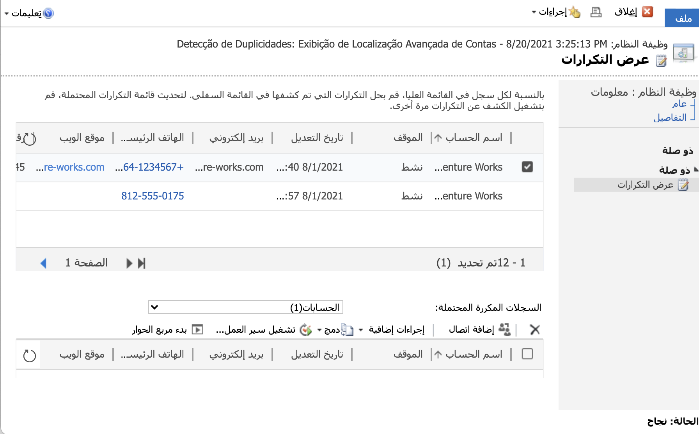
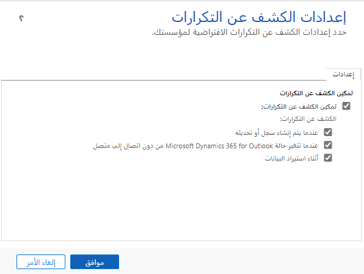
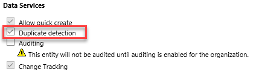
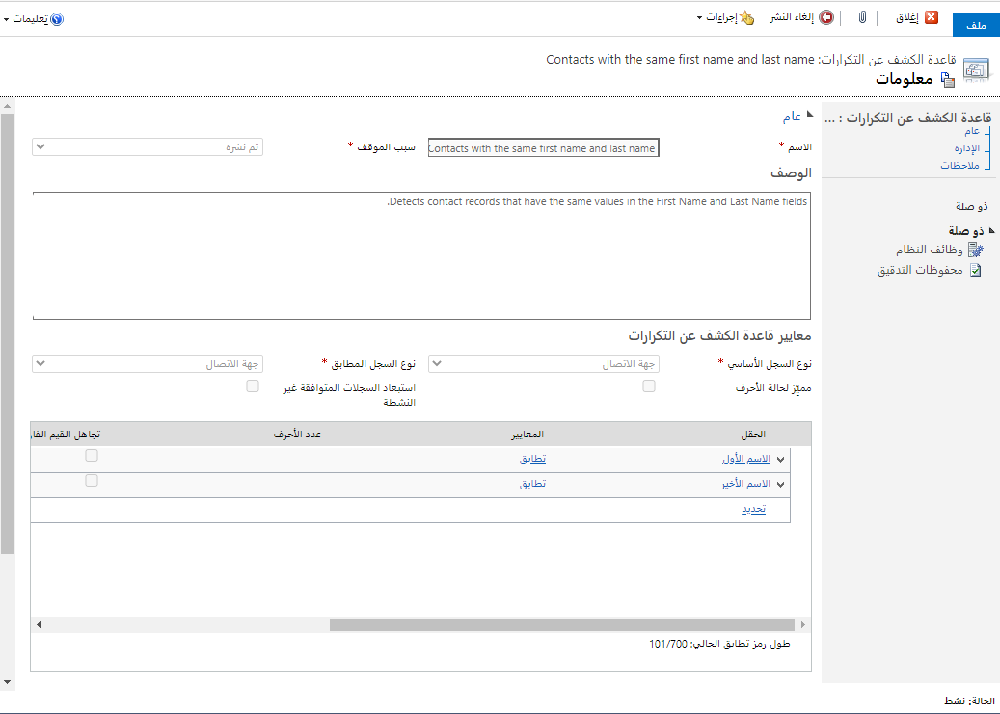
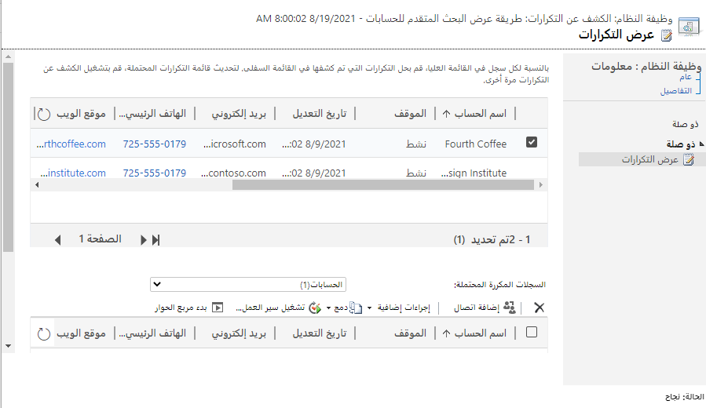

يعد الكشف عن التكرارات ميزة مطلوبة بشكل شائع في تطبيقات قواعد البيانات للمساعدة في الحفاظ على البيانات نظيفة. نظراً لأن المستخدمين يقومون بإنشاء سجلات، فقد لا يدركون أن السجل الذي يقومون بإنشائه موجود بالفعل في النظام. تم تصميم وظيفة الكشف عن التكرارات الجاهزة لتنبيه المستخدم إلى التكرارات المحتملة عند إنشاء السجلات أو تحديثها بشكل تفاعلي في التطبيقات المستندة إلى النموذج. يمكن أيضاً تشغيلها كوظيفة نظام في الخلفية للعثور على التكرارات المحتملة للمسؤول لمراجعتها. بالإضافة إلى ذلك، يمكن للمطورين اكتشاف التكرارات عند استخدام API للنظام الأساسي عبر التعليمات البرمجية. يتم تمكين كل هذه السيناريوهات من خلال تمكين الكشف عن التكرارات وتكوين القواعد بشأن ما يمكن اعتباره تكراراً.

### إعدادات الكشف عن التكرارات
قبل التمكن من استخدام الكشف عن التكرارات، يجب تمكينه بشكل صحيح. للقيام بذلك، انتقل إلى منطقة إدارة البيانات في الإعدادات وافتح إعدادات الكشف عن التكرارات للتأكد من تمكين الكشف عن التكرارات للمؤسسة. 

يجب تمكين أي كيان ترغب في استخدام الكشف عن التكرارات على مستوى الكيان. تم العثور على منطقة خدمات البيانات للكيان في أي حل حيث الكيان موجود. 

بمجرد تمكين المؤسسة والكيانات المحددة، يمكن إنشاء قواعد الكشف عن التكرار. 

### قواعد الكشف عن التكرارات
تحدد قواعد الكشف عن التكرار الحقول التي سيتم استخدامها لتحديد البيانات المكررة المحتملة. يتم تحديد ذلك عادةً من خلال البيانات الفريدة الموجودة في السجل، مثل عنوان البريد الإلكتروني. غالباً ما يتم استخدام أسطر متعددة للمساعدة في استبعاد الإيجابيات الخاطئة، مثل الاسم الأول واسم العائلة وهاتف العمل في نفس القاعدة. 

يمكن أن تكون الحقول مطابقة تماماً، أو مشاركة عدد معين من الأحرف الأولى أو الأحرف الأخيرة. على سبيل المثال، قد يكون لديك أسماء حسابات حيث تكون الأحرف الستة الأولى متطابقة، وقد يلزم مراجعة هذا لمعرفة ما إذا كان الحساب الجديد تابعاً لحساب موجود. 

يمكنك تحديد ما إذا كنت تريد إجبار المطابقات على أن تكون حساسة لحالة الأحرف. عادةً ما يتم ترك هذا المربع دون تحديد. يمكنك أيضاً اختيار تجاهل القيم الفارغة. يؤدي تجاهل القيم الفارغة إلى منع القاعدة من رؤية الحقل المحدد فارغاً في سجلين كمطابقة. عادةً ما يتم تحديد خانة الاختيار هذه، ويتم تجاهل الفراغات. من الشائع تحديد المربع لاستبعاد السجلات غير النشطة من القاعدة، بحيث لا تستمر التكرارات التي تم حلها مسبقاً في الظهور في النتائج. 

يمكن أيضاً استخدام الكشف عن التكرارات لفحص كيانين لمعرفة ما إذا كانت هناك تكرارات عبر السجلات، مثل عميل متوقع يمثل أيضاً جهة اتصال. يتم استخدام نوع السجل المطابق لتحديد السجلات الأخرى التي يجب التحقق منها، سواء كانت نفس الكيان أو كياناً مختلفاً. 

يمكن أن يكون لديك عدة قواعد نشطة للكشف عن التكرار لكيان ما. 

### مهام الكشف عن التكرارات
يمكن إعداد وظائف الكشف عن التكرارات كوظائف نظام للتشغيل بشكل دوري والتحقق من التكرارات. تتوفر عدة خيارات أثناء تكوين مهمة الكشف عن التكرارات:

- أدخل اسماً يعكس معايير الاستعلام

- يمكن تشغيل وظيفة الكشف عن التكرارات على الفور ولكن يتم جدولتها عادةً للتشغيل بعد ساعات حتى لا تؤثر في إنتاجية المستخدم. 

- من خلال تحديد هذا المربع واختيار تكرار، سيتم تشغيل وظيفة الكشف عن التكرارات تلقائياً في المستقبل. 

- يمكن لمهام الكشف عن التكرارات إرسال بريد إلكتروني إلى المسؤول وعنوان بريد إلكتروني آخر بعد اكتمال المهمة. 

بعد تشغيل وظيفة الكشف عن التكرارات، يجب على مستخدم إداري مثل مسؤول النظام فتح وظيفة نظام الكشف عن التكرارات ومراجعة التكرارات المحتملة ومعالجتها. 

  

### الاعتبارات
- لا يتم اكتشاف التكرارات عندما يقوم المستخدم بدمج سجلين أو تنشيط سجل أو إلغاء تنشيطه أو حفظ نشاط مكتمل.

- إذا كانت قاعدة الكشف عن التكرارات تحتوي على شرط واحد فقط، فسيتم تجاهل القيم الفارغة أثناء مهمة الكشف عن التكرارات.

- تعتبر وظيفة الكشف عن التكرارات الجاهزة حرفية للغاية وليست صارمة بما يكفي لجميع البيئات. ستقترح الوظيفة التكرارات المحتملة ولكنها ليست مقيدة للمستخدمين ولا تفرض سياسة حماية صارمة من التكرارات. في بعض عمليات التنفيذ، من الضروري إحضار حل جهة خارجية أو منطق مطور مخصص لإدارة التكرارات. 

