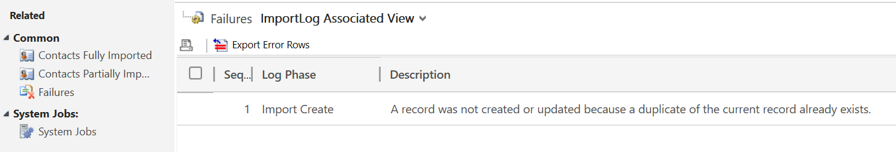
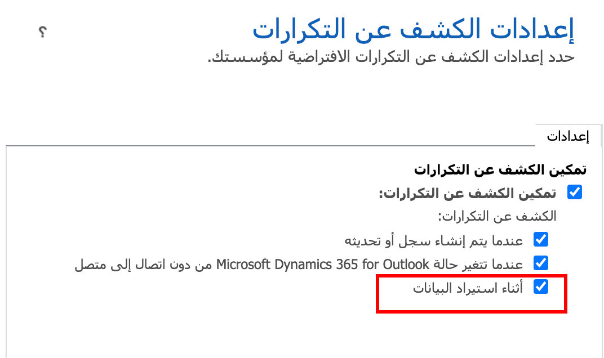
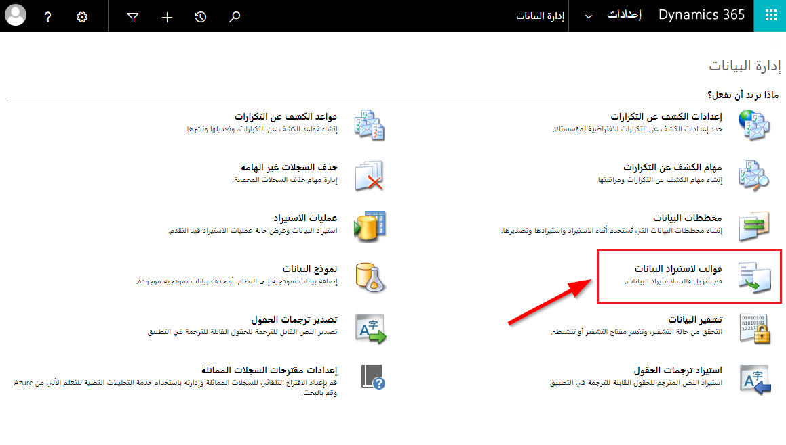
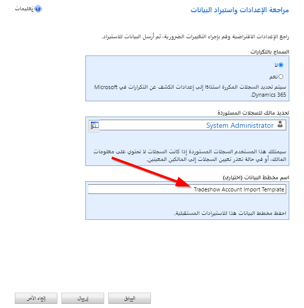
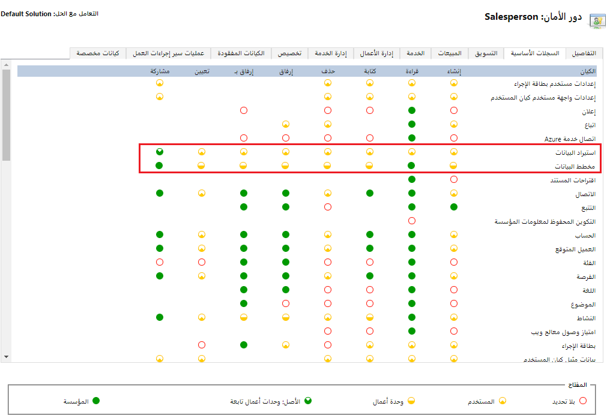
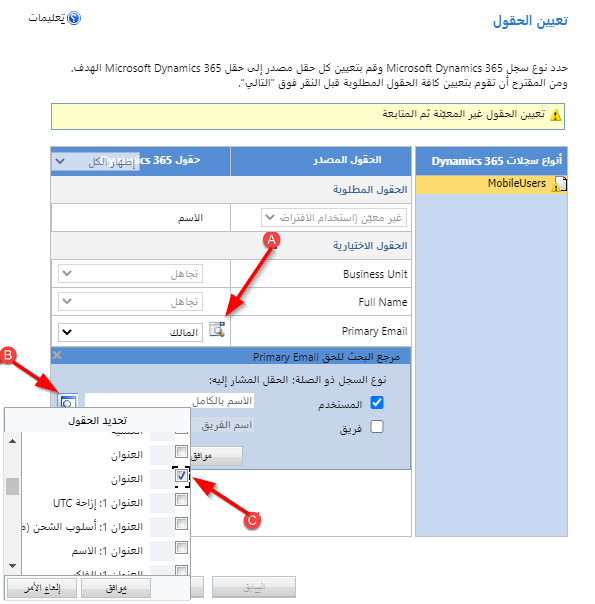
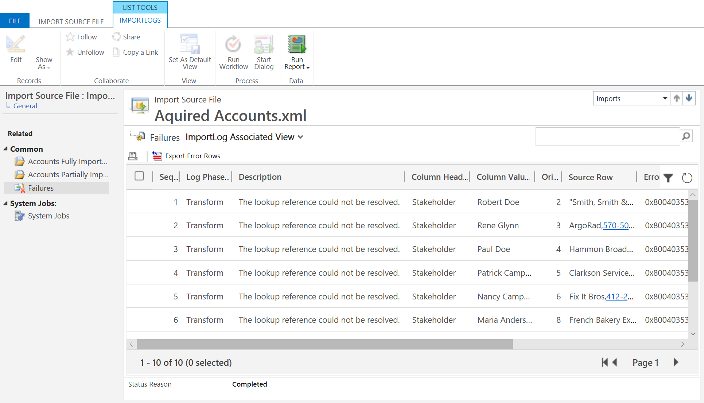
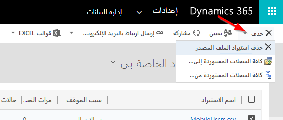

شاهد فيديو النظرة العامة هذا حول استيراد البيانات.

> [!VIDEO https://www.microsoft.com/videoplayer/embed/RWrznC]

عند إحضار البيانات إلى بيئات Microsoft Dataverse للتطبيقات، يوجد عدد من التحديات الشائعة التي قد يواجهها المستخدمون أثناء العملية.

## تكرار البيانات 

إلى حد بعيد المشكلة الأكثر شيوعاً التي واجهتها أثناء استيراد البيانات هي استيراد البيانات التي قد تكون موجودة بالفعل في النظام الهدف. 

يحتوي Dataverse للتطبيقات على ميزة الكشف عن التكرارات التي تعتمد على القواعد التي تجمع بين عدة حقول لتحديد قيمة فريدة لكل سجل. تُستخدم هذه القيمة لاكتشاف ما إذا كان السجل الذي يتم استيراده مكرراً. يمكن التحكم في هذا الإعداد بشكل منفصل لعملية استيراد البيانات. 

إذا تم تعطيل الكشف عن التكرارات أثناء الاستيراد، فلا يزال من الممكن استخدامه لتحديد السجلات المكررة المحتملة لاحقاً. للتعامل مع التكرارات، يتضمن Dataverse للتطبيقات وظيفة الدمج حيث يمكن دمج سجلين محددين وإلغاء تنشيط أحدهما. تحتوي [عملية الدمج](/dynamics365/customer-engagement/basics/merge-duplicate-records-accounts-contacts-leads) على واجهة مستخدم تفاعلية لجهة الاتصال والحساب وكيانات العملاء المتوقعين، على الرغم من أنه يمكن للمطورين استخدام API لتطبيقات الويب Dataverse للتطبيقات لتنفيذ الدمج على الكيانات الأخرى، بما في ذلك الكيانات المخصصة.

الطريقة الأخرى لمنع نسخة مكررة من الدخول إلى النظام هي إنشاء مفاتيح بديلة لكيان ما. يجب أن يكون للمفاتيح البديلة قيمة فريدة في جميع إدخالات البيانات داخل كيان واحد. على سبيل المثال، يمكن تحديد رقم العميل ليكون فريداً، أو قد يكون لديك قرار عمل حيث يجب أن يكون لجميع جهات الاتصال في قاعدة البيانات الخاصة بك عنوان بريد إلكتروني فريد. على عكس قواعد الكشف عن التكرارات، لا يمكن التحايل على المفتاح البديل، ولن يتم ببساطة استيراد السجلات التي تحتوي على مفتاح مكرر.

### العلاقات

غالباً ما ترتبط السجلات المستوردة بكيانات أخرى في النظام. على سبيل المثال، قد يكون لجهات الاتصال حساب أصلي محدد في بيانات الاستيراد. تعتمد طريقة التعامل مع التبعيات على مدى تعقيد العلاقات. 

في الحالات المباشرة عندما يقوم أحد الكيانات بالبحث عن كيان آخر، على سبيل المثال، لدى جهة اتصال حساب أصلي، يوفر معالج استيراد البيانات القدرة على استيراد ملف zip. يحتوي على بيانات لكلا الكيانين وستتعامل عملية الاستيراد مع العلاقة.

قد تتضمن السيناريوهات الأكثر تعقيداً تبعيات دائرية، على سبيل المثال عند استخدام جهة اتصال فرعية أيضاً كجهة اتصال رئيسية للحساب الأصلي. يتضمن مثال آخر علاقات مرجعية ذاتية عندما يكون الكيان مرتبطاً بنفسه، على سبيل المثال يمكن أن يكون للحساب حسابات فرعية. يمكن التعامل مع هذه السيناريوهات الأكثر تعقيداً باستخدام: 

- أداة ترحيل التكوين التي تعد جزءاً من مجموعة SDK لـ Dataverse للتطبيقات.

- أدوات تكامل بيانات الجهات الخارجية.

### البيانات المطلوبة

في كثير من الأحيان، عند استيراد البيانات إلى البيئة، لا يمكن ضمان جودة البيانات الواردة. أحد أكثر التحديات شيوعاً هو عدم وجود قيم للحقول التي أنشأتها الأعمال لتكون إلزامية. 

لن تفشل عمليات الاستيراد إذا كان هناك حقل إلزامي مفقود من بيانات الاستيراد. لحل القيم المفقودة، قد ترغب في التفكير في تنظيف بياناتك قبل الإدخال للتأكد من أن تصفية صف القيم في Power Query تجعل هذه العملية مهمة مباشرة للغاية. اعتماداً على متطلبات العمل، قد يكون البديل الآخر هو السماح للبيانات بالدخول إلى بيئتك ثم استخدام ميزة البحث المتقدم للإبلاغ عن السجلات التي تكون فيها الحقول الإلزامية مفقودة والسماح للمستخدمين بالتعامل معها.

### مصادر البيانات

تعد الملفات المفصولة بفواصل (csv.) وExcel ‏(xlsx.) أحد أكثر تنسيقات إدخال البيانات شيوعاً ويمكن معالجتها باستخدام معالج استيراد البيانات أو أداة ترحيل التكوين أو Excel Online. غالباً ما تأتي البيانات من مصادر بيانات أخرى، على سبيل المثال، قوائم SharePoint، وقواعد بيانات الجهات الخارجية، وما إلى ذلك. وهذا هو المكان الذي يمكن فيه استخدام Power Query للاتصال مباشرة بمجموعة متنوعة من مصادر البيانات، واستخراج بياناتك وتحويلها وتنظيفها قبل الاستيراد. 

### ال‏‏عمليات 

مع تزايد تعقيد بيئتك، قد يكون لدى الكيانات مهام سير عمل في الوقت الحقيقي، وقواعد عمل على نطاق الكيان، ومكونات إضافية مضافة. تُستخدم هذه المكونات عادةً لتنفيذ منطق الأعمال أو زيادة البيانات أو فرض قواعد تكامل البيانات أو التواصل مع الخدمات الأخرى، بما في ذلك الجهات الخارجية.

غالباً ما يكون لهذه العمليات تأثير ضئيل أو مقبول على الأداء عند تحديث السجلات الفردية عبر واجهة المستخدم. ومع ذلك، عند استيراد عدد كبير من السجلات، يمكن أن يصبح التأثير قاسياً للغاية مما يؤدي إلى ظهور عقوبة أداء غير مقبولة أو حتى حالات فشل.

يُوصى بشدة بمراجعة المكونات المسجلة في الكيانات التي يتم استيرادها، وإن أمكن، اتخاذ إجراء تصحيحي.

- قم بتحويل مهام سير العمل في الوقت الحقيقي إلى مهام سير عمل في الخلفية حيثما أمكن ذلك.

- قم بتعطيل قواعد العمل والمكونات الإضافية ومهام سير العمل في الوقت الحقيقي لمدة الاستيراد وأعد تمكينها بعد ذلك. قد تحتاج إلى العمل مع المطورين لتحديد ما إذا كانت العمليات التعويضية، مثل تنفيذ مجمع لسير العمل، مطلوبة ليتم تشغيلها.

- استبدل عمليات التحقق في الوقت المناسب بعملية دُفعة، إن أمكن. على سبيل المثال، إذا كنت تستخدم خدمة ويب تابعة لجهة خارجية للتحقق من صحة عناوين العملاء، فربما لا تكون هناك حاجة ملحة للقيام بذلك عند استيراد معلومات العميل. قد يكون قرار العمل الصالح هو تشغيل وظيفة دفعة متكررة للتحقق من صحة العناوين بشكل مجمّع.

 
غالباً ما يلزم إحضار البيانات التي تنشأ في نظام آخر إلى Dynamics 365. تسهل وظيفة الاستيراد على مستخدم الأعمال أو مسؤول النظام استيراد السجلات. يمكن إنشاء سجلات لأي كيان أو تحديثها من خلال معالج الاستيراد، في بعض الحالات. 

### استيراد الملفات
يتم استيراد البيانات من ملفات Excel، إما من خلال قوالب Dynamics 365 أو أوراق عمل Excel. يمكن تنزيل قوالب Excel لأي كيان في منطقة إعدادات إدارة البيانات. سيوفر هذا النموذج جميع الحقول للكيان؛ يمكن حذف الحقول غير الضرورية من جدول البيانات. 

يمكن استيراد ملفات Excel دون قالب بالتنسيقات التالية: قيم مفصولة بفواصل (csv.)، نص (txt.)، جدول بيانات Excel 2003 ‏(xml.)، مصنف Excel ‏(xlsx.)، مضغوط (zip.). أثناء عملية الاستيراد، سيتم إنشاء مخطط بيانات لمطابقة الأعمدة في جدول البيانات مع الحقول الموجودة في الكيان. يمكن حفظ مخططات البيانات لاستخدامها لاحقاً عن طريق إضافة اسم في نهاية عملية الاستيراد. سيؤدي ذلك إلى إتاحة جدول البيانات لتعيينات الحقول لأي مستخدم لديه أذونات لاستيراد البيانات. 

### الملفات المضغوطة
من الشائع وجود تبعيات بين كيانات متعددة من البيانات مما قد يؤدي إلى تعقيد عملية الاستيراد. على سبيل المثال، إذا كنت تقوم باستيراد حسابات وجهات اتصال جديدة، فإن سجل الحساب يحتوي على بحث لجهة الاتصال الأساسية، ويكون لجهة الاتصال بحث في الحساب. يجب أن تكون السجلات المشار إليها في البحث موجودة في النظام عند الاستيراد، وإلا سيفشل هذا الصف من ملف الاستيراد. إذا تم وضع ملفات الاستيراد في ملف مضغوط وتم استيرادها معاً، فستكون السجلات ذات الصلة متاحة ولن تتسبب في حدوث حالات فشل. 

### ملكية السجلات التي تم إنشاؤها عند الاستيراد
هناك طريقتان للإشارة إلى مالك السجلات التي تم إنشاؤها بواسطة الاستيراد. إذا تم تضمين عمود مالك في الاستيراد وتم ملؤه باسم مستخدم صالح، فسيكون السجل مملوكاً لهذا المستخدم. في نهاية عملية الاستيراد، يمكن اختيار مستخدم لامتلاك أي سجلات من دون عمود مالك ممتلئ. بشكل افتراضي، إذا لم تتم الإشارة إلى أي سجلات بطريقة أخرى في عمود المالك أو في معالج الاستيراد، فإن السجلات تكون مملوكة للمستخدم الذي يقوم بتشغيل معالج الاستيراد. 

### الأمان
يتم التحكم في القدرة على استيراد البيانات من خلال أدوار الأمان، وتحديداً امتيازات استيراد البيانات ومخطط البيانات. يجب أن يمتلك المستخدم أيضاً امتيازات إنشاء للكيان لإنشاء سجلات جديدة عبر معالج الاستيراد بالإضافة إلى امتيازات الكتابة للكيان في حالة تحديث البيانات من خلال الاستيراد. 

إذا كان لدى المستخدم أذونات استيراد، فيمكنه الكتابة فوق البيانات باستخدام Excel Online. يجب منح هذا الإذن بعناية فائقة لأنه يسمح للمستخدم بالتأثير المحتمل على قدر كبير من البيانات عن طريق الخطأ. 

### عمليات البحث
ستؤدي القيم المكررة في حقل البحث إلى فشل الاستيراد حتى إذا لم تكن السجلات مكررة بالفعل. بالنسبة لعمليات الاستيراد باستخدام حقول البحث التي يمكن اعتبارها مكررة، قم بتحرير الحقل المختار داخل مخطط البيانات بحيث يبحث مخطط البيانات عن حقل فريد مثل رقم الحساب أو رقم الهاتف ولا يعتمد على اسم شائع أو حقل نص متكرر في كثير من الأحيان. 

### معالجة الأخطاء 

في منطقة عمليات الاستيراد من إدارة البيانات، يمكنك مراجعة مهام الاستيراد الخاصة بك. يمكن مراجعة الوظائف الفردية من خلال النجاحات وحالات الفشل. لا يمكنك استرداد ملف الاستيراد الأصلي، تظهر لك فقط نتائج الاستيراد. في عمود حالات الفشل، يمكنك مراجعة الأخطاء التي تسببت في فشل أحد الصفوف. 

### العودة إلى الحالة السابقة

من وقت لآخر، قد تحتاج إلى التراجع عن الاستيراد. سيؤدي خيار حذف الملف المصدر للاستيراد إلى إزالة الملف من قائمة الاستيراد ولكنه لن يؤثر على أي بيانات تم استيرادها. يمكنك اختيار القيام بذلك لإزالة وظائف الاستيراد التي فشلت أو لمسح سجل وظائف الاستيراد القديمة. إذا قمت باستيراد البيانات عن طريق الخطأ، فلديك خيار التراجع عن جميع السجلات المستوردة عن طريق تحديد جميع السجلات التي تم استيرادها إلى الكيان أثناء هذا الاستيراد. سيزيل الخيار الثالث السجلات المستوردة من جميع الكيانات المشاركة في استيراد الملف المضغوط. 

### الاعتبارات
- يمكن إضافة حقول جديدة من خلال معالج الاستيراد، ولكن لا يُوصى بذلك عند الحاجة إلى ناشري الحلول وبادئات الحلول في بيانات التعريف.

- ضع في اعتبارك الحد الأقصى لأحجام الملفات. يبلغ الحد الأقصى لحجم الملفات المضغوطة ‏32 ميجابايت، ويبلغ الحد الأقصى لحجم جميع الملفات الأخرى 8 ميجابايت. 

- إذا كان لديك أي عمليات تنفيذ تلقائية، مثل مهام سير العمل أو عمليات Power Automate أو المكونات الإضافية أو قواعد العمل، التي تم تكوينها لتنشيطها عند إنشاء سجل وتقوم أنت باستيراد نوع السجل هذا في الكتلة، فسيتم تشغيل عمليات التنفيذ التلقائية ويمكنها أن تؤثر على الأداء. 

- تجنب استخدام الفاصلة المنقوطة (؛) أو الفاصلة (،) في البيانات المستوردة. يستخدم Dynamics 365 الفواصل المنقوطة والفاصلات كمحددات للحقول.

### استخدام Power Query

إن Power Query هو خيار لاستيراد البيانات، ويوضح الفيديو التالي كيف يتم ذلك.

> [!VIDEO https://www.microsoft.com/videoplayer/embed/RWrUgK]
