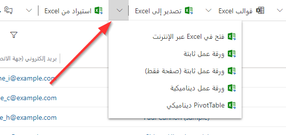
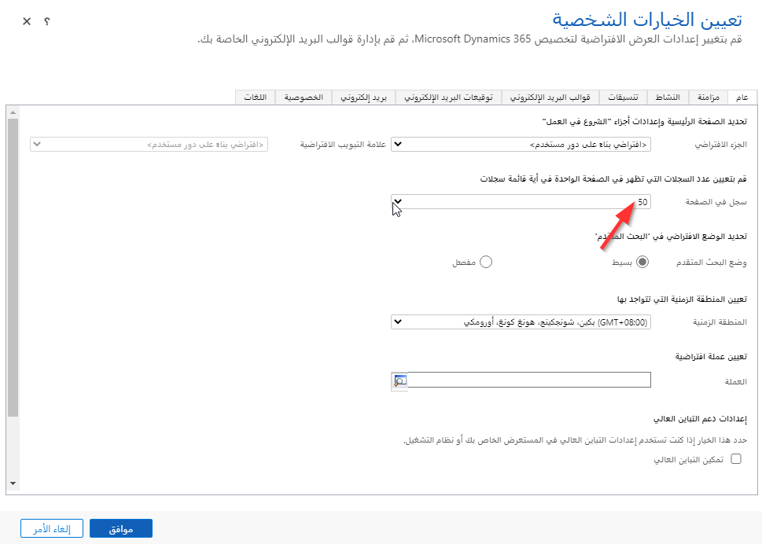
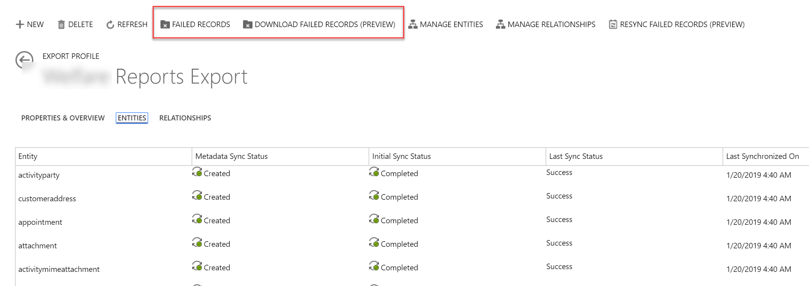

يقدم الفيديو التالي نظرة عامة على خيارات تصدير البيانات.

> [!VIDEO https://www.microsoft.com/videoplayer/embed/RWrwR2]

يعد التكامل بين التطبيقات المستندة إلى النموذج وMicrosoft Excel ميزة يفضلها العديد من المستخدمين. يعد Excel أحد أكثر أدوات تحليل البيانات شيوعاً لمستخدمي الأعمال، كما تشكل سهولة تصدير بيانات Microsoft Dataverse إلى Excel ميزة كبيرة للمستخدمين على جميع مستويات المؤسسة. 

في بعض الحالات، قد يكون من الضروري مشاركة بيانات Dataverse مع الأفراد أو المؤسسات الذين ليس لديهم ترخيص Power platform. تعد وظيفة التصدير إلى Excel أداة رائعة لدعم هذه السيناريوهات.

### أوراق العمل الثابتة والديناميكية

يمكن تصدير معظم طرق العرض كأوراق عمل ثابتة أو ديناميكية. ويؤدي تصدير ورقة عمل ثابتة إلى إنشاء نسخة محلية من البيانات. لا يتم الاحتفاظ بأي اتصال بين بيئة CDS والمصنف، ولم يعد نموذج أمان CDS يُنظِّم الوصول إلى البيانات. تحتفظ المصنفات الديناميكية المُصدَّرة أو جداول العروض المحورية بارتباط بين بيانات CDS وملف Excel. يتم الاحتفاظ بنموذج أمان CDS، ويجب أن تتوفر امتيازات مناسبة للمستخدمين لتحديث البيانات. 

يقوم خيار التصدير الإضافي بالتصدير إلى Excel Online. يفتح هذا الخيار ملف Excel للمستخدم في نافذة داخل Dynamics 365 أو التطبيقات المخصصة المستندة إلى النموذج. ويمكن للمستخدمين الذين لديهم الأذونات المناسبة حفظ تغييرات البيانات مرة أخرى إلى Dataverse. 

### الأمان

يتم التحكم في القدرة على التصدير من خلال أدوار الأمان. يمكن العثور على الامتياز في علامة تبويب إدارة الأعمال ضمن علامات تبويب الامتياز المتعلقة بالخصوصية. وهو امتياز لا غنى عنه. في حالة منحه، يمكن للمستخدم تصدير أي بيانات يملك حقوق الأمان الخاصة بعرضها. 

وبمجرد التصدير، يصبح ملف Excel خارج نموذج أمان Dataverse ويمكن لأي شخص لديه حق الوصول إلى الملف عرض جميع البيانات. وكما هو الحال مع أي ملف يحتوي على بيانات حساسة، من الضروري التعامل مع المستندات بطريقة تراعي قواعد خصوصية بيانات المؤسسة. 

### السجلات لكل صفحة

بشكل افتراضي، ستعرض طرق العرض 50 سجلاً فقط لكل صفحة. ويمكنك زيادة عدد السجلات المعروضة في علامة التبويب "عام" بقائمة الخيارات الشخصية. 

### الاعتبارات

- إذا كنت تخطط لإعادة استيراد البيانات بعد إجراء تغييرات في Excel، فضع في اعتبارك أنك لن تتمكن من استيراد التغييرات إلى الحقول المركبة، مثل حقل الاسم الكامل أو حقل القيمة المحتسبة والحقل المحسوب. في حالة الحقول المركبة، يمكنك تحديث الحقول الفردية مثل الاسم الأول واسم العائلة وسيتم تحديث الحقل المركب بعد الاستيراد. 

- لعرض وتحديث البيانات الديناميكية، يجب تثبيت Microsoft Dynamics 365 for Outlook. وإذا تم تثبيته وتكوينه بالفعل، فانقر فوق تحديث من CRM لتسجيل الدخول إلى تطبيقات Dynamics 365 Customer Engagement. إذا لم تكن تريد أن تتم مطالبتك مرة أخرى بتسجيل الدخول، فانقر فوق حفظ عنوان البريد الإلكتروني وكلمة المرور في صفحة تسجيل الدخول.

- لا يمكن تصدير بعض طرق عرض النظام، مثل الحسابات: التي ليس لها أنشطة حملات في الأشهر الـ 3 الماضية‬، إلا إلى ورقة عمل Excel ثابتة.

يوفر Dataverse الخاص بالتطبيقات الوصول إلى البيانات باستخدام واجهات المستخدم أو API، ولا يوجد وصول مباشر إلى قاعدة البيانات الأساسية. يتم فرض قيود معينة على هذه البنية عندما يتعلق الأمر بمعالجة كميات كبيرة من البيانات، على سبيل المثال لأغراض تخزين البيانات أو إعداد تقارير عنها أو استخدام أدوات التحليل والتعلم الآلي في Azure. من الممكن نسخ بيانات Dataverse باستخدام أدوات الاستخراج والتحويل والتحميل (ETL) ولكن من المُعضِل الحفاظ عليها بحكم طبيعتها. 

خدمة تصدير البيانات هي خدمة متوفرة على Microsoft AppSource تضيف القدرة على نسخ بيانات تطبيقات Dynamics 365 Customer Engagement إلى مخزن قاعدة بيانات Azure SQL في اشتراك Azure المملوك للعميل. 

**ملاحظة:** تتطلب خدمة تصدير البيانات اشتراك تطبيقات Dynamics 365 Customer Engagement، وهي غير متوفرة على Dataverse لخطط التطبيقات.

تقوم خدمة تصدير البيانات بمزامنة المجموعة الفرعية المكونة مسبقاً من بيانات التطبيقات Dynamics 365 Customer Engagement بطريقة ذكية في البداية، وبعد ذلك تقوم بمزامنتها بشكل مستمر عند حدوث تغييرات في تطبيقات Dynamics 365 Customer Engagement. 

تعمل خدمة تصدير البيانات على تبسيط التعقيد الفني والإداري لتوزيع وإدارة حل تصدير البيانات - إدارة كل من المخطط والبيانات تلقائياً. 

### حالات الاستخدام

يتيح وجود بياناتك في قاعدة بيانات Azure SQL العديد من الإمكانات، مثل إعداد قاعدة بيانات تشغيلية لإعداد التقارير باستخدام Power BI، أو إنشاء منطقة تجميع لمستودع البيانات، أو إنشاء نماذج التعلم الآلي. بالإضافة إلى ذلك، يمكن أن تساعد قاعدة البيانات المتزامنة أيضاً في إلغاء تحميل أي استعلامات تتمحور حول حمل عمل القراءة فقط، مما يقلل أحمال العمل على نظام Dynamics 365 الرئيسي. 

إن حالة الاستخدام الرئيسية التي يمكن أن تساعدها خدمة تصدير البيانات هي إنشاء تقارير BI التشغيلية أو المؤسسية القابلة للتطوير باستخدام Power BI في Azure مدعومة بقاعدة بيانات Azure SQL. ويمكن أن يساعد هذا أيضاً المؤسسات التي تقوم بالترحيل من عمليات التثبيت المحلية حيث تم استخدام SQL Server Reporting Services‏ (SSRS) بشكل مكثف لإعداد تقارير عن بيانات Dynamics 365.

### تأمين البيانات

لا يطبق تصدير البيانات إلى Azure SQL نموذج أمان Dataverse. أي شخص لديه حق الوصول إلى قاعدة البيانات فإنه يمتلك حق الوصول الكامل إلى الجداول ما لم تقم بتطبيق الأمان الخاص بك.

### التثبيت والتكوين 

يتم تثبيت خدمة تصدير البيانات بواسطة مسؤول النظام عبر [AppSource](https://appsource.microsoft.com/en-US/marketplace/apps?search=Dynamics%20365&page=1). بعد تثبيت خدمة تصدير البيانات، يتم إنشاء ملف تعريف تصدير واحد أو أكثر، يحدد كل منها مجموعة من الكيانات لنسخ البيانات من Dynamics 365 إلى قاعدة البيانات الوجهة.

تقوم ملفات تعريف التصدير بتكوين الكيانات والعلاقات لمزامنة البيانات مع قاعدة البيانات الوجهة. ويتم إنشاء المخطط الوجهة وتحديثه تلقائياً استناداً إلى تعريف الكيان والعلاقة. 

**ملاحظة:** تستخدم خدمة تصدير البيانات ميزة تتبع التغييرات لمزامنة البيانات المتزايدة. تأكد من تمكين تعقب التغييرات في كافة الكيانات المحددة للمزامنة.

تكون عملية إنشاء ملف تعريف التصدير على النحو التالي:

لإنشاء ملف تعريف، يتطلب وجود عدد من خدمات Azure مثل قاعدة بيانات Azure SQL. سيقوم مسؤول Azure الخاص بك بتوفير وتكوين خدمات Azure المطلوبة.

سيؤدي تنشيط ملف التعريف إلى بدء المزامنة الأولية التي قد تستغرق بعض الوقت بناءً على حجم البيانات في المثيل الخاص بك والقدرة الإنتاجية لقاعدة بيانات Azure SQL الخاصة بك.

### استكشاف الأخطاء وإصلاحها

تفشل بعض العمليات من وقت لآخر. تقوم خدمة تصدير البيانات بإعادة المحاولة عدة مرات. ومع ذلك، قد تستمر حالات الفشل. يمكنك فرض إعادة مزامنة السجلات الفاشلة فقط أو إعادة مزامنة جميع السجلات.

ويمكنك عرض معلومات حول حالة المزامنة عن طريق فتح سجل ملف التعريف واستخدام الأمر "السجلات الفاشلة". لمزيد من التحليل التفصيلي، يمكنك تنزيل سجل كامل للسجلات الفاشلة باستخدام الأمر "تنزيل السجلات الفاشلة".

تعد مساحة التخزين غير الكافية لقاعدة البيانات وانتهاء المُهلات لقاعدة بيانات Azure SQL أكثر الأسباب شيوعاً لفشل المزامنة، وهذا غالباً بسبب عدم كفاية خطة قاعدة بيانات Azure SQL. قد يلزمك التعاون مع مسؤول خدمات Azure لحل مشكلات القدرة الإنتاجية غير الكافية.

### Configuration Migration tool

يتم تنزيل Configuration Migration tool من [Nuget](https://xrm.tools). توفر هذه الأداة الميزات التالية:

- تمكينك من تحديد الكيانات والحقول. 
- المساعدة في تجنب السجلات المكررة.
- تعطيل المكونات الإضافية أثناء الاستيراد وتمكين المكونات الإضافية عند اكتمال الاستيراد.
- التحقق من صحة المخطط.
- إعادة استخدام المخطط الموجود من بيئة مصدر.
- استيراد البيانات إلى بيئة مستهدفة.
- معالجة التبعيات.
- ضبط حقول **الوقت والتاريخ** تلقائياً.
- التضمين كجزء من توزيع **Package Deployer**.

دعنا نلقي نظرة على Configuration Migration tool أثناء عملها.

> [!VIDEO https://www.microsoft.com/videoplayer/embed/RWrznF]
