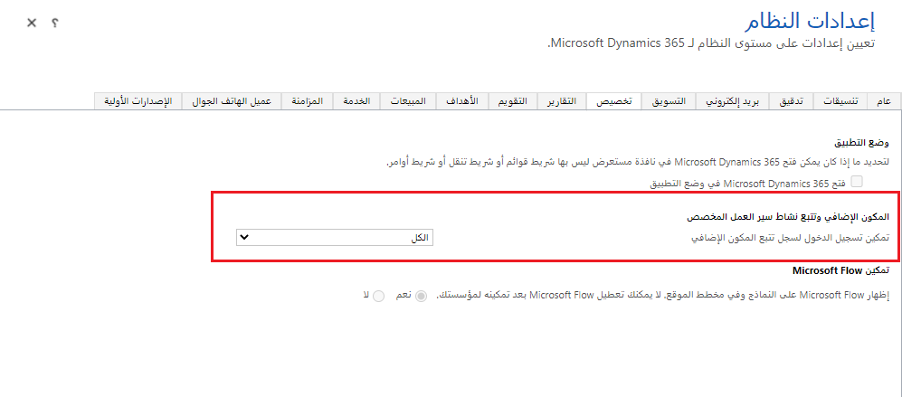
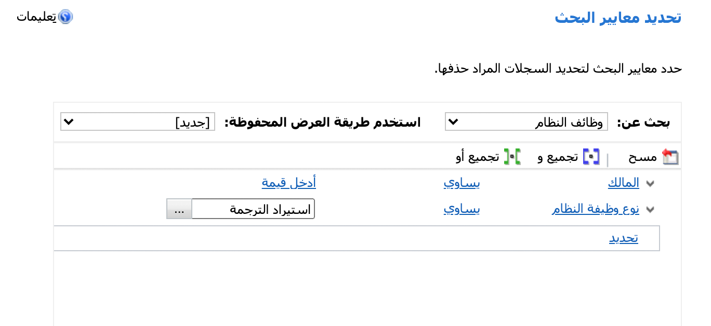
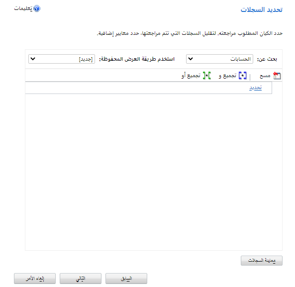
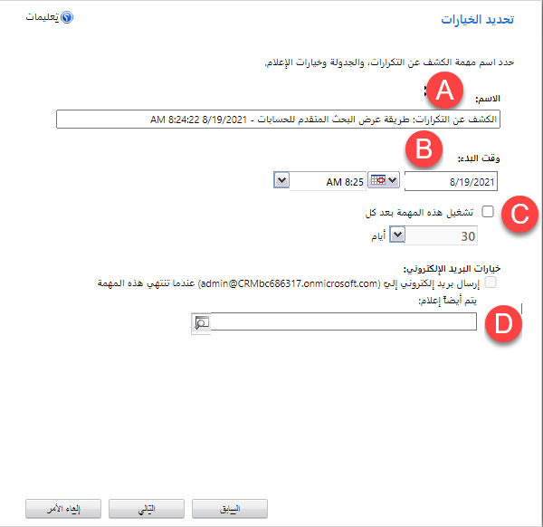

يوفر الفيديو التالي نظرة عامة على ميزة الحذف المجمع للسجلات.

> [!VIDEO https://www.microsoft.com/videoplayer/embed/RWrrAw]

تساعدك ميزة الحذف المجمع في الحفاظ على جودة البيانات وإدارة استهلاك تخزين النظام في Microsoft Dataverse التطبيقات عن طريق حذف البيانات التي لم تعد بحاجة إليها. يسمح بإزالة كمية كبيرة من البيانات المحددة والمستهدفة وفقاً لجدول زمني.

فيما يلي سيناريوهات شائعة حيث يمكن أن تكون ميزة الحذف المجمع مفيدة.

### بيانات تالفة

مع نمو النظام وبمرور الوقت، قد تصبح إدخالات البيانات قديمة. على سبيل المثال، ضع في اعتبارك عدداً كبيراً من العملاء المتوقعين الذين تم الحصول عليهم نتيجة لحملة تسويقية ضخمة تستهدف أحداثاً معينة. مع مرور الحدث، يصبح العملاء المحتملون الذين لم يتم اتخاذ إجراءات بشأنهم بعد، مُهملين. يَستخدم الحذف المُجمَّع في هذا المثال طريقة عرض تُرجع جميع العملاء المتوقعين لهذه الحملة التسويقية التي لا تزال نشطة.

في مثال آخر، قد يكون من الآمن افتراض أن أي أنشطة بريد إلكتروني مضى عليها أكثر من سبع سنوات لم تعد مطلوبة للاحتفاظ بها في Dataverse للتطبيقات. ستسمح طريقة العرض البسيطة التي تعيد جميع رسائل البريد الإلكتروني التي مضى عليها أكثر من سبع سنوات بتشغيل وظيفة الحذف المجمع، وإزالة السجلات بما في ذلك المرفقات، وبالتالي يحتمل أن تحرر مساحة تخزين كبيرة.

### بيانات لا علاقة لها بالموضوع

يمكن استخدام وظائف الحذف المجمع لحذف البيانات التي لم تعد لها علاقة بالنشاط التجاري. على سبيل المثال، قد يكون النشاط التجاري قد فتح شركة هندسية تابعة جديدة ووسّع نطاقه Dataverse لكي تتعامل التطبيقات مع مسائل معينة تخص هذا القسم. في وقت لاحق، تم بيع الأعمال الهندسية، ولم تعد أجزاء من Dataverse لها بالتطبيقات أو مطلوبة. في الواقع، ليس من غير المألوف أن تكون الشركة ملزمة قانوناً بحذف أي سجلات تتعلق بالنشاط التجاري المُباع. في هذه الحالة، ستستخدم عدداً من وظائف الحذف المجمع لتنظيف جميع الكيانات من الحل.

### عينة أو اختبار البيانات

عند اختبار أداء النظام، غالباً ما يتم استيراد كميات كبيرة من البيانات إلى Dataverse للتطبيقات لمحاكاة أعباء العمل الإنتاجية. عند اكتمال الاختبارات ولم تعد البيانات مطلوبة، يمكن استخدام مجموعة من وظائف الحذف المجمع لإزالة الاختبار غير الضروري أو بيانات العينة.

### بيانات خاطئة

غالباً ما يتم استيراد كميات كبيرة من البيانات إلى Dataverse للتطبيقات من أنظمة أخرى. إذا تم ارتكاب أخطاء، ولم يتم استيراد البيانات بشكل صحيح، فإن الحذف المجمع سيسمح بالتنظيف السهل. 

### اختبار البيانات أو استكشاف الأخطاء وإصلاحها

أثناء اختبار وظائف سير العمل (أو عن طريق الخطأ)، قد يتم تعيين علامة للاحتفاظ بإدخالات الوظائف للوظائف المكتملة بنجاح. سيؤدي ذلك إلى نمو سجل وظائف النظام. بمجرد اكتمال الاختبار (أو رصد خطأ من خلال اكتشاف الحجم غير الطبيعي للسجل)، يمكن حذف إدخالات السجل الناجحة من النظام.

أثناء استكشاف أخطاء المكون الإضافي ونشاط سير العمل المخصص وإصلاحها، قد يطلب المطورون تمكين تسجيل المكون الإضافي. 

بناءً على حجم عملية التوزيع ودرجة تعقيدها، قد يتسبب هذا الإعداد في نمو سجل التتبع بسرعة كبيرة. بمجرد اكتمال استكشاف الأخطاء وإصلاحها وإعادة تعيين العلامة، يمكنك استخدام وظيفة الحذف المجمّع مقابل كيان التتبع لحذف أي إدخالات سجل متعلقة بالمكونات الإضافية.

 من وقت لآخر، قد تحتاج إلى حذف مجموعة من البيانات. قد يكون هذا نموذجاً لسجلات أو بيانات قديمة أو بيانات تشغيلية ضمن غرض محدود لا تريد الاحتفاظ بمساحة في نظامك. تعد وظائف الحذف المجمع طريقة بسيطة لإزالة البيانات. يمكن جدولة هذه الوظائف للتشغيل تلقائياً على فترات زمنية محددة أو تكوينها بشكل فردي حسب الحاجة. 

يتم جمع السجلات المراد حذفها من خلال استعلام تم تكوينه تماماً مثل البحث المتقدم. يقوم هذا الاستعلام بتصفية السجل المراد حذفه. في وظائف الحذف المجمع المتكررة، تُعد هذه القائمة الديناميكية وظيفة للعثور على السجلات المناسبة للحذف في ذلك الوقت. تتضمن هذه الاستعلامات الأكثر شيوعاً حقل تاريخ بالإضافة إلى الحقول الأخرى لتصفية السجلات. 

تتوفر عدة خيارات أثناء تكوين وظيفة الحذف المجمع:

- أدخل اسماً يعكس معايير الاستعلام، لذلك ستتذكر ما تم حذفه عند الرجوع إلى سجلات وظائف الحذف المجمع.

- يمكن تشغيل وظائف الحذف المجمع على الفور ولكن يتم جدولتها عادةً للتشغيل بعد ساعات حتى لا تؤثر على إنتاجية المستخدم. 

- من خلال تحديد هذا المربع واختيار تكرار، سيتم تشغيل وظيفة الحذف بالجملة تلقائياً في المستقبل. 

- يمكن لوظائف الحذف المجمع إرسال بريد إلكتروني إلى المسؤول وعنوان بريد إلكتروني آخر بعد اكتمال الوظيفة. 

### الأمان
لتشغيل وظيفة الحذف المجمع، يجب أن يمتلك المستخدم امتياز الحذف المجمع بالإضافة إلى امتيازات الحذف لأنواع الكيانات المحددة للسجلات التي يتم حذفها. يجب أن يكون لدى المستخدم أيضاً أذونات قراءة للسجلات. 

### الاعتبارات
- إذا فشلت وظيفة الحذف المجمع، فإن أي سجلات تم حذفها بنجاح قبل الفشل تظل محذوفة ولا يتم التراجع عنها. 

- ستؤدي وظائف الحذف المجمع إلى تشغيل إجراءات الحذف المحددة بواسطة قواعد التسلسل لعلاقات هذا الكيان. هذا يعني أنه إذا قمت بحذف سجلات الحساب بشكل جماعي، فقد تقوم أيضاً بحذف السجلات الفرعية تلقائياً، اعتماداً على إعدادات قاعدة التتالي للحسابات. 

- يمكن أن تؤدي إجراءات الحذف إلى تشغيل وظائف سير العمل وقواعد العمل والأتمتة الأخرى إذا تم تعيينها للتشغيل عند حذف نوع السجل هذا. يمكن أن يؤدي استخدام معالج الحذف المجمع إلى تشغيل هذه العمليات بشكل جماعي ويسبب مشكلات في الأداء. 
