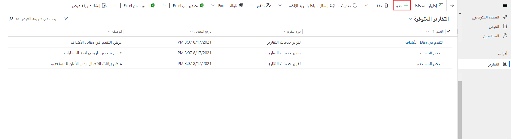
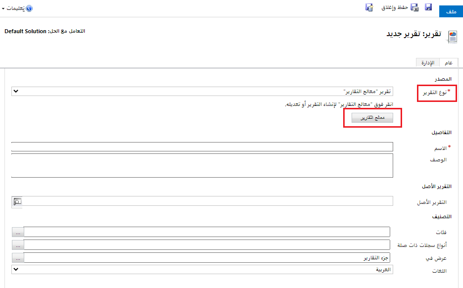
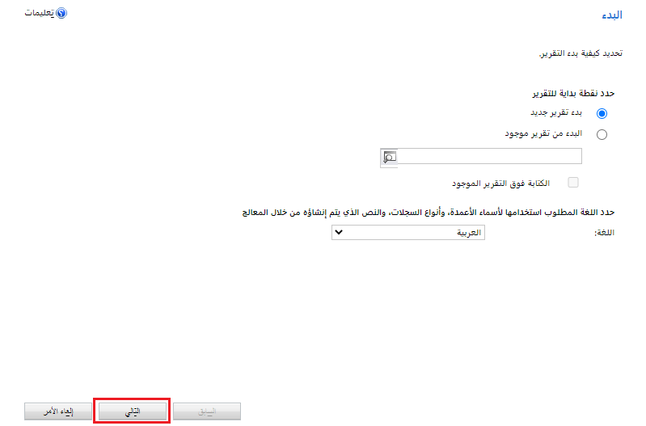
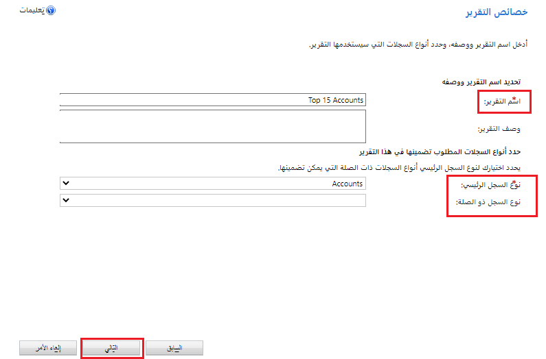
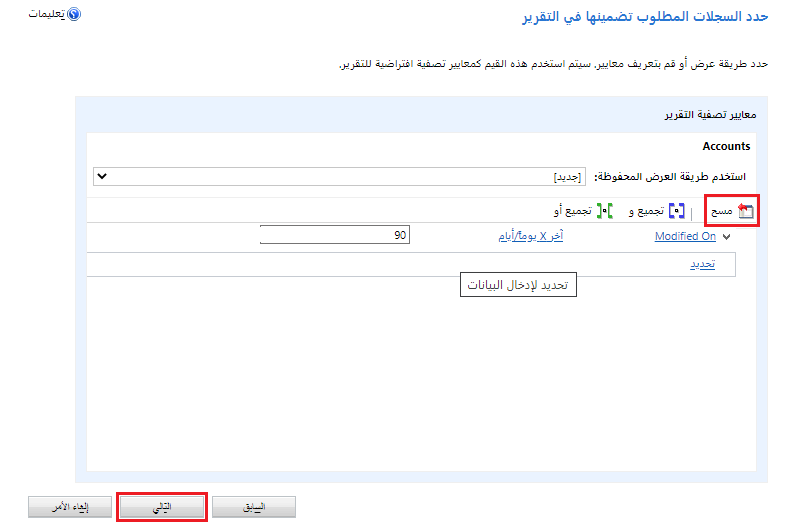
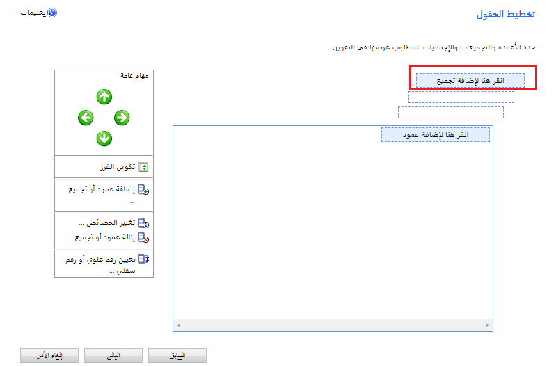
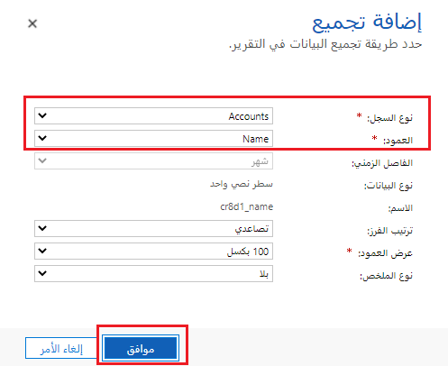
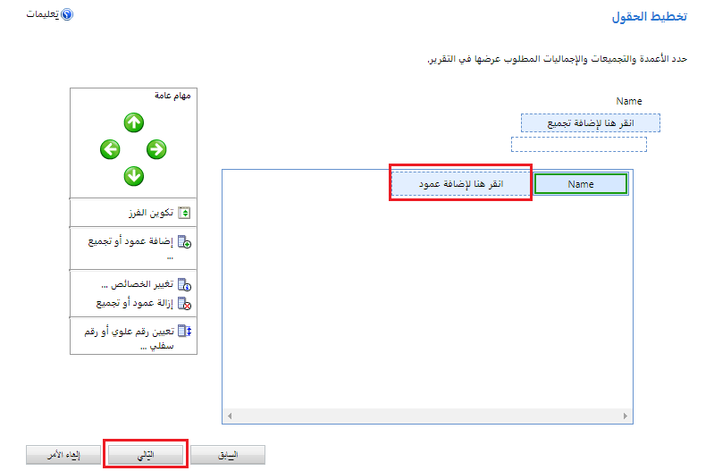
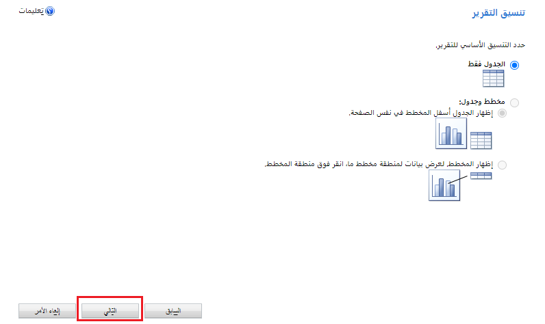
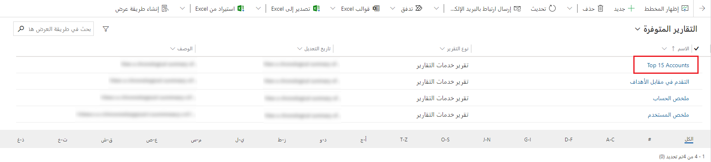

استخدم معالج التقارير لإنشاء تقارير بمخططات وجداول تسمح لك بتحليل بياناتك بسهولة.

جميع التقارير التي تم إنشاؤها باستخدام معالج التقارير هي تقارير مستندة إلى الجلب. تتم طباعة جميع التقارير التي تم إنشاؤها باستخدام معالج التقارير في الوضع الأفقي.

## إنشاء تقرير جديد

1. من جزء التنقل الأيمن، حدد منطقة التقارير.

1. من شريط الأوامر، حدد **جديد**.

    > [!div class="mx-imgBorder"]
    > 

1. تقرير: ستظهر شاشة تقرير جديدة. بالنسبة لـ **نوع التقرير** اترك التحديد الافتراضي إلى، تقرير معالج التقارير وحدد **زر معالج التقارير**.

    > [!div class="mx-imgBorder"]
    > 

1. في الشاشة التالية، اترك التحديدات الافتراضية ثم حدد **التالي**.

    > [!div class="mx-imgBorder"]
    > 

1. في شاشة **‏‫خصائص التقرير‬**، أدخل اسمًا للتقرير ثم اختر الصف الذي سيتم تضمينه في التقرير ثم حدد **التالي**.

    > [!div class="mx-imgBorder"]
    > 

1. في شاشة **تحديد الصفوف لتضمينها في التقرير**، اختر عوامل التصفية لتحديد الصفوف التي سيتم تضمينها في التقرير. إذا كنت لا تريد تصفية البيانات، فحدد **مسح**. عند الانتهاء، حدد **التالي**.

    > [!div class="mx-imgBorder"]
    > 

1. في شاشة **تخطيط الأعمدة**، اختر تخطيط التقرير. حدد **‏‫انقر هنا لإضافة تجميع‬** واختر الكيفية التي ترغب في تجميع البيانات بها. 

    > [!div class="mx-imgBorder"]
    > 

1. حدد **نوع الصف** و **العمود** للبيانات التي تريد تجميعها في التقرير. عند الانتهاء من إجراء التحديدات، حدد **موافق**.

    > [!div class="mx-imgBorder"]
    > 

1. حدد **انقر هنا لإضافة عمود‬** إلى أعمدة البيانات المرتبطة بنوع الصف الذي اخترته في الخطوة السابقة. 

    > [!div class="mx-imgBorder"]
    > 

1. في شاشة **إضافة عمود** اختر البيانات التي تريد عرضها للعمود ثم حدد **موافق**.

1. كرر الخطوة السابقة لأي أعمدة إضافية تريد إضافتها. عند الانتهاء، من شاشة **تخطيط الأعمدة**، حدد **التالي**.

    > [!div class="mx-imgBorder"]
    > 

1. في شاشة **تنسيق التقرير** اختر طريقة تنسيق التقرير ثم حدد **التالي**.

    > [!div class="mx-imgBorder"]
    > 

1. راجع ملخص التقرير وحدد **التالي** ثم حدد **إنهاء**. يمكنك الآن عرض هذا التقرير في قائمة التقارير الموجودة في النظام.

    > [!div class="mx-imgBorder"]
    > 